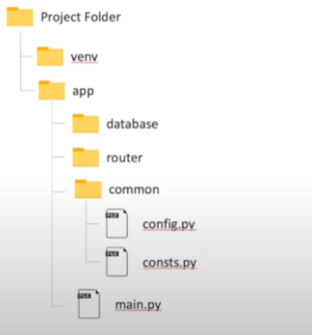

#### config.py  
1. 구조는 아래와 같이 잡는다
    - 참고: https://www.youtube.com/watch?v=loZsGOXnOBs&list=PLKy1qiqTzJteucwpykHuZyCh-HqeZXIG4&index=16



2. config.py를 작성한다
    - **class객체를 언패킹하기 위해 `@dataclass, asdict`를 import하게 된다.**
    - **현재파일(`__file__`)의 절대주소에서 path.dirname()로 부모폴더로 1단계씩 가서, `프로젝트폴더(root)`를 찾아 base_dir을 잡는다.**
        - 확인은, print + 직접실행으로 찍어본다.
    - 상속될 부모 Config를 잡아놓고, **@dataclass를 씌워서, `BASE_DIR`, `DB_POOL_RECYCLE`, `DB_ECHO`여부를 기본으로 작성해준다.**
```python
from dataclasses import dataclass, asdict
from os import path

base_dir = path.dirname(path.dirname(path.dirname(path.abspath(__file__))))


# print(base_dir)
# C:\Users\cho_desktop\PycharmProjects\fastApiProject

@dataclass
class Config:
    """
    기본 Configuration
    """
    BASE_DIR = base_dir

    DB_POOL_RECYCLE: int = 900
    DB_ECHO: bool = True
```

- dataclass + asdict 조합으로, 상수클래스의 객체 -> dict -> 언패킹 -> 함수의 keyword인자로 각각 꼽을 수 있다.
```python
print(Config())  # 객체는, class __str__으로 찍힌다.


# Config(DB_POOL_RECYCLE=900, DB_ECHO=True)

def abc(DB_ECHO=None, DB_POOL_RECYCLE=None, **kwargs):
    print(DB_ECHO, DB_POOL_RECYCLE)


abc(Config())  # 객체를 키워드인자에 넘기면, 첫번째의 객체로 대입된다.
# Config(DB_POOL_RECYCLE=900, DB_ECHO=True) None

# asdict()는 dataclass전용으로, 상수로 구성된 class의 객체를, dict로 변환해준다.
print(asdict(Config()))
# {'DB_POOL_RECYCLE': 900, 'DB_ECHO': True}

# asdict()로 dict가 된 것을 **언패킹해서 함수에 넘겨주면, 상수들이, 해당하는 키워드인자에 각각 꼽히게 된다.
abc(**asdict(Config()))
# True 900
```

3. **Local, Prod 서로 값이 다른 상수를, 다르게 정의해놓고(RELOAD여부), `conf()`메서드를 통해, `APP_ENV` 환경변수에 따라, dict로 모여진 것 중, 해당Config객체를 가져온다.**
```python
@dataclass
class LocalConfig(Config):
    PROJ_RELOAD: bool = True


@dataclass
class ProdConfig(Config):
    PROJ_RELOAD: bool = False


def conf():
    """
    Config객체들을, 환경별(key) -> value의 dict로 만들어놓고,
    환경변수 APP_ENV에 따라, 해당 Config객체를 추출하기
    :return:
    """
    # dict에서는 switch/case함수가 없기 때문에, 모아놓고, get으로 뽑아서 쓰도록 한다.
    config = dict(prod=ProdConfig(), local=LocalConfig())
    return config.get(environ.get("APP_ENV", "local"))

```
#### main.py
1. app객체를 create_app에서 만들어서 쓰는 팩토리패턴을 쓴다.
    - **이 때, main.py에 함수를 써서, app객체를 선언까지 해준다.**
```python
def create_app():
    """
    앱 함수 실행
    :return:
    """
    app = FastAPI()
    return app

app = create_app()

```

2. 이제 main.py의 실행함수 uvicorn.run()내부에 `reload=`옵션을, 
    - **config.py의 conf메서드를 import해서, create_app에서 config객체를 1개 생성해놓고,**
    - **실행함수(테스트용)에서도 conf().PROJ_RELOAD로 객체생성 + 상수 이용하도록 한다.**
```python
from app.common.config import conf


def create_app():
    """
    앱 함수 실행
    :return:
    """
    config = conf()
    app = FastAPI()

    return app

#...

if __name__ == '__main__':
    # uvicorn.run("main:app", port=8010, reload=True)
    uvicorn.run("main:app", port=8010, reload=conf().PROJ_RELOAD)
```
- 실행용함수는 그냥 True로 써도 된다.


### 도커 명령어
```powershell
docker --version
docker-compose --version

docker ps
docker ps -a 

docker kill [전체이름]
docker-compose build --no-cache
docker-compose up -d 
docker-compose up -d [서비스이름]
docker-compose kill [서비스이름]
```