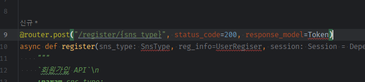

- 저번시간에 만든 index.py의 index router Users모델 create코드를 주석처리한다.

### 로그인
#### auth.py
1. router / `auth.py` 생성
2. post `/register/{sns_type}` endpoint 생성
    - router만 async def로 정의하면 되고, 내부 사용 메서드는 async일 필요는 없다.
    - router는 post의 추가인자로, **`응답성공시의 데이터`들인  `status_code=201`와, `파이단틱모델 response_model=Token`을 지정해준다.**
        - **회원가입 성공시 status_code외 Token Schema를 내려보내주면 된다.**
    - function의 인자로는 **`들어오는 데이터`들인, path에서 들어오는 변수인 `sns_type` + 유저정보 pydantic모델인 `UserRegister`, 그리고 Users .create()에 필요한 공용세션을 받는다.**
```python
from fastapi import APIRouter, Depends
from sqlalchemy.orm import Session

from app.database.conn import db

router = APIRouter()


@router.post("/register/{sns_type}", status_code=201, response_model=Token)
async def register(sns_type: SnsType, user_register_info: UserRegister, session: Session = Depends(db.session)):
    """
    `회원가입 API`\n
    :param sns_type: 
    :param user_register_info: 
    :param session: 
    :return: 
    """
    ...
```
- 빨간줄이 들어온 schema(pydantic 모델들)



3. 일단 router객체를 create_app에 등록해준다.
    - **이 때, `tags=["Authentication"]`, `prefix="/auth"`옵션을 추가해서 등록한다.**
        - FastAPI에서 tags 매개변수는 API 문서화를 위해 사용되는 기능입니다. tags는 해당 라우터에 대한 태그를 지정하는 데 사용되며, API 문서화를 더 구조적으로 만들고 그룹화할 수 있도록 도와줍니다.
    ```python
    from app.router import index
from app.api.v1 import auth
    
    
    # ...
    def create_app():
        # ...
        # route 등록
        app.include_router(index.router)
        app.include_router(auth.router, tags=["Authentication"], prefix="/auth")
    
        return app
    ```
#### app > schema.py
- 나중에는 각 도메인별로 schema.py를 가질 것 같다. 하지만 지금은 `app폴더`에서 `schema.py`를 생성한다.

1. **`path`로 들어오는 `sns_type(문자열)을 검증`하기 위해 `Enum`이지만, schema에 `SnsType`class를 Enum + str을 상속해서 정의한다.**
    - **참고로 인터프리터언어(pytho, js)는 타입힌트를 줘도 속도가 빨라지지 않는다.**
    ```python
    from enum import Enum
    
    
    class SnsType(str, Enum):
        email: str = "email"
        facebook: str = "facebook"
        google: str = "google"
        kakao: str = "kakao"
    ```
2. json으로 나가고, 들어오는 데이터들은 flask의 마쉬멜로우Schema대신, `Pydantic의 BaseModel을 상속`해서 정의한 뒤, `객체`로 취급할 수 있게 한다.
    - **유저정보들 중, email에 대한 자동검증은 `"pydantic[email]"` 패키지를 따로 설치해야, type hint 등으로 활용될 수 있다.**
    ```shell
    pip install "pydantic[email]"
    
    pip freeze > .\requirements.txt
    
    docker-compose build --no-cache api; docker-compose up -d api;
    ```
    ```python
    from pydantic.networks import EmailStr
    
    class UserRegister(BaseModel):
        # pip install "pydantic[email]"
        email: EmailStr = None
        pw: str = None
    ```

3. Token 모델은 Authorization: str 하나만 가진다.
```python
class Token(BaseModel):
    Authorization: str = None

```
4. view function의 인자로 들어가면 required로 잡히는 것 같다.
    - docs로 들어가서 확인해본다. `Try it`을 눌러야지, enum선택이 가능해진다.
    - **Enum을 인자로 줬더니, 선택형 / Pydantic모델인자 -> request body**
    - **router의 reponse_model Pydantic모델인자 -> responses에 잡힌다.**


5. Token을 return할 때, token객체 or `dict()`를 return하면 json으로 변환되는데
    - **return dict(Authorization = f"Bearer 토큰값")를 전달할 예정이다.**
    - **이 때, 토큰값을 User정보로 생성할텐데, `user객체 -> UserToken(파이단틱모델).from_orm()`으로 변환한 뒤, `.dict(exclude={})`를 지정해서 최종적으로는 `dict`로 변환시킬 예정인데**
    - `user객체 -> User파이단틱모델 -> dict` -> 토큰생성(str) -> 토큰dict -> return 으로 Token파이단틱모델 -> json
    - **객체 to dict를 만들기 위한 파이탄틱 모델 `UserToken`을 생성한다**
    - id는 기본값을 안주고 그냥 입력한다. / nullable한 칼럼값만 None으로 기본값을 준다
    - **`user가 볼 필요없는, token생성에도 필요없는` status + marketing_agree는 제외하고 정의해준다.**
    - **orm객체로 변환시킬려면, `class Config: orm_mode = True`를 옵션으로 줘야한다.**
    ```python
    # for Token - create_access_token
    class UserToken(BaseModel):
        id: int
        email: str = None
        name: str = None
        phone_number: str = None
        profile_img: str = None
        sns_type: str = None
    
        class Config:
            orm_mode = True
    ```

### auth.py register router jwt 발급
1. `pyjwt`, `bcrypt` 패키지 설치 + pip freeze + 도커재빌드
    ```shell
    # pyjwt, bcrypt 패키지 설치
    pip freeze > .\requirements.txt
    
    docker-compose build --no-cache api; docker-compose up -d api;
     ```

2. app > common > consts.py 에 JWT SECRET 키랑, ALGORHITM 정의
    - **나중에는 환경별로 다를 수 있고, aws secret manager를 활용해서 빠질 예정**
    ```python
    # JWT
    JWT_SECRET = 'abcd1234!'
    JWT_ALGORITHM = 'HS256'
    ```

3. jwt 발급 로직 작성
- `sns_type` path -> **`타입힌트를 SnsType의 Enum클래스`로 해주는 순간 string이, Enum객체로 바뀐다.**
```python
@router.post("/register/{sns_type}", status_code=201, response_model=Token)

async def register(sns_type: SnsType, user_register_info: UserRegister, session: Session = Depends(db.session)):

    # email <class 'str'>
    print(sns_type, type(sns_type)) # SnsType.email <enum 'SnsType'>
    ...
```
4. sns_type이 SnsType.email로 들어왔다면, email or pw 중 빠진 게 없는지 먼저 검사한다
    - 하나라도 안들어왔거나(or), sns_type이 email이 아니라면, JSONResponse로 에러를 내보내준다.
```python
@router.post("/register/{sns_type}", status_code=201, response_model=Token)
async def register(sns_type: SnsType, user_register_info: UserRegister, session: Session = Depends(db.session)):
    if sns_type == SnsType.email:
        # 검증1) 모든 요소가 다들어와야한다.
        if not user_register_info.email or not user_register_info.pw:
            return JSONResponse(status_code=400, content=dict(message="Email and PW must be provided."))

    return JSONResponse(status_code=400, content=dict(message="NOT_SUPPORTED"))

```

5. 2번째 검증으로서, 해당 email이 이미 존재하는지 확인해야한다.
    - 이 때, email 존재여부검사는 자주쓰이므로 `await 호출 + async def의 비동기메서드`로 따로 빼준다.
```python
async def exists_user_email(email: str):
    user = Users.get(email=email)
    return True if user else False

@router.post("/register/{sns_type}", status_code=201, response_model=Token)
async def register(sns_type: SnsType, user_register_info: UserRegister, session: Session = Depends(db.session)):
    if sns_type == SnsType.email:
        # 검증1) 모든 요소(email, pw)가 다들어와야한다.
        if not user_register_info.email or not user_register_info.pw:
            return JSONResponse(status_code=400, content=dict(message="Email and PW must be provided."))
        # 검증2) email이 이미 존재하면 안된다.
        exists_email = await exists_user_email(user_register_info.email)

    return JSONResponse(status_code=400, content=dict(message="NOT_SUPPORTED"))
```
6. **email 존재검사시 `조회용 get`메서드가 필요하므로 modles.py > BaseModel 정의해준다.**

#### models.py > get 메서드 정의
- **외부session이 없는 경우, next(db.session())으로 새발급 -> 조회후 close()까지 해준다.**
- session.query(cls)를 기본 query로, kwargs로 넘어오는 요소들을 queyr.filter()로 연달아서 필터링해준다.
- 카운트가 1개보다 크면, get이 아니므로 에러를 낸다.
```python
class BaseModel(Base):
    
    #...
    
    # 기본 CRUD 메서드
    # 1) create -> 새 session발급 없이, [인자] 외부주입 [router 공용 session]으로만 사용해서 그 속에 [객체추가]
    #   + all_columns 메서드 -> 자동으로 주어지는 id, created_at을, [생성시 제외하고 setattr 하기 위함.]
    # 2) get -> 조회는 [router 공용 session 주입 인자] + [내부  next() session 새 발급] - route 공용세션 없는, 메서드 상황에서 단독조회까지 가능하게 한다
    #   + if 내부 새발급session이라면, .close()로 조회만 하고 객체만 반환하여 닫는다.

    @classmethod
    def get(cls, session: Session = None, **kwargs):
        # 1) router 공용 session이 없다면, 새 session을 바급한다.
        local_session = next(db.session()) if not session else session
        # 2) session.query(cls)로 연쇄 query의 첫번째 요소로 만든다.
        query = local_session.query(cls)
        # 3) kwarg로 들어오는 검색요소key=value를 순회하면서,
        #    getattr(cls, key)로 column을 꺼내고, filter()를 연쇄한다.
        for key, value in kwargs.items():
            column = getattr(cls, key)
            query = query.filter(column == value)

        # 4) query.count()를 쳐서 1개 이상이면, get에 안어울려 에러는 낸다.
        if query.count() > 1:
            raise Exception("Only one row is supposed to be returned, but got more than one. ")
        result = query.first()

        # 5) 외부주입 session이 아니라면, 조회후 새발급 session을 끊어버린다.
        if not session:
            local_session.close()

        return result
```

#### 다시 돌아와서
7. get으로 email이 존재하는지 검사하고, 존재한다면 400에러를 낸다.
    ```python
    async def exists_user_email(email: str):
        user = Users.get(email=email)
        return True if user else False
    
    
    @router.post("/register/{sns_type}", status_code=201, response_model=Token)
    async def register(sns_type: SnsType, user_register_info: UserRegister, session: Session = Depends(db.session)):
        if sns_type == SnsType.email:
            # 검증1) 모든 요소(email, pw)가 다들어와야한다.
            if not user_register_info.email or not user_register_info.pw:
                return JSONResponse(status_code=400, content=dict(message="Email and PW must be provided."))
            # 검증2) email이 이미 존재하면 안된다.
            exists_email = await exists_user_email(user_register_info.email)
            if exists_email:
                return JSONResponse(status_code=400, content=dict(message="EMAIL_EXISTS"))
    
        return JSONResponse(status_code=400, content=dict(message="NOT_SUPPORTED"))
    ```
   
- **나중에는 400에러를 직접 내보는게 아니라 raise에러처리 -> middleware가 잡아줘서 자동으로 에러처리 되도록 할 것이다.**


9. bcrypt로 password 해쉬
    - **해쉬는 byte만 가능하므로 들어온 가입정보의 pw를 utf-8로 인코딩하며, 해쉬할때 소금을 gensalt()로 뿌려줄 수 있다.**
```python
@router.post("/register/{sns_type}", status_code=201, response_model=Token)
async def register(sns_type: SnsType, user_register_info: UserRegister, session: Session = Depends(db.session)):
  
    if sns_type == SnsType.email:
        # 검증...

        # 비밀번호 해쉬 -> 해쉬된 비밀번호 + email -> user 객체 생성
        hash_pw = bcrypt.hashpw(user_register_info.pw.encode('utf-8'), bcrypt.gensalt())
        new_user = Users.create(session, auto_commit=True, pw=hash_pw, email=user_register_info.email)
    
    return JSONResponse(status_code=400, content=dict(message="NOT_SUPPORTED"))

```

10. 이제 생성된 user객체(orm) -> Pydantic UserToken -> dict(exclude={})로, pw+마케팅여부를 제외하고 `create_access_token의 재료를 dict`로 만든다.
    - **이 때, v1에서는 `.from_orm( user객체 ) .dict()` 를 사용햇으나 v2에서부터는 `model_validate().model_dump()`로 변경되었다.**
    - **이 때, Schema인 UserToken은 email은 필수요소로서 들어오나, name/pn/profile_img/sns_type은 `Optional[type]`으로 nullable로 지정해준다.**
    - **Config에 orm_mode=True는 삭제하고, from_attributes=True를 설정해준다.**
```python
# for Token - create_access_token
class UserToken(BaseModel):
    id: int
    email: str = None

    name: Optional[str] = None
    phone_number: Optional[str] = None
    profile_img: Optional[str] = None
    sns_type: Optional[str] = None

    class Config:
        # orm_mode = True
        from_attributes = True

```
```python
# 비밀번호 해쉬 -> 해쉬된 비밀번호 + email -> user 객체 생성
hash_pw = bcrypt.hashpw(user_register_info.pw.encode('utf-8'), bcrypt.gensalt())
new_user = Users.create(session, auto_commit=True, pw=hash_pw, email=user_register_info.email)

# user객체 -> new_user_data (dict by pydantic) -> create_access_token
new_user_data = UserToken.model_validate(new_user).model_dump(exclude={'pw', 'marketing_agree'})
# {'id': 21, 'email': '5gr@example.com', 'name': None, 'phone_number': None, 'profile_img': None, 'sns_type': None}
```

11. data -> token을 만들어주는 메서드 `create_access_token`을 정의해주고, `dict( Authorization=f"Bearer {}")`에 넣어서 `Token Schema에 들어갈 return dict`를 생성한다
```python
def create_access_token(*, data: dict = None, expires_delta: int = None):
    # 들어온 데이터dict 원본을 변화시키지 않도록 미연에 방지( token 만료기간 연장)
    to_encode_data = data.copy()
    
    # 복사데이터dict 만료시간 update
    if expires_delta:
        to_encode_data.update({"exp": datetime.utcnow() + datetime.timedelta(hours=expires_delta)})
        
    # pyjwt로 엔코딩 -> string 반환
    encoded_jwt = jwt.encode(to_encode_data, key=JWT_SECRET, algorithm=JWT_ALGORITHM)
    return encoded_jwt

```

12. 이제 router에서 Token Schema에 들어갈 token dict를 반환한다.
```python
# 비밀번호 해쉬 -> 해쉬된 비밀번호 + email -> user 객체 생성
hash_pw = bcrypt.hashpw(user_register_info.pw.encode('utf-8'), bcrypt.gensalt())
new_user = Users.create(session, auto_commit=True, pw=hash_pw, email=user_register_info.email)

# user객체 -> new_user_data (dict by pydantic) -> create_access_token -> Token Schema용 dict 반환
#   - v1: user_token = UserToken.from_orm(new_user).dict(exclude={'pw', 'marketing_agree'})
new_user_data = UserToken.model_validate(new_user).model_dump(exclude={'pw', 'marketing_agree'})
#   - {'id': 21, 'email': '5gr@example.com', 'name': None, 'phone_number': None, 'profile_img': None, 'sns_type': None}

new_token = dict(
    Authorization=f"Bearer {create_access_token(data=new_user_data)}"
)
return new_token
```

- /docs에서 email을 입력하여 token이 잘 반환되는지 확인한다.
- **아직 만료시간은 적용되지 않았다.**


### 도커 명령어

1. (`패키지 설치`시) `pip freeze` 후 `api 재실행`

```shell
pip freeze > .\requirements.txt

docker-compose build --no-cache api; docker-compose up -d api;
```

2. (init.sql 재작성시) `data폴더 삭제` 후, `mysql 재실행`

```shell
docker-compose build --no-cache mysql; docker-compose up -d mysql;
```

```powershell
docker --version
docker-compose --version

docker ps
docker ps -a 

docker kill [전체이름]
docker-compose build --no-cache
docker-compose up -d 
docker-compose up -d [서비스이름]
docker-compose kill [서비스이름]

docker-compose build --no-cache [서비스명]; docker-compose up -d [서비스명];

```

- 참고
    - 이동: git clone 프로젝트 커밋id 복사 -> `git reset --hard [커밋id]`
    - 복구: `git reflog` -> 돌리고 싶은 HEAD@{ n } 복사 -> `git reset --hard [HEAD복사부분]`
    - 