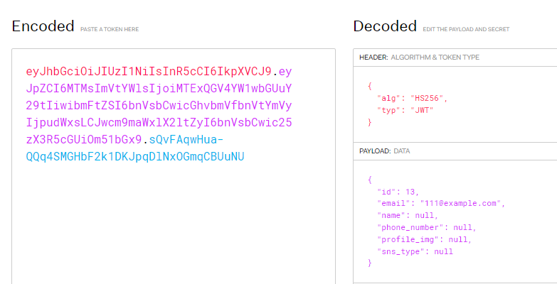

### 로그인
1. auth.py > `login/{sns_type}` router로서, 로그인할 때도, sns_type을 선택하게 한다.
    - **register와 다르게, `생성X 조회해서 확인만` 하므로 `공용세션의 주입Depends가  필요없다.`**
    - 들어오는 유저정보가 email/pw로, UserRegister와 동일하므로, RequestBody로서 같이 활용한다.
    - **이 때, 유저가 email/pw 어느것이 틀렷는지 모르도록 에러메세지를 `NO_MATCH_USER`로 동일하게 준다.**

```python
@router.post("/login/{sns_type}", status_code=200, response_model=Token)
async def login(sns_type: SnsType, user_info: UserRegister):
    """
    `로그인 API`\n
    :param sns_type:
    :param user_info:
    :return:
    """
    if sns_type == SnsType.email:
        # 검증1) 모든 요소(email, pw)가 다들어와야한다.
        if not user_info.email or not user_info.pw:
            return JSONResponse(status_code=400, content=dict(message="Email and PW must be provided."))
        # 검증2) email이 존재 해야만 한다.
        exists_email = await exists_user_email(user_info.email)
        if not exists_email:
            return JSONResponse(status_code=400, content=dict(message="NO_MATCH_USER"))
        # 검증3)  [입력된 pw] vs email로 등록된 DB저장 [해쉬 pw]  동일해야한다.
        user = Users.get(email=user_info.email)
        is_verified = bcrypt.checkpw(user_info.pw.encode('utf-8'), user.pw.encode('utf-8'))
        if not is_verified:
            return JSONResponse(status_code=400, content=dict(message="NO_MATCH_USER"))

        # 비번인증된 user객체 -> UserToken(dict) -> create_access_token -> Token모델용 token dict return
        token_data = UserToken.model_validate(user).model_dump(exclude={'pw', 'marketing_agree'})
        token = dict(
            Authorization=f"Bearer {create_access_token(data=token_data)}")
        return token

    return JSONResponse(status_code=400, content=dict(msg="NOT_SUPPORTED"))
```


2. docs에서 **`정상 로그인-> token반환 확인` + `email틀리게 + 비번틀리게 -> 같은 에러`를 확인한다**

3. 정상로그인되어 발급된 토큰을 jwt.io에서 분리해보자
   - Bearer 빼고 입력하면 된다.
    

4. Http status 정리
```python
"""
400 Bad Request
401 Unauthorized
403 Forbidden
404 Not Found
405 Method not allowed

500 Internal Error
502 Bad Gateway
504 Timeout

200 OK
201 Created
"""
```


### 도커 명령어

1. (`패키지 설치`시) `pip freeze` 후 `api 재실행`

```shell
pip freeze > .\requirements.txt

docker-compose build --no-cache api; docker-compose up -d api;
```

2. (init.sql 재작성시) `data폴더 삭제` 후, `mysql 재실행`

```shell
docker-compose build --no-cache mysql; docker-compose up -d mysql;
```

```powershell
docker --version
docker-compose --version

docker ps
docker ps -a 

docker kill [전체이름]
docker-compose build --no-cache
docker-compose up -d 
docker-compose up -d [서비스이름]
docker-compose kill [서비스이름]

docker-compose build --no-cache [서비스명]; docker-compose up -d [서비스명];

```

- 참고
    - 이동: git clone 프로젝트 커밋id 복사 -> `git reset --hard [커밋id]`
    - 복구: `git reflog` -> 돌리고 싶은 HEAD@{ n } 복사 -> `git reset --hard [HEAD복사부분]`