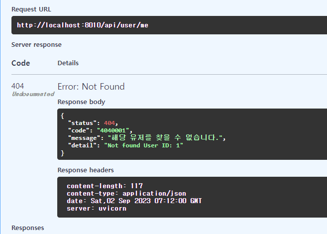

### exception
#### exceptions 정의
1. app > `erros` 폴더 > `exceptions.py` 을 생성한다
2. **먼저 Exception을 상속한 부모 class `APIException`을 만든다.**
    - status_code, message, exception객체외에 **custom_code인 `code`와 세부 message인 `detail`을 추가해서 정의한다.**
    - status_code는 기본값 500을 keyword인자로 넣는데 `starlette의 status`객체에서 상수를 뽑아낸다.
    - **이 최상위 부모class는 `정의하지 못한 500에러 -> exception_handler -> 정의한 기본 500에러`로 변환할 때도 사용된다.**
    - custom_code는 HTTP_CODE 3개 + 그것들을 4자리로 만들어줄 총 7개의 code이며, 500은 기본 `0000000`의 문자열 이다.
    - 생성자에 5개의 필드를 넣고, `exception기본 생성자에 exception객체를 넣고 부모생성자 초기화`까지 해준다.
    - message에서는 유저에게 보일 메세지를 넣는데, `기본값으로 서버에 문제가 발생했습니다` 멘트를 넣어준다 for 정의하지 않은 에러
    - detail은 각 Exception마다 필요한 인자 ex> user_id -> 메세지 를 받아서 들어가게 되며, 정의하지 않은 에러는 str(e)가 detail로 들어가게 된다.
    - exception객체는 **정의 하지 않는 에러를 잡아서 -> APIExpcetion()으로 변환할 때, 그 e를 넣어주는 역할을 할 것이다.**
```python
from starlette import status


class APIException(Exception):
    status_code: int
    code: str
    message: str
    detail: str
    exception: Exception

    def __init__(
            self,
            *,
            status_code: int = status.HTTP_500_INTERNAL_SERVER_ERROR,
            code: str = "0000000",
            message: str = "서버에 문제가 발생했습니다.",
            detail: str = None,
            exception: Exception = None,
    ):
        self.status_code = status_code
        self.code = code
        self.message = message
        self.detail = detail
        self.exception = exception
        super().__init__(exception)
```

3. 이제 부모class `APIException을 상속한 개별 exception을 정의`해준다. 
    - **`생성자의 인자는 부모꺼 다X` -> `detail에 들어갈 exception마다 다른 내용`(ex> id) + exception객체만 키워드**로 받고
    - **`생성자의 내부에서는, 자신만의 고유값`들을 -> `부모생성자에 exception개별 값들만 미리 넣어주는 형식`으로 정의**한다.
    - **즉 에러이름 + 에러이름마다 달라지는 detail용 변수 + exception객체만 인자로 받고 -> 공용 인자들은 부모생성자에서 직접 상수로 입력**해준다.
    - custom_code인 `code`는 404 + 0001 로 시작하게 zfill(4)을 활용해서 만든다. 1111~9999까지 404에러에 대한 커스텀 에러를 내는 것이다. 이 때, `{'1'.zfill(4)}`로 시작 에러를 만들면 된다.
```python
# 404
class NotFoundUserException(APIException):
    def __init__(self, user_id=None, exception: Exception = None):
        super().__init__(
            status_code=status.HTTP_404_NOT_FOUND,
            code=f"{status.HTTP_404_NOT_FOUND}{'1'.zfill(4)}",
            message="해당 유저를" + " 찾을 수 없습니다.",
            detail=f"Not found " + "User " + f"ID: {user_id}",
            exception=exception
        )

```
4. 필요한 Exception들을 추가 정의해준다.
   - **나중에는 수백개가 될 수 있는데 -> DB에 정의해서 -> 새로 exceptions.py파일을 `서버시작시마다 쓰기도` 한다고 한다.**
   - **회사에서는 status/message는 프론트로 보내주지 않고, `detail + custom코드`만 front로 보여주고 있다고 한다. 2가지로 front에서 사전정의된 메세지를 보여준다고 함.**

5. **400 Bad Request는 워낙 종류가 많기 때문에, 일단은 개별로 다 정의해주지 않고, `status_code, message는 고정으로서 안받고`, `message, detail, code 필수 args인자`로 직접 받는 `중간 부모`를 1개 더 정의해주자.**
    - **또한 code도 일부 정해져있으니, `새롭게 자식 정의시마다 문자열 code`를 입력해서 정의하도록 하자.**
```python
# 400
class BadRequestException(APIException):

    def __init__(self, *, code_number: [str, int] = "0", detail: str = None, exception: Exception = None):
        if not isinstance(code_number, str):
            code_number = str(code_number)

        super().__init__(
            status_code=status.HTTP_400_BAD_REQUEST,
            code=f"{status.HTTP_400_BAD_REQUEST}{code_number.zfill(4)}",
            message="잘못된 접근입니다.",
            detail=detail,
            exception=exception
        )
```

6. **이후 보일때마다 custom_code인 `code`를 `code_number`에 1부터 채우면서 정의해주면 된다.**
```python
class TokenDecodeException(BadRequestException):

    def __init__(self, exception: Exception = None):
        super().__init__(
            code_number=1,
            detail="잘못된 토큰으로 접속하였습니다.",
            exception=exception
        )


class TokenExpiredException(BadRequestException):
    def __init__(self, exception: Exception = None):
        super().__init__(
            code_number=2,
            detail="토큰이 만료되었습니다.",
            exception=exception
        )
```

7. 404 NotFound도 여러가지가 발생할 예정이니. 부모클래스로서 1개를 생성해놓고 상속해서 정의한다.
    - status_code + code 고정에 code_number받기 + `detail -> detail에 필요한 변수는 자식에서 받기` + exception=객체는 기본적으로 받기
    - user -> 자식class 생성자의 인자로 user_id를 받아 detail 작성
    - email -> 자식class 생성자의 인자로 email을 받아 detail 작성
```python
# 404
class NotFoundException(APIException):

    def __init__(self, *, code_number: [str, int] = "0", detail: str = None, exception: Exception = None):
        if not isinstance(code_number, str):
            code_number = str(code_number)

        super().__init__(
            status_code=status.HTTP_404_NOT_FOUND,
            code=f"{status.HTTP_404_NOT_FOUND}{code_number.zfill(4)}",
            message="대상을 찾을 수 없습니다.",
            detail=detail,
            exception=exception
        )


class NotFoundUserException(NotFoundException):
    def __init__(self, user_id=None, exception: Exception = None):
        super().__init__(
            code_number=1,
            detail=f"Not found User ID: {user_id}",
            exception=exception
        )


class NotFoundEmail(NotFoundException):
    def __init__(self, email=None, exception: Exception = None):
        super().__init__(
            code_number=2,
            detail=f"Not found User Email: {email}",
            exception=exception
        )
```
#### exception_handler - 정의 하지 않은 에러를 APIException 기본 500으로 만들기
1. **middleware(access_control)내에서 `except Exception as e`의 error가 발생해서 잡았을 때, 그 `e`를 가지고, `우리가 정의하지 에러들`를 -> `APIException`으로 변환해주는 `exception_handler.py`를 erros폴더에 생성한다.**
    - **기본 500의 에러의 최상위 부모class APIException이라는 가장 상위 부모 class의 객체로 변경해준다.**

```python
from app.errors.exceptions import APIException


async def exception_handler(exception: Exception):
    # 정의안한 에러 -> 우리정의 APIException(기본 status_code 500, code 0000000, message 서버에 문제 발생) 객체로 변환하되
    # - exception 필드에 해당exception을 통째로 넣어주고
    # - detail은 str(e)값을 넣어준다.
    if not isinstance(exception, APIException):
        exception = APIException(exception=exception, detail=str(exception))

    return exception

```
2. access_control 에서 발생한 e를 잡아 `await exception_handler()`에 넣어주고 error객체를 응답 받은 뒤, dict로 변환하여 content=내용을 작성한 뒤 반환한다.
    - **이 때, 반환되는 exception은 APIException이 보장된므로 -> dict로 변환 후, JsonRespone의 content로 내려보내준다.**
```python
try:
    #...
except Exception as e:
    # handler를 통해 정의하지 않은 e라면 -> 기본 500의 APIException으로 변환되게 된다.
    error: APIException = await exception_handler(e)

    # JSONResponse의 content=로 넣을 error 객체를 dict로 변환한다.
    error_dict = dict(
        status=error.status_code,
        code=error.code,
        message=error.message,
        detail=error.detail,
    )

    response = JSONResponse(status_code=error.status_code, content=error_dict)
    # logging

    return response
```

3. **이제 `function level(router)에서 raise`를 시키면, `미들웨어에서 exception을 잡아서 JSONResponse`하는지 router에서 강제로 raise시켜본다.**
```python
@router.get('/me', response_model=UserMe)
async def get_user(request: Request):
    """
    get my info
    :param request:
    :return:
    """
    user_token = request.state.user
    user = Users.get(id=user_token.id)

    # test
    # raise NotFoundUserException()
    raise NotFoundUserException(user_id=1)
    # raise TokenExpiredException()

    return user

```


#### 기존 exception or return JSONResponse를 -> raise로 바꿔서, 미들웨어에서 에러 응답하도록 하기
1. utils > auth_utils.py 의 decode_token
```python
async def decode_token(token: str):
    """
    :param token:
    :return:
    """
    try:
        payload = jwt.decode(token, key=JWT_SECRET, algorithms=JWT_ALGORITHM)
        return payload
    except jwt.ExpiredSignatureError:
        # raise Exception("ExpiredSignature Error")
        raise TokenExpiredException()
    except jwt.InvalidTokenError:
        # raise Exception("InvalidToken Error")
        raise TokenDecodeException()

```
- access_token의 템플릿(쿠키) 접속시,  **잘못된 쿠키를 박아서 테스트**
```python
# [2] 템플릿 레더링 -> cookies에서 token정보 -> decode 후 user정보를 states.user에 심기
else:
# 템플릿 쿠키 검사1) 키가 없으면 탈락

# test ) 잘못된 토큰 박아서, decode_token 내부에러 확인하기
cookies['Authorization'] = 'Bearer abc'

request.state.access_token = cookies.get("Authorization")
if not request.state.access_token:
    # return JSONResponse(status_code=401, content=dict(message="AUTHORIZATION_REQUIRED"))
    raise NotAuthorized()
```
2. access_control.py에서 api token검사
```python
try:
    # [1] api 접속 -> headers에 token정보 -> decode 후 user정보를 states.user에 심기
    if url.startswith('/api'):
        # api 검사1) api endpoint 접속은, 무조건 Authorization 키가 없으면 탈락
        request.state.access_token = headers.get("Authorization")
        if not request.state.access_token:
            # return JSONResponse(status_code=401, content=dict(message="AUTHORIZATION_REQUIRED"))
            raise NotAuthorized()
    # [2] 템플릿 레더링 -> cookies에서 token정보 -> decode 후 user정보를 states.user에 심기
    else:
        # 템플릿 쿠키 검사1) 키가 없으면 탈락
        request.state.access_token = cookies.get("Authorization")
        if not request.state.access_token:
            # return JSONResponse(status_code=401, content=dict(message="AUTHORIZATION_REQUIRED"))
            raise NotAuthorized()
```
-  /test(not api) - 템플릿 렌더링으로 접속해서 쿠키x -> authorization 없음 -> 에러 뜨는지 확인

3. router > auth.py에서 각종 인증 실패시 error 내기
    - **입력이 빠진 에러는 그냥 `ValueError`로 대처한다.**
    - **없던 에러(NOT_SUPPORTED, NO_MATCH_USER)도 exceptions.py에 정의해서 raise시켜준다.**
```python
@router.post("/register/{sns_type}", status_code=201, response_model=Token)
async def register(sns_type: SnsType, user_register_info: UserRegister, session: Session = Depends(db.session)):
    if sns_type == SnsType.EMAIL:
        # 검증1) 모든 요소(email, pw)가 다들어와야한다.
        if not user_register_info.email or not user_register_info.pw:
            # return JSONResponse(status_code=400, content=dict(message="Email and PW must be provided."))
            raise ValueError('이메일 혹은 비밀번호를 모두 입력해주세요.')

        user = await Users.get_by_email(session, user_register_info.email)
        if user:
            # return JSONResponse(status_code=400, content=dict(message="EMAIL_EXISTS"))
            raise EmailAlreadyExistsException()

        # 비밀번호 해쉬 -> 해쉬된 비밀번호 + email -> user 객체 생성
        hash_pw = bcrypt.hashpw(user_register_info.pw.encode('utf-8'), bcrypt.gensalt())
        new_user = Users.create(session, auto_commit=True, pw=hash_pw, email=user_register_info.email)

        # user객체 -> new_user_data (dict by pydantic) -> create_access_token -> Token Schema용 dict 반환
        new_user_data = UserToken.model_validate(new_user).model_dump(exclude={'pw', 'marketing_agree'})

        new_token = dict(
            Authorization=f"Bearer {await create_access_token(data=new_user_data)}"
        )
        return new_token

    # return JSONResponse(status_code=400, content=dict(message="NOT_SUPPORTED"))
    raise NoSupportedException()


@router.post("/login/{sns_type}", status_code=200, response_model=Token)
async def login(sns_type: SnsType, user_info: UserRegister, session: Session = Depends(db.session)):
    if sns_type == SnsType.EMAIL:
        # 검증1) 모든 요소(email, pw)가 다 들어와야한다.
        if not user_info.email or not user_info.pw:
            # return JSONResponse(status_code=400, content=dict(message="Email and PW must be provided."))
            raise ValueError('이메일 혹은 비밀번호를 모두 입력해주세요.')

        # 검증2) email이 존재 해야만 한다.
        user = await Users.get_by_email(session, user_info.email)
        if not user:
            # return JSONResponse(status_code=400, content=dict(message="NO_MATCH_USER"))
            raise NoUserMatchException()
        # 검증3)  [입력된 pw] vs email로 등록된 DB저장 [해쉬 pw]  동일해야한다.
        is_verified = bcrypt.checkpw(user_info.pw.encode('utf-8'), user.pw.encode('utf-8'))
        if not is_verified:
            # return JSONResponse(status_code=400, content=dict(message="NO_MATCH_USER"))
            raise NoUserMatchException()

        # 비번인증된 user객체 -> UserToken(dict) -> create_access_token -> Token모델용 token dict return
        token_data = UserToken.model_validate(user).model_dump(exclude={'pw', 'marketing_agree'})
        token = dict(
            Authorization=f"Bearer {await create_access_token(data=token_data)}"
        )
        return token
    
    # return JSONResponse(status_code=400, content=dict(msg="NOT_SUPPORTED"))
    raise NoSupportException()
```

4. **이 때, `/auth/api`는 except_path에 속해서, try가 적용안되어있는데, try를 올려서 같이 에러를 잡도록 해주자.**
```python
try:
    # 통과(access) 검사 시작 ------------
    # (1) except_path url 검사 -> 해당시, token없이 접속가능(/docs, /api/auth ~ 등) -> token 검사 없이 바로 endpoint(await call_next(request)) 로
    if await url_pattern_check(url, EXCEPT_PATH_REGEX) or url in EXCEPT_PATH_LIST:
        # print('except path - no url check')
        response = await call_next(request)
        # logging
        return response
```
### 도커 명령어

1. (`패키지 설치`시) `pip freeze` 후 `api 재실행`

```shell
pip freeze > .\requirements.txt

docker-compose build --no-cache api; docker-compose up -d api;
```

2. (init.sql 재작성시) `data폴더 삭제` 후, `mysql 재실행`

```shell
docker-compose build --no-cache mysql; docker-compose up -d mysql;
```

```powershell
docker --version
docker-compose --version

docker ps
docker ps -a 

docker kill [전체이름]
docker-compose build --no-cache
docker-compose up -d 
docker-compose up -d [서비스이름]
docker-compose kill [서비스이름]

docker-compose build --no-cache [서비스명]; docker-compose up -d [서비스명];

```

- 참고
    - 이동: git clone 프로젝트 커밋id 복사 -> `git reset --hard [커밋id]`
    - 복구: `git reflog` -> 돌리고 싶은 HEAD@{ n } 복사 -> `git reset --hard [HEAD복사부분]`