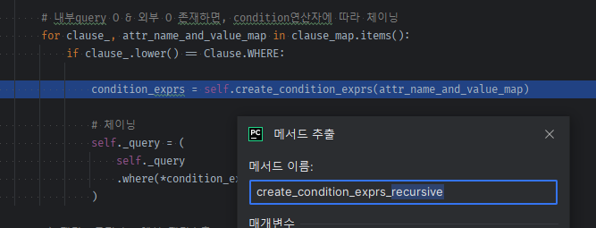

### CRUDMixin

#### get

1. 기존에 구현한 get을 objectMixin + async를 적용시킨 뒤, crudmixin에 정의하는 것으로 변경다.
    - 기존
    ```python
        @classmethod
        def get(cls, session: Session = None, **kwargs):
            # 1) router 공용 session이 없다면, 새 session을 바급한다.
            local_session = next(db.session()) if not session else session
            # 2) session.query(cls)로 연쇄 query의 첫번째 요소로 만든다.
            query = local_session.query(cls)
            # 3) kwarg로 들어오는 검색요소key=value를 순회하면서,
            #    getattr(cls, key)로 column을 꺼내고, filter()를 연쇄한다.
            for key, value in kwargs.items():
                column = getattr(cls, key)
                query = query.filter(column == value)
    
            # 4) query.count()를 쳐서 1개 이상이면, get에 안어울려 에러는 낸다.
            if query.count() > 1:
                raise Exception("Only one row is supposed to be returned, but got more than one. ")
            result = query.first()
    
            # 5) 외부주입 session이 아니라면, 조회후 새발급 session을 끊어버린다.
            if not session:
                local_session.close()
    
            return result
    ```
    - 변경
        - BaseModel의 get을 CRUDMixin으로 옮긴다.

2. 일단 모든 CRUD는 cls._create_obj()를 통해, session + 기본 쿼리(`self._query = select(self.__class__)`)를 잡고 있어야한다.
    - **그 전에, args(id) or kwargs(id= or unique_key=) `검증`을 해야한다.**
    ```python
        @classmethod
        async def get(cls, args, session: AsyncSession = None, **kwargs):
            # 1) ids_ or kwargs가 들어와야함. &  둘다 들어오면 안됨.
            if not (args or kwargs) or (args and kwargs):
                raise KeyError(f'pk or unique key를 인자 or 키워드로 1개만 입력해주세요.')
    ```

##### get을 위한 base_mixin 메서드 정의

1. **base_mixin에 `primary_key_names` or `unique_key_names`를 종류별로 추출할 수 있는 base_mixin들을 정의한다.**

- **제약 조건은 `cls.__table__.constraints`로, 가지고 있는 constrain_class들에 대해서**

```python
class BaseMixin(Base):
    # ...
    @class_property
    def constraint_class_list(cls):
        return cls.__table__.constraints
```

- **pk/fk/uk 중 하나를 target으로 받아서, Constraint 제약조건 cls를 추출할 수 있도록 `map`을 매핑해놓고, 받아꺼내와서, 위에서 정의한 `constraint_class_list`
  중에서 해당되는 것 1개만 꺼내고 없으면 None을 `generator + next( if, None)`을 씌워서 1개만 추출한다.**
    - **이 때, 3개 중 타겟 제약조건의 instance에 걸리는  `table의 constrain_class`가 있다면, `가장 첫번째 제약조건 1개`만 꺼낸 다.**
    - **만약, table에 target 제약조건 없더라도, None으로 반환하지말고, `None이 아닌, 빈 []를 return`해서, `.columns`에 대응하는 리스트를 보낸다**
    - **해당하는 `table의 제약조건.column`로 해당 칼럼들을 전체 다 가져오고, `columns.keys()`로 column이름들을 꺼내올 수 있다.**
    - columns를 추출하면 실제 table의 칼럼이 나오진 않는다. `ReadOnlyColumnCollection(users.id)` 칼럼명을 얻기 위함일 뿐이라 columns를 얻는 메서드는 생랴갛ㄴ다.

```python
class BaseMixin(Base):
    __abstract__ = True  # Base상속이면서, tablename 자동화할려면 필수.

    constraint_map = {
        'primary_key': PrimaryKeyConstraint,
        'foreign_key': ForeignKeyConstraint,
        'unique': UniqueConstraint,
    }

    @class_property
    def constraint_class_list(cls):
        return cls.__table__.constraints

    @classmethod
    def get_constraint_column_names(cls, target):
        """
        :param target: primary_key | foreign_key | unique
        :return: []
        """
        target_constraint_class = cls.constraint_map.get(target)
        target_constraint_class = next(
            (c for c in cls.constraint_class_list if isinstance(c, target_constraint_class)),
            None
        )

        if not target_constraint_class:
            return []

        return target_constraint_class.columns.keys()
```

```python
@router.get("/")
async def index():
    """
    `ELB 상태 체크용 API` \n
    서버의 시각을 알려줍니다.
    """

    # user = Users.get(name='조재성')
    print("test", Users.constraint_class_list)
    # {PrimaryKeyConstraint(Column('id', Integer(), table=<users>, primary_key=True, nullable=False)), UniqueConstraint(Column('phone_number', String(length=20), table=<users>))}
    # print("test", Users.get_constraint_columns('primary_key'))  # ReadOnlyColumnCollection(users.id)
    print("test", Users.get_constraint_column_names('primary_key'))  # ['id']
    # print("test", Users.get_constraint_columns('unique'))  # ReadOnlyColumnCollection(users.phone_number)
    print("test", Users.get_constraint_column_names('unique'))  # ['phone_number']

    current_time = datetime.utcnow()
    return Response(f"Notification API (UTC: {current_time.strftime('%Y.%m.%d %H:%M:%S')})")
```

3. target을 미리 정해놓은 메서드를 `@class_property`로 따로 정의해준다.
    ```python
    @class_property
    def primary_key_names(cls):
        return cls.get_constraint_column_names('primary_key')
    
    @class_property
    def foreign_key_names(cls):
        return cls.get_constraint_column_names('foreign_key')
    
    @class_property
    def unique_names(cls):
        return cls.get_constraint_column_names('unique')
    ```

#### get - id(int) 여러개 or keyword로 검색시 인자 검증

```python
@classmethod
async def get(cls, *ids_, session: AsyncSession = None, **kwargs):
    """
    1. id(pk)로  1개만 검색하는 경우 => where(id칼럼 == ) + first()
        User.get(1) => <User> or None
    2. id(pk)   2개로 검색하는 경우 => where(id칼럼.in_() ) + .all() 
        User.get(1, 2) => [<User>, <.User object at 0x000002BE16C02FD0>]
    3. kwargs(unique key or pk) key1개, values list 가능 우 -> filter_by(where)로 1개 .first() / 여러개 .all()
        User.get(username='admin')
        Category.get(name=['123', '12345'])
    """
    # 인자 검증1) ids_ or kwargs가 들어와야함. &  둘다 들어오면 안됨.
    if not (ids_ or kwargs) or (ids_ and kwargs):
        raise KeyError(f'id or 키워드는 primary key or unique 칼럼 1개만 입력해주세요.')

    # 인자 검증2) kwargs가 들어왔는데, 그 값이 pk + unique list 안에 포함되지 않는다면, 탈락이다.
    identity_columns = cls.primary_key_names + cls.unique_names
    if not all(attr in identity_columns for attr in kwargs.keys()):
        raise KeyError(f'keyword 조회는 primary key or unique 칼럼을 입력해주세요 ')
```

#### get 내부에서 obj를 생성하여 base query인 select(cls)를 self.query를 이용해서 작성

##### id로 조회하는 경우

1. id를 `*args`를 통해 **들어오는 인자(id)들을 list로 묶은 것을 `args`로 가져온다**
    - keyword가 없는 경우, id list의 중복을 제거 -> int인지 검증한다
    - id가 2개이상이면 in으로 where / 1개이하면 == where로 조회한다
    - count_stmt를 **select(`func.count()`).select_from( `기존query` )를 이용해서 count를 먼저 센다**
    - 입력된 id갯수 <-> count값과 비교하는데 `2개이상 인경우, count와 id갯수 비교`가 아니면 raise한다. **1개이하인 경우 갯수가 안맞는 None은 그대로 출력해야한다.**
    - **결과값은 들어온 id갯수에 따라, `all`로 조회 or `first`로 조회해서, 복수냐 단수의 결과를 낸다.**
    - **`마지막 조회 메서드의 session처리`는, 공용세션X(새발급) 이면서, 추가 공용세션 주입이 없는 상황이라면, `close`로 직접 닫아준다.**
    - **`공용session`이 obj.served == False로 들어가있는 상태거나 or `중간에 한번이라도 메서드 인자로 주입`된다면, `flush`만 해준다**
    - **외부에서 session과 served를 건들여야하기 때문에 `프로퍼티 served` + `session, served 프로퍼티.setter`를 일단 정의해주자.**

```python
class ObjectMixin(BaseMixin):
    __abstract__ = True  # Base상속이면서, tablename 자동화할려면 필수.

    @session.setter
    def session(self, session):
        self._session = session

    @property
    def served(self):
        return self._served

    @served.setter
    def served(self, is_served):
        self._served = is_served
```

```python
@classmethod
async def get(cls, *ids_, session: AsyncSession = None, **kwargs):
    # ... 검증
    obj = await cls.create_obj(session=session)
    if ids_ and not kwargs:
        # 중복제거
        ids_ = set(ids_)

        # 검증) id는 정수임을 확인
        if not any(type(id_) == int for id_ in ids_):
            raise KeyError(f'id(pk)를 정수로 입력해주세요.')

        # stmt 생성 -> 2개이상 시 in / 1개이하 == 
        id_column = getattr(cls, "id")
        obj.query = obj.query.where(id_column.in_(ids_))

        # 2개이상의 id를 입력한 경우, 들어온 id의 갯수 vs 결과 갯수가 다르면 ->  Error
        count_stmt = select(*[func.count()])
        .select_from(obj.query)
    count_ = await obj.session.execute(count_stmt)
    count = count_.scalar()

    # 2개이상 검색 & 결과가 [] 0개가 아닌데, id갯수 != 결과갯수가 다르면 에러를 낸다.
    # ex> .get(1,2) 검색 -> 1개 / .get(1,2,3) -> 2개 
    if len(ids_) > 1 and count != 0 and len(ids_) != count:
        raise KeyError(f'유효하지 않은 id or 중복된 id가 포함되어 있습니다.')

    # 결과 추출 -> 1개일땐 first( 객체 or None) 2개이상 all ( 객체list or [] )
    if len(ids_) > 1:
        result = await obj.session.execute(obj.query)
        result = result.scalars().all()
    else:
        result = await obj.session.execute(obj.query)
        result = result.scalars().first()

else:
...
# 조회 session처리
# 자체발급 세션 && 추가 공용세션X && result 실행 메서드면 session.을 close() / 아니라면, flush()만
if obj.served and not session:
    await obj.session.close()
    obj.served = False
    obj.session = None
else:
    await obj.session.flush()

return result
```

2. router에서 테스트한다.

```python
@router.get("/")
async def index():
    print("3", await Users.get(3))  # 3 None
    print("77", await Users.get(77))  # <app.models.auth.Users object at 0x7fa3696fd610>
    print("3, 77", await Users.get(3, 77))  # 유효하지 않은 id or 중복된 id가 포함되어 있습니다.

    current_time = datetime.utcnow()
    return Response(f"Notification API (UTC: {current_time.strftime('%Y.%m.%d %H:%M:%S')})")
```

#### get- id조회 refacotring

1. 드러오는 kwargs의 경우, pk or unique 칼럼인지 확인하는 검증파트를 메서드로 추출

```python
    @classmethod
async def get(cls, *ids_, session: AsyncSession = None, **kwargs):
    # ...

    # 인자 검증2) kwargs가 들어왔는데, 그 값이 pk + unique list 안에 포함되지 않는다면, 탈락이다.
    await cls.check_pk_or_unique_keyword(kwargs)
    # ...


@classmethod
async def check_pk_or_unique_keyword(cls, kwargs):
    identity_columns = cls.primary_key_names + cls.unique_names
    if not all(attr in identity_columns for attr in kwargs.keys()):
        raise KeyError(f'primary key or unique 칼럼을 입력해주세요.')
```

2. **`칼럼명으로 column객체 추출`부분을 메서드화**
    - 기존: `id_column = getattr(cls, "id")`
    - **단순히, 현재 모델 뿐만 아니라, `관계모델의 칼럼도 차후 추출`할 수 있도록 `model or model`과 `칼럼명`을 인자로 받는다.**
    - **모델이 string으로 들어오는 경우는 expression으로 처리시인데, 이때는 expr용으로서 `text(model_string.칼럼명)`로 return하면 된다.**
    - **expression에서 `join() 속에서 사용되는 model은 Table, Subquery, Alias`가 model로 올 수 있는데, 이때는 `model.c`로 칼럼을 추출해야한다.**
    ```python
    class ObjectMixin(BaseMixin):
        # ...
        @classmethod
        def get_column(cls, model, attr):
            # for expression
            if isinstance(model, str):
                return text(model + '.' + attr)
    
            # for join expression
            if isinstance(model, (Table, Subquery, Alias)):
                return getattr(model.c, attr, None)
            
            return getattr(model, attr, None)
    ```
    ```python
    @classmethod
    async def get(cls, *ids_, session: AsyncSession = None, **kwargs):
        # ...
        
        # id_column = getattr(cls, "id")
        id_column = cls.get_column(cls, "id")
        # ...
    ```

3. **이제 obj.query프로퍼티에 setter를 이용하는 부분을 method로 전환한다?!**
    - **그 전에 `query를 where 이외에 각 다른query 종류`마다 받아서, `내부 chaning`하도록 `keyword`로 처리한다.**

##### set_query 재설계

1. get내부에서 직접 obj.query.where() 체이닝을, **메서드내부에서 `set_query(where=dict(칼럼_연산자=값))`형태로 할 수 있도록, `set_query`메서드를 재설계한다.**
    - 일단 where(id_column.in_(ids_)) 를 1개의 고정값을 eq로 조회하는 것으로 변경하면서 set_query메서드를 만든다.
    ```python
    # id_column = cls.get_column(cls, "id")
    # obj.query = obj.query.where(id_column.in_(ids_))
    obj.set_query(where=dict(id=77))
    ```
    - where=dict() , order_by=dict() 등의 `clause_map`이 keyword로 들어오게 해서 구분하는 `**clause_map`을 인자로 받도록 설계한다
      - 기존의 _set_query에서 초기화하는 코드를 도입하고
      - clause_map을 돌면서, clause_가 where일때를 조건문 걸어서 작성한다.
      - 일단 id=77의 칼럼은 get_column을 이용하고, `칼럼에 붙을 연산자`는 eq로 고정상태니 `operators.eq`을 호출하지말고 가져온 상태에서 `op(칼럼expr, value)`로
      조건문expr를 만든다.
      - 여러개의 exprs가 완성되었다고 가정하고, `self.query에서 .where(* exprs list)`형태로 `자동and`로 조건문을 만든다.
      - **지금까지 안정해진 것 - `operator 종류`, `조건문을 and/or 선택` 등은 안정해졌다.**
    ```python
    class ObjectMixin(BaseMixin):
        # ...
        def set_query(self, **clause_map):
            """
            obj.set_query(where=dict(id=77))
            """
            # 내부query X & 외부chaning X -> select 초기화
            # if not self._query and not clause_map:
            # => queyr 비교는 not query로 하면 에러난다.
            if self._query is None and not clause_map:
                self._query = select(self.__class__)
    
            # 내부query X  외부query만 O 들어오면, raise
            if self._query is None and clause_map:
                raise Exception(f'체이닝 할 수 없는 상태입니다.')
    
            # 내부query O & 외부 O 존재하면, condition연산자에 따라 체이닝
            for clause_, attr_name_and_value_ in clause_map.items():
                if clause_ == 'where':
    
                    condition_exprs = []
    
                    for attr_name_, value_ in attr_name_and_value_.items():
                        op = operators.eq
                        column_expr = self.get_column(self.__class__, attr_name_)
                        condition_expr = op(column_expr, value_)
    
                        condition_exprs.append(condition_expr)
    
                    # 체이닝
                    self._query = (
                        self._query
                        .where(*condition_exprs)
                    )
    
    ```

2. 'where'의 문자열은 `mixins > consts.py`를 만들고 상수로서 가져오게 한다.

```python
# consts.py 

class Clause:
    WHERE = 'where'
    ORDER_BY = 'order_by'
    HAVING = 'having'
    GROUP_BY = 'group_by'
    JOIN = 'join'

```

```python
for clause_, attr_name_and_value_ in clause_map.items():
    if clause_.lower() == Clause.WHERE:
# ...
```

3. operator도 eq고정이 아니라 **where = dict(`칼럼명__연산자명` = value) 형태**로 넘어오게 할 것이며, `__`로 split이후 칼럼명/연산자를 나눠준다.
    - __연산자명이 생략되면, eq로 간주하게 한다.
    - **일단, `연산자명` <-> 실제 연산자 메서드 ex> operators.eq (   )을 호출하지 않은체 함수객체를 매핑해야한다.**
    - **operators 패키지에서 지원하지않는 `is, isnot`은 lambda함수 + ==None,!=None의 `isnull`을 활용한다.**
    - 양이 많기 때문에 `maps.py`를 생성해서 정의한다.

```python
# maps.py
from sqlalchemy.sql import operators

# operatios에서 지원하지 않은 is, isnot은  isnull이나 eq로 대체한다.
#    op = _operators[op_name]
#    expressions.append(op(column, value))
operator_map = {
    # lambda c,v로 정의하면 => 외부에서는  dict_value( c, v)로 입력해서 호출한다.
    'isnull': lambda c, v: (c == None) if v else (c != None),
    # 추가 => 실패, alias 관계객체 -> alias관계컬럼으로 식을 만들어야하므로 일반적인 create_column 후 getattr is_를 불러오는게 안됨.
    # => is, isnot_은  eq로 처리하면 된다. is_: eq=None /  isnot: ne=None
    # 'is': lambda c, v:  c is v ,
    # 'is_': operators.is_,
    # 'isnot': lambda c, v:  c is not v ,
    # 'exact': operators.eq,
    'eq': operators.eq,
    'ne': operators.ne,  # not equal or is not (for None)

    'gt': operators.gt,  # greater than , >
    'ge': operators.ge,  # greater than or equal, >=
    'lt': operators.lt,  # lower than, <
    'le': operators.le,  # lower than or equal, <=

    'in': operators.in_op,
    'notin': operators.notin_op,
    'between': lambda c, v: c.between(v[0], v[1]),

    'like': operators.like_op,
    'ilike': operators.ilike_op,
    'startswith': operators.startswith_op,
    'istartswith': lambda c, v: c.ilike(v + '%'),
    'endswith': operators.endswith_op,
    'iendswith': lambda c, v: c.ilike('%' + v),
    'contains': lambda c, v: c.ilike('%{v}%'.format(v=v)),

    'year': lambda c, v: extract('year', c) == v,
    'year_ne': lambda c, v: extract('year', c) != v,
    'year_gt': lambda c, v: extract('year', c) > v,
    'year_ge': lambda c, v: extract('year', c) >= v,
    'year_lt': lambda c, v: extract('year', c) < v,
    'year_le': lambda c, v: extract('year', c) <= v,

    'month': lambda c, v: extract('month', c) == v,
    'month_ne': lambda c, v: extract('month', c) != v,
    'month_gt': lambda c, v: extract('month', c) > v,
    'month_ge': lambda c, v: extract('month', c) >= v,
    'month_lt': lambda c, v: extract('month', c) < v,
    'month_le': lambda c, v: extract('month', c) <= v,

    'day': lambda c, v: extract('day', c) == v,
    'day_ne': lambda c, v: extract('day', c) != v,
    'day_gt': lambda c, v: extract('day', c) > v,
    'day_ge': lambda c, v: extract('day', c) >= v,
    'day_lt': lambda c, v: extract('day', c) < v,
    'day_le': lambda c, v: extract('day', c) <= v,
}
```

4. 이제 clause_map에 들어오는 value는 attr+value가 아니라 `attr + op + value`다
    - **연산자 불리 `__`를 상수로 정해놓고, 검사하고 생략했으면 기존코드를 map에서 eq를 꺼내고, 있으면 split해서 추출한 뒤 만든다.**

```python
# consts.py
# where
OPERATOR_SPLITTER = '__'
```

```python
def set_query(self, **clause_map):
    # 내부query O & 외부 O 존재하면, condition연산자에 따라 체이닝
    for clause_, attr_name_and_value_ in clause_map.items():
        if clause_.lower() == Clause.WHERE:

            condition_exprs = []

            for attr_name_, value_ in attr_name_and_value_.items():
                if OPERATOR_SPLITTER in attr_name_:
                    attr_name_, op_name = attr_name_.split(OPERATOR_SPLITTER, maxsplit=1)
                else:
                    attr_name_, op_name = attr_name_, 'eq'

                # op = operators.eq
                op_func = operator_map[op_name]
                column_expr = self.get_column(self.__class__, attr_name_)
                condition_expr = op_func(column_expr, value_)

                condition_exprs.append(condition_expr)

            # 체이닝
            self._query = (
                self._query
                .where(*condition_exprs)
            )
```

5. get에서 갯수별로 eq(생략)인 id=, 연산자를 끼운 `id__in= [ ]`를 입력해서, 정상작동하는지 확인한다.

```python
class CRUDMixin(ObjectMixin):
    @classmethod
    # ...
    async def get(cls, *ids_, session: AsyncSession = None, **kwargs):
        # ...

        if ids_ and not kwargs:
            ids_ = list(set(ids_))
            # ...
            if len(ids_) > 1:
                obj.set_query(where=dict(id__in=ids_))
            else:
                obj.set_query(where=dict(id=ids_[0]))
```

6. **이제 where = dict()안에 `여러개의 조건일 때 and_=dict()/or_=dict()`를 판단할 수 있게 한다.**

##### dict -> list 반환 메서드를 재귀key + dictValue추가로 재귀메서드로 만들기
7. **attr_name_and_value dict 순회 자체를 `재귀메서드를 타기 위한 자신처리 메서드화`를 위해서 메서드로 추출한다**
- 기존

```python
for clause_, attr_name_and_value_ in clause_map.items():
    if clause_.lower() == Clause.WHERE:

        condition_exprs = []
        # 재귀를 위한 메서드 대상------------------------------------------------------------
        for attr_name_, value_ in attr_name_and_value_.items():
            if OPERATOR_SPLITTER in attr_name_:
                attr_name_, op_name = attr_name_.split(OPERATOR_SPLITTER, maxsplit=1)
            else:
                attr_name_, op_name = attr_name_, 'eq'

            op_func = operator_map[op_name]
            column_expr = self.get_column(self.__class__, attr_name_)
            condition_expr = op_func(column_expr, value_)

            condition_exprs.append(condition_expr)
        # 재귀를 위한 메서드 대상------------------------------------------------------------

        # 체이닝
        self._query = (
            self._query
            .where(*condition_exprs)
        )
```

- 1단계: 메서드 추출 `create_condition_exprs`

```python
        # 내부query O & 외부 O 존재하면, condition연산자에 따라 체이닝
for clause_, attr_name_and_value_ in clause_map.items():
    if clause_.lower() == Clause.WHERE:
        condition_exprs = self.create_condition_exprs(attr_name_and_value_)

        # 체이닝
        self._query = (
            self._query
            .where(*condition_exprs)
        )


def create_condition_exprs(self, attr_name_and_value_):
    condition_exprs = []

    for attr_name_, value_ in attr_name_and_value_.items():
        if OPERATOR_SPLITTER in attr_name_:
            attr_name_, op_name = attr_name_.split(OPERATOR_SPLITTER, maxsplit=1)
        else:
            attr_name_, op_name = attr_name_, 'eq'

        op_func = operator_map[op_name]
        column_expr = self.get_column(self.__class__, attr_name_)
        condition_expr = op_func(column_expr, value_)

        condition_exprs.append(condition_expr)

    return condition_exprs
```

8. **`추출한 메서드를 내부`에서 dict의 특정key(and_, or_) 발견시, 재귀로 호출하기 위해, `같은 인자를 받는 메서드를 다시 한번 추출`한 뒤, 내부에서 재귀처리한다.**



```python
# consts.py
class Logical:
    AND = 'and_'
    OR = 'or_'
```

```python
def set_query(self, **clause_map):
    # ...
    for clause_, attr_name_and_value_map in clause_map.items():
        if clause_.lower() == Clause.WHERE:
            condition_exprs = self.create_condition_exprs_recursive(attr_name_and_value_map)

            # 체이닝
            self._query = (
                self._query
                .where(*condition_exprs)
            )

def create_condition_exprs(self, attr_name_and_value_):
    #...

def create_condition_exprs_recursive(self, attr_name_and_value_map):
    condition_exprs = self.create_condition_exprs(attr_name_and_value_map)
    return condition_exprs
```
8. **`dict -> key+value 조합 list를 반환 메서드`를 `dict-key로 재귀인자 추가` + `재귀껍데기메서드`
    - **내부에서 `[no재귀 key] {no재귀key: value}의 dict를 인자로 자신처리 메서드를 호출 -> yield from으로 제네레이터로 변환`** 
    - **`[재귀 key] early continue` + `[재귀 dict-value] yield 통합메서드(* 재귀껍데기메서드 + dict-value 인자의 generator -> list결과물 )`**
    - **`=> yield 통합메서드( list )로 [no 재귀key]의 자신처리 yield from list -> 개별요소`와 동일 수준으로 `and_() or or_()`가 반환**
    - 최종적으로 밖에서는 `자신처리yield from의 list요소 1개씩` + `and_()` + `자신처리 list 1개씩` + `or_()`로 통합적으로 최초 dict의 value들이 통합되서 나간다.

9. 일단 재귀 / 비재귀를 구분해서, `비재귀에는 list반환 원래 메서드를 호출`하되, **return 대신 `yield from으로 1개요소씩 나가게 generator`로 만든다.**
```python
def create_condition_exprs_recursive(self, attr_name_and_value_map):
    # 1) 재귀key가 포함될지도 모르니 다시 순회한다
    for attr_name_, value_ in attr_name_and_value_map.items():
        # 2) 재귀key가 발견되면, dict-value로서 결과물 list를 통합 -> 
        #    1개의 통합expression로서 yield하여 -> 외부 비재귀 list의 요소가 1개씩 yield될 때, 같은 급으로 and_(), or_() 가 줄슨다.
        if attr_name_.lower().startswith((Logical.AND, Logical.OR)):
            continue

        # 3) 재귀가 아닌 key + value는, **원래 인자에서 재귀key를 통과한 No재귀key + value를 dict로 전달해줘야한다.**
        #  - list를 추출하는 메서드를 호출한 뒤, yield from으로 반환 -> 1개씩 요소들이 방출되게 한다.
        #    (재귀 결과물 list -> 통합 1개요소 들과 같이 줄 세우기 위함)
        no_recursive_map = {attr_name_: value_}
        yield from self.create_condition_exprs(no_recursive_map)
```

10. 이제 재귀key에 대한 dict value로, 재귀메서드를 다시 호출 후 결과list를 and_() 내부에 `*`로 풀어서 입력되게 한다
```python
def create_condition_exprs_recursive(self, attr_name_and_value_map):
    # 1) 재귀key가 포함될지도 모르니 다시 순회한다
    for attr_name_, value_ in attr_name_and_value_map.items():
        #    1개의 통합expression로서 yield하여 -> 외부 비재귀 list의 요소가 1개씩 yield될 때, 같은 급으로 and_(), or_() 가 줄슨다.
        if attr_name_.lower().startswith((Logical.AND, Logical.OR)):
            # 2-1) and_냐 or_냐 따라서, 재귀dict-value의 결과물 list를 1개로 통합하여
            #      전체적 generator의 1개요소로서 반환되게 한다.
            if attr_name_.lower().startswith(Logical.AND):
                # yield from으로 나가는 expression 1개와 동급으로 and_(*list)로 통합해서 yied로 반환하자.
                # -> 재귀메서드를 호출하되, 인자는 재귀key에 대한 dict value다.
                yield and_(*self.create_condition_exprs_recursive(value_))
            elif attr_name_.lower().startswith(Logical.OR):
                yield or_(*self.create_condition_exprs_recursive(value_))

            continue

            # 3) 재귀가 아닌 key + value는, **원래 인자에서 재귀key를 통과한 No재귀key + value를 dict로 전달해줘야한다.**
            #  - list를 추출하는 메서드를 호출한 뒤, yield from으로 반환 -> 1개씩 요소들이 방출되게 한다.
            #    (재귀 결과물 list -> 통합 1개요소 들과 같이 줄 세우기 위함)
            no_recursive_map = {attr_name_: value_}
            yield from self.create_condition_exprs(no_recursive_map)
```

11. **이제 재귀메서드는 list를 반환하는게 아니라 generator가 되었으므로 `외부 set_query`메서드 내부에서는 `(*generator)`형식으로 호출해야하는 generator로 받아, `사용시 where(*geneartor)`로 한번에 list로 받는다.**
```python
    def set_query(self, **clause_map):
 for clause_, attr_name_and_value_map in clause_map.items():
            if clause_.lower() == Clause.WHERE:
                # condition_exprs = self.create_condition_exprs_recursive(args)
                condition_exprs_generator = self.create_condition_exprs_recursive(attr_name_and_value_map)

                # 체이닝
                self._query = (
                    self._query
                    .where(*condition_exprs_generator)
                )
```

12. 이제 get메서드 내부에서 set_query(where=)의 쿼리를 임시적으로 and_, or_를 포함해서 query를 날려보낟.
    - `id__ne = None`의 당연한 조건을 and_로 한번 or_로 한번 추가해서 log를 본다.
```python
@classmethod
async def get(cls, *ids_, session: AsyncSession = None, **kwargs):
    # ...
    if ids_ and not kwargs:
        #...
        if len(ids_) > 1:
            # obj.set_query(where=dict(id__in=ids_))
            obj.set_query(
                # where=dict(and_=dict(id__in=ids_, id__ne=None))
                where=dict(or_=dict(id__in=ids_, id__ne=None))
            )
        else:
            obj.set_query(where=dict(id=ids_[0]))
```
```python
# SELECT users.status, users.email, users.pw, users.name, users.phone_number, users.profile_img, users.sns_type, users.marketing_agree, users.id, users.created_at, users.updated_at 
# FROM users 
# WHERE users.id IN (__[POSTCOMPILE_id_1]) AND users.id IS NOT NULL

# SELECT users.status, users.email, users.pw, users.name, users.phone_number, users.profile_img, users.sns_type, users.marketing_agree, users.id, users.created_at, users.updated_at 
# FROM users 
# WHERE users.id IN (__[POSTCOMPILE_id_1]) AND users.id IS NOT NULL
```


13. **이제 set_query내부에 검증을 추가한다.**
    - where이외의 clause=키워드가 들어오면 아직 구현안됬음.
```python
def set_query(self, **clause_map):
    for clause_, attr_name_and_value_map in clause_map.items():
        if clause_.lower() == Clause.WHERE:
            #...
        else:
            raise NotImplementedError(f'아직 구현되지 않는 clause keyword입니다: {clause_}')
```
- 조건expression을 만들 때, op가 operator_map에 사전에 등록되지 않는 op가 들어오면, 에러를 낸다.

```python
def create_condition_exprs(self, attr_name_and_value_map):
    condition_exprs = []

    for attr_name_, value_ in attr_name_and_value_map.items():
        if OPERATOR_SPLITTER in attr_name_:
            attr_name_, op_name = attr_name_.split(OPERATOR_SPLITTER, maxsplit=1)
            # split해서 만든 op_name 검증
            self.check_op_name(attr_name_, op_name)

def check_op_name(self, attr_name_, op_name):
    if op_name not in operator_map:
        raise KeyError(f'잘못된 칼럼 연산자를 입력하였습니다. {attr_name_}__{op_name}')
```

14. set_query에서 clause_map은 default query에 changing만 해줄 것이기 때문에, 초기 검증을, `self._query is None`만 유지한다.
```python
def set_query(self, **clause_map):
    """
    obj.set_query(where=dict(id=77))
    """
    # 내부query X & 외부chaning X -> select 초기화
    # if not self._query and not clause_map:
    # => queyr 비교는 not query로 하면 에러난다.
    # if self._query is None and not clause_map:
    #     self._query = select(self.__class__)

    # 내부query X  외부query만 O 들어오면, raise
    # if self._query is None and clause_map:
    #     raise Exception(f'체이닝 할 수 없는 상태입니다.')
    
    # query(select) 등은 is None 으로만 검증할 것(not self._query 시 에러)
    if self._query is None: 
        self._query = select(self.__class__)

    # clause의 종류에 따라 각각 체이닝
    for clause_, attr_name_and_value_map in clause_map.items():
```
15. 기존에 _create_obj에서만 사용되던 `_set_query`를 새로운 `set_query`로 대체하고, 기존 것은 삭제한다.
    - **인자도 `query` -> query인 clause_map외 다른 것들도 들어올 수 있으니 `kwargs`로 변경해준다. query=를 직접 대입해준 적이 없기 때문에, 다른 것은 수정할 필요 없다.**
```python
# async def _create_obj(cls, session: Session = None, query=None):
@classmethod
async def _create_obj(cls, session: Session = None, **kwargs):
    obj = cls()
    await obj._set_session(session=session)  # 비동기 session을 받아오는 비동기 호출 메서드로 변경
    # obj._set_query(query=query)
    obj.set_query(kwargs=kwargs)

    return obj
```


16. **create_obj 나 set_query에서 `clause_map`의 key들이 `상수 class Clause`의 value안에 있는지 검증하기 위해**
    - consts.py에서`(str, Enum)`으로 상속한  `BaseStrEnum`을 만든 뒤
    - **Enum을 for에 순회하면서, .name / .value를 순회한 list comp로 추출하는 로직을 `Enum.names` `Enum.values`로 호출하기 위해, `@class_property`로 정의한 뒤**
    - 각 class이 .names / .values 로 호출할 수 있게 한다.
```python
from enum import Enum

from app.models.utils import class_property

class BaseStrEnum(str, Enum):

    @class_property
    def names(cls):
        return [field.name for field in cls]

    @class_property
    def values(cls):
        return [field.value for field in cls]
```
```python
class Clause(BaseStrEnum):
    WHERE = 'where'
    ORDER_BY = 'order_by'
    HAVING = 'having'
    GROUP_BY = 'group_by'
    JOIN = 'join'
    SELECT = 'select'


class Logical(BaseStrEnum):
    AND = 'and_'
    OR = 'or_'

if __name__ == '__main__':
    # print([clause.value for clause in Clause])
    # ['where', 'order_by', 'having', 'group_by', 'join', 'select']
    print(Clause.names)
    print(Clause.values)

    # ['WHERE', 'ORDER_BY', 'HAVING', 'GROUP_BY', 'JOIN', 'SELECT']
    # ['where', 'order_by', 'having', 'group_by', 'join', 'select']
```

17. Clause에 create_obj()에 session외에 들어오는 kwargs에서 clause_map만 추출하는 `@classmethod`를 만들어서,
    - set_query시 clause_map을 `**kwargs`로 분해하여 where=dict(id__ne:None) 등의 키워드를 넣어준다.
```python
class Clause(BaseStrEnum):
    WHERE = 'where'
    ORDER_BY = 'order_by'
    HAVING = 'having'
    GROUP_BY = 'group_by'
    JOIN = 'join'
    SELECT = 'select'

    @classmethod
    def extract_from_dict(cls, map_: dict):
        return {key: value for key, value in map_.items() if key in Clause.values}
```
- create_obj는 cls메서드로서 외부에서 사용되니 앞에 `_`는 제거해준다.
```python
    async def create_obj(cls, session: Session = None, **kwargs):
    obj = cls()
    await obj._set_session(session=session)
    # create_obj()에 들어오는 kwargs 중에, Clause.values(상수필드의 'where' 등의 value)에 해당하는 것만 추출해서, set_query()에 입력해준다.

    # clause_kwargs = {key: value for key, value in kwargs.items() if key in Clause.values}
    clause_kwargs = Clause.extract_from_dict(kwargs)
    # print("clause_kwargs", clause_kwargs)
    # await cls._create_obj(session=session, where=dict(id__ne=None)) ->  {'where': {'id__ne': None}} or {}
    obj.set_query(**clause_kwargs)

    return obj
```

18. set_query의 `**clause_map`에서는 Clause.values에 속하는 keyword인지 검증한다.
    - **이 때, `any(` c in Clause.values for c in dict `)를 사용해서 하나라도 True` -> 외부에서 `not` -> `모두 True가 아니라면`으로 검증한다**
    - **그리고 create_obj에서 set_query호출시 아예 빈 dict가 넘어올 수 있으니, `검증은 if clause_map`을 추가해준다.**

```python
class Clause(BaseStrEnum):
    #...
    @classmethod
    def is_valid_dict(cls, map_: dict):
        return any(clause in Clause.values for clause in map_)
```
```python
def set_query(self, **clause_map):
    """
    obj.set_query(where=dict(id=77))
    """
    # keyword로 입력되는 cluase_map의 key검사 -> Clause 안에 있어야한다.
    # -> create_obj시  clause_map이 없을 수도 있으니, 있을때만 검증하게 한다
    #   clause_map없이 select()만 초기화 하는 경우가 있다.
    if clause_map and  not Clause.is_valid_dict(clause_map):
        # keyword는 where, order_by, having, group_by, join, select 중 하나여야합니다. : where2
        raise KeyError(f'keyword는 {", ".join(Clause.values)} 중 하나여야합니다. : {", ".join(clause_map.keys())}')
    
    #...
```
- **clause_map이 검증 됨에 따라, map 순회하면서, 검증되지 않은 clause(key)에 대한 에러를 뱉을 필요 없어서 제외시켜준다.**
    - 대신 각 clause 처리 이후, continue를 해서 넘겨주도록 한다.
```python
def set_query(self, **clause_map):
    for clause_, attr_name_and_value_map in clause_map.items():
        if clause_.lower() == Clause.WHERE:
            #...
            continue
        # else:
        #     raise NotImplementedError(f'아직 구현되지 않는 clause keyword입니다: {clause_}')
```

19. set_query에서 WHERE 체이닝 부분을 메서드로 뺀다.
- 기존
```python
 # clause의 종류에 따라 각각 체이닝
for clause_, attr_name_and_value_map in clause_map.items():
    if clause_.lower() == Clause.WHERE:
        condition_exprs_generator = self.create_condition_exprs_recursive(attr_name_and_value_map)

        # 체이닝
        self._query = (
            self._query
            .where(*condition_exprs_generator)
        )
```
- 메서드 추출
```python
def set_query(self, **clause_map):
    #...
    # clause의 종류에 따라 각각 체이닝
    for clause_, attr_name_and_value_map in clause_map.items():
        if clause_.lower() == Clause.WHERE:
            self.chain_where_query(attr_name_and_value_map)
            continue
            
def chain_where_query(self, attr_name_and_value_map):
    condition_exprs_generator = self.create_condition_exprs_recursive(attr_name_and_value_map)

    self._query = (
        self._query
        .where(*condition_exprs_generator)
    )
```

#### get으로 돌아와서 중간 .count() 메서드
1. create_obj에서 where= kwargs를 넣어줘도 되지만, id/kwargs에 따라, 다르게 쿼리가 들어가므로, 넘어간다
    - **count_stmt를 만드는 부분은 crudmixin내부에 async def count()메서드로 정의해줘야한다.**
    - **.count()는 자체발급session이라도, 최종호출메서드가 아니라 중간호출로 쓰일 수 있기 때문에, `session=`키워드를 자체발급session을 넣어서, close가 안되게 해야한다.**
    - 자체발급session이라도, 외부공용인자로 취급하도록 넣어주고, 
```python
    @classmethod
    async def get(cls, *ids_, session: AsyncSession = None, **column_name_and_value_map):
        obj = await cls.create_obj(session=session)
        if ids_ and not column_name_and_value_map:
            ids_ = list(set(ids_))  # 중복제거

            # 검증) id는 정수임을 확인 ...

            # 2개이상의 id를 입력한 경우, 들어온 id의 갯수 vs 결과 갯수가 다르면 ->  Error
            count = await obj.count()

            # 2개이상 검색 & 결과가 [] 0개가 아닌데, id갯수 != 결과갯수가 다르면 에러를 낸다.
            # ex> .get(1,2) 검색 -> 1개 / .get(1,2,3) -> 2개
            if len(ids_) > 1 and count != 0 and len(ids_) != count:
                raise KeyError(f'유효하지 않은 id or 중복된 id가 포함되어 있습니다.')
```
```python
class ObjectMixin(BaseMixin):
    __abstract__ = True  # Base상속이면서, tablename 자동화할려면 필수.
    #...
    async def count(self, session: AsyncSession = None):
        count_stmt = select(*[func.count()]) \
            .select_from(self.query)
    
        if session:
            result = await session.execute(count_stmt)
            await session.flush()
        else:
            result = await self.session.execute(count_stmt)
            await self.close()
    
        count_ = result.scalar()
```

2. 이 때 self메서드로 close()를 served이 일땐, session=None으로 제거해서, `session.close 이후 쿼리호출시 에러`가 나오게 한다.
    ```python
    async def close(self):
        if not self.served:
            await self._session.close()
            # 추가 / close된 객체의 자체발급 session은 더이상 안쓰도록 직접 변수에서 제거해 -> 추가호출시 에러나게 한다.
    
            self.session = None
        else:
            await self._session.flush()
    ```
   
3. 이제 get 중간에 obj.count()를 session= 주입없이 = 중간호출 신호X로 호출하면, 밑부분에서 session사용시 에러가 나게 된다.
```python
@classmethod
async def get(cls, *ids_, session: AsyncSession = None, **column_name_and_value_map):
    obj = await cls.create_obj(session=session)

    if ids_ and not column_name_and_value_map:
        count = await obj.count()

        # 2개이상 검색 & 결과가 [] 0개가 아닌데, id갯수 != 결과갯수가 다르면 에러를 낸다.
        # ex> .get(1,2) 검색 -> 1개 / .get(1,2,3) -> 2개
        if len(ids_) > 1 and count != 0 and len(ids_) != count:
            raise KeyError(f'유효하지 않은 id or 중복된 id가 포함되어 있습니다.')

        # 결과 추출 -> 1개일땐 first( 객체 or None) 2개이상 all ( 객체list or [] )
        if len(ids_) > 1:
            result = await obj.session.execute(obj.query)
            result = result.scalars().all()
        else:
            result = await obj.session.execute(obj.query)
            result = result.scalars().first()
```
```python
@property
def session(self):
    """
     외부 CRUD 메서드 내부
     obj = cls._create_obj() ->  obj.session.add()
    """
    if self._session is not None:
        return self._session

    raise Exception("Can get session.")
```

- **중간 count호출시 `session=obj.session`으로 `자체 session이지만, 중간호출임을 신호를 준다`**
```python
# 2개이상의 id를 입력한 경우, 들어온 id의 갯수 vs 결과 갯수가 다르면 ->  Error
# - 중간 count라면, session=인자로 신호주기
count = await obj.count(session=obj.session)
```

#### 자체발급served라도, 중간조회면 close안되는 count처럼, exists도 미리 구현
1. count_stmt는 `.select_from()`에 자체query를 넣고, select에서 func.count()를 배치해 숫자값을 받아냈지만,
    - **exitst_stmt는 `exists()`에 자체query를 넣고, `.select()`로 마무리해줘야한다.**
```python
async def exists(self, session: AsyncSession = None):
    """
    obj.set_query()
    obj.exists()
    :param session:
    :return:  True or False
    """
    # EXISTS (
    #   SELECT users.status, users.email, users.pw, users.name, users.phone_number, users.profile_img, users.sns_type, users.marketing_agree, users.id, users.created_at, users.updated_at
    #   FROM users
    #   WHERE users.id = %s
    #) AS anon_1
    exists_stmt = exists(self._query) \
        .select()

    if session:
        # 공용session or 자체session인데 close방지용*****
        result = await session.execute(exists_stmt)
        await session.flush()
    else:
        result = await self.session.execute(exists_stmt)
        await self.close()

    exists_ = result.scalar()

    return exists_

```
2. **count처럼, `자체발급session이라도, session=인자에 넣어줘야`, close()안되서 중간조회후 아래의 query에 session사용이 가능해진다.**
```python
 count = await obj.count(session=obj.session)
print("exists_text", await obj.exists(session=obj.session)) # True/False
```
- **나중에, where or filter_by 메서드가 구현되면, classmethod로 exists()를 새롭게 정의해서, 내부에서 사용해야할 듯.**
#### get- first, all + one_or_none 호출부분도 메서드화
1. get 내부 기존 `최종조회(close) 메서드`인 first, all을 objectmixin에 정의해서 self.query를 이용해 **`close까지자동으로 되도록 구성`한다.**
    ```python
    if len(ids_) > 1:
        result = await obj.session.execute(obj.query)
        result = result.scalars().all()
    else:
        result = await obj.session.execute(obj.query)
        result = result.scalars().first()
    ```
- **내부에 await self.close()를 호출하는 first/all을 구현하되, get에서는 1개 찾고 없으면 에러가 나야하므로 `one_or_none`도 같이 구현해서 first를 대체한다.**
```python
async def first(self):
    result = await self.session.execute(self.query)
    _first = result.scalars().first()

    await self.close()
    return _first

async def all(self):
    result = await self.session.execute(self.query)
    _all = result.scalars().all()
    print("_all", _all)

    await self.close()
    return _all

async def one_or_none(self):
    result = await self.session.execute(self.query)
    _one_or_none = result.scalars().one_or_none()

    await self.close()
    return _one_or_none
```

2. get내부에서는 first()대신 one_or_none을 호출하고, none으로 못찾았으면, 해당id를 못찾았다고 raise한다.
```python
# 결과 추출 -> 1개일땐 first( 객체 or None) 2개이상 all ( 객체list or [] )
if len(ids_) > 1:
    # result = await obj.session.execute(obj.query)
    # result = result.scalars().all()
    result = await obj.all()
else:
    # id 1개 조회에서는 none이 나올 경우, 에러를 발생시켜야한다.
    result = await obj.one_or_none()
    if not result:
        raise KeyError(f'{obj.__class__} with id "{ids_[0]}" was not found')
```

- test
```python
@router.get("/")
async def index():
    
    print("77", await Users.get(77)) # <app.models.auth.Users object at 0x7fa3696fd610>
    print("77 78", await Users.get(77, 78))  # <app.models.auth.Users object at 0x7fa3696fd610>
    # print("999999, 77", await Users.get(999999, 77)) # 유효하지 않은 id or 중복된 id가 포함되어 있습니다.
    print("9999", await Users.get(999999)) # "'<class \\'app.models.auth.Users\\'> with id \"999999\" was not found'"

    current_time = datetime.utcnow()
    return Response(f"Notification API (UTC: {current_time.strftime('%Y.%m.%d %H:%M:%S')})")

```

#### 이제 get메서드에 keyword로 넘어오는 경우
1. set_query(where=)를 사용해서, 해당 keyword로 처리한다.
    - **이 때, where = 에 dict를 넣으면 `자동 and_연결`로서 여러keyword를 연쇄되도록 한다.**
    - **keyword검색은 id 1개 입력처럼, one_or_none으로 처리해야한다.**

```python
@classmethod
async def get(cls, *ids_, session: AsyncSession = None, **kwargs):
    # 1) id 1~여러개가 들어오는 경우 -> 기본query(select(cls))에 .where(id칼럼.in( list ))를 이용해서 stmt만들기
    if ids_ and not kwargs:
    # 2) kwargs(pk or unique 칼럼)로 조회
    else:
        # 현재 kwargs의 key는 모두 pk or unique key들로 검증된 상태다.
        obj.set_query(where=kwargs)

        # keyword 여러개 입력해도, 갯수가 1개 초과면, get()에서는 에러가 나야함.
        result = await obj.one_or_none()
        if not result:
            raise KeyError(f'{obj.__class__} with keyword "{kwargs.keys()}" was not found')

    return result
```
```python
@router.get("/")
async def index():
    print("get keyword", await Users.get(id=77)) # keyword <app.models.auth.Users object at 0x7faed13e4190>


    current_time = datetime.utcnow()
    return Response(f"Notification API (UTC: {current_time.strftime('%Y.%m.%d %H:%M:%S')})")

```

2. **get으로 auth.py의 Users.get_by_email()을 `대체하면 안된다`.**
    - **없을 때 에러를 내면 안되는 상황(없으면 -> 회원가입, 있으면 에러 / 있으면 -> 로그인, 없으면 에러)를 직접 내줘야한다.**

3. email이 unique칼럼이 되도록 변경한다
```python
class Users(BaseModel):
    status = Column(Enum("active", "deleted", "blocked"), default="active")
    email = Column(String(length=255), nullable=True, unique=True)
```
- table삭제후 자동 재생성 되도록 한다. create_all코드를 startup으로 옮긴다.
```python
def init_app_event(self, app):
    @app.on_event("startup")
    async def start_up():
        self._engine.connect()
        logging.info("DB connected.")

        # 테이블 생성 추가
        async with self.engine.begin() as conn:
            await conn.run_sync(Base.metadata.create_all)
            logging.info("DB create_all.")
```
- auth.py의 내용은 **`filter_by 메서드 구현 obj + query 상태에서 -> .exists()`를 통해 처리되도록 해야할 듯.**
### 도커 명령어

1. (`패키지 설치`시) `pip freeze` 후 `api 재실행`

```shell
pip freeze > .\requirements.txt

docker-compose build --no-cache api; docker-compose up -d api;
```

2. (init.sql 재작성시) `data폴더 삭제` 후, `mysql 재실행`

```shell
docker-compose build --no-cache mysql; docker-compose up -d mysql;
```

```powershell
docker --version
docker-compose --version

docker ps
docker ps -a 

docker kill [전체이름]
docker-compose build --no-cache
docker-compose up -d 
docker-compose up -d [서비스이름]
docker-compose kill [서비스이름]

docker-compose build --no-cache [서비스명]; docker-compose up -d [서비스명];

```

- 참고
    - 이동: git clone 프로젝트 커밋id 복사 -> `git reset --hard [커밋id]`
    - 복구: `git reflog` -> 돌리고 싶은 HEAD@{ n } 복사 -> `git reset --hard [HEAD복사부분]`