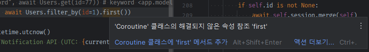

### filter_by

1. **주 역할은 create_obj 나 set_query에 들어갈 `where=`전용 kwargs를 받는 것이다.**
    - get(kwargs)는 따로 clause용 kwargs를 추출해서 set_query나 create_obj에 넣어줬찌만, where=전용이므로 where=가 생략된 keyword만 입력한다.
    - Users.filter_by() .first() 형식으로 추출해야하기 때문에, `classmethod`로 정의해야한다.

    ```python
    @classmethod
    async def filter_by(cls, session: AsyncSession = None, **kwargs):
        """
        Users.filter_by( id=1) - kwargs
            -> obj.create_obj(where= kwargs) or obj.set_query(where=kwargs)
        .first() / .all() 을 추가로 입력하도록 obj를 return
        
        :param session:
        :param kwargs:
        :return:
        """
        obj = await cls.create_obj(session=session, where=kwargs)
        return obj
    ```

2. 이때의 문제점은, 호출시 `User.filter_by()`가 async method라 `await`응답이 `coroutine`이라 `async def first()`가 바로 체이닝이 안된다.
    - 그렇다고 filter_by를 async로 안만들기에는 내부에 create_obj(session=) 때문에 불가능하다.
    - **async-chain을 만드는 utils을 만들어야한다.**
      

    ```python
    print("filter_by", await Users.filter_by(id=1).first())
    # 'coroutine' object has no attribute 'first'
    ```

#### @async_chain decoration 정의

1. utils > `async_chain.py`를 생성하고,
    - 데코레이터 `async_chain`을 정의하는데 필요한 코드를 작성한다

    ```python
    # https://github.com/Steffo99/async-chain
    from __future__ import annotations
    
    import functools
    import inspect
    import typing as t
    import abc
    
    
    class Chain(metaclass=abc.ABCMeta):
        __slots__ = []
    
        def __getattr__(self, item) -> ChainGetAttr:
            return ChainGetAttr(previous=self, item=item)
    
        def __getitem__(self, item) -> ChainGetItem:
            return ChainGetItem(previous=self, item=item)
    
        def __call__(self, *args, **kwargs) -> ChainCall:
            return ChainCall(previous=self, args=args, kwargs=kwargs)
    
        def __await__(self):
            return self.__evaluate__().__await__()
    
        @abc.abstractmethod
        def __repr__(self) -> str:
            raise NotImplementedError()
    
        @abc.abstractmethod
        def __display__(self) -> str:
            raise NotImplementedError()
    
        @abc.abstractmethod
        async def __evaluate__(self) -> t.Any:
            raise NotImplementedError()
    
    
    StartingType = t.TypeVar("StartingType")
    
    
    class ChainStart(Chain):
        __slots__ = ("__start__",)
    
        def __init__(self, start: StartingType):
            super().__init__()
            self.__start__: StartingType = start
    
        def __repr__(self) -> str:
            return f"<Chain {self.__display__()}>"
    
        def __display__(self) -> str:
            return f"{self.__start__!r}"
    
        async def __evaluate__(self) -> StartingType:
            return self.__start__
    
    
    class ChainNode(Chain, metaclass=abc.ABCMeta):
        __slots__ = ("__previous__",)
    
        def __init__(self, previous: Chain):
            super().__init__()
            self.__previous__: Chain = previous
    
        def __repr__(self) -> str:
            return f"<Chain {self.__display__()}>"
    
    
    class ChainGetAttr(ChainNode):
        __slots__ = ("__item__",)
    
        def __init__(self, previous: Chain, item: str):
            super().__init__(previous=previous)
            self.__item__: str = item
    
        def __display__(self) -> str:
            return f"{self.__previous__.__display__()}.{self.__item__!s}"
    
        async def __evaluate__(self) -> t.Any:
            previous = await self.__previous__.__evaluate__()
    
            current = getattr(previous, self.__item__)
    
            if inspect.isawaitable(current):
                return await current
            else:
                return current
    
    
    class ChainGetItem(ChainNode):
        __slots__ = ("__item__",)
    
        def __init__(self, previous: Chain, item: t.Any):
            super().__init__(previous=previous)
            self.__item__: t.Any = item
    
        def __display__(self) -> str:
            return f"{self.__previous__.__display__()}[{self.__item__!r}]"
    
        async def __evaluate__(self) -> t.Any:
            previous = await self.__previous__.__evaluate__()
    
            current = previous[self.__item__]
    
            if inspect.isawaitable(current):
                return await current
            else:
                return current
    
    
    class ChainCall(ChainNode):
        __slots__ = ("__args__", "__kwargs__",)
    
        def __init__(self, previous: Chain, args: t.Collection[t.Any], kwargs: t.Mapping[str, t.Any]):
            super().__init__(previous=previous)
            self.__args__: t.Collection[t.Any] = args
            self.__kwargs__: t.Mapping[str, t.Any] = kwargs
    
        def __display__(self) -> str:
            args = map(lambda a: f"{a!r}", self.__args__)
            kwargs = map(lambda k, v: f"{k!s}={v!r}", self.__kwargs__)
            allargs: str = ", ".join([*args, *kwargs])
            return f"{self.__previous__.__display__()}({allargs})"
    
        async def __evaluate__(self) -> t.Any:
            previous = await self.__previous__.__evaluate__()
    
            current = previous(*self.__args__, **self.__kwargs__)
    
            if inspect.isawaitable(current):
                return await current
            else:
                return current
    
    
    class FunctionWrapper:
        def __init__(self, func):
            self._func = func
    
        def __repr__(self) -> str:
            return self._func.__name__
    
        def __call__(self, *args, **kwargs) -> t.Any:
            return self._func(*args, **kwargs)
    
    
    def async_chain(func):
        @functools.wraps(func)
        def decorated(*args, **kwargs):
            return ChainStart(start=FunctionWrapper(func))(*args, **kwargs)
    
        return decorated
    
    ```

2. **filter_by의 @classmethod 데코 `밑`에 `@async_chain`데코레이터를 달아주면 된다.**

    ```python
    from app.models.utils.async_chain import async_chain
    
    
    # ...
    
    @classmethod
    @async_chain
    async def filter_by(cls, session: AsyncSession = None, **kwargs):
        """
        Users.filter_by( id=1) - kwargs
            -> obj.create_obj(where= kwargs) or obj.set_query(where=kwargs)
        .first() / .all() 을 추가로 입력하도록 obj를 return
        """
        obj = await cls.create_obj(session=session, where=kwargs)
        return obj
    
    ```

### order_by with async_chain  만들기

- order_by는 `Users.ordre_by()`.first() 가 될 수도 잇고, Users`.filter_by().order_by()`.first()가 될 수 있다.
- **filter_by역시 추후 Users`.load({}).filter_by()`.first()가 될 수도 있다.**

#### @class_or_instanc_method classmethod + instancemethod(self)를 각각 정의할 수 있게 하는 데코레이터
1. uitls > `class_or_instance_method.py`를 만들고 코드를 작성한다.
    ```python
    # https://stackoverflow.com/questions/28237955/same-name-for-classmethod-and-instancemethod
    # noinspection PyPep8Naming
    class class_or_instance_method:
        def __init__(self, fclass, finstance=None, doc=None):
            self.fclass = fclass
            self.finstance = finstance
            self.__doc__ = doc or fclass.__doc__
            # support use on abstract base classes
            self.__isabstractmethod__ = bool(
                getattr(fclass, '__isabstractmethod__', False)
            )
    
        def classmethod(self, fclass):
            return type(self)(fclass, self.finstance, None)
    
        def instancemethod(self, finstance):
            return type(self)(self.fclass, finstance, self.__doc__)
    
        def __get__(self, instance, cls):
            if instance is None or self.finstance is None:
                # either bound to the class, or no instance method available
                return self.fclass.__get__(cls, None)
            return self.finstance.__get__(instance, cls)
    ```

2. **사용은 아래와 같이 classmethod의 경우 `@class_or_instancemethod`, 같은 이름의 인스턴스 메서드는 `@filter_by.instancemethod`의 `@메서드명.instancemethod`로 정의한다.**
    - filter_by에 적용하고, filter_by().filter_by()로 객체상태에서 호출해본다.
    ```python
    @class_or_instance_method
    @async_chain
    async def filter_by(cls, session: AsyncSession = None, **kwargs):
        """
        Users.filter_by( id=1) - kwargs
            -> obj.create_obj(where= kwargs) or obj.set_query(where=kwargs)
        .first() / .all() 을 추가로 입력하도록 obj를 return
        """
        obj = await cls.create_obj(session=session, where=kwargs)
        return obj
    
    @filter_by.instancemethod
    @async_chain
    async def filter_by(self, **kwargs):
    
        self.set_query(where=kwargs)
    
        return self
    ```
    ```python
    @router.get("/")
    async def index():
        print("filter_by", await Users.filter_by(id=1).first())
        print("filter_by", await Users.filter_by(id=1).filter_by(id__ne=None).first())
    
        current_time = datetime.utcnow()
        return Response(f"Notification API (UTC: {current_time.strftime('%Y.%m.%d %H:%M:%S')})")
    
    ```

#### order_by 도  cls/self 둘다 쓰이는 중간메서드
1. order_by를 정의하고, keyword로는 `order_by=`를 주입한다.
    - **메서드 자체는 kwargs가 아니라 `*args`의 인자입력 -> `tuple`로 들어올 것이다.**
    ```python
    @class_or_instance_method
    @async_chain
    async def order_by(cls, *args, session: AsyncSession = None):
        """
        Users.order_by("-id")
        Users.order_by("-id", "email")
        """
        obj = await cls.create_obj(session=session, order_by=args)
        return obj
    
    @order_by.instancemethod
    @async_chain
    async def order_by(self, *args):
    
        self.set_query(order_by=args)
    
        return self
    
    ```
2. **set_query에서 order_by=를 처리할 로직을 작성한다.**
    ```python
    def set_query(self, **clause_map):
        # clause의 종류에 따라 각각 체이닝
        for clause_, attr_name_and_value_map in clause_map.items():
            clause_lower = clause_.lower()
    
            if clause_lower == Clause.WHERE:
                self.chain_where_query(attr_name_and_value_map)
                continue
                
            elif clause_lower == Clause.ORDER_BY:
                self.chain_order_by_query(attr_name_and_value_map)
                continue
    ```

   - where가 아닌 경우, clause_map의 value가 `attr_name_and_value_map`이 아니라 `str list`이므로, 그냥 `value_`로 변경한다
       ```python
       def set_query(self, **clause_map):
           #...
           # clause의 종류에 따라 각각 체이닝
           for clause_, value_ in clause_map.items():
               clause_lower = clause_.lower()
    
               if clause_lower == Clause.WHERE:
                   # where = dict( id=1 )
                   self.chain_where_query(value_)
                   continue
    
               elif clause_lower == Clause.ORDER_BY:
                   # order_by = str "id" or "-id"
                   self.chain_order_by_query(value_)
                   continue
       ```
3. `self.chain_order_by_query()` 메서드의 로직을 작성한다.
    - **`where`의 경우에는, 추후 `having`과 같이, `create_condition_exprs` + `recursive`로 구성했지만,**
    - **`order_by` 외에 `select` + `group_by`의 경우에는 `추후 한 세트인데`로 `지금은 각각 구성` -> `추후 메서드로 묶어서` 구성하자**

    ```python
    def chain_order_by_query(self, args: tuple):
        column_exprs = self.create_order_by_exprs(args)
    
        self.query = (
            self.query
            .order_by(*column_exprs)
        )
    ```
4. create_order_by_exprs를 작성한다.
    - 인자로 "id" or "-id"가 올 수 있으므로 startswith으로 확인할 `ORDER_BY_DESC_PREFIX = '-'`를 consts.py에 정의한다.
    ```python
    ORDER_BY_DESC_PREFIX = '-'
    ```
    - 만약 복수가 아닌 인자가 왔을 땐, tuple()로 감싼다. `사실상 *args -> args는 tuple고정이라 상관없을 듯`
      - **prefix를 `""으로 기본값`잡아두고, ORDER_BY_DESC_PREFIX가 attr_name_에 포함되어있으면, prefix를 "-"로 채워놓는다.**
      - split한 뒤, column_name -> cls.get_column + `prefix에 따른 desc or asc sqla func`을 씌운 표현식을 모아서 반환한다.
    ```python
    def create_order_by_exprs(self, args: tuple):
        """
        order_by('id') -> args:  ('id',)
        order_by('id', '-id') -> args: ('id', '-id')
        """
        if not isinstance(args, (list, tuple, set)):
            args = tuple(args)
    
        order_by_exprs = []
    
        for attr_name_ in args:
            order_by_prefix = ""
            if ORDER_BY_DESC_PREFIX in attr_name_:
                order_by_prefix = ORDER_BY_DESC_PREFIX
                attr_name_ = attr_name_.lstrip(ORDER_BY_DESC_PREFIX)
    
            order_func = desc if order_by_prefix else asc
            column_expr = self.get_column(self.__class__, attr_name_)
            order_by_expr = order_func(column_expr) # desc(Users.id)
    
            order_by_exprs.append(order_by_expr)
    
        return order_by_exprs
    ```
5. `집계변수 + append를 제거`하기 위해 generator로 변환하고, 외부 변수명을 바꾼다. (`어차피 밖에선 *return`으로 사용되어 한번에 풀어짐)
    ```python
    def create_order_by_exprs(self, args: tuple):
        """
        order_by('id') -> args:  ('id',)
        order_by('id', '-id') -> args: ('id', '-id')
        """
        if not isinstance(args, (list, tuple, set)):
            args = tuple(args)
    
        # order_by_exprs = []
    
        for attr_name_ in args:
            order_by_prefix = ""
            if ORDER_BY_DESC_PREFIX in attr_name_:
                order_by_prefix = ORDER_BY_DESC_PREFIX
                attr_name_ = attr_name_.lstrip(ORDER_BY_DESC_PREFIX)
    
            order_func = desc if order_by_prefix else asc
            column_expr = self.get_column(self.__class__, attr_name_)
            order_by_expr = order_func(column_expr) # desc(Users.id)
    
            # order_by_exprs.append(order_by_expr)
            yield order_by_expr
    
        # return order_by_exprs
    ```
    ```python
    def chain_order_by_query(self, args: tuple):
        # column_exprs = self.create_order_by_exprs(args)
        column_exprs_generator = self.create_order_by_exprs(args)
    
        # .order_by(*column_exprs)
        self.query = (
            self.query
            .order_by(*column_exprs_generator)
        )
    ```

6. `Users.ordre_by()`의 인자로는 string args로 칼럼이름이 들어와야 하므로, 실수방지차원에서 검증을 추가한다
    ```python
    def check_order_by_args(self, args):
        if not all(isinstance(column_name, str) for column_name in args):
            raise KeyError(f'column명을 string으로 입력해주세요 ex> order_by("id", "-id") ')
    ```
    ```python
    @class_or_instance_method
    @async_chain
    async def order_by(cls, *args, session: AsyncSession = None):
        cls.check_order_by_args(args)
    
        obj = await cls.create_obj(session=session, order_by=args)
        return obj
    
    @order_by.instancemethod
    @async_chain
    async def order_by(self, *args):
        self.check_order_by_args(args)
    
        self.set_query(order_by=args)
    
        return self
    ```
    - test
    ```python
    @router.get("/")
    async def index():
        print("order_by", await Users.order_by("id").first())
        print("order_by", await Users.order_by("id", "-id").first())
        current_time = datetime.utcnow()
        return Response(f"Notification API (UTC: {current_time.strftime('%Y.%m.%d %H:%M:%S')})")
    ```
   

### get/create는 only clsmethod로 지정(instance 호출시 raise)
1. get/create를 @classmethod -> `@classmethod_or_instance`로 변경해주고, `@메서드.instance_method`에서 raise를 발생시킨다.
```python
# @classmethod
@class_or_instance_method
async def create(cls, session: AsyncSession = None, auto_commit=False, **kwargs):
    #...

@create.instancemethod
async def create(self, session: AsyncSession = None, auto_commit=False, **kwargs):
    raise NotImplementedError(f'객체 상태에서 create 메서드를 호출 할 수 없습니다.')

```
```python
# @classmethod
@class_or_instance_method
async def get(cls, *ids_, session: AsyncSession = None, **kwargs):
    #...

@get.instancemethod
async def get(self, *ids_, session: AsyncSession = None, **kwargs):
    raise NotImplementedError(f'객체 상태에서 get 메서드를 호출 할 수 없습니다.')

```
### 도커 명령어

1. (`패키지 설치`시) `pip freeze` 후 `api 재실행`

```shell
pip freeze > .\requirements.txt

docker-compose build --no-cache api; docker-compose up -d api;
```

2. (init.sql 재작성시) `data폴더 삭제` 후, `mysql 재실행`

```shell
docker-compose build --no-cache mysql; docker-compose up -d mysql;
```

```powershell
docker --version
docker-compose --version

docker ps
docker ps -a 

docker kill [전체이름]
docker-compose build --no-cache
docker-compose up -d 
docker-compose up -d [서비스이름]
docker-compose kill [서비스이름]

docker-compose build --no-cache [서비스명]; docker-compose up -d [서비스명];

```

- 참고
    - 이동: git clone 프로젝트 커밋id 복사 -> `git reset --hard [커밋id]`
    - 복구: `git reflog` -> 돌리고 싶은 HEAD@{ n } 복사 -> `git reset --hard [HEAD복사부분]`