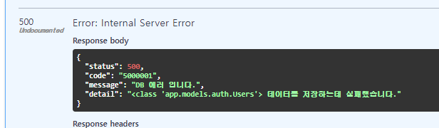
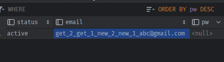

### update (self only)
1. update는 only instance_method로 호출되도록 한다.
    ```python
        @class_or_instance_method
        async def update(self, session: AsyncSession = None, auto_commit: bool = False, **kwargs):
            raise NotImplementedError(f'update 메서드는 객체상태에서만 호출 할 수 있습니다.')
    
        @update.instancemethod
        async def update(self, session: AsyncSession = None, auto_commit: bool = False, **kwargs):
            ...
    ```
#### _set_session 재설계
2. 외부 공용session이 안넘어올 때, **현재 객체 상태가 `get등으로 조회된 객체 + close로 session = None인 상태` or `순수model객체` 일 수 있다.**
    - _set_session() 메서드에서 **외부session이 없을 때, `self._session`여부를 확인해서, `session이 없을경우만 재발급`하고, `외부session이 있다면 덮어쓰기`되도록 수정한다**
        - **self.session의 property는 set_session관련 상황에서 사용하면 안된다. session이 없으면 raise하기 때문에 확인 불가.**
    - set_session도 외부에서 호출하니 `_` prefix를 제거하여 메서드명을 바꾼다.
    ```python
    async def set_session(self, session: Session = None):
        """
        공용 session이 따로 안들어오면, 단순조회용으로 db에서 새발급
        """
        if session:
            self._session, self._served = session, True
        else:
            # 외부 공용 sess X 자기 sess X -> 다시 재발급
            if not self._session:
                # session = next(db.session())
                # 비동기 AsyncSession는 yield하더라도, # 'async_generator' object is not an iterator 에러가 뜬다.
                # => 제네레이터가 아니라 비동기 제네레이터로서, wait + 제네레이터.__anext__()를 호출한다.
                # session = await db.session().__anext__()
                session = await db.session().__anext__()
    
                self._session, self._served = session, False
            # 외부 공용 sess X & 자기 sess O -> 유지
            else:
                ...
    ```
   
3. **이 때, 아래와 같은 경우, .create( , auto_commit=False)의 경우, obj에 session이  None으로 안덮히고 남아있어서, auto_commit=True가 될때까지 사용할 수 있게 된다.**
    - **이렇게 되기 위해서는 `2번재 .update()시, 외부session이 안들어가도, 자체발급 안되도록` 조건식을 걸어줘야한다.**
    - **`외부 X + 자체 O`의 상황에서는 session의 변화가 없어야하는데, 자체O라는 말은 `self._session 필드`도 있어야하고, `그 값도 None이 아니여야`한다.**
    - **그 조건을 만족하는 조건식이 `getattr(self, _session, None)`이다. `필드를 이미 가진 조회/생성된 객체`라도 getattr된 값이 None이면 탈락이다. 필드조차 없으면 None이 나온다.** 
    ```python
    user = await Users.create(email='abc@gmail.com')
    
    print(await user.update(email='new_1_' + user.email))
    
    print(await user.update(email='new_2_' + user.email, auto_commit=True))
    ```
    ```python
    async def set_session(self, session: Session = None):

    # 외부 X and 자신O(필드 + session) -> 아예 실행도 X
    if not session and getattr(self, '_session', None):
        return
    
    # 외부 O or 자신X
    if session:
        # (외부 O) & (자신O or 자신X 노상관) -> 무조건 덮어쓰기
        self._session, self._served = session, True
    else:
        # (외부 X) and 자신X -> 새 발급
        self._session = await db.session().__anext__()
        self._served = False
    
    ```
   
#### fill 재설계
4. update는 `self.fill(**kwargs)`시 변화가 나타나야 -> update쿼리를 날리고, `fill()시 새로운 데이터가 없다면 update Fail`시켜야한다.
    - **이 때, `fill메서드의 return값`으로 `False or True`가 가능하도록 flag변수 `is_filled`를 추가한다**
    - **fill의 검증3가지 중에, `같은 값이면 continue`되므로, flag가 True로 안변하게 하는 것을 이용한다.**
    ```python
     def fill(self, **kwargs):
        """
        create 내부 obj객체   or   외부 model객체.fill() 용 self메서드
        obj = cls._create_obj()
        obj.fill(**kwargs) -> True or False (is_filled)
        """
        is_filled = False
    
        for column_name, new_value in kwargs.items():
            # 1) form.data(dict) 에 더불어 오는 keyword => 에러X 무시하고 넘어가기
            if column_name in ['csrf_token', 'submit'] or column_name.startswith('hidden_'):
                continue
            # 2) settable_attr이 아니라도 -> (@property일 수 있다)
            #    setter/expression을 hasattr()하고 있는 @property는, fill 가능이다.
            #    (settable_attr에 포함되면 바로 통과)
            if not (column_name in self.settable_attributes or self.is_setter_or_expression(column_name)):
                raise KeyError(f'Invalid column name: {column_name}')
    
            # 3) (settable_attr or property지만) 2개를 포괄하는 column_names 중에
            #    -> 이미 현재 값과 동일한 값이면, continue로 넘어간다.
            if column_name in self.column_names and getattr(self, column_name) == new_value:
                continue
    
            # 4) 이제 self의 column에 setattr() 해줄 건데, <관계칼럼이면서 & uselist=True>는 append를 해준다.
            if column_name in self.relation_names and isinstance(getattr(self, column_name), InstrumentedList) \
                    and not isinstance(new_value, list):
                getattr(self, column_name).append(new_value)
            else:
                setattr(self, column_name, new_value)
    
            is_filled = True
    
        # return self
        return is_filled
    ```
   
5. 기존 fill메서드를 사용하는 `create`메서드에서는, 기본값으로 들어가는 것들이 있고, `update와 달리 반드시 데이터가 들어가야하는 것`이 아니기 때문에, fill의 return값을 활용하지 않아도 된다.

6. **이제 `update메서드` 내부에서 `set_session`만 해주고, `self._query`는 없는 상태다. 하지만 `create처럼 update는 fill -> obj.save()`로 `query대신 add/merge commit`만 하면 되서 `query가 필요없다.`**
    - **게다가 update는 self상태에서 호출하는 것이날 `create_obj내의 set_query`도 필요없다.**
    - **create와 다른점은, `fill()`호출 후, `실제 바뀐 값이 있을 때만 .save()를 호출`해야한다.**
    - **이렇게, `조회된 객체 전용 self(instance_method)메서드`는 `set_session`으로 처리되도록 한다.(create_obj필수X)**
    ```python
    @update.instancemethod
    async def update(self, session: AsyncSession = None, auto_commit: bool = False, **kwargs):
    
        await self.set_session(session=session)
    
        is_filled = self.fill(**kwargs)
    
        if not is_filled:
            return None
        
        return await self.save(auto_commit=auto_commit)
    ```
   

### CU(D) 에러 -> sqlalchemy 에러에 대한 exception handling + logging
7. exceptions.py에서 `DB용 exception -> DB용 log`를 따로 찍기 위해, `500` exception `하위 DBExceptionclass `를 새롭게 정의하고
    - SaveFailException이 상속할 수 있게 틀을 짠다.
    - SaveFailException은 save메서드 호출시, 어떤 self객체의 class에서 저장에러가 났는지 detail에 적기 위해 `cls_`를 인자로 받는다.
    ```python
    # 500
    
    # 500 - db
    class DBException(APIException):
        def __init__(
                self, *,
                code_number: [str, int] = "0",
                detail: str = None,
                exception: Exception = None
        ):
            if not isinstance(code_number, str):
                code_number = str(code_number)
    
            super().__init__(
                status_code=status.HTTP_500_INTERNAL_SERVER_ERROR,
                code=f"{status.HTTP_500_INTERNAL_SERVER_ERROR}{code_number.zfill(4)}",
                message="DB 에러 입니다.",
                detail=detail,
                exception=exception
            )
    
    
    class SaveFailException(DBException):
    
        def __init__(self, *, cls_=None, exception: Exception = None):
            super().__init__(
                code_number=1,
                detail=f"{cls_} 데이터를 저장하는데 실패했습니다.",
                exception=exception
            )
    
    ```
8. save메서드 내용을 `try/except`로 감싼 뒤, 해당 Exception을 raise시키고, cls정보를 넘겨준다.
    ```python
        async def save(self, auto_commit=False):
            try:
                # id를 가진 조회된객체(자체sess)상태에서 + 외부 공용sess 주입 상태일때만 merge
                if self.id is not None and self.served:
                    await self.session.merge(self)
                else:
                    self.session.add(self)
                    await self.session.flush()
    
                if auto_commit:
                    await self.session.commit()
                    self._session = None
                    self._served = False
    
                return self
    
            except Exception as e:
                raise SaveFailException(cls_=self.__class__, exception=e)
    
    ```
9. **access_control에서 log를 찍을 때, `APIException의 하위 class부터` 인스턴스인지 확인하여, DBException이면, `db_logger.log()`로 에러를 찍는다.**
    ```python
    class AccessControl(BaseHTTPMiddleware):
        async def dispatch(self, request: Request, call_next: RequestResponseEndpoint) -> Response:
    
            except Exception as e:
                # handler를 통해 정의하지 않은 e라면 -> 기본 500의 APIException으로 변환되게 된다.
                error: APIException = await exception_handler(e)
    
                # JSONResponse의 content=로 넣을 error 객체를 dict로 변환한다.
                error_dict = dict(
                    status=error.status_code,
                    code=error.code,
                    message=error.message,
                    detail=error.detail,
                )
    
                response = JSONResponse(status_code=error.status_code, content=error_dict)
                # logging
                if isinstance(error, DBException):
                    # APIException의 하위 DBException class부터 검사하여 해당하면 db_logger로 찍기
                    await db_logger.log(request, error=error)
                else:
                    await app_logger.log(request, error=error)
    
            return response
    ```
   
10. test로, index에서 이미 존재하는 unique칼럼(email)로 Users.create()를 호출하여, db.log에 찍히는지 확인하면 된다.
    ```python
    @router.get("/")
    async def index(session: AsyncSession = Depends(db.session)):
        users_1 = await Users.get(1, session=session)
        
        await Users.create(email=users_1.email)
        
        current_time = datetime.utcnow()
        return Response(f"Notification API (UTC: {current_time.strftime('%Y.%m.%d %H:%M:%S')})")
    
    ```
    


### update test
- **only self -> set_session시 처리로 인해, auto_commit전까지, create/get 이후 사용할 수 있다.**
```python
@router.get("/")
async def index(session: AsyncSession = Depends(db.session)):
    user = await Users.create(email='abc@gmail.com')

    print("user", user)

    print(await user.update(email='new_1_' + user.email))

    print(await user.update(email='new_2_' + user.email, auto_commit=True))

    user = await Users.get(id=user.id)
    print(await user.update(email='get_1_' + user.email))
    print(await user.update(email='get_2_' + user.email, auto_commit=True))

    current_time = datetime.utcnow()
    return Response(f"Notification API (UTC: {current_time.strftime('%Y.%m.%d %H:%M:%S')})")

```


### router/auth.py의 get_by_email -> filter_by + exist or first()
- **회원가입시에는 `exists`를, 로그인에서는 `exists가 아니라 first로 객체`를 가져와서, 회원정보 비교해야함**
```python
@router.post("/register/{sns_type}", status_code=201, response_model=Token)
async def register(sns_type: SnsType, user_register_info: UserRegister, session: AsyncSession = Depends(db.session)):
    if sns_type == SnsType.EMAIL:
        #...
        if not user_register_info.email or not user_register_info.pw:
            raise ValueError('이메일 혹은 비밀번호를 모두 입력해주세요.')

        # user = await Users.get_by_email(session, user_register_info.email)
        exists_user = await Users.filter_by(session=session, email=user_register_info.email).exists()
        if exists_user:
            raise EmailAlreadyExistsException()
            
@router.post("/login/{sns_type}", status_code=200, response_model=Token)
async def login(sns_type: SnsType, user_info: UserRegister, session: AsyncSession = Depends(db.session)):
    if sns_type == SnsType.EMAIL:
        #...
        if not user_info.email or not user_info.pw:
            # return JSONResponse(status_code=400, content=dict(message="Email and PW must be provided."))
            raise ValueError('이메일 혹은 비밀번호를 모두 입력해주세요.')

        # 검증2) email이 존재 해야만 한다.
        # user = await Users.get_by_email(session, user_info.email)
        user = await Users.filter_by(session=session, email=user_info.email).first()
        if not user:
            raise NoUserMatchException()
        
        is_verified = bcrypt.checkpw(user_info.pw.encode('utf-8'), user.pw.encode('utf-8'))
        if not is_verified:
            raise NoUserMatchException()
```

### 주의점 -> auto_commit 없이 2개를 동시에 호출시 -> lock에 걸린다.

```python
user = await Users.create(email='abc@gmail.com')
user = await Users.create(email='abc@gmail.com')
# => 앱 멈춤.
# Lock wait timeout exceeded; try restarting transaction
```
```python
    user = await Users.create(email='abc@gmail.com', auto_commit=True)
    user = await Users.create(email='abc@gmail.com', auto_commit=True)
```

### 도커 명령어

1. (`패키지 설치`시) `pip freeze` 후 `api 재실행`

```shell
pip freeze > .\requirements.txt

docker-compose build --no-cache api; docker-compose up -d api;
```

2. (init.sql 재작성시) `data폴더 삭제` 후, `mysql 재실행`

```shell
docker-compose build --no-cache mysql; docker-compose up -d mysql;
```

```powershell
docker --version
docker-compose --version

docker ps
docker ps -a 

docker kill [전체이름]
docker-compose build --no-cache
docker-compose up -d 
docker-compose up -d [서비스이름]
docker-compose kill [서비스이름]

docker-compose build --no-cache [서비스명]; docker-compose up -d [서비스명];

```

- 참고
    - 이동: git clone 프로젝트 커밋id 복사 -> `git reset --hard [커밋id]`
    - 복구: `git reflog` -> 돌리고 싶은 HEAD@{ n } 복사 -> `git reset --hard [HEAD복사부분]`