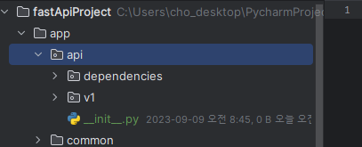

### schemas.py -> schemas패키지 생성 하여 각 router도메인별로 생성
1. schemas패키지 > init.py auth.py, user.py 생성
2. schemas.py 에 있는 내용을 각각의 모듈에 맡게 이동
3. init.py에 한번에 올리기 -> `schemas.py와 경로가 모든 schema의 같아짐`. route 확인
    ```python
    from .auth import *
    from .user import *
    ```
   
4. **common.py를 추가생성해서, `Message` Schema를 미리 생성해놓는다.**
    ```python
    from pydantic import BaseModel
    
    
    class Message(BaseModel):
        message: str = None
    
    
    class SuccessMessage(BaseModel):
        message: str = "ok"
    
    
    class FailMessage(BaseModel):
        message: str = "fail"
    
    ```
    ```python
    from .common import *
    from .auth import *
    from .user import *
    
    ```
   
5. `UserRegister` 스키마는 로그인/회원가입 다 쓰이니 `UserRequest`로 변경해놓는다.
    ```python
    class UserRequest(BaseModel):
        # pip install "pydantic[email]"
        email: EmailStr = None
        pw: str = None
        #...
    ```
    - router들에서도 변경해준다.
    ```python
    @router.post("/register/{sns_type}", status_code=201, response_model=Token)
    async def register(sns_type: SnsType, user_request: UserRequest, session: AsyncSession = Depends(db.session)):
        #...
    
    @router.post("/login/{sns_type}", status_code=200, response_model=Token)
    async def login(sns_type: SnsType, user_request: UserRequest, session: AsyncSession = Depends(db.session)):
        #...
    
    ```
   
6. models/auth.py -> 인증이 아니라 user의 모델들이니 user.py로 변경한다.

### app > api패키지 > v1 + dependencies 패키지
- `api에서만 사용되는 router`들은 api패키지로 옮겨서 처리하려고 하므로 `index.py`를 제외하고 `user.py, auth.py`를 옮겨줄 예정이다.
- 또한, api에 사용될 주입 dependencies(인증시 db처리가 필요할 때, 미들웨어에서 하지 않고(성능문제), 접속시 주입식으로 처리되기 하기 위해)패키지를 따로 만든다.
    

1. 기존 routers폴더에서 `index.py`를 제외하고 `user.py, auth.py`를 v1 폴더로 옮겨준다.
2. `v1/__init__.py`에서 각각의 router들을 `v1 router`에 하위 route들을 통합되도록 한다.
    - **이 때, 각 route객체에서 줬던 prefix를, `상위router.include_router()`에서 통합될 때, 명시적으로 주도록 변경한다.**
    ```python
    # auth.py
    # router = APIRouter(prefix='/auth')
    router = APIRouter()
    
    # user.py
    # router = APIRouter(prefix='/user')
    router = APIRouter()
    ```

3. v1 / `__init__.py`에서 하위 auth, user 파일을 import한 뒤, .router를 include하면서 `prefix, tags, dependencies`를 추가한다.
    ```python
    from fastapi import APIRouter, Depends
    from fastapi.security import APIKeyHeader
    
    from . import auth, user
    
    API_KEY_HEADER = APIKeyHeader(name='Authorization', auto_error=False)
    
    router = APIRouter() # v1 router -> 상위 main router객체에 prefix
    router.include_router(auth.router, prefix='auth', tags=['Authentication'])
    router.include_router(user.router, prefix='users', tags=['Users'], dependencies=[Depends(API_KEY_HEADER)])
    ```
   
4. api / `__init__.py`에서 v1을 가져오고 -> ~route객체를 만들어서,~ `app객체`에  `prefix='v1'`으로 include_router로 추가한다.
    - **router에서 .include_router()도 가능하고, `최상위에서는 app객체에서 .include_router()`로 추가하는데, init.py가 포함된 객체 자체를 가져와 한다.**
    ```python
    from fastapi import APIRouter
    
    from . import v1
    
    router = APIRouter()
    router.include_router(v1.router, prefix="v1")
    
    ```

5. main.py의 create_app에서 api를 가져와, -> route에서 `prefix='api'`로 include한다
    - **이 때, index.py를 포함하고 있는 router/index.py는 그대로 추가한다.**
```python
from app import api
#...
def create_app():
    #...
    # route 등록
    app.include_router(index.router) # template or test
    app.include_router(api.router, prefix='/api')
    # app.include_router(auth.router, tags=["Authentication"], prefix="/api")
    # app.include_router(user.router, tags=["Users"], prefix="/api", dependencies=[Depends(API_KEY_HEADER)])

    #...
    return app
```

#### 이제 /api 와 /auth 사이에 url에 /v1이 붙었으니, except_path에 추가해준다.
- `consts.py`에서 EXCEPT_PATH_REGEX = 에 정규식으로 v[숫자]가 오는 경우로 변경한다.
```python
# EXCEPT_PATH_REGEX = "^(/docs|/redoc|/api/auth)"
EXCEPT_PATH_REGEX = "^(/docs|/redoc|/api/v[0-9]+/auth)"
```
#### router/index.py check 및 template render용으로 routers패키지로 만든다.
```python
# routers/__init__.py

from . import index

```

```python
# main.py

from app.routers import index


# ...
def create_app():
    # route 등록
    app.include_router(index.router)  # template or test
    # ...
    return app
```
### 도커 명령어

1. (`패키지 설치`시) `pip freeze` 후 `api 재실행`

```shell
pip freeze > .\requirements.txt

docker-compose build --no-cache api; docker-compose up -d api;
```

2. (init.sql 재작성시) `data폴더 삭제` 후, `mysql 재실행`

```shell
docker-compose build --no-cache mysql; docker-compose up -d mysql;
```

```powershell
docker --version
docker-compose --version

docker ps
docker ps -a 

docker kill [전체이름]
docker-compose build --no-cache
docker-compose up -d 
docker-compose up -d [서비스이름]
docker-compose kill [서비스이름]

docker-compose build --no-cache [서비스명]; docker-compose up -d [서비스명];

```

- 참고
    - 이동: git clone 프로젝트 커밋id 복사 -> `git reset --hard [커밋id]`
    - 복구: `git reflog` -> 돌리고 싶은 HEAD@{ n } 복사 -> `git reset --hard [HEAD복사부분]`