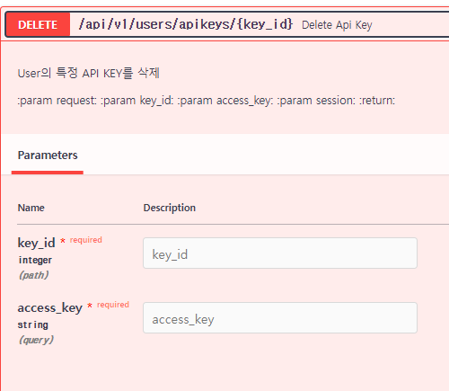

### ApiKeys, ApiWhiteLists 테이블 model 생성

1. models/user.py에 같이 정의한다.
    - **`fk 칼럼`을 `one테이블을 string`으로 지정하여 ForeignKey("`소문자테이블명`.id") + nullable=False 로 지정한다.**
    - **fk 칼럼 정의시, `one에 대한 relationship`도 같이 정의해주는데, 이때는 `one테이블을 string으로 주되 Class명`이 들어가는 relationship(`클래스명`, )으로
      지정한다**
    - **fk가 여러개 인 다대다 테이블에서 비롯했지만, `relationship 정의시 foreign_keys=[fk칼럼변수]에 fk를 명시적으로 지정`해주자.**
    - **relationship의 대상이 one이면 `uselist=False`로서, list가 아닌 객체로 반환되도록 설정하고,
      각각은 `backref대신 back_populates로 양쪽에서 서로 relationship을 지정`해준다.**

    ```python
    class Users(BaseModel):
        # ...
        keys = relationship("ApiKeys", back_populates="user")
   
    class ApiKeys(BaseModel):
        access_key = Column(String(length=64), nullable=False, index=True)
        secret_key = Column(String(length=64), nullable=False)
        user_memo = Column(String(length=40), nullable=True)
        status = Column(Enum("active", "stopped", "deleted"), default="active")
    
        user_id = Column(Integer, ForeignKey("users.id"), nullable=False)
        # users = relationship("Users", back_populates="keys")
        user = relationship("Users", back_populates="keys",
                            foreign_keys=[user_id],
                            uselist=False,
                            )
    
        is_whitelisted = Column(Boolean, default=False)
        whitelists = relationship("ApiWhiteLists", back_populates="api_key")
    
    
    class ApiWhiteLists(BaseModel):
        ip_address = Column(String(length=64), nullable=False)
        api_key_id = Column(Integer, ForeignKey("apikeys.id"), nullable=False)
        api_key = relationship("ApiKeys", back_populates="whitelists",
                               foreign_keys=[api_key_id],
                               uselist=False,
                               )
    ```

2. 이 때, ApiKeys테이블에서는
    - apikey에 대한 `access_key`와 `secret_key`가 2개 동시에 생성되어야한다.
    - `user_memo`는 apikey생성시 적어주는 설명이다.

### ApiKeys CRUD

- **유저정보는, `/ or auth관련(회원가입/로그인)`을 제외하고는 access_control에서 `request.state.user`에서 어차피 따오므로, /users/apikeys/로 이어지는 url을
  쓴다.**
- api > v1 > user.py에서 작업한다.

#### Create - reqeust

1. Create시, 필요한 정보는 `user` from `request` 외에 `user_memo`이다. ApiKeyRequest의 schema를 정의한다.
    - 없을 수도 있어서 Optional
    - **`Create`의 `Request`가 SChema가 제일적을 것이기 때문에 `먼저 정의`하고 -> `Create Response`를 정의한다.**
    - user_memo는 없을 수 있다.
    ```python
    class ApiKeyRequest(BaseModel):
        user_memo: Optional[str] = None
    
        class Config:
            from_attributes = True
    ```
    - **이 떄, 2.0버전에서 권장하는 ConfigDict를 사용해서 오류나 워닝을 방지하도록 변경한다.**
    - 일본 참고페이지: https://zenn.dev/tk_resilie/articles/fastapi0100_pydanticv2

##### pydantic v2.0 공부

1. (필수) BaseSettings가 다른 패키지의 pydantic-settings가되었습니다.
    ```python
    from pydantic import BaseSettings
    
    from pydantic_settings import BaseSettings
    ```
2. (필수) 기본값이 None이면 =None 지정이 필수입니다.
    - V1에서 = None을 지정하지 않고 값이 지정되지 않은 경우 암시 적으로 None이 설정되었지만 Python 표준 사양에 맞게 검토되고 기본값이 None이면 = None 지정이 필수가 되었습니다.

    ```python
    class TodoResponse(BaseModel):
        id: str
        title: str
        created_at: datetime.datetime
        updated_at: datetime.datetime | None  # =Noneなしでも、値未指定ならNoneとみなされた
    
    
    #V2
    
    class TodoResponse(BaseModel):
        id: str
        title: str
        created_at: datetime.datetime
        updated_at: datetime.datetime | None = None  # =Noneがない場合は、値の指定が必須になった
    ```

3. (필수) validator의 이름 변경
    - validator의 함수명이 변경되어
    - validator -> field_validator
    - root_validator -> model_validator
    - 와 같이, 보다 명확한 인상이 되었습니다.
    - 또한 V1의 pre=True는 mode='before'로 변경되었습니다.
    - mode는 'before' 이외에 'after'도 지정 가능하며, pydantic에서 타입 체크 전에 validate했을 경우는 before를 지정합니다

    ```python
    
    from pydantic import BaseModel, validator, root_validator
    
    
    class User(BaseModel):
        name: str
    
        @validator('name', pre=True)  # <-
        def validate_name(cls, v):
            return v
    
        @root_validator(pre=True)  # <-
        def validate_root(cls, values):
            return values
    
    
    # V2
    
    from pydantic import BaseModel, field_validator, model_validator
    
    
    class User(BaseModel):
        name: str
    
        @field_validator('name', mode='before')  # <-
        def validate_name(cls, v):
            return v
    
        @model_validator(mode='before')  # <-
        def validate_root(cls, values):
            return values
    ``` 

4. (추가 기능) validator와는 별도로 serializer가 추가되어 json화 될 때의 변환 처리를 정의 할 수있게되었다

   - 종래는 Pydantic의  모델 작성시도, 직렬화시도 같은 validator로 처리되고 있었습니다만, v2로부터는  구별 가능하게 되었습니다.
   - field_serializer
   - model_serializer

5. (권장) class Config 대신 model_config = ConfigDict () 사용
    - 기존의 Config 클래스에서는, 에디터에서의 보완이나 Mypy 체크가 효과가 없고, 잘못되어도 에러가 되지 않는 문제가 있었습니다만 v2에서는 ConfigDict()를 사용하는 것으로, 이 문제가
      해소되었습니다

    ```python
    
    class TodoResponse(BaseModel):
        id: str
    
        class Config:
            ...　  # 設定を記述
    
            # V2
    
            from pydantic import ConfigDict
    
            class TodoResponse(TodoBasBaseModele):
                id: str
    
                model_config = ConfigDict(...)  # 設定を記述
    ```

6. (권장) to_camel 표준 설치 및 allow_population_by_field_name이 populate_by_name으로 변경되었습니다.
    - JSON 시리얼라이즈시의 캬멜 케이스 변환은 V1에서는 외부 라이브러리의 추가가 필요했지만, V2에서는 Pydantic에 표준 탑재되었습니다.
    - 또한 config에서 지정하는 설정의 이름이 allow_population_by_field_name에서 populate_by_name으로 변경되었습니다.
    - 이하에서는 실용예로서, alias_generator와 세트로 사용하는 것으로, 뱀 케이스, 낙타 케이스를 자동적으로 상호 변환하고 있습니다.

    ```python
    
    # V2
    
    from pydantic import BaseModel, ConfigDict
    from pydantic.alias_generators import to_camel  # pydanticに標準搭載された
    
    
    class BaseSchema(BaseModel):
    
    
        """全体共通の情報をセットするBaseSchema"""
    
    # class Configで指定した場合に引数チェックがされないため、ConfigDictを推奨
    model_config = ConfigDict(
        alias_generator=to_camel,
        populate_by_name=True,  # V1: allow_population_by_field_name=True
    )
    ```

7. (권장) from_orm이 더 이상 사용되지 않으며 model_validate가 새로 설치되었습니다.
    - V1에서는 ORM 인스턴스에서 Pydantic 인스턴스를 만들 때 orm_mode=True를 설정하고 from_orm으로 처리했지만 V2에서는 from_attributes=True를 설정하고
      model_validate로 처리하도록 변경되었습니다
    - from_orm도 현재는 종래대로 동작합니다.
    ```python
    
    # V2
    
    class TodoResponse(TodoBase):
        id: str
        tags: list[TagResponse] | None = []
        created_at: datetime.datetime | None = None
        updated_at: datetime.datetime | None = None
        
            model_config = ConfigDict(from_attributes=True) # V1: from_mode=True
    
    # ormインスタンスからpydanticインスタンスを生成
    
    TodoResponse.model_validate(orm_obj) # V1: TodoResponse.from_orm(orm_obj)
    ```
8. (권장) dict ()가 더 이상 사용되지 않고 model_dump가 새로 추가되었습니다.
    - dict화하는 처리는 model_dump()가 신설되어 있습니다.
    ```python
    
    # V2
    
    class TodoResponse(TodoBase):
        id: str
        tags: list[TagResponse] | None = []
        created_at: datetime.datetime | None = None
        updated_at: datetime.datetime | None = None
    
        model_config = ConfigDict(from_attributes=True)　# V1: from_mode=True
    
    # ormインスタンスからpydanticインスタンスを生成
    data = TodoResponse.model_validate(orm_obj)
    data.model_dump() # dict化される
    ```
9. (새 기능) computed_field
    - 필드끼리의 계산에 의해 세트 되는 필드는 computed_field 로 정의할 수 있습니다.
    - V1에서는 root_validator 등으로 구현하는 경우가 많았습니다만, 보다 알기 쉬운 기능으로서 독립한 형태입니다.
    ```python
    
    # V2🆕
    
    from pydantic import BaseModel, computed_field
    
    
    class Rectangle(BaseModel):
        width: int
        length: int
    
        @computed_field
        @property
        def area(self) -> int:
            return self.width * self.length
    
    
    print(Rectangle(width=3, length=2).model_dump())
    #> {'width': 3, 'length': 2, 'area': 6}
    ```
10. (권장) strict = True를 지정하면 더 엄격하게 유형을 확인할 수 있습니다.
    - strict=True 를 지정하면, str -> int 의 암묵적인 변환이 에러가 되는 등, 엄밀한 체크를 실시할 수 있습니다.

    ```python
    
    # V2
    
    class BaseSchema(BaseModel):
        """全体共通の情報をセットするBaseSchema"""
    
        model_config = ConfigDict(
          strict=True
        )
    ```

11. (권장) __fields__가 더 이상 사용되지 않고 model_fields가 새로 추가되었습니다.
    - 필드 정보를 얻으려면 model_fields를 사용합니다.
    - 다음 예제에서는 필드 이름을 나열합니다.
    ```python
    
    # V1
    
    list(TodoResponse.__fields__.keys())
    
    # V2
    
    list(TodoResponse.model_fields.keys())
    ```
#### 다시 back

2. create router에서 **생성하기 전에 `user별 api key를 가질 수 있는 최대 갯수 : 3(상수 정의필요)`를 체크해야한다.**
    ```python
    @router.post('/apikeys', status_code=201)
    async def create_api_key(request: Request, api_key_request: ApiKeyRequest, session: AsyncSession = Depends(db.session)):
        """
        API KEY 생성
        :param request:
        :param api_key_request:
        :param session:
        :return:
        """
        # api max count 확인
        user = request.state.user
    
        user_api_key_count = ApiKeys.filter_by(session=session, user_id=user.id, status='active').count()
        print(user_api_key_count)
        if user_api_key_count >= MAX_API_KEY_COUNT:
            raise MaxKeyCountException()
        
        return user_api_key_count
    ```
    ```python
    # consts.py
    
    # API KEY
    MAX_API_KEY_COUNT = 3
    ```
    - api가 넘었는데 생성요청은 400 BadRequest하위클래스 예외로 만들어준다.
    ```python
    class MaxAPIKeyCountException(BadRequestException):
        def __init__(self, exception: Exception = None):
            super().__init__(
                code_number=6,
                detail=f"API 키 생성은 {MAX_API_KEY_COUNT}개 까지 가능합니다.",
                exception=exception,
            )
    ```
    - swagger에서 로그인 후, 테스트를 해서 count가 제대로 찍히는지 확인한다.
        - **ApiKey 전용으로서 classmethod로 따로 추출해서 사용되도록 한다**
    ```python
    
    # api max count 확인
    await ApiKeys.check_max_count(user, session=session)
    
    class ApiKeys(BaseModel):
        # ... 
        @classmethod
        async def check_max_count(cls, user, session=None):
            user_api_key_count = await cls.filter_by(session=session, user_id=user.id, status='active').count()
            if user_api_key_count >= MAX_API_KEY_COUNT:
                raise MaxAPIKeyCountException()
    
    ```
3. count가 3개 미만인 상태면 통과되어어서, request -> user -> `user.id` 외에 **`access_key`, `secret_key`를 직접 만들어서 들고간다.**
    - secret_key(랜덤40글자) 생성 by alnums + random
    - access_key( uuid4 끝 12개 + uuid4 전체)로 생성 후, db에서 exists로 존재하지 않을때까지 무한반복 후 -> db에 없는 key일 때 통과
    - **access_key는 유일해야하므로 `unique 칼럼으로 정의하면 좋겠지만, 유지보수에 힘들어진다. 직접 코드나 함수로 존재안함을 확인후  생성`한다.**
    ```python
    @router.post('/apikeys', status_code=201)
    async def create_api_key(request: Request, api_key_request: ApiKeyRequest, session: AsyncSession = Depends(db.session)):
        """
        API KEY 생성
        :param request:
        :param api_key_request:
        :param session:
        :return:
        """
        user = request.state.user
    
        # api max count 확인
        user_api_key_count = await ApiKeys.filter_by(session=session, user_id=user.id, status='active').count()
        # print(user_api_key_count)
        if user_api_key_count >= MAX_API_KEY_COUNT:
            raise MaxAPIKeyCountException()
    
        # secret_key(랜덤40글자) 생성 by alnums + random
        # ex> ''.join(random.choice(alnums) for _ in range(40)) -> 'JYx5Ww7h7l6q8cPut1ODLgCoVaqVz3R8owExnsLO'
        alnums = string.ascii_letters + string.digits
        secret_key = ''.join(random.choices(alnums, k=40))
    
        # access_key( uuid4 끝 12개 + uuid4 전체)
        # ex> f"{str(uuid4())[:-12]}{str(uuid4())}" -> 'b485bb0e-d5eb-4e09-8076-e170bf05-935d-431f-a0ec-21d5b084db6f'
        # => 빈값(None) 가변변수로 채워질 때까지(while not 가변변수)로 무한반복, 조건만족시 가변변수 채우기
        access_key = None
        while not access_key:
            access_key_candidate = f"{str(uuid4())[:-12]}{str(uuid4())}"
            exists_api_key = await ApiKeys.filter_by(session=session, access_key=access_key_candidate).exists()
            if not exists_api_key:
                access_key = access_key_candidate
    
        return secret_key, access_key
    ```
4. **request 정보(user_memo)의 `Schema객체`를 `.model_dump()`로 dict로 변환하여 `create에 **dict로 keywrod입력되게 한다.`**
    ```python
    @router.post('/apikeys', status_code=201)
    async def create_api_key(request: Request, api_key_request: ApiKeyRequest, session: AsyncSession = Depends(db.session)):
        #....
    
        # request schema정보를 -> .model_dump()로 dict로 변환하여 **를 통해 키워드로 입력하여 create한다.
        additional_info = api_key_request.model_dump()
        
        return additional_info
    ```

5. **이제 request에서 뽑은 one에 대한 fk인 `user.id`와 `key 2개`, `request schema정보 -> dict변환후 **dicy로 keyword입력`시켜 create한다**
    ```python
    @router.post('/apikeys', status_code=201)
    async def create_api_key(request: Request, api_key_request: ApiKeyRequest, session: AsyncSession = Depends(db.session)):
        #...
    
        additional_info = api_key_request.model_dump()
    
        new_api_key = await ApiKeys.create(session=session, auto_commit=True,
                                           user_id=user.id,
                                           secret_key=secret_key,
                                           access_key=access_key,
                                           **additional_info)
        return "ok"
    ```
   

#### create response Schema

1. **create `response` schema부터는 `Config설정 및 및 request로 들어왔던 필요정보 user_memo`를 포함해야하기 때문에 상속해서 정의한다**
    - user_memo(optional)을 포함한, 객체로부터 오는 id, access_key, created_at은 필수정보라 옵션을 안준다.
    ```python
    class ApiKeyRequest(BaseModel):
        model_config = ConfigDict(from_attributes=True)
    
        user_memo: Optional[str] = None
    
    
    class ApiKeyResponse(ApiKeyRequest):
        id: int
        access_key: str
        created_at: datetime
    ```

2. router에 reponse_model로 schema를 지정한 뒤, return에서는 해당 orm객체를 반환하면 된다.
    ```python
    @router.post('/apikeys', status_code=201, response_model=ApiKeyResponse)
    
    async def create_api_key(request: Request, api_key_request: ApiKeyRequest, session: AsyncSession = Depends(db.session)):
        #...
        new_api_key = await ApiKeys.create(session=session, auto_commit=True,
                                           user_id=user.id,
                                           secret_key=secret_key,
                                           access_key=access_key,
                                           **additional_info)
        return new_api_key
    ```

3. **이 때, `Create시 (첫 api생성)시에만 secret_key를 포함`시켜줘야한다.**
    - **따로 First를 붙인 Schema를 만들어서, create(post) router에서 사용하도록 한다.**
```python
class ApiKeyFirstTimeResponse(ApiKeyResponse):
    secret_key: str


@router.post('/apikeys', status_code=201, response_model=ApiKeyFirstTimeResponse)
#...
```
- **users/apikeys로서, `1명의 유저당 여러개의 apikey가 반환`되어야하므로, `1개의 apikey response`만 일단 정의해놓고, 사용시 `List[]`로 지정해준다**

4. create가 완료되었으므로, `super().create()`를 내부에서 이용한 create overide를 한다.
    - 이 때, request schema -> model_dump()로 dict한 것을 인자로 넘기기 위해, 위쪽으로 뺀 뒤, 메서드화 해서 넘긴다.
    - **super().create()는 BaseModel의 Mixin에서 정의해준 create가 올 것이기 때문에, `기존 ApiKeys.create()를 super().create()로 바꿔준다.`**
    ```python
    class ApiKeys(BaseModel):
        @classmethod
        async def create(cls, session=None, user=user, **kwargs):
            # secret_key(랜덤40글자) 생성 by alnums + random
            alnums = string.ascii_letters + string.digits
            secret_key = ''.join(random.choices(alnums, k=40))
    
            # access_key( uuid4 끝 12개 + uuid4 전체)
            access_key = None
            while not access_key:
                access_key_candidate = f"{str(uuid4())[:-12]}{str(uuid4())}"
                exists_api_key = await cls.filter_by(session=session, access_key=access_key_candidate).exists()
                if not exists_api_key:
                    access_key = access_key_candidate
    
            new_api_key = await super().create(session=session, auto_commit=True,
                                               user_id=user.id,
                                               secret_key=secret_key,
                                               access_key=access_key,
                                               **kwargs)
            return new_api_key
    ```
    ```python
    @router.post('/apikeys', status_code=201, response_model=ApiKeyFirstTimeResponse)
    async def create_api_key(request: Request, api_key_request: ApiKeyRequest, session: AsyncSession = Depends(db.session)):
    
        # request schema정보를 -> .model_dump()로 dict로 변환하여 **를 통해 키워드로 입력하여 create한다.
        additional_info = api_key_request.model_dump()
        new_api_key = await ApiKeys.create(session=session, user=user, **additional_info)
    
        return new_api_key
    ```
#### read
1. user에 달린 apikeys는 request schema가 없이, request에서 user정보만 추출해서 처리하면 된다. 대신 **Response Schema를 `List[]`에 넣어서 list로 반환되어야한다**
    - create는 user의 현재 생성된 apikey + secret / `read는 user별 생성된 모든 apikeys(List)`
```python
@router.get('/apikeys', response_model=List[ApiKeyResponse])
async def get_api_key(request: Request, session: AsyncSession = Depends(db.session)):
    """
    현재 User의 모든 API KEY 조회
    :param request:
    :param session:
    :return:
    """
    user = request.state.user
    api_keys = await ApiKeys.filter_by(session=session, user_id=user.id).all()

    return api_keys
```

#### update
- update는 users/apikeys/ 여러개 중 1개를 특정해서 수정해야하고, id를 path로 받는다. -> 인자로 path 변수를 int로 받으면 된다.
- 이 때, 생성시 들어온 `user_memo만 수정가능`하므로, creat시 Schema를 그대로 활용한다. 
- 수정은 `put`으로 작성한다. 응답은 수정된 key 1개를 응답한다.

1. request -> user, api_key_request -> user_memo인데 **kwargs로 create/update에 입력, `path -> key_id`로 조회에 사용된다.
    - **`해당id로 조회한 객체가 존재해야하며, 존재하더라도 상위도메인인 user의 fk와 request의 user.id가 일치`해야한다.**
    - **path는 swagger에서 입력가능하다.**
    ```python
    @router.put('/apikeys/{key_id}', response_model=ApiKeyResponse)
    async def update_api_key(
            request: Request,
            api_key_request: ApiKeyRequest,
            key_id: int,
            session: AsyncSession = Depends(db.session)
    ):
        """
        User의 특정 API KEY의 user_memo 수정
        :param request:
        :param api_key_request:
        :param key_id:
        :param session:
        :return:
        """
        user = request.state.user
    
        target_api_key = await ApiKeys.get(id=key_id)
        # 해당 id의 key가 존재하는지 & 해당key의 상위도메인(user)이 일치하는지
        if not target_api_key or target_api_key.user_id != user.id:
            raise NoKeyMatchException()
    ```
   
2. 예외를 정의한다.
    ```python
    class NoKeyMatchException(NotFoundException):
        def __init__(self, exception: Exception = None):
            super().__init__(
                code_number=4,
                detail="해당 apikey id에 매칭되는 api_key 정보가 없습니다.",
                exception=exception
            )
    ```
   
3. update함수에 넣을 fill keyword를 Schema에서 model_dump한 dict를 입력한다.
    ```python
    @router.put('/apikeys/{key_id}', response_model=ApiKeyResponse)
    async def update_api_key(
            request: Request,
            api_key_request: ApiKeyRequest,
            key_id: int,
            session: AsyncSession = Depends(db.session)
    ):
        user = request.state.user
    
        target_api_key = await ApiKeys.get(id=key_id)
        # 해당 id의 key가 존재하는지 & 해당key의 상위도메인(user)이 일치하는지
        if not target_api_key or target_api_key.user_id != user.id:
            raise NoKeyMatchException()
    
        additional_info = api_key_request.model_dump()
    
        return await target_api_key.update(session=session, auto_commit=True, **additional_info)
    ```
   
4. key_id로 조회후 user_id vs user.id를 비교하지말고 한꺼번에 조회한 뒤, 없으면 에러나오도록 변경하자.
    ```python
    @router.put('/apikeys/{key_id}', response_model=ApiKeyResponse)
    async def update_api_key(
            request: Request,
            api_key_request: ApiKeyRequest,
            key_id: int,
            session: AsyncSession = Depends(db.session)
    ):

        user = request.state.user
        target_api_key = await ApiKeys.filter_by(session=session, id=key_id, user_id=user.id).first()
        if not target_api_key:
            raise NoKeyMatchException()
            
        additional_info = api_key_request.model_dump()
    
        return await target_api_key.update(session=session, auto_commit=True, **additional_info)
    ```
#### delete with path id + querystring access_key
- delete에서는 `id를 path로` 받는데, **front를 여러 사이트에 접근가능할 예정이므로, `id만으로 잘못삭제`하면 안되서 `안전장치로서, 접속자만 상시 알수 있는 기밀정보`인 access_key를 `querystring`으로 추가로 요구**한다
- 내부 검증에서는 존재하고 상위도메인 주인을 확인한 뒤, 삭제 후 `Message 상수 Schema`를 반환해서 string만 반환해준다
    - 상수Schema는 `response_model=지정 없이, 스키마객체를 바로 return`하게 된다.

1. **삭제시 querystring으로 받을 변수(access_key)는 `:str`으로 정의만해주고, path에서 안받으면 자동 querystring이다.**
    ```python
    @router.delete('/apikeys/{key_id}')
    async def create_api_key(
            request: Request,
            key_id: int,
            access_key: str,
            session: AsyncSession = Depends(db.session)
    ):
        #...
    ```
2. 상수 Schema는 resonpose_model=로 지정하는게 아니라 직접 return한다.
    ```python
    class Message(BaseModel):
        message: str = None
    
    
    class SuccessMessage(BaseModel):
        message: str = "ok"
    ```
    ```python
    @router.delete('/apikeys/{key_id}')
    async def delete_api_key(
            request: Request,
            key_id: int,
            access_key: str,
            session: AsyncSession = Depends(db.session)
    ):
        #...
        return SuccessMessage()
    ```
    

3. 이제 내부에서 user_id, key_id 외에 `access_key`까지 같이 조회를 해서 없으면 에러, 있으면 삭제한다.
    ```python
    @router.delete('/apikeys/{key_id}')
    async def delete_api_key(
            request: Request,
            key_id: int,
            access_key: str,
            session: AsyncSession = Depends(db.session)
    ):
        user = request.state.user
    
        target_api_key = await ApiKeys.filter_by(session=session, id=key_id, user_id=user.id, access_key=access_key).first()
        if not target_api_key:
            raise NoKeyMatchException()
   
        await target_api_key.delete(session=session, auto_commit=True)
    
        return SuccessMessage()
    
    ```

4. test할때는, user login 후 `token` 인증 후 , `key_id` 및 `access_key`까지 db에서 확인한 뒤, 테스트해야한다.
#### cascade
- relationship에서 `cascade="all(모든 수정/삭제 작업에)  orphant-delete(삭제시 고아가되는 자식들 모두 삭제)"`로 python레벨에서 설정하거나
- fk칼럼의 `ForeignKey( , ondelete="CASCADE")`옵션으로, 부모삭제시=ondelete -> "자식 같이 삭제"로 만드는데, db레벨의 제약조건으로 만든다.
- **부모삭제시 set null을 하려면 fk칼럼에서 `ondelete(부모삭제시)="SET NULL(자식은 null)"`옵션으로만 가능하다.**
- **나는 여기서 relationship에 cascade=옵션으로 자식들을 같이 삭제시킨다.**
```python
class ApiKeys(BaseModel):
    #...
    whitelists = relationship("ApiWhiteLists", back_populates="api_key",
                              cascade="all, delete-orphan"
                              )
```
### ApiWhiteList
- /users(request) / apikeys / `{key_id}`의 특정 apikey에 대한 / `whitelists`를 생성/조회하고, / `{list_id}`의 특정 ip에 대한 삭제를 하고, update는 없다.
##### Schema
1. whitelist는 ip일 뿐이라서, `request` body로는 json으로 ip_address:str만 들어온다
    - `response는 id를 포함`해서 나가며, 생성된 `orm객체를 줘야하니 ConfigDict를 설정`해준다.
```python
class ApiWhiteListRequest(BaseModel):
    ip_address: str


class ApiWhiteListResponse(ApiWhiteListRequest):
    model_config = ConfigDict(from_attributes=True)

    id: int

```

#### Create-검증( 3단계도메인 -> 최상위user - 상위도메인 부터 연결확인부터 )
1. **router로는 user(request), apikey(path key_id)에, `ip_address가 들어잇는 Schema`를 받아준다.**
    - **user/apikeys/whitelists 3단계에 걸친 생산에서, 현재도메인의 `상위도메인인 apikey`가` 최상위도메인 user에 등록된 것인지 확인`부터한다.**
    ```python
    @router.post('/apikeys/{key_id}/whitelists', status_code=201, response_model=ApiWhiteListResponse)
    async def create_api_white_list(
            request: Request,
            key_id: int,
            white_list_request: ApiWhiteListRequest,
            session: AsyncSession = Depends(db.session)
    ):
        user = request.state.user
    
        exists_user_api_key = await ApiKeys.filter_by(session=session, id=key_id, user_id=user.id).exists()
        if not exists_user_api_key:
            raise NoKeyMatchException()
    ```
   - **`최상위user - 상위apikey의 검증`은 현재도메인 whitelist를 CRD할 때마다 항상 확인해야하니, `메서드로 추출해`놓는다.**
    ```python
    class ApiKeys(BaseModel):
        #...
        @classmethod
        async def check_key_owner(cls, id_, user, session=None):
            """
            하위도메인 Apikey가 상위도메인 user에 속해있는지 확인
            -> 하위도메인에서 상위도메인의 fk를 이용해서 필터링해서 조회하여 있으면 해당됨.
            """
            exists_user_api_key = await cls.filter_by(session=session, id=id_, user_id=user.id).exists()
            if not exists_user_api_key:
                raise NoKeyMatchException()
    ```
    ```python
    @router.post('/apikeys/{key_id}/whitelists', status_code=201, response_model=ApiWhiteListResponse)
    async def create_api_white_list(
            request: Request,
            key_id: int,
            white_list_request: ApiWhiteListRequest,
            session: AsyncSession = Depends(db.session)
    ):
        user = request.state.user
        # 상위도메인인 api_key부터, 최상위 user것인지 확인한다.
        # -> 현재user로 등록된 해당 api_key가 존재하는지 확인한다.
        await ApiKeys.check_key_owner(key_id, user, session=session)
        #...
    ```
2. **다음으로, `ip format형식을 검증`한다**
    - schema가 필드가 많아, 전체를 dict로 변경하려면 `.model_dump()`지만, **필드가 몇개안되는 Schema는 `스키마객체.필드`로 필요한 것을 꺼낸다.**
    - **맨 처음 `ipaddress`모듈로, ip string의 format을 확인한다.**
    ```python
    @router.post('/apikeys/{key_id}/whitelists', status_code=201, response_model=ApiWhiteListResponse)
    async def create_api_white_list(
            request: Request,
            key_id: int,
            white_list_request: ApiWhiteListRequest,
            session: AsyncSession = Depends(db.session)
    ):
        user = request.state.user
        await ApiKeys.check_key_owner(key_id, user, session=session)

        ip_address = white_list_request.ip_address
   
        # ip 형식 확인
        try:
            ipaddress.ip_address(ip_address)
        except Exception as e:
            raise InvalidIpException(ip=ip_address, exception=e)
    
        return ApiWhiteListResponse
    ```
    - 정상작동하면`auth_utils.py`로 옮기자.
    ```python
    # ip 형식 확인
    await check_ip_format(ip_address)
    ```
    ```python
    async def check_ip_format(ip_address):
        try:
            ipaddress.ip_address(ip_address)
        except Exception as e:
            raise InvalidIpException(ip_address, exception=e)
    ```
3. 400에러에서, 해당 exception을 정의해준다. ip만 받아서 표시해준다.
    ```python
    class InvalidIpException(BadRequestException):
        def __init__(self, ip_address='', exception: Exception = None):
            super().__init__(
                code_number=9,
                detail=f"비정상 ip({ip_address})로 접속하였습니다",
                exception=exception
            )
    ```

4. 이제 `MAX_API_KEY_COUNT`처럼,   `MAX_API_WHITELIST=10`로 1 key당 ip 10개까지 허용하도록 작성하고
    - **`최대 갯수 검증`을 추가한다. create_api_key를 참고해서 classmethod로 빼서 처리되도록 한다**
    - **이 때, apikey는 직상부모 user가 필요했지만, whitelist는 user가 필요없고, 직상위 도메인인인 api_key만 필요하다. api_key당 10개**
    ```python
    # API KEY
    MAX_API_KEY_COUNT = 3
    MAX_API_WHITE_LIST_COUNT = 10
    ```
    ```python
    # max count 확인
    await ApiWhiteLists.check_max_count(key_id, session=session)
    ```
    ```python
    @classmethod
    async def check_max_count(cls, api_key_id, session=None):
        user_api_key_count = await cls.filter_by(session=session, api_key_id=api_key_id).count()
        if user_api_key_count >= MAX_API_WHITE_LIST_COUNT:
            raise MaxWhiteListCountException()
    ```
    ```python
    class MaxWhiteListCountException(BadRequestException):
        def __init__(self, exception: Exception = None):
            super().__init__(
                code_number=10,
                detail=f"API 키 당 {MAX_API_WHITE_LIST_COUNT}개의 IP까지 등록 가능합니다.",
                exception=exception,
            )
    ```

5. **이제 생성 전 존재검증하는데 `해당ip는 자동 등록(자동 생성)`될 것이니, `이미 존재한ip라도, 생성된 것처럼 바로 return`해주면 된다.**
    ```python
    @router.post('/apikeys/{key_id}/whitelists', status_code=201, response_model=ApiWhiteListResponse)
    async def create_api_white_list(
            key_id: int,
            white_list_request: ApiWhiteListRequest,
            session: AsyncSession = Depends(db.session)
    ):
        """
        API White List 생성
    
        :param key_id:
        :param white_list_request:
        :param session:
        :return:
        
        """
        user = request.state.user
        # 상위도메인인 api_key부터, 최상위 user것인지 확인한다.
        await ApiKeys.check_key_owner(key_id, user, session=session)
    
        # ip 형식 확인
        ip_addr = white_list_request.ip_address
        await check_ip_format(ip_address)
    
        # max count 확인
        await ApiWhiteLists.check_max_count(key_id, session=session)
    
        # 생성전 존재 검증(unique필드 대신 직접 exists확인)
        duplicated_white_list = await ApiWhiteLists.filter_by(session=session, api_key_id=key_id, ip_address=ip_address).first()
        if duplicated_white_list:
            return duplicated_white_list
    
        new_white_list = await ApiWhiteLists.create(session=session, auto_commit=True,
                                                    api_key_id=key_id, ip_addr=ip_addr)
    
        return new_white_list
    ```
#### get
1. 상위도메인 지정(path)으로 list로 모든 whitelist를 다 가져오게 하며, List로 응답한다.
2. 일단 3단계 도메인이라서, 1-2도메인 검증부터 하고, 상위도메인으로 하위(현재)도메인을 모두 all()로 가져온다.
    ```python
    @router.get('/apikeys/{key_id}/whitelists', response_model=List[ApiWhiteListResponse])
    async def get_api_white_list(
            request: Request,
            key_id: int,
            session: AsyncSession = Depends(db.session)
    ):
        """
        API White List 생성
        :param request:
        :param key_id:
        :param session:
        :return:
        """
        # 상위도메인인 api_key부터, 최상위 user것인지 확인한다.
        user = request.state.user
        await ApiKeys.check_key_owner(key_id, user, session=session)
    
        # 상위도메인으로 딸린 모든 현재 도메인을 조회한다.
        white_lists = await ApiWhiteLists.filter_by(api_key_id=key_id).all()
    
        return white_lists
    ```
#### delete
- ip_address를 저장하는 whiltelist는 update는 필요없다.
- **특정id 지정은 모두 path로 넘어온다.**
- delete의 응답은 상수schema를 던져준다.
    ```python
    @router.delete("/apikeys/{key_id}/whitelists/{list_id}")
    async def delete_api_white_list(
            request: Request,
            key_id: int,
            list_id: int,
            session: AsyncSession = Depends(db.session)
    ):
        # 상위도메인인 api_key부터, 최상위 user것인지 확인한다.
        user = request.state.user
        await ApiKeys.check_key_owner(key_id, user, session=session)
    
        target_white_list = await ApiWhiteLists.filter_by(id=list_id, api_key_id=key_id).first()
        if not target_white_list:
            raise NoWhiteListMatchException()
    
        await target_white_list.delete(session=session, auto_commit=True)
    
        return SuccessMessage()
    ```
    ```python
    class NoWhiteListMatchException(NotFoundException):
        def __init__(self, exception: Exception = None):
            super().__init__(
                code_number=4,
                detail="매칭되는 api_white_list 정보가 없습니다.",
                exception=exception
            )
    ```
### 도커 명령어

1. (`패키지 설치`시) `pip freeze` 후 `api 재실행`

```shell
pip freeze > .\requirements.txt

docker-compose build --no-cache api; docker-compose up -d api;
```

2. (init.sql 재작성시) `data폴더 삭제` 후, `mysql 재실행`

```shell
docker-compose build --no-cache mysql; docker-compose up -d mysql;
```

```powershell
docker --version
docker-compose --version

docker ps
docker ps -a 

docker kill [전체이름]
docker-compose build --no-cache
docker-compose up -d 
docker-compose up -d [서비스이름]
docker-compose kill [서비스이름]

docker-compose build --no-cache [서비스명]; docker-compose up -d [서비스명];

```

- 참고
    - 이동: git clone 프로젝트 커밋id 복사 -> `git reset --hard [커밋id]`
    - 복구: `git reflog` -> 돌리고 싶은 HEAD@{ n } 복사 -> `git reset --hard [HEAD복사부분]`