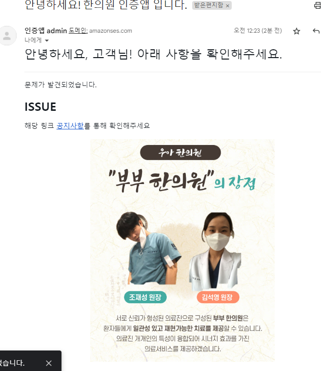

### AWS SES, AWS ROUTE 53, certificate manager

- 프리티어는 가입한 순간부터 12개월
- 도메인 vs 이메일을 선택해서, 인증해서 보낼 수 있다.
    - 타사 도메인 사용시
      참고: https://support.bespinglobal.com/ko/support/solutions/articles/73000544864--aws-amazon-ses-simple-email-service-
- Amazon SES는 Amazon `EC2`에 호스팅된 애플리케이션에서 이메일을 발송할 경우` 매월 62,000건까지 무료`로 전송

1. ~~SES > 자격증명생성 > 도메인 `chojaeseong.com` 입력 > 자격 증명생성~~
    - 도메인이 Amazon Route 53인 경우, Amazon SES는 도메인의 DNS 서버를 필요한 레코드로 자동으로 업데이트합니다
    - **나는 타사 도메인이라서 `이 자격 증명의 소유권을 확인하려면 제공된 CNAME 레코드를 사용하여 도메인의 DNS 설정에서 DKIM을 구성해야 합니다.`**
    - **가비아는 자격증명 3개의 CNAME 등록시 에러가 난다.(호스트에 점 2개 이상 못적음)**
    - 그래서 취소
2. 내 가비아 도메인 - AWS Route 53을 연결한 뒤, 적용하기 [참고블로그](https://hannut91.github.io/blogs/route53/gabia)
    - Route 53 > ~~도메인 등록~~이 아닌 `호스팅 영역 생성` > 도메인 입력 > 4개의 NS네임서버가 생김
    - ~~DNS관리툴~~이 아닌 `도메인 관리툴` > `네임서버 설정`
    - 네임서버 목록 > 신규등록 > (기존가비아ns삭제) route 53의 라우팅대상4개에서 맨끝에 점1개를 빼고 입력 > 불러오기
        - 소유자 인증 > **네임서버가 바뀌면, `가비아에서 설정한 CNAME("is2js.github.io)` 접속이 안된다. ex> blog.chojaeseong.com**
    - `NS를 설정한 Route 53`에서, `CNAME` 기존것을 새 레코드로 추가한다.
        - CNAME > blog(subdomain) > 값: is2js.github.io 
        - **추가로 front홈피도 해주자. `CNAME + hani(subdomain) + is3js.github.io` (http:// 등등은 없어야함)**
        - 이후 /hospital은 github repo > settings > `pages` > custom domain에 추가해주자.
        
    - **NS를 설정한 Route 53에서 `subdomain.`() + chojaeseong.com(도메인)의 `record set`을 `route 53에서 생성`하기**
    ```
    방금 한 것은 상위 도메인 .ai를 관리하는 DNS서버에 mcas.ai 도메인을 관리하는 DNS서버가 어디인지를 가르쳐 준 것입니다.
    
    이제 *.mcas.ai으로 주소를 물어보면 AWS Route53이 mcas.ai에 대한 DNS 서버가 되어서, 그 물어본 도메인 이름에 대한 실제 IP 주소를 가르쳐주는 역할을 하게 됩니다.
    
    다음은 도메인을 https(TLS) 프로토콜을 통해 보안이 유지된 연결을 할 수 있도록 AWS Certificate Manager에서 도메인 인증서를 등록하는 방법을 설명하겠습니다.
    ```
3. **`Route 53 등록 도메인`으로, `AWS SES에서 자격증명(도메인) 생성`시  Route 53에 CNAME `자동`생성**
    - `없던 호스팅영역 레코드가 3개가 자동 추가`된다.
    - **이것은, SES 자격증명 생성시 추가해야하는 CNAME 3개와 동일하며, 직접 등록해도 될 듯. 가비아는 구조상 추가가 바로 안됨.**
    

4. **AWS 인증서를 이용해서 https 보장받기**
    - [참고블로그](https://musma.github.io/2019/09/16/what-to-do-after-you-buy-your-new-domain-on-aws.html)
    - 인증서 요청 > 도메인 이름 입력 + **`이 인증서에 다른이름 추가`하여 `*.도메인` 추가**
    - 인증서 요청 중(검증 대기중)인데, **이 때, 검증을 `Route 53 레코드 생성`을 통한`검증` > 2개 도메인 선택으로 생성한다.**
    - Route53에서 보면, 자동으로 CNAME 레코드가 1개 추가 된다.

5. 이제 도메인 등록을 기다리면서, `SES email`로 등록하기
    - 이걸 등록해서 인증되어야, `수신자(recipent)`로서, sandbox상태(not prod)에서 `메일을 받을 수 있는 사람`으로 넣을 수 있다.
   
6. 이메일과 달리 도메인등록이 안되고 있는데, 흠.. 최대 72시간까지 걸린다고 한다.
    - 일단 확인 보류 중으로 떠서 기다려본다.
    
    
- TODO: SES account를 `sandbox` access에서 해제하기
  - 위에서 만든 SES IAM은 테스트 용도인 sandbox으로 생성되며, 이 조건에서는 `일 최대 200개의 verified된 메일간 송수신`, 제한없는 메일 송수신 시뮬레이션만이 가능
  - 따라서 production access로 사용하려면 limit 해제요청을 해야 함.

7. **이제 boto3로 python에서 aws를 사용하기 위한 AWS_ACCESS_KEY, AWS_SECRET_KEY를 `내 계정`에서 찾아놓자.**
    - 내 계정 > 내 보안 자격 증명 > 액세스키 만들기 > key 챙겨놓기
   
### services.py에 /email/send_by_ses 라우터 만들고, AWS_SES로 요청하기
- **발신 email 도메인이 한정적이라서 메일서버를 따로 구축안할거면, `ses가 싸진 않지만 좋다`. 6만2천건까지 무료.**

1. **dotenv 파일에 `AWS_ACCESS_KEY`, `AWS_SECRET_KEY`, `AWS_SES_AUTHORIZED_EMAIL` 외에** app설정에서 동적으로 쓰이는 것으로서 Config class에 `HOST_MAIN`을 정의한다.** 
    ```python
    HOST_MAIN="xxxx.com"
   
    AWS_ACCESS_KEY="" # for AWS SES
    AWS_SECRET_KEY=""
    AWS_SES_AUTHORIZED_EMAIL="tingstyle11@gmail.com"
    ```
   
2. config.py에서 HOST_MAIN만 Config클래스 내부에서 받고, 나머지는 전역상수로 설정한다.
    ```python
    # aws ses
    AWS_ACCESS_KEY: str = environ.get("AWS_ACCESS_KEY", None)
    AWS_SECRET_KEY: str = environ.get("AWS_SECRET_KEY", None)
    AWS_SES_AUTHORIZED_EMAIL: str = environ.get("AWS_SES_AUTHORIZED_EMAIL", None)
    ```
    - **동적으로 변하는 HOST_MAIN을 Config의 상수로 설정하고 싶지만, `하위자식 클래스(ProdConfig)`에서 기본값 재정의할 때, `해당 상수값을 사용`해야하므로, `어쩔수 없이 전역상수`로 올린다.**
    ```python
    # prod
    HOST_MAIN: str = environ.get("HOST_MAIN", "localhost")
    @dataclass
    class Config(metaclass=SingletonMetaClass):
        #...
        
        # prod or aws-ses
        HOST_MAIN: str = HOST_MAIN
        
    @dataclass
    class ProdConfig(Config):
        PROJ_RELOAD: bool = False
        # log
        LOG_BACKUP_COUNT = 10
    
        # sqlalchemy
        DB_ECHO: bool = True
    
        # middleware
        TRUSTED_HOSTS: list = field(
            default_factory=lambda: [
                f"*.{HOST_MAIN}",
                HOST_MAIN,
                "localhost",
            ]
        )
        ALLOWED_SITES: list = field(
            default_factory=lambda: [
                f"*.{HOST_MAIN}",
                HOST_MAIN,
                "localhost",
            ]
        )
        
        
    config = Config.get()
    # config = Config.get(option='prod')
    # print(config)
    # TRUSTED_HOSTS=['*.chojaeseong.com', 'chojaeseong.com', 'localhost']
    ```
3. 이제 `/email/send_by_ses` router를 `post`로 파서, **`sandbox상태에서 이메일을 수신할 수 있는 인증 메일`을 수신자(mailing_list)로 1개 지정해서 보낸다.**
    ```python
    @router.post('/email/send_by_ses')
    async def send_by_ses(request: Request, background_tasks: BackgroundTasks):
        sender = f"한의원인증앱 admin <admin@{HOST_MAIN}>"
        mailing_list: list = [AWS_SES_AUTHORIZED_EMAIL] # sandbox 상태에서는 인증된 메일만 받기 가능
    
        return SuccessMessage()
    ```
   

4. aws로 보내려면 `boto3 패키지`를 설치해야한다.
    ```shell
    pip install boto3 
    
    pip freeze > .\requirements.txt
    
    docker-compose build --no-cache api; docker-compose up -d api;
    ```
    - **이 때 추가로 요구하는 urllib은 버전을 잘 맞춰야한다.**
    ```
    The conflict is caused by:
    The user requested urllib3==2.0.4
    botocore 1.31.47 depends on urllib3<1.27 and >=1.25.4
    ```

5. 이제 내부 로직을 작성한다.
    - **body_text의 경우, a링크만 있거나, a링크의 텍스트에 Google과 같은 기업명이 있으면 스팸으로 분류된다.**
    - **send_mail시 `Source=`에는 sender text를 `이름 <이메일>`형태로 주고, Destination=, Message= 총 3개의 keyword를 채워준다.**
    ```python
    @router.post('/email/send_by_ses')
    async def send_by_ses(request: Request, background_tasks: BackgroundTasks):
        # sender = f"인증앱 admin<{HOST_MAIN}>" # host의 메일서버가 있을 때.
        sender = f"인증앱 admin<{ADMIN_GMAIL}>"
        mailing_list: list = [AWS_SES_AUTHORIZED_EMAIL]  # sandbox 상태에서는 인증된 메일만 받기 가능
    
        region = "ap-northeast-2"  # 한국/서울
    
        title = "안녕하세요! 한의원 인증앱 입니다."
        # body에 링크만 있으면, 스팸으로 인식됨. 글자도 충분히 있어야한다.
        body_text = "안녕하세요! 한의원 인증앱 입니다. \r\n HTML 버전만 지원합니다!"
        body_html = (
            "<html>\n    <head></head>\n    <body>\n      <h1>안녕하세"
            "요! 반갑습니다.</h1>\n      <p>기업에서 대규모 이메일 솔루션을 구축한다는 것은"
            " 복잡하고 비용이 많이 드는 작업이 될 수 있습니다. 이를 위해서는 인프라를 구축하고, 네"
            "트워크를 구성하고, IP 주소를 준비하고, 발신자 평판을 보호해야 합니다. 타사 이메일 솔"
            "루션 대부분이 상당한 규모의 선수금을 요구하고 계약 협상을 진행해야 합니다.\n\nAmazon"
            " SES는 이러한 부담이 없으므로 몇 분 만에 이메일 발송을 시작할 수 있습니다. Amaz"
            "on.com이 대규모의 자사 고객 기반을 지원하기 위해 구축한 정교한 이메일 인프라와 오랜"
            " 경험을 활용할 수 있습니다.</p>\n      <p>해당 링크\n      "
            "  <a href='https://blog.chojaeseong.com'>여기</a>를 통해 확인해주세요</p>\n    "
            "</body>"
        )
        charset = "UTF-8"
    
        client = boto3.client(
            "ses",
            region_name=region,
            aws_access_key_id=AWS_ACCESS_KEY,
            aws_secret_access_key=AWS_SECRET_KEY,
        )
    
        try:
            response = client.send_email(
                Source=sender,
                Destination={"ToAddresses": mailing_list},
                Message={
                    "Body": {
                        "Html": {"Charset": charset, "Data": body_html},
                        "Text": {"Charset": charset, "Data": body_text},
                    },
                    "Subject": {"Charset": charset, "Data": title},
                },
            )
        except ClientError as e:
            # TODO: 실패시 어디다가 보내기
            print(e.response['Error']['Message'])
        else:
    
            # TODO: 성공시 어디다가 알리기?
            print(f"Email sent! Message ID: {response['MessageId']}"),
    
        return SuccessMessage()
    
    ```

6. **boto3내부에서 비동기로 처리하여 속도는 빠르지만, `service_utils.py`에 모듈로 따로 빼고, `Background_Tasks`를 활용한다.**
    ```python
    # service_utils.py
    async def send_mail_by_ses(
            recipients: List[str] = None,
            sender: str = f"인증앱 admin<{ADMIN_GMAIL}>",
            mail_title: str = "안녕하세요! 한의원 인증앱 입니다.",
            template_greetings="아래 사항을 확인해주세요.",
            template_introduction="문제가 발견되었습니다.",
            template_title="ISSUE",
            template_description="해당 링크 <a href='https://hani.chojaeseong.com'>공지사항</a>를 통해 확인해주세요",
            template_image_url=KAKAO_SEND_ME_IMAGE_URL,
    ):
        # sender = f"인증앱 admin<admin@{HOST_MAIN}>" # host의 메일서버가 있을 때.
        if recipients is None:
            # sandbox 상태에서는 인증된 메일만 받기 가능
            recipients: List[str] = [AWS_SES_AUTHORIZED_EMAIL]
    
        region = "ap-northeast-2"  # 한국/서울
    
        # body에 링크만 있으면, 스팸으로 인식됨. 글자도 충분히 있어야한다.
        body_text = mail_title + "\r\n HTML 버전만 지원합니다!"
        body_html = EMAIL_CONTENTS_FORMAT.format(
            name="고객",
            greetings=template_greetings,
            introduction=template_introduction,
            title=template_title,
            description=template_description,
            image_url=template_image_url,
        )
    
        charset = "UTF-8"
    
        client = boto3.client(
            "ses",
            region_name=region,
            aws_access_key_id=AWS_ACCESS_KEY,
            aws_secret_access_key=AWS_SECRET_KEY,
        )
    
        try:
            response = client.send_email(
                Source=sender,
                Destination={"ToAddresses": recipients},
                Message={
                    "Body": {
                        "Html": {"Charset": charset, "Data": body_html},
                        "Text": {"Charset": charset, "Data": body_text},
                    },
                    "Subject": {"Charset": charset, "Data": mail_title},
                },
            )
        except ClientError as e:
            # TODO: 실패시 어디다가 보내기
            print(e.response['Error']['Message'])
        else:
    
            # TODO: 성공시 어디다가 알리기?
            print(f"Email sent! Message ID: {response['MessageId']}"),
            # Email sent! Message ID: 010c018a9382e4a4-2d7561d2-b429-449b-9f20-8155790b963e-000000
    ```
   
    ```python
    @router.post('/email/send_by_ses')
    async def send_by_ses(request: Request, background_tasks: BackgroundTasks):
        
        await send_mail_by_ses(
            sender=f"인증앱 admin<{ADMIN_GMAIL}>",
            recipients=None,  # recipients: List[str] 없으면, 운영자 gmail(ses 인증 메일)로 간다
            mail_title="안녕하세요! 한의원 인증앱 입니다.",  # 메일 제목
            template_greetings="아래 사항을 확인해주세요.",  # 제목1) 고객님, xxxx
            template_introduction="문제가 발견되었습니다.",  # - yyyy
            template_title="ISSUE",  # 제목2) zzzz
            template_description="해당 링크 <a href='https://hani.chojaeseong.com'>공지사항</a>를 통해 확인해주세요",
        )
        return SuccessMessage()
    
    ```
    

7. 이제 외부에서 들어오는 RequestSchema를 생성하여, `recipients: Optional[List[str]] = None`으로 받도록 만들어보자.
    - **인증된 2개의 메일을 swagger에서 보내본다.**
    - **추후 직접 list를 받는게 아니라, front에서 `해당 user의 mailingListGroup(직원/환자/의사)을 선택 -> 속하는 자식 mailingList들`에게 전체 보내게 해야할 듯?!**
    ```python
    class SESRequest(BaseModel):
        recipients: Optional[List[str]] = None
    ```
    ```python
    @router.post('/email/send_by_ses')
    async def send_by_ses(request: Request, ses_request: SESRequest, background_tasks: BackgroundTasks):
        
        await send_mail_by_ses(
            sender=f"인증앱 admin<{ADMIN_GMAIL}>",
            recipients=ses_request.recipients, 
        #...
    ```
    ```json
    {
      "recipients": [
        "tingstyle1@gmail.com",
        "tingstyle11@gmail.com"
      ]
    }
    ```
### 도커 명령어

1. (`패키지 설치`시) `pip freeze` 후 `api 재실행`

```shell
pip freeze > .\requirements.txt

docker-compose build --no-cache api; docker-compose up -d api;
```

2. (init.sql 재작성시) `data폴더 삭제` 후, `mysql 재실행`

```shell
docker-compose build --no-cache mysql; docker-compose up -d mysql;
```

```powershell
docker --version
docker-compose --version

docker ps
docker ps -a 

docker kill [전체이름]
docker-compose build --no-cache
docker-compose up -d 
docker-compose up -d [서비스이름]
docker-compose kill [서비스이름]

docker-compose build --no-cache [서비스명]; docker-compose up -d [서비스명];

```

- 참고
    - 이동: git clone 프로젝트 커밋id 복사 -> `git reset --hard [커밋id]`
    - 복구: `git reflog` -> 돌리고 싶은 HEAD@{ n } 복사 -> `git reset --hard [HEAD복사부분]`