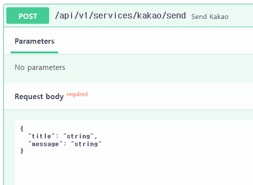

### test 코드 작성

#### 서비스
1. request_service fixture를 만든 김에, 먼저 서비스부터 테스트한다.
    
    ```python
    async def test_send_kakao(request_service):
    
        json = dict(
            title="안녕하세요",
            message="카카오톡 나에게 보내기 테스트입니다."
        )
    
        response = await request_service(
            "post",
            service_name="kakao/send",
            json=json
        )
        
        assert response['message'] == 'ok'
    ```


2. `@pytest.mark.skipif(조건, reason=)`을 활용해서, KAKAO API TOKEN이 없으면 skip하도록 한다.
    - 기존 config에서 Bearer를 붙여주던 것을 삭제하고, 사용처(service)에서 사용하도록 변경. getenv시 default None을 줘서, `.env입력안될 시 None`으로 받도록하고
   - 테스트시 .env에서 빈 `""`를 입력하면 get시 None으로 들어가는 것을 확인했음
    ```python
    # config.py
    KAKAO_SEND_ME_ACCESS_TOKEN = environ.get("KAKAO_ACCESS_TOKEN", None)
    ```
    ```python
    from app.common.config import KAKAO_SEND_ME_ACCESS_TOKEN
    
    
    @pytest.mark.skipif(KAKAO_SEND_ME_ACCESS_TOKEN is None, reason="KAKAO_SEND_ME_ACCESS_TOKEN is not set")
    async def test_send_kakao(request_service):
    
        json = dict(
            title="안녕하세요",
            message="카카오톡 나에게 보내기 테스트입니다."
        )
    
        response = await request_service(
            "post",
            service_name="kakao/send",
            json=json
        )
    
        assert response['message'] == 'ok'
    
    ```


##### ses 구조 변경
- 미뤘던 내용받기 추가
    ```python
    # schemas/services.py
    class SESRequest(BaseModel):
        recipients: Optional[List[str]] = None
    
        mail_title: Optional[str] = None  # 메일 제목
    
        greetings: Optional[str] = None  # 고객님, xxxx !
        introduction: Optional[str] = None  # yyyyy
    
        title: Optional[str] = None  # 잇슈 제목
        description: Optional[str] = None  # 잇슈 내용
    ```
    ```python
    @router.post('/email/send_by_ses')
    async def send_by_ses(request: Request, ses_request: SESRequest, background_tasks: BackgroundTasks):
        await send_mail_by_ses(
            sender=f"인증앱 admin<{ADMIN_GMAIL}>",
            recipients=ses_request.recipients,  # List[str] 없으면, [운영자 gmail(ses 인증 메일)]이 입력됨.
    
            mail_title=ses_request.mail_title,  # 메일 제목
            template_greetings=ses_request.greetings,  # 제목1) 고객님, xxxx
            template_introduction=ses_request.introduction,  # - yyyy
            template_title=ses_request.title,  # 제목2) zzzz
            template_description=ses_request.description,
        )
        return SuccessMessage()
    ```
        
    
- **test에서는 schema의 필드대로 json=dict()를 만들어서 발송하면 된다.**
    ```python
    async def test_send_by_ses(request_service):
        json = dict(
            mail_title="테스트 메일 발송 입니다.",
            greetings="오늘 하루 괜찮으셨나요?", # 고객님, xxxx
            introduction="한의원 인증앱입니다.",
            title="서비스 장애 발생",
            description="금일 서버실 화재로 인해 17:00 ~ 19:00 서비스 장애가 발생하였으나, 진압되었으니 참고 부탁드립니다",
        )
    
        response = await request_service(
            "post",
            service_name="email/send_by_ses",
            json=json
        )
    ```
    

### 도커 명령어

1. (`패키지 설치`시) `pip freeze` 후 `api 재실행`

```shell
pip freeze > .\requirements.txt

docker-compose build --no-cache api; docker-compose up -d api;
```

2. (init.sql 재작성시) `data폴더 삭제` 후, `mysql 재실행`

```shell
docker-compose build --no-cache mysql; docker-compose up -d mysql;
```

```powershell
docker --version
docker-compose --version

docker ps
docker ps -a 

docker kill [전체이름]
docker-compose build --no-cache
docker-compose up -d 
docker-compose up -d [서비스이름]
docker-compose kill [서비스이름]

docker-compose build --no-cache [서비스명]; docker-compose up -d [서비스명];

```

3. docker 추가 명령어
```powershell
docker stop $(docker ps -aq)
docker rm $(docker ps -aqf status=exited)
docker network prune 

docker-compose -f docker-compose.yml up -d
```
### pip 명령어

```powershell
# 파이참 yoyo-migration 설치

pip freeze | grep yoyo

# 추출패키지 복사 -> requirements.txt에 붙혀넣기

```

### git 명령어
```powershell
git config user.name "" 
git config user.email "" 

```
### yoyo 명령어
```powershell
yoyo new migrations/

# step 에 raw sql 작성

yoyo apply --database [db_url] ./migrations 
```

- 참고
    - 이동: git clone 프로젝트 커밋id 복사 -> `git reset --hard [커밋id]`
    - 복구: `git reflog` -> 돌리고 싶은 HEAD@{ n } 복사 -> `git reset --hard [HEAD복사부분]`