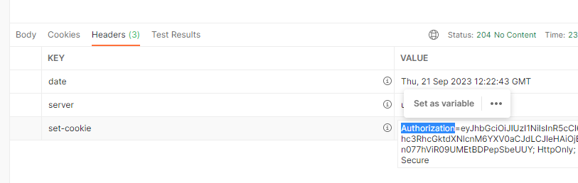

### fastapi-users
- [참고 블로그- not sqlalchemy](https://blog.joonas.io/227)
- [sqlalchemy 사용 세팅 유튜브](https://www.youtube.com/watch?v=vkEhatGH1kI)
    - cookie 버전
- [공식문서 오버뷰](https://fastapi-users.github.io/fastapi-users/12.1/configuration/overview/)
- [tortoize 버전 유튜브](https://www.youtube.com/watch?v=ZCvohUSzvPg)


1. `fastapi-users[sqlalchemy]` 패키지 설치
    - pycharm에선 `fastapi-users-db-sqlalchemy`

#### 기존 Users모델과 차이점을 확인하고 통합하기
1. fastapi-users에서 제공하는 `SQLAaclhemyBaseUserTable`은 기본적으로 `id, email, hashed_password ,is_active ,is_superuser ,is_verified` 필드를 제공하며
    - **기본적으로 id를 UUID로 쓰는데 mysql에서는 제공안하므로, `SQLAaclhemyBaseUserTable[int]`를 mixin으로 사용해야한다.**
    - **hashed_password필드를 제공하지만, 외부 Schema에서는 `password`필드로 받아야한다.**
    - **또한, tablename이 `user`로 변해버린다.**
    ```python
    class SQLAlchemyBaseUserTable(Generic[ID]):
        
        __tablename__ = "user"
    
    
        email: Mapped[str] = mapped_column(
            String(length=320), unique=True, index=True, nullable=False
        )
        hashed_password: Mapped[str] = mapped_column(
            String(length=1024), nullable=False
        )
        is_active: Mapped[bool] = mapped_column(Boolean, default=True, nullable=False)
        is_superuser: Mapped[bool] = mapped_column(
            Boolean, default=False, nullable=False
        )
        is_verified: Mapped[bool] = mapped_column(
            Boolean, default=False, nullable=False
        )
    ```
2. **기존 Users모델의 테이블명인 `users`를 유지 + 기존id칼럼(커스텀 BaseModel)을 유지시키기 위해, `상속의 바로 직전부모가 BaseModel`이 되도록 왼쪽에서 상속시키고, `오른쪽에서 SQLAlchemyBaseUserTable[int]`를 상속한다.**
    - **또한, 기존의 `pw`필드는 삭제하여 자연스럽게 password필드가 자리잡게 한다.**
    - email필드도 거의 성질이 비슷하여 주석처리한다.
    ```python
    # class Users(BaseModel):
    class Users(BaseModel, SQLAlchemyBaseUserTable[int]):
        status = Column(Enum(UserStatus), default=UserStatus.active)
        # email = Column(String(length=255), nullable=True, unique=True)
        # pw = Column(String(length=2000), nullable=True)
    ```
    ```sql
    CREATE TABLE users (
    
        id INTEGER NOT NULL AUTO_INCREMENT, # BaseModel
        created_at DATETIME NOT NULL, 
        updated_at DATETIME NOT NULL, 
        
        
    
        email VARCHAR(320) NOT NULL,  # SQLAlchemyBaseUserTable[int]
        hashed_password VARCHAR(1024) NOT NULL, 
        is_active BOOL NOT NULL, 
        is_superuser BOOL NOT NULL, 
        is_verified BOOL NOT NULL, 
    )
    ```

#### Schema 생성
- schemas > users.py에 추가로 정의해준다.
- **`from fastapi_users.schemas import BaseUser, BaseUserCreate, BaseUserUpdate`를 가져오면, 기본필드5개가 자동입력되어있다.**
    - 이 때, **id까지 가져오는 `BaseUser`는 제네릭을 설정해 `BaseUser[int]`를 설정해줘야한다.**
    ```python
    class UserRead(BaseUser[int]):
        pass
    
    
    class UserCreate(BaseUserCreate):
        pass
    
    
    class UserUpdate(BaseUserUpdate):
        pass
    ```
1. 이 상태에서 UserRead에서 추가필드도 넣어준다. 기존 UserMe를 참고해보자.
```python
class UserRead(BaseUser[int]):
    
    name: Optional[str] = None
    phone_number: Optional[str] = None
    profile_img: Optional[str] = None
    sns_type: Optional[str] = None
```

2. UserCreate에서는 최소한의 필수필드인 기본필드 5개만 진행되도록 한다.
    - 기존 api 로그인에서 sns_type등을 받아서 처리하면 된다.

3. UserUpdate에서는 추가정보들을 다 넣게 다 넣어준다.
    ```python
    class UserUpdate(BaseUserUpdate):
        name: Optional[str] = None
        phone_number: Optional[str] = None
        profile_img: Optional[str] = None
        sns_type: Optional[str] = None
    
        nickname: Optional[str] = None
        gender: Optional[str] = None
        age: Optional[int] = None
        birthday: Optional[str] = None
    
        marketing_agree: Optional[bool] = None
    ```
   

#### auth.py router가 복잡해지니, auth 패키지로 변환
1. api > v1 의 init.py에서는 여전 `auth.router`를 사용할 수 있도록
    - auth 패키지 생성
    - 기존 auth.py -> auth/router.py로 변경
    - auth/init.py에서 `from .router import router`로 auth패키지.router가 사용가능하게 둔다.


#### app > libs 패키지에서 authentication bakcend(transports.py + stratgies.py) 정의하기
1. app > libs 패키지 만들기
2. app > libs > auth > `transports.py` 만들어서, `쿠키용 transports` 정의하기
    - consts에 상수를 정의해주고, **`cookie_name`을 `Authorization`로 지정해준다. 안해주면 `fastapiusers`로 쿠키이름이 잡힌다**
    ```python
    from fastapi_users.authentication import CookieTransport
    
    from app.common.consts import USER_AUTH_MAX_AGE
    
    
    # cookie_transport = CookieTransport(
    #     cookie_name='Authorization',
    #     cookie_max_age=3600,
    #     cookie_httponly=True
    # )
    
    def get_cookie_transport():
        return CookieTransport(
            cookie_name='Authorization',
            cookie_max_age=USER_AUTH_MAX_AGE,
            # cookie_httponly=True,  # js요청 금지
        )
    ```
   
3. app > libs > auth > `strategies.py` 정의하기
    - const에서 api 로그인에서 사용한 SECREET상수를 똑같이 사용해준다.
    ```python
    from fastapi_users.authentication import JWTStrategy
    
    from app.common.consts import  USER_AUTH_MAX_AGE
    from app.common.config import JWT_SECRET
    
    
    def get_jwt_strategy() -> JWTStrategy:
        return JWTStrategy(secret=JWT_SECRET, lifetime_seconds=USER_AUTH_MAX_AGE)
    
    ```
   
4. `https://djecrety.ir/` 사이트에서 SECRET 키를 바로 새성할 수 있기 때문에, 수정해서 환경변수에 넣고, config로 돌려준다.

5. app > libs > auth > `backends.py` 정의하기
    - cookie용 백엔드를 만든다. transport는 메서드호출을 통해 객체를 / get_strategy는 주입식 메서드를 입력한다.
    ```python
    from fastapi_users.authentication import AuthenticationBackend
    
    from app.libs.auth.strategies import get_jwt_strategy
    from app.libs.auth.transports import get_cookie_transport
    
    cookie_auth_backend = AuthenticationBackend(
        name="jwt",
        transport=get_cookie_transport(),
        get_strategy=get_jwt_strategy,
    )
    ```
#### UserManager 만들기 (managers.py)
1. app > libs > auth > `managers.py` 만들기
2. **UserManager를 만들 때도, id가 uuid가 아닌 Interger라는 것을 알려줘야하며, BaseUserManger에도 모델class + id type을 인지시켜줘야한다.**
    - reset_password_token_secret, verification_token_secret도 JWT_SECRET으로 둔다.
    ```python
    class UserManager(IntegerIDMixin, BaseUserManager[Users, int]):
        reset_password_token_secret = JWT_SECRET
        verification_token_secret = JWT_SECRET
    
        async def on_after_register(self, user: Users, request: Optional[Request] = None):
            print(f"User {user.id} has registered.")
    
        async def on_after_forgot_password(
                self, user: Users, token: str, request: Optional[Request] = None
        ):
            print(f"User {user.id} has forgot their password. Reset token: {token}")
    
        async def on_after_request_verify(
                self, user: Users, token: str, request: Optional[Request] = None
        ):
            print(f"Verification requested for user {user.id}. Verification token: {token}")
    
    ```
3. [문서](https://fastapi-users.github.io/fastapi-users/12.1/configuration/user-manager/)에 있던 session주입으로 Yield manager하는 내용은 libs패키지에 안두도록 떨어뜨린다.
    - **api > `dependencies` 패키지 > auth.py에 정의할 예정이다.**

#### api > dependencies 패키지 > auth.py에 주입메서드 + FastAPIUsers 객체 -> router객체들을 모은 get_auth_routers() 메서드 구현

1. api > dependencies > auth.py 에 주입용 `get_user_db`를 db.session으로 `SQLAlchemyUserDatabase`를 yield로 만들고
    - SQLAlchemyUserDatabase객체를 주입받는 주입용 `get_user_manager`를 정의한다.
    ```python
    async def get_user_db(session: AsyncSession = Depends(db.session)):
        yield SQLAlchemyUserDatabase(session=session, user_table=Users)
    
    
    async def get_user_manager(user_db=Depends(get_user_db)):
        yield UserManager(user_db)
    ```
   
2. 이제 get_user_manager + backend로 FastAPIUsers 객체를 생성한다.
    - 생성시 제네릭에 User모델객체 + id type도 명시해준다.
    ```python
    fastapi_users = FastAPIUsers[Users, int](
        get_user_manager,
        [cookie_auth_backend],
    )
    ```
   
3. **이 때, backend객체들을 list로 여러개 입력받으므로, `backends.py`에 정의한 모든 backend객체들을 반환해주는 메서드를 통해 다 입력시킨다.**
    ```python
    # backends.py
    cookie_auth_backend = AuthenticationBackend(
        name="jwt",
        transport=get_cookie_transport(),
        get_strategy=get_jwt_strategy,
    )
    
    
    def get_auth_backends():
        return [
            cookie_auth_backend,
        ]
    
    ```
    ```python
    # app/api/dependencies/auth.py
    fastapi_users = FastAPIUsers[Users, int](
        get_user_manager,
        get_auth_backends(),
    )
    
    ```
4. **이제 `각 backend객체` + fastapiusers객체로  router를 만들어야하는데, `매번 모든 backend객체들`을 가져와서 include해줘야하므로, `get_auth_backends()`를 활용해서 순회하며 모았다가 한꺼번에 include한다.**
    - **backend객체.name + fastapi_users.get_auth_router( backend객체)로 dict에 이름을 넣어서 dict list를 모은다.**
    - **이 때, backend객체 생성시 name이 prefix로 돌아갈 예정이므로, 참고한다.**
    ```python
    def get_auth_routers():
        routers = []
    
        for auth_backend in get_auth_backends():
            routers.append({
                "name": auth_backend.name,
                "router": fastapi_users.get_auth_router(auth_backend),
            })
    
        return routers
    ```
   
5. 이제 해당 auth router들을 api > v1 > auth > router.py에서 순회하며 include_router해주되, `name을 prefix로` 잡아준다.
    - prefix하기 전엔` 각 auth_route당 /login, /logout`이 등장하게 되는데, backend객체.name이 prefix로 들어가게 해준다.
    - **각 name앞에 `/users`도 추가로 붙혀줘서 api/v1/auth`/user/backend_name/login, logout`으로 등록되도록 한다.**
    ```python
    # auth/router.py
   
    router = APIRouter()
   
    # fastapi-users
    for auth_router in get_auth_routers():
        router.include_router(
            prefix=f"/users/{auth_router['name']}",
            router=auth_router['router'],
        )
    @router.post("/register/{sns_type}", status_code=201, response_model=Token)
    async def register(sns_type: SnsType, user_request: UserRequest, session: AsyncSession = Depends(db.session)):
        """
    ```
    

#### postman 사용하기
- 기본적으로 `ctrl+E`가 새로만든 폴더/파일등의 rename 단축키임.

1. Environments에 `프로젝트명`으로 환경변수를 만든 뒤, 사용체크를 해놓고
    - `host`: `http://localhost:8001`의 환경을 환경변수로 지정해놓는다.
    

2. Collections에 프로젝트명 > users > auth > `Login` reqeust를 만들고, 내부에서 환경변수 host를  `{{host}}`로 사용하며 처리해본다.
    - **이 때, fastapiuser에서 `login`에 필요한 email/password 등을 `json payload가 아닌 form-data`로 받으며**
    - **email조차 `username`필드로 받는다고 명시되어 있다. email필드로 보내면, missing에러가 남.**
    ```
    Warning
    Notice that we don't send it as a JSON payload here but with form data instead. Also, the email is provided by a field named username.
    ```
    

3. username/password에 넣을 {{email}}과 {{password}}환경변수도 하나 넣어놓는다.
    - password는 type을 secret으로 변경해준다.
4. 다시 send하면, 등록된 정보가 없으니 `LOGIN_BAD_CREDENTIALS`이 뜬다.


#### get_auth_routers()외 fastapi_users객체에서 단1개의 register_route를 반환하는 메서드 정의해서 등록하기
1. 이 때, UserCreate스키마를 지정해준다. 
    ```python
    def get_register_router():
        return fastapi_users.get_register_router(
            user_schema=UserRead, 
            user_create_schema=UserCreate
        )
    
    ```
   
2. 등록된 backend가 없어서, prefix가 `/users`만 직접 지정해준다.
    ```python
    # app/api/v1/auth/router.py
    router = APIRouter()
    
    # fastapi-users
    for auth_router in get_auth_routers():
        router.include_router(
            router=auth_router['router'],
            prefix=f"/users/{auth_router['name']}",
        )
    
    router.include_router(
        router=get_register_router(),
        prefix='/users'
    )
    ```
    - 추후 google이나 session로그인이 구현된다면 `/users/google/login + logout`형태로 추가되어야한다.

3. login의 강제 username필드 입력대신, UserCreate 스미카를 지정해준 덕분에, `email필드`가 존재하게 된다.
    

4. register도 postman으로 해보자.
    - login은 `x-www-form-urlencoded`로 body를 보내야 햇찌만
    - **register는 json payload를 받는다고한다. `raw > JSON`으로 body를 만들어서 보내자.**
    - **추가로 환경변수를 raw > json으로 작성할 땐 `"{{email}}"`처럼, 쌍따옴표를 붙혀서 써야한다.**
    ```json
    {
        "email": "{{email}}",
        "password": "{{password}}"
    }
    ```
    

5. **다시 환경변수로 login해보면, 204 no content로서 Body에는 아무것도 없으나 `Headers`를 보고, `set-cookie`가 잘 적용됬는지 확인한다.**
    

    - login 후 응답 Headers 속 set-cookie값을 postman `우측상단 Cookies`에 확인한다.
    

#### cookie가 입력된 상태에서 logout POST 호출하기
- Logout request를 만들고 postman으로 보내도, 박힌 Cookies가 안사라진다.
- **하지만, fastapi /docs 스웨거에서는 f12로 쿠키를 연상탱세ㅓ cookie_name으로 지정한 key값이 사라지는 것을 확인할 수 있다.**

### CustomJSONResponse 만들어서, api 버전까지 같이 응답하게 하기?!
1. .env에 상수 추가 -> config에 추가
    ```dotenv
    APP_VERSION="1.0.0"
    APP_TITLE="한의원 인증앱"
    APP_DESCRIPTION="한의원 서비스 이용 애플리케이션"
    ```
    ```python
    @dataclass
    class Config(metaclass=SingletonMetaClass):
        """
        기본 Configuration
        """
        APP_VERSION: str = environ.get("APP_VERSION", "")
        APP_TITLE: str = environ.get("APP_TITLE", "")
        APP_DESCRIPTION: str = environ.get("APP_DESCRIPTION", "")
    ```
   
2. create_app에서 app객체에 정보를 넘겨서, swagger docs에 반영되게 하기
    ```python
    def create_app(config: Config):
        """
        앱 함수 실행
        :return:
        """
        app = FastAPI(
            version=config.APP_VERSION,
            title=config.APP_TITLE,
            description=config.APP_DESCRIPTION,
        )
        #...
    ```
    

3. **이제 모든 router들에 대해서, `CustomJSONResponse`를 통해, dict로 기본응답시 app_version까지 찍히게 한다.**
    - 기존 dict데이터는 `data`에, 앱버전은 `version`에 찍히게 한다.
    - **utils > http_utils.py를 만들고 `CustomJSONResponse` class를 정의한다.**
    - **JSONResponse의 `render메서드를 오버라이딩`해서 구현한다.**
    ```python
    import typing
    from fastapi.responses import JSONResponse
    
    from app.common.config import config
    
    
    class CustomJSONResponse(JSONResponse):
        def render(self, content: typing.Any) -> bytes:
            return super(CustomJSONResponse, self).render({
                "data": content,
                'version': config.APP_VERSION,
            })
    ```
   
4. app > init.py의 create_app에서 `default_response_class=`를 지정해준다.
    - 전체로 하고 싶으면 create_app 내부에서 `FastAPI(default_response_class=)`로 지정해줘도 된다.
    ```python
    def create_app(config: Config):
    
        app = FastAPI(
            version=config.APP_VERSION,
            title=config.APP_TITLE,
            description=config.APP_DESCRIPTION,
            default_response_class=CustomJSONResponse
        )
    ```
   
5. postman에서 Regiser를 해서, UserRead를 작동시키자. (Login은 응답없이 set-cookie만 작동함.)
    

#### postman에서 pre-script로 headers에 cookie 박아, Login후 쿠키획득한 상태에서 -> Logout 가능하게 하기
##### Collection 환경변수 및 Pre-request Script로, 요청시마다 특정값이 Headers의 Cookie에 변수=값으로 박히게 하기
1. 현재 프로젝트 Collection을 클릭한 뒤, `Variables`에 `Auhorization 변수를 생성`해놓고
    
2. Collection의 `Pre-request Script`에, Autrhozation변수 값을 `pm.request.headers`에 
   - `Cookie`라는 key에 
   - 백틱으로 `Authorization=${}` 속에 `pm.collectionVariables.get('AuthCookie')`의 값을 value로 넣어
   - **요청시마다 AuthCookie 변수 -> headers속 Cookie를 `cookie_transport의 cookie_name`인 `Authorization=xxxx`로 박히게 스크립트를 짠다.**
    
    ```js
    const authorization_value = pm.response.headers.idx(2).value;
    const token = authorization_value.substring(authorization_value.indexOf('=') + 1, authorization_value.indexOf(';'))
    pm.collectionVariables.set('AuthCookie', token)
    ```
##### Cookie값(변수=xxx)를 받는 Login router에서 Tests를 통해 응답 이후 환경변수에 값 입력하기
1. set-cookie응답을 받는 Login에서 `Tests`를 통해, `응답이후 작동하는 코드`를 작성한다.
    - 이 때, 응답 headers에서 `set-cookie`의 순서(idx(2)-3번째)값에 대해, `=`이후~`첫번째;`전까지의 값을 추출한 뒤, Collection변수에 값을 set해준다.
    
    ```js
    const authorization = pm.response.headers.idx(2).value;
    const token = authorization.substring(authorization.indexOf('=') + 1, authorization.indexOf(';'))
    pm.collectionVariables.set('AuthCookie', token)
    ```
   
2. Login 요청을 보내면, 프로젝트 Collection의 Varitables에 `AuthCookie`에 값이 세팅된다.
    

3. 이제 더이상 **Logout요청시, ` "detail": "Unauthorized"`가 안뜨게 된다.**
    - headers에 쿠키값을 가지고 logout을 요청하기 때문.
    - Cookies를 확인해도 Authorization이 삭제된 상태가 된다.


### auth router에서 기존 모델필드(pw 등) + 기존Schema 변경하기
1. 스키마 UserRequest를 pw -> password로 변경한다.
    ```python
    class UserRequest(BaseModel):
    
        email: EmailStr = None
        # pw: str = None
        password: str = None
    
        @field_validator("email", "password")
        def check_required_fields(cls, value):
            if value is None:
                raise ValueError("필수 필드입니다.")
            return value
    ```
2. router에서 user객체의 필드를 pw -> password로 변경, Users.create()에서 넣어줄 필드는 hash후, hash_pw -> `hashed_password`로 변경해서 입력한다
    ```python
    @router.post("/register/{sns_type}", status_code=201, response_model=Token)
    async def register(sns_type: SnsType, user_request: UserRequest, session: AsyncSession = Depends(db.session)):
        if sns_type == SnsType.EMAIL:
            #...
            if not user_request.email or not user_request.password:
            #...
            hashed_password = await hash_password(user_request.password)
            #...
            new_user = await Users.create(session=session, auto_commit=True, hashed_password=hashed_password,
                                          email=user_request.email)
    ```

3. .model_dump(exclude={})시에는 db정보상태이므로 pw -> `hashed_password`로
    ```python
    @router.post("/login/{sns_type}", status_code=200, response_model=Token)
    async def login(sns_type: SnsType, user_request: UserRequest, session: AsyncSession = Depends(db.session)):
        if sns_type == SnsType.EMAIL:
            #....
            if not user_request.email or not user_request.password:
            token_data = UserToken.model_validate(user).model_dump(exclude={'hashed_password', 'marketing_agree'})
            #...
    ```
   

### fastapi-users의 hash와 기존 hash 및 decode_token 일치시키기.
1. **fastapi-users는 `decode`를 제공하지 않고,` read_token을 제공하더라도, user모델 입력이 추가로 필요`하게 된다.**
    - **기존 decode_token() for middle ware를 이용하기 위해서, `JWTStrategy`객체를 만들어줄 때, 기존 JWT_SECRET + `기존 ALGORHITM`을 입력해서, 기존 decode도 가능하게 만든다.**
    ```python
    #app/libs/auth/strategies.py
    def get_jwt_strategy() -> JWTStrategy:
        # return JWTStrategy(secret=JWT_SECRET, lifetime_seconds=USER_AUTH_MAX_AGE)
        return JWTStrategy(secret=JWT_SECRET, algorithm=JWT_ALGORITHM, lifetime_seconds=USER_AUTH_MAX_AGE)
    
    ```
   
2. router에서 쓰이던 기존 자체 hash_pw() 유틸을, **fastapi-users - usermanager내부에서 사용되는 `password_helper`로 대체할 수 있게 하자.**
    - **UserManager는 주입식으로 주어지기 때문에, user_manager -> yield user_manager.password_helper의 dependency를 정의한다.**
    ```python
    async def get_user_manager(user_db=Depends(get_user_db)):
        yield UserManager(user_db)
    
    
    # router에서 쿠키 아닌(no db조회) 로그인(sns_type선택한 api 회원가입/로그인)시 hash/verify하기 위함.
    async def get_password_helper(user_manager=Depends(get_user_manager)):
        yield user_manager.password_helper
    ```
   

3. **이제 hash 등 password검사가 필요한 login/regiser route에서 주입하여 fastapi-users 객체에서 사용될 password_helepr를 빼와서 사용하자.**
    - **이때, 기존의 check_pw()메서드 대신, verify_and_update메서드를 사용하며, return으로 `verify여부, 업데이트필요시 업데이트된 hashed_password or None` 튜플을 응답받으므로 활용한다.**
    ```python
    @router.post("/register/{sns_type}", status_code=201, response_model=Token)
    async def register(sns_type: SnsType, user_request: UserRequest, session: AsyncSession = Depends(db.session),
                       password_helper=Depends(get_password_helper)):
        if sns_type == SnsType.EMAIL:
    
            # 비밀번호 해쉬 -> 해쉬된 비밀번호 + email -> user 객체 생성
            # hashed_password = await hash_password(user_request.password)
            hashed_password = password_helper.hash(user_request.password)
            #...
            
    @router.post("/login/{sns_type}", status_code=200, response_model=Token)
    async def login(sns_type: SnsType, user_request: UserRequest, session: AsyncSession = Depends(db.session),
                    password_helper=Depends(get_password_helper)
                    ):
            #...
            # is_verified = bcrypt.checkpw(user_request.password.encode('utf-8'), user.password.encode('utf-8'))
            is_verified, updated_hashed_password = password_helper.verify_and_update(user_request.password,
                                                                                      user.hashed_password)
    
            if not is_verified:
                raise NoUserMatchException()
    
            if updated_hashed_password:
                await user.update(session=session, auto_commit=True, hashed_password=updated_hashed_password)
            #...
    ```
   
### middleware에서, non_service2가지 중 쿠키에 의한 접속 vs api접속을 확실히 구분
- 쿠키에 의한 접속은 템플릿 router용으로 쓰이며 `db를 조회하여 user객체 주입`할 것이나
- 하지만 api로의 접속은 `db와 별개로서, headers 속 Authorization확인 -> decode -> UserToken schema`로서 **db조회없이 인증해결**을 하기 때문에
    - **api 서비스 접속 확인 -> api 접속 확인 (여기까진 jwt no db 유저정보) -> cookie 접속확인(db와 연계 유저정보)순으로 검사해준다.**
- 먼저 cookie검사 통과하게 되면, api접속에서도 이미 통과한 것으로 넘어가버릴 수 있으며
- cookie에 의한 접속은 **`router에서 주입으로 db -> user 추출이 다 해결`되므로, middelware에서는 검사할 필요가 없다**
```python
class AccessControl(BaseHTTPMiddleware):

    async def dispatch(self, request: Request, call_next: RequestResponseEndpoint) -> Response:

        try:
            # (1) token 검사(user정보) 없는 except_path -> endpoint로
            if await url_pattern_check(url, EXCEPT_PATH_REGEX):
                ...
            elif url in EXCEPT_PATH_LIST:
                ...
            # (3) services router들로 들어오면, headers(secret[key]) and querystring([access]key + timestamp)
            # ->  UserToken을 state.user에 담아 endpoint로
            elif await url_pattern_check(url, SERVICE_PATH_REGEX):

                # (4) local(DEBUG=True) swagger로 qs + secret로는 swagger 테스트가 안되니,
                # -> swagger에서 삽입한 Authorization으로 인증(user_token)하도록 non_service(headers-Authorization에 jwt access token)로 처리되게 한다.
                if config.DEBUG:
                    request.state.user = await self.extract_user_token_by_non_service(headers, cookies)
                    response = await call_next(request)
                    await app_logger.log(request=request, response=response)
                    return response
                # print("service")
                request.state.user = await self.extract_user_token_by_service(headers, query_params)

            # (2) service아닌 API or 템플릿 렌더링
            #  -> token 검사 후 (request 속 headers(서비스아닌api) or cookies(템플릿렌더링)) -> UserToken을 state.user에 담아 endpoint로
            elif await url_pattern_check(url, API_PATH_REGEX):
                print('api접속')
                request.state.user = await self.extract_user_token_by_non_service(headers, cookies)

            #### 쿠기가 있어도, service(qs + headers -> user_token) /api접속(headers -> user_token)이 아닐시에만 -> 쿠키로그인(cookie -> route에서 주입user객체) 시에는 그냥 넘어간다.
            elif "Authorization" in cookies.keys():
                pass

            else:
                raise NotAuthorized()
```


### 작성했던 test_service를 돌려서 오류를 파악한다.
1. user_info를 생성해주는 faker객체의 필드를 pw -> ~~password~~ 
    - **fastapi-users를 거치지 않고 생성되므로 `password_helper`를 이용해서 hashed된 password를 `hashed_password=` 입력으로 수정해준다.**
    - **주입식이 아닌 메서드이므로, `기존에 만든 hash_password 유틸`을 이용해서 hash해주자.**
    ```python
    from app.utils.auth_utils import hash_password
    
    class UserProvider(BaseProvider):
    
        def create_user_info(self, **kwargs):
            #...
            return dict(
                email=fake_profile['mail'],
                hashed_password=hash_password("string"),
                #...
    ```

2. 응답형태가 CustomJSONResponse로 바꼈으므로 api_key_info를 뽑아낼 때, 서비스 요청 메서드fixture 응답 수정
    - 응답도 원래 body -> body의 ['data']를 반환.
    ```python
    @pytest.fixture(scope="session")
    async def api_key_info(async_client: AsyncClient, login_headers: dict[str, str]):
        response_body = response.json()
        # assert "access_key" in response_body
        # assert "secret_key" in response_body
        assert "access_key" in response_body['data']
        assert "secret_key" in response_body['data']
    
        # return response_body
        return response_body['data']
    ```
    ```python
    @pytest.fixture(scope="session")
    async def request_service(async_client: AsyncClient, api_key_info: dict[str, str]) -> Any:
        async def func(
    
            return response_body['data']
    
        return func
    ```
### 도커 명령어

1. (`패키지 설치`시) `pip freeze` 후 `api 재실행`

```shell
pip freeze > .\requirements.txt

docker-compose build --no-cache api; docker-compose up -d api;
```

2. (init.sql 재작성시) `data폴더 삭제` 후, `mysql 재실행`

```shell
docker-compose build --no-cache mysql; docker-compose up -d mysql;
```

```powershell
docker --version
docker-compose --version

docker ps
docker ps -a 

docker kill [전체이름]
docker-compose build --no-cache
docker-compose up -d 
docker-compose up -d [서비스이름]
docker-compose kill [서비스이름]

docker-compose build --no-cache [서비스명]; docker-compose up -d [서비스명];

```

3. docker 추가 명령어
```powershell
docker stop $(docker ps -aq)
docker rm $(docker ps -aqf status=exited)
docker network prune 

docker-compose -f docker-compose.yml up -d
```
### pip 명령어

```powershell
# 파이참 yoyo-migration 설치

pip freeze | grep yoyo

# 추출패키지 복사 -> requirements.txt에 붙혀넣기

```

### git 명령어
```powershell
git config user.name "" 
git config user.email "" 

```
### yoyo 명령어
```powershell
yoyo new migrations/

# step 에 raw sql 작성

yoyo apply --database [db_url] ./migrations 
```

- 참고
    - 이동: git clone 프로젝트 커밋id 복사 -> `git reset --hard [커밋id]`
    - 복구: `git reflog` -> 돌리고 싶은 HEAD@{ n } 복사 -> `git reset --hard [HEAD복사부분]`