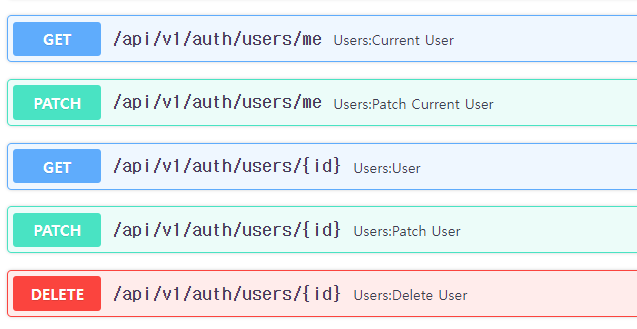

### users router(총 5개)
1. 기존 `get_auth_routers, get_register_router` 메서드처럼, fastapi_users객체에서 뽑아내는 router를  `app/api/dependencies/auth.py`에 `메서드`로 정의한다.
    - `requires_verification=`옵션은 해당 유저의 기본 추가 5 필드 중 1개인 **`is_verifeid`가 True인 유저인지 검증하게 한다.**
    ```python
    def get_users_router():
        return fastapi_users.get_users_router(
            user_schema=UserRead,
            user_update_schema=UserUpdate
        )
    
    ```
   
2. 이제 auth router에서 prefix='/users'로 include시켜준다.
    ```python
    router.include_router(
        router=get_users_router(),
        prefix='/users'  # /users/me(get) + me(patch)  + {id}(get) + {id}(patch) + {id}(delete)
    )
    ```
    

#### enum 정리 및 user model enum필드 수정
1. **enum의 value는 `외부입력이 편하도록 소문자`로 수정한다.**
    ```python
    # app/models/enums.py
    from enum import Enum
    
    
    class UserStatus(str, Enum):
        ADMIN = "admin"
        ACTIVE = "active"
        DELETED = "deleted"
        BLOCKED = "blocked"
    
    
    class SnsType(str, Enum):
        EMAIL: str = "email"
        FACEBOOK: str = "facebook"
        GOOGLE: str = "google"
        KAKAO: str = "kakao"
    
    
    class Gender(str, Enum):
        MALE = "male"
        FEMAIL = "female"
    
    
    class ApiKeyStatus(str, Enum):
        ACTIVE = "active"
        STOPPED = "stopped"
        DELETED = "deleted"
    
    ```
   
2. user model에서 sqlalchemy.Enum("직접", "문자열", "나열") 필드의 값을 (str, ENum) 클래스로 변경한다.
    ```python
        sns_type = Column(Enum(SnsType), nullable=True,)
        gender = Column(Enum(Gender), nullable=True)
    ```
   

#### Schema에서 Enum칼럼은 string 허용되지만, 종류다를시 에러 -> 기본값을 string으로 넣어두기
1. request 예시가 적히는 create/update의 schema에 기본값으로 입력
    ```python
    class UserCreate(BaseUserCreate):
        # model_config = ConfigDict(use_enum_values=True, )
        sns_type: Optional[SnsType] = "email"
    
    
    class UserUpdate(BaseUserUpdate):
        # model_config = ConfigDict(use_enum_values=True, )
        name: Optional[str] = None
        phone_number: Optional[str] = None
        profile_img: Optional[str] = None
    
        nickname: Optional[str] = None
        age: Optional[int] = None
        birthday: Optional[str] = None
        
        marketing_agree: Optional[bool] = None
        
        sns_type: Optional[SnsType] = "email"
        gender: Optional[Gender] = "male"
        status: Optional[UserStatus] = "active"

    ```
   
2. faker에서 유저만들 때도, 기본값으로 1개 뽑아서 .value로 string으로 입력되게 해놓기
    ```python
    class UserProvider(BaseProvider):
    
        def create_user_info(self, **kwargs):
            _faker = self.generator
            status = _faker.random_element(UserStatus).value
            gender = _faker.random_element(Gender).value
            sns_type = _faker.random_element(SnsType).value
            
            return dict(
                email=fake_profile['mail'],
                hashed_password=hash_password("string"),
                phone_number=phone_number,
                name=fake_profile['name'],
                nickname=fake_profile['username'],
                birthday=fake_profile['ssn'][:6],
                age=age,
                status=status,
                gender=gender,
                sns_type=sns_type,
            ) | kwargs
    ```
   
### users/{id} CRUD는 `is_supderuser`가 True(1)인 user의 접속시에만 조절가능하다!
- db에서 is_superuser가 True or 1로 등록될 때만, `forbidden`이 안뜬다.
```
403 Forbidden
Not a superuser.
```
#### postman에서 테스트하기

### 도커 명령어

1. (`패키지 설치`시) `pip freeze` 후 `api 재실행`

```shell
pip freeze > .\requirements.txt

docker-compose build --no-cache api; docker-compose up -d api;
```

2. (init.sql 재작성시) `data폴더 삭제` 후, `mysql 재실행`

```shell
docker-compose build --no-cache mysql; docker-compose up -d mysql;
```

```powershell
docker --version
docker-compose --version

docker ps
docker ps -a 

docker kill [전체이름]
docker-compose build --no-cache
docker-compose up -d 
docker-compose up -d [서비스이름]
docker-compose kill [서비스이름]

docker-compose build --no-cache [서비스명]; docker-compose up -d [서비스명];

```

3. docker 추가 명령어
```powershell
docker stop $(docker ps -aq)
docker rm $(docker ps -aqf status=exited)
docker network prune 

docker-compose -f docker-compose.yml up -d
```
### pip 명령어

```powershell
# 파이참 yoyo-migration 설치

pip freeze | grep yoyo

# 추출패키지 복사 -> requirements.txt에 붙혀넣기

```

### git 명령어
```powershell
git config user.name "" 
git config user.email "" 

```
### yoyo 명령어
```powershell
yoyo new migrations/

# step 에 raw sql 작성

yoyo apply --database [db_url] ./migrations 
```

- 참고
    - 이동: git clone 프로젝트 커밋id 복사 -> `git reset --hard [커밋id]`
    - 복구: `git reflog` -> 돌리고 싶은 HEAD@{ n } 복사 -> `git reset --hard [HEAD복사부분]`