### Custom AuthBackend -> OAuthBackend

#### /callback router 다시 분석하기

- **콜백라우터 내부에서는 `backend`객체가, `.login( strategy, user객체)`만 작동하며, `Users테이블 + OAuthAccount테이블정보가 완성된 user객체`를 보유한 상태로
  Response를 생성한다.**
    - **그렇다면, UserManager는 그대로 두고, backend.login()을 custom할 수 있는 Custom AuthBackend인 `OAuthBackend`를 정의하고, 각 OAuth
      name마다 다르게 user정보를 추출할 수 있게 한다.**
      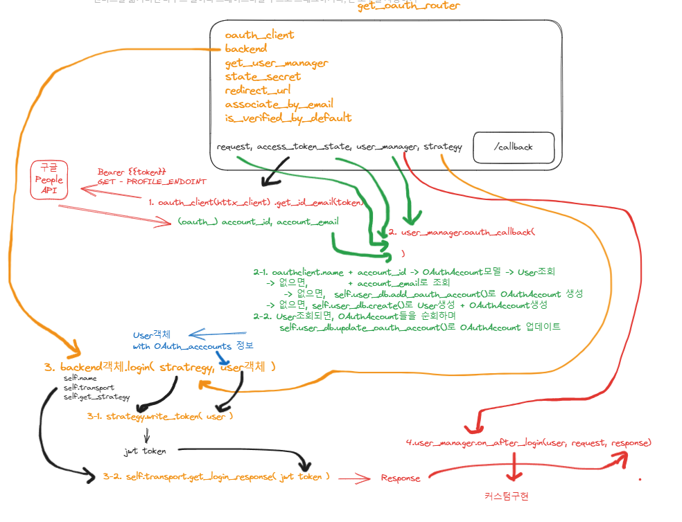

#### 추가기능 or override를 위해 공용 OAuthBackend 만들기

1. libs > auth > backends.py의 내용을 libs > auth > `backends` 패키지 >  `base.py`에 옮겨준다.
2. **각 oauth 종류별로, 추가기능이 달린 backend class `OAuthBackend(AuthenticationBackend)`를 정의하는 `oauth.py`를 만들어서 정의해주고, login메서드를
   재정의한다.**
    - 파이참에서 alt + insert 메서드 재정의에서 선택하면 알아서 파라미터와 메서드를 채워준다.
    ```python
    from fastapi_users import models
    from fastapi_users.authentication import AuthenticationBackend, Strategy
    from starlette.responses import Response
    
    
    class OAuthBackend(AuthenticationBackend):
        # 등록완료/로그인완료된 user객체를 컨트롤 할 수 있다.
        async def login(self, strategy: Strategy[models.UP, models.ID], user: models.UP) -> Response:
            return await super().login(strategy, user)
    ```

3. 원래 backend.login의 기능이
    - 입력 strategy + user -> jwt token
    - 생성시 transport + jwt token -> Response이다.
    - **response 객체로 받은 뒤, `원하는 추가기능`을 `완성된 user객체`를 이용해서 정의한 뒤, `return response`해준다.**

4. **일단 user_profile을 추가로 조회할 수 도 있고 못할 수 도 있어서, `프로필 정보 추가여부`를 생성자에서 추가로 받는다.**
    ```python
    class OAuthBackend(AuthenticationBackend):
    
        def __init__(
                self,
                name: str, 
                transport: Transport,
                get_strategy: DependencyCallable[Strategy[models.UP, models.ID]],
                has_profile_callback: bool = False, # 추가 프로필 요청 여부
        ):
            super().__init__(name, transport, get_strategy)
            self.has_profile_callback = has_profile_callback
    
        # 등록완료/로그인완료된 user객체를 컨트롤 할 수 있다.
        async def login(self, strategy: Strategy[models.UP, models.ID], user: models.UP) -> Response:
            response = await super().login(strategy, user)
            
            # 프로필정보 추가 요청
            if self.has_profile_callback:
                ...
    
            return response
    ```

5. 이 때, `user.oauth_accounts`에 들어있는 것 중 `현재 OAuth에 대한 token`를 골라내야하는데, OAuthAccount모델의 `.oauth_name`과, 현재 OAuthBackend
   주체와 일치하는 것의 `.access_token`을 가져와야한다.
    - **비교할 oauth_name부분만 서로 달라지기 때문에, 해당 부분만 `method 추출 -> @abstractmethod + raise NotImplementError`로 정의해버린다.**
    ```python
    class OAuthBackend(AuthenticationBackend):
    
        # 등록완료/로그인완료된 user객체를 컨트롤 할 수 있다.
        async def login(self, strategy: Strategy[models.UP, models.ID], user: models.UP) -> Response:
            response = await super().login(strategy, user)
    
            # 프로필정보 추가 요청
            if self.has_profile_callback:
                access_token = self.get_access_token(user)
                if not access_token:
                    pass
    
            return response
    
        def get_access_token(self, user: Users):
            for oauth_account in user.oauth_accounts:
                if oauth_account.oauth_name == self.get_oauth_name():
                    return oauth_account.access_token
    
            return None
    
        @abstractmethod
        def get_oauth_name(self):
            raise NotImplementedError
    
    
    class GoogleBackend(OAuthBackend):
        OAUTH_NAME = 'google'
    
        def get_oauth_name(self):
            return self.OAUTH_NAME
    
    ```
    - **추가 프로필 요청은 `여부 True` and `해당 oauth의 access_token 존재`가 필수 조건이므로 조건식을 수정한다.**
    ```python
    async def login(self, strategy: Strategy[models.UP, models.ID], user: models.UP) -> Response:
        response = await super().login(strategy, user)
        # 프로필정보 추가 요청
        if self.has_profile_callback and self.get_access_token(user):
            ...
         return response
    ```
    - 반환되는 token을 내부에서 사용해야하기 때문에, `:=` 코끼리 연산자로 할당과 동시에 사용하게 한다.
    ```python
    async def login(self, strategy: Strategy[models.UP, models.ID], user: models.UP) -> Response:
        response = await super().login(strategy, user)

        # 프로필정보 추가 요청
        if self.has_profile_callback and (access_token := self.get_access_token(user)):
            ...

        return response
    ```

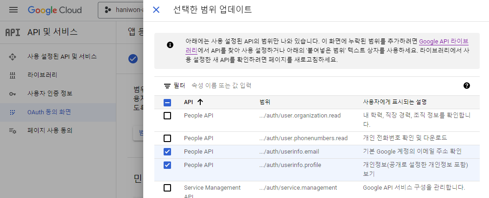

6. 이제 확보된 `access_token`이 확보된 상황에서, **google api 중 `httx_oauth`의 각 oauth_client들이 내부에서 요청하는 것을 참고하여,
   get요청으로 `people api의 정보`를 추가로 받아와야한다.**
    - httx_oauth의 `BaseOAuth2` class를 상속하는  `GoogleOAuth2`는 **BaseOAuth2의 많은 요청 중 `get_id_email(token)`메서드에서 get요청을 하는
      것을 참고하자.**
    - **`httpx.AsyncClient`를 사용하여, get요청을 하되, `people api`를 PROFILE_ENDPOINT 상수로 사용하여 요청한다.**
    - **또한, query paramer를 `params=`에 `personFields`로 입력한다.**
    - **headers에 access_token을 `Authorize=`로 넣어서 요청한다.**
    ```python
    AUTHORIZE_ENDPOINT = "https://accounts.google.com/o/oauth2/v2/auth"
    ACCESS_TOKEN_ENDPOINT = "https://oauth2.googleapis.com/token"
    REVOKE_TOKEN_ENDPOINT = "https://accounts.google.com/o/oauth2/revoke"
    BASE_SCOPES = [
        "https://www.googleapis.com/auth/userinfo.profile",
        "https://www.googleapis.com/auth/userinfo.email",
    ]
    PROFILE_ENDPOINT = "https://people.googleapis.com/v1/people/me"
    
    class GoogleOAuth2(BaseOAuth2[GoogleOAuth2AuthorizeParams]):
        # ...
        async def get_id_email(self, token: str) -> Tuple[str, Optional[str]]:
            async with self.get_httpx_client() as client:
                response = await client.get(
                    PROFILE_ENDPOINT,
                    params={"personFields": "emailAddresses"},
                    headers={**self.request_headers, "Authorization": f"Bearer {token}"},
                )
    
                if response.status_code >= 400:
                    raise GetIdEmailError(response.json())
    
                data = cast(Dict[str, Any], response.json())
    
                user_id = data["resourceName"]
                user_email = next(
                    email["value"]
                    for email in data["emailAddresses"]
                    if email["metadata"]["primary"]
                )
    
                return user_id, user_email
    
        # (BaseOAuth2)
        def get_httpx_client(self) -> AsyncContextManager[httpx.AsyncClient]:
            return httpx.AsyncClient()
    ```

#### 추가 정보 요청을 위해 httx_oauth의 BaseOAuth2 기능 살펴보기

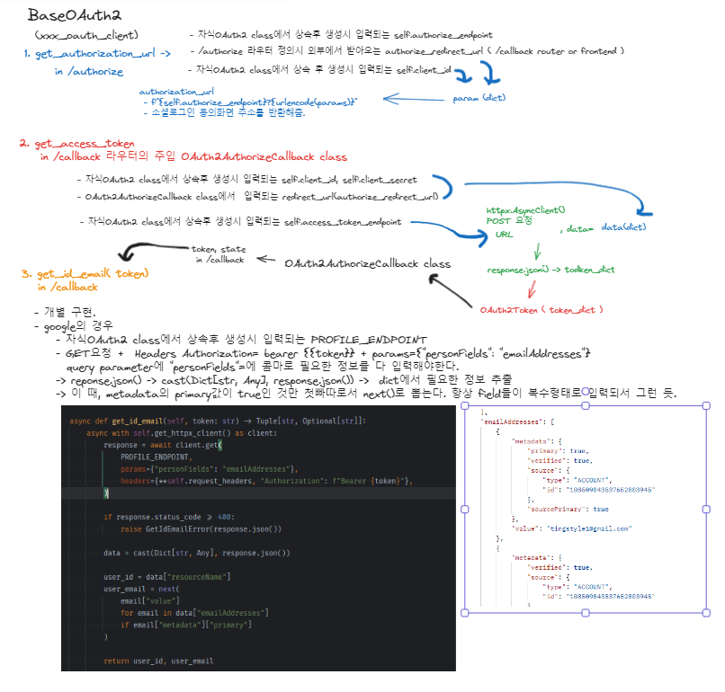

### 추가 정보 요청을 위한 구글클라우트 설정

#### 추가 정보의 scope는 [OAuth 동의화면]에서 추가된다.

1. 기본적으로 people api에 요청해서 사용하는데 **people api의 사용범위를 `OAuth 동의화면`에 들어가서 추가해야한다.**
    - OAuth 동의화면 > `저장후 계속` > 범위 - `범위 추가 또는 삭제` 클릭
    - `.../auth/userinfo.email`와 `.../auth/userinfo.profile`는 이미 추가했었는데,
    - **추가로 People API의 `.../auth/user.phonenumbers.read` + `.../auth/user.birthday.read` + `.../auth/user.gender.read`
      사용을 추가했다.**
    - **여기서 추가해야지, 추후 `로그인 화면시, 추가엑세스 요청`에 추가된다.**
      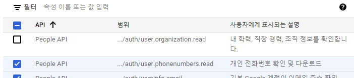
      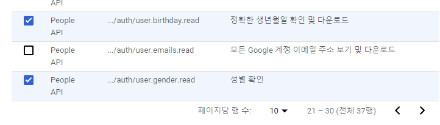
      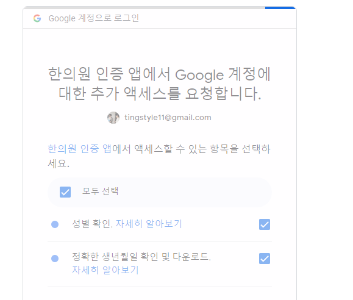
      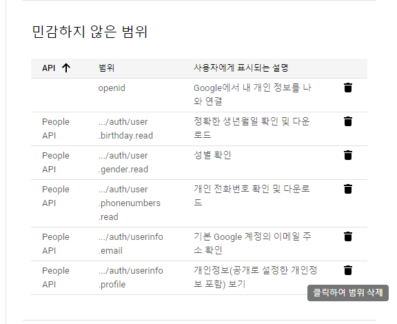

### fastapi의 ouath_client객체 생성시 scope 늘려서 반영하기

1. client 생성시 scope 추가해주기
    ```python
    # BASE_SCOPES = [
    # "https://www.googleapis.com/auth/userinfo.profile",
    #     "https://www.googleapis.com/auth/userinfo.email",
    # ]
    
    google_oauth_client = GoogleOAuth2(
        GOOGLE_CLIENT_ID,
        GOOGLE_CLIENT_SECRET,
        scopes=[
            "openid",
            "https://www.googleapis.com/auth/userinfo.profile",  # 구글 클라우드 - 동의에서 설정한 범위
            "https://www.googleapis.com/auth/userinfo.email",
            "https://www.googleapis.com/auth/user.birthday.read",  # 추가 액세스 요청 3개 (전부 people api)
            "https://www.googleapis.com/auth/user.gender.read",
            "https://www.googleapis.com/auth/user.phonenumbers.read",
        ])
    
    ```

### scope를 추가한만큼, 해당 scope에 대한 people api 조회시, personFields에 추가해야 보인다.

- 원래하던데로 요청하면, emailAddress만 보이게 된다.
- **scope URL과 달리, httx_oauth client객체가 요청하던, get_id_email(token)메서드처럼, `PROFILE_ENDPOINT`에서 personFields에 해당요소드를
  추가해서 받아야한다.**
```python
PROFILE_ENDPOINT = "https://people.googleapis.com/v1/people/me"

    async def get_id_email(self, token: str) -> Tuple[str, Optional[str]]:
        async with self.get_httpx_client() as client:
            response = await client.get(
                PROFILE_ENDPOINT,
                params={"personFields": "emailAddresses"},
                headers={**self.request_headers, "Authorization": f"Bearer {token}"},
            )

            if response.status_code >= 400:
                raise GetIdEmailError(response.json())

            data = cast(Dict[str, Any], response.json())

            user_id = data["resourceName"]
            user_email = next(
                email["value"]
                for email in data["emailAddresses"]
                if email["metadata"]["primary"]
            )

            return user_id, user_email
```

#### POSTMAN
1. 일단 환경변수에 `GOOGLE-PROFILE-ENDPOINT`를 추가해서 바로 쓸 수 있게 한다.
    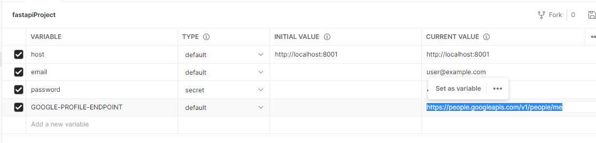

2. 프로젝트 collectino > OAuth > `GOOGLE Additional Info`로 request를 새로 만들고 환경변수를 사용해 구성하며
    - 기존 요청 qs인 personFields -> emailAddresses를 넣어서 GET요청해본다.
    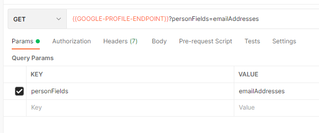
    - `PERMISSION_DENIED`
    - **Bearer 방식으로 database에 있는 한 user의 OAuthAccounts - `oauth_name`이 google인 것의 access_token을 하나 가져와서 `Headers`의 Authorization key에 `Bearer `를 붙여서 넣어준다.**
    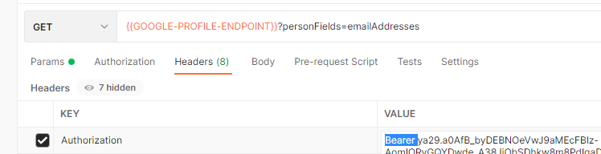
    - `UNAUTHENTICATED`

3. **`scope가 늘어난 만큼` 새롭게 /authorize -> 로그인 화면에서 추가 엑세스 동의 -> `새로운 access_token`을 발급받아서 요청해줘야한다.**
    - swagger를 이용해서 로그인화면을 얻고 -> 복붙해서 사용자동의에 추가엑세스까지 허용해준다.
    - **db를 보면, access_token이 없데이트 되어있다. -> 새롭게 복사해서 Authorization=Bearer {{}}에 추가해준다.**
    - 다시 postman으로 요청해보자.
    - **나의 경우, 2개의 이메일이 나오게 되는데, `metadata`의 `primary`가 true인 것의 `value`를 가져오면 된다.**
    ```json
    {
        "resourceName": "people/xxx",
        "etag": "xxx",
        "emailAddresses": [
            {
                "metadata": {
                    "primary": true,
                    "verified": true,
                    "source": {
                        "type": "ACCOUNT",
                        "id": "xxx"
                    },
                    "sourcePrimary": true
                },
                "value": "tingstyle1@gmail.com"
            },
            {
                "metadata": {
                    "verified": true,
                    "source": {
                        "type": "ACCOUNT",
                        "id": "xxx"
                    }
                },
                "value": "tingstyle@hanmail.net"
            }
        ]
    }
    ```
   

4. 이제 QueryParams의 personFields에 `emailAddresses`외 추가로 성별/생일/전화번호를 문서를 보고 필드 추가해보자.
    - **[문서](https://developers.google.com/people/api/rest/v1/people/get)는 한글번역하면 필드까지 번역되므로 번역없이 봐야함.**
    - people > get > Query parameters 의 personFields를 확인한다.
        - scope가 필요할 수 있다고 나오며, 우리는 원래 목적이 었던 프로필사진인 `photos`, `birthdays, genders, phoneNumbers` 필드를 추가해서 요청해본다.
        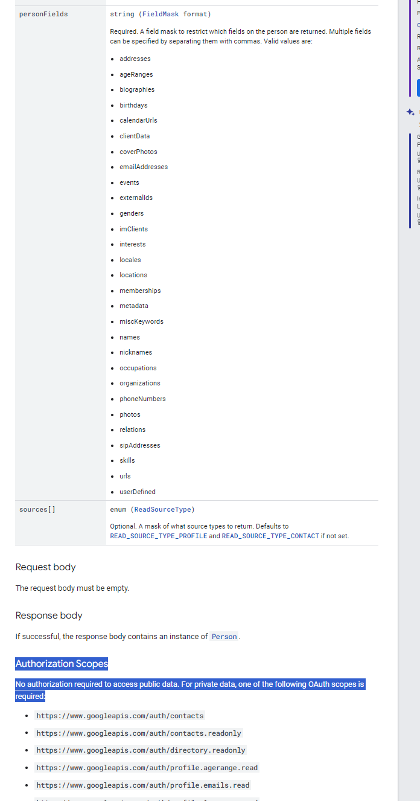

5. postman에서 personFields에 콤마로 연결해서 요청한다.
    - **콤마사이에 여백있으면 안됨.**
    - `{{GOOGLE-PROFILE-ENDPOINT}}?personFields=emailAddresses,photos,birthdays,genders,phoneNumbers`
    - **전화번호는 없으니까 안나오나보다.**
    ```json
    {
        "resourceName": "people/xxx",
        "etag": "%xxxx/GgQBAgUxxxxHIgxqZTFWYzh5UTdxZz0=",
        "photos": [
            {
                "metadata": {
                    "primary": true,
                    "source": {
                        "type": "PROFILE",
                        "id": "xxx"
                    }
                },
                "url": "https://lh3.googleusercontent.com/a/ACg8ocKn-HgWhuT191z-Xp6lq0Lud_nxcjMRLR1eJ0nMhMS1=s100",
                "default": true
            }
        ],
        "genders": [
            {
                "metadata": {
                    "primary": true,
                    "source": {
                        "type": "PROFILE",
                        "id": "xxx"
                    }
                },
                "value": "male",
                "formattedValue": "Male"
            }
        ],
        "birthdays": [
            {
                "metadata": {
                    "primary": true,
                    "source": {
                        "type": "PROFILE",
                        "id": "xxx"
                    }
                },
                "date": {
                    "year": 1900,
                    "month": 10,
                    "day": 10
                }
            },
            {
                "metadata": {
                    "source": {
                        "type": "ACCOUNT",
                        "id": "xxx"
                    }
                },
                "date": {
                    "year": 1900,
                    "month": 10,
                    "day": 10
                }
            }
        ],
        "emailAddresses": [
            {
                "metadata": {
                    "primary": true,
                    "verified": true,
                    "source": {
                        "type": "ACCOUNT",
                        "id": "xxx"
                    },
                    "sourcePrimary": true
                },
                "value": "tingstyle1@gmail.com"
            },
            {
                "metadata": {
                    "verified": true,
                    "source": {
                        "type": "ACCOUNT",
                        "id": "xxx"
                    }
                },
                "value": "tingstyle@hanmail.net"
            }
        ]
    }
    ```
   

6. 휴대폰 번호는 구글 계정에 내 번호를 등록해야 나온다. 입력안한사람은 위와 같이 아예 key가 발견도 안될 것이다.
    ```json
    "phoneNumbers": [
            {
                "metadata": {
                    "primary": true,
                    "verified": true,
                    "source": {
                        "type": "PROFILE",
                        "id": "xxx"
                    }
                },
                "value": "010-xxxx-yyyy",
                "canonicalForm": "+8210xxxxyyyy",
                "type": "mobile",
                "formattedType": "Mobile"
            }
        ]
    ```

### 다시 backend 커스텀으로 와서, oauth_client 요청방식으로 추가정보요청하기
- **커스텀 OAuthBackend의 login 오버라이딩에서 구글을 예시로, 데이터를 뽑아내고 -> user객체를 `자체 session으로 업데이트`해야한다.**
  - callback router에서 활동하지만, user_manager가 없는 상태여서, user_db.xxx메서드를 호출할 순 없다.
  - **backend.login 이후 user_manager.on_after_login()가 UserManager에 기능이 있지만, token인풋X 각 oauth마다 개별 요청 구현이 힘드므로, backend에서 자체적으로 해결한다.**
  - 자체session으로 업데이트 하려면, user객체.update()로 해야하는데 내부 .fill()호출시 kwargs가 안들어오면 None을 반환하므로, 개별입력이 아니라, dict에 모아서 **dict로 .update()에 입력해준다.

1. oauth_client.get_id_mail(token) 메서드를 참고해서, 작성할 예정이므로 필요한 재료들을 미리 만들어놓는다.
    - 생성자에서 기본 request_headers의 타입을 미리 만들어놓는다.
       - **추후 최종 headers는 `dict 합치기(뒤에것 우선)`의 방법인 `{**기존dict, **추가dict}`로 병합하면 된다.**
     - 또한, http 요청이 있으므로 각 OAuth별 자식 구현시 쓸 수 있또록 httx.AsyncClient()객체를 반환하도록 해준다.
    ```python
    class OAuthBackend(AuthenticationBackend):
    
        def __init__(
    
                self,
                name: str,
                transport: Transport,
                get_strategy: DependencyCallable[Strategy[models.UP, models.ID]],
                has_profile_callback: bool = False,  # 추가 프로필 요청 여부
        ):
            super().__init__(name, transport, get_strategy)
            self.has_profile_callback = has_profile_callback
    
            # 추가 정보요청을 위해 추가
            self.request_headers = {
                "Accept": "application/json",
            }
            
        # 추가정보 요청용 client
        @staticmethod
        def get_httpx_client() -> AsyncContextManager[httpx.AsyncClient]:
            return httpx.AsyncClient()
    ```
2. response.status_code가 >= 400 이상의 에러일 때를 미리 정의해놓는다.
    - router를 타서 middelware를 타는 상황이므로
    - `404 NOT_FOUND 에러(클라이언트가 무언가를 요청하였으나 해당 항목에 대해 어떤 것도 찾지 못하였음)`로 만들어준다.
    ```python
    class GetOAuthProfileError(NotFoundException):
        def __init__(self, exception: Exception = None):
            super().__init__(
                code_number=5,
                detail="소셜로그인 추가정보를 요청하는데 실패하였습니다.",
                exception=exception
            )
    
    ```
   
3. 이제 google people api 응답에 따라 데이터를 추출한 뒤, user객체.update()를 해준다.
    ```python
    class OAuthBackend(AuthenticationBackend):
        #...
   
        # async def login(self, strategy: Strategy[models.UP, models.ID], user: models.UP) -> Response:
        async def login(self, strategy: Strategy[models.UP, models.ID], user: Users) -> Response:
            strategy_response = await super().login(strategy, user)
    
            # 프로필정보 추가 요청
            if self.has_profile_callback and (access_token := self.get_access_token(user)):
    
                async with self.get_httpx_client() as client:
                    response = await client.get(
                        # PROFILE_ENDPOINT,
                        google.PROFILE_ENDPOINT,
                        # params={"personFields": "emailAddresses"},
                        params={"personFields": "photos,birthdays,genders,phoneNumbers"},
                        headers={**self.request_headers, "Authorization": f"Bearer {access_token}"},
                    )
    
                    if response.status_code >= 400:
                        # raise GetIdEmailError(response.json())
                        raise GetOAuthAdditionalInfoError()
    
                    data = cast(Dict[str, Any], response.json())
    
                    # user_id = data["resourceName"]
                    profile_info = dict()
                    
                    for field in "photos,birthdays,genders,phoneNumbers".split(","):
                        field_data_list = data.get(field)
                        primary_data = next(
                            (field_data for field_data in field_data_list if field_data_list["metadata"]["primary"])
                            , None
                        )
                        if primary_data:
                            continue
    
                        if field == 'photos':
                            # "url": "https://lh3.googleusercontent.com/a/ACg8ocKn-HgWhuT191z-Xp6lq0Lud_nxcjMRLR1eJ0nMhMS1=s100",
                            profile_info['profile_img'] = primary_data['url']
    
                        if field == 'birthdays':
                            birthday_info = primary_data['date']
                            # "date": {
                            #              "year": 1900,
                            #              "month": 00,
                            #              "day": 00
                            #          }
                            profile_info['birthday'] = str(birthday_info['year']) + str(birthday_info['month']) + str(
                                str(birthday_info['day']))
    
                        if field == 'genders':
                            # "value": "male",
                            profile_info['gender'] = primary_data['value']
    
                        if field == 'phoneNumbers' :
                            # "value": "010-4600-6243",
                            profile_info['phone_number'] = primary_data['value']
    
                    # 자체 session으로 업데이트
                    await user.update(auto_commit=True, **profile_info)
    
            return strategy_response
    ```

4. 이제 access_token을 가지고 추가 데이터 요청하는 부분을 공용메서드로서 추출해놓고, GoogleBackend의 메서드에서 구현하도록 해본다.
    ```python
    async def login(self, strategy: Strategy[models.UP, models.ID], user: Users) -> Response:
        strategy_response = await super().login(strategy, user)
    
        # 프로필정보 추가 요청
        if self.has_profile_callback and (access_token := self.get_access_token(user)):
            
            profile_info = self.get_profile_info(access_token)
            
            # 자체 session으로 업데이트
            await user.update(auto_commit=True, **profile_info)
    
        return strategy_response
    
    def get_profile_info(self, access_token):
        async with self.get_httpx_client() as client:
            response = await client.get(
                # PROFILE_ENDPOINT,
                google.PROFILE_ENDPOINT,
                # params={"personFields": "emailAddresses"},
                params={"personFields": "photos,birthdays,genders,phoneNumbers"},
                headers={**self.request_headers, "Authorization": f"Bearer {access_token}"},
            )
    
            if response.status_code >= 400:
                # raise GetIdEmailError(response.json())
                raise GetOAuthAdditionalInfoError()
    
            data = cast(Dict[str, Any], response.json())
    
            # user_id = data["resourceName"]
            profile_info = dict()
    
            for field in "photos,birthdays,genders,phoneNumbers".split(","):
                field_data_list = data.get(field)
                primary_data = next(
                    (field_data for field_data in field_data_list if field_data_list["metadata"]["primary"])
                    , None
                )
                if not primary_data:
                    continue
    
                if field == 'photos':
                    # "url": "https://lh3.googleusercontent.com/a/ACg8ocKn-HgWhuT191z-Xp6lq0Lud_nxcjMRLR1eJ0nMhMS1=s100",
                    profile_info['profile_img'] = primary_data['url']
    
                if field == 'birthdays':
                    birthday_info = primary_data['date']
                    # "date": {
                    #              "year": 1900,
                    #              "month": 00,
                    #              "day": 00
                    #          }
                    profile_info['birthday'] = str(birthday_info['year']) + str(birthday_info['month']) + str(
                        str(birthday_info['day']))
    
                if field == 'genders':
                    # "value": "male",
                    profile_info['gender'] = primary_data['value']
    
                if field == 'phoneNumbers':
                    # "value": "010-4600-6243",
                    profile_info['phone_number'] = primary_data['value']
    
            return profile_info
    ```
   
5. **추가정보 요청을 안하는 OAuth도 있을 수 있으니, 추가정보 응답을 기본 빈 dict()로 해놓고, 항상 호출하게 해놓는다.**
    - 추상메서드 + NotImpleError로 구현하면, 매번 구현해야하는 번거로움이 생김.
    - if 추가정보 dict가 넘어올때만, user를 업데이트한다.
    ```python
    class OAuthBackend(AuthenticationBackend):
    
        async def login(self, strategy: Strategy[models.UP, models.ID], user: Users) -> Response:
            strategy_response = await super().login(strategy, user)
    
            # 프로필 정보 추가 요청
            if self.has_profile_callback and (access_token := self.get_access_token(user)):
                try:
                    # 추가정보가 들어올 때만, user.update()
                    if profile_info := await self.get_profile_info(access_token):
                        # 자체 session으로 업데이트
                        await user.update(auto_commit=True, **profile_info)
                except Exception as e:
                    raise e
        
            return strategy_response
    
        def get_profile_info(self, access_token):
            return dict()
    ```
    ```python
    class GoogleBackend(OAuthBackend):
        # 
        def get_profile_info(self, access_token):
            async with self.get_httpx_client() as client:
                response = await client.get(
                    # PROFILE_ENDPOINT,
                    google.PROFILE_ENDPOINT,
                    # params={"personFields": "emailAddresses"},
                    params={"personFields": "photos,birthdays,genders,phoneNumbers"},
                    headers={**self.request_headers, "Authorization": f"Bearer {access_token}"},
                )
    
                if response.status_code >= 400:
                    # raise GetIdEmailError(response.json())
                    raise GetOAuthProfileError()
    
                data = cast(Dict[str, Any], response.json())
    
                # user_id = data["resourceName"]
                user_info = dict()
    
                for field in "photos,birthdays,genders,phoneNumbers".split(","):
                    field_data_list = data.get(field)
                    primary_data = next(
                        (field_data for field_data in field_data_list if field_data_list["metadata"]["primary"])
                        , None
                    )
                    if not primary_data:
                        continue
    
                    if field == 'photos':
                        # "url": "https://lh3.googleusercontent.com/a/ACg8ocKn-HgWhuT191z-Xp6lq0Lud_nxcjMRLR1eJ0nMhMS1=s100",
                        user_info['profile_img'] = primary_data['url']
    
                    if field == 'birthdays':
                        birthday_info = primary_data['date']
                        # "date": {
                        #              "year": 1900,
                        #              "month": 00,
                        #              "day": 00
                        #          }
                        user_info['birthday'] = str(birthday_info['year']) + str(birthday_info['month']) + str(
                            str(birthday_info['day']))
    
                    if field == 'genders':
                        # "value": "male",
                        user_info['gender'] = primary_data['value']
    
                    if field == 'phoneNumbers':
                        # "value": "010-4600-6243",
                        user_info['phone_number'] = primary_data['value']
    
                return user_info
   
            return dict()
    ```
- get profile 정보통신은 성공할 수 있어도, user.update시 실패할 수 도 있으니 에러를 `500에러 & DBException`으로 만들어보자.
    ```python
    class OAuthProfileUpdateFailException(DBException):
    
        def __init__(self, *, obj=None, exception: Exception = None):
            super().__init__(
                code_number=3,
                detail=f"{obj}의 소셜로그인 프로필 업데이트에 실패했습니다.",
                exception=exception
            )
    ```
    ```python
    async def login(self, strategy: Strategy[models.UP, models.ID], user: Users) -> Response:
        strategy_response = await super().login(strategy, user)
    
        # 프로필 정보 추가 요청
        if self.has_profile_callback and (access_token := self.get_access_token(user)):
            try:
                # 추가정보가 들어올 때만, user.update()
                if profile_info := await self.get_profile_info(access_token):
                    # 자체 session으로 업데이트
                    await user.update(auto_commit=True, **profile_info)
            except Exception as e:
                raise OAuthProfileUpdateFailException(obj=user, exception=e)
    
        return strategy_response
    ```
#### oauth_client별 -> oauthBackend 구현으로 인해, get_aouth_routers() 구조 변경
- 기존: oauth_clients 를 순회하면서, `고정된 1개의 cookie_auth_backend`를 입력하여 router 생성 -> append
- 변경: oauth_client마다 oauth_backend(cookie, bearer)가 딸려있으므로 
    1. oauth_client들을 순회 -> `oauth_client종류 확인` -> 종류에 따라 oauth전용 backend객체들(cookie, bearer)를 불러와 router생성  
    2. 이 때, backend 내부에 OAUTH_NAME(get_oauth_name()) or client.name으로  (google...)을 불러올 수 있으며, **backend객체 생성시, name을 `cookie or bearer` 둘중에 하나만 붙이기로 약속**
    3. 소셜로그인 이름인 `google(oauth_client.name)` + `/` + backend.name인 `cookie or bearer` 를 prefix로 하도록 함.


1. app/api/v1/auth/router.py 에서 get_oauth_router() 1개 등록하던 것을, `get_oauth_routers()`로 한꺼번에 불러온다.
    ```python
    # 기존
    # /api/v1/auth/users/jwt/google/cookie/authorize
    # /api/v1/auth//users/jwt/google/cookie/callback
    router.include_router(
        router=get_oauth_router(),
        prefix='/users/jwt/google'
    )
    
    # 변경
    # /api/v1/auth/google/cookie or bearer/authorize
    # /api/v1/auth/google/cookie or bearer/callback
    for oauth_router in get_oauth_routers():
        router.include_router(
            router=oauth_router['router'],
            prefix=f"/{oauth_router['name']}",
        )
    ```
   
2. get_oauth_routers()에서는 get_oauth_clients()를 불러와서 순회하며, `isinstance`로 어떤 OAuth2 class인지 확인하여
    - 미리 생성된 해당 backend객체들(cookie + bearer)를 다 불러와서, 1 client ->  2backends로 각각 router를 만들 수 있게 한다.
    - **이 때, backend객체 생성시 이름을 `cookie or bearer`로 고정하고, `clinet.name / cookie or bearer`가 prefix로 작동할 수 있게 한다.**
    ```python
    # 기존
    def get_oauth_router():
        router = fastapi_users.get_oauth_router(
            oauth_client=google_oauth_client,
            backend=cookie_auth_backend,
            state_secret=JWT_SECRET,
            associate_by_email=True,
        )
        return router
    
    # 변경
    def get_oauth_routers():
        routers = []
    
        for oauth_client in get_oauth_clients():
            if isinstance(oauth_client, GoogleOAuth2):
                for backend in get_google_backends():
                    # oauth_client.name -> 'google' or ... (cusotm)
                    # backend.name -> 'cookie' or 'bearer' (backend객체 생성시 약속)
                    routers.append({
                        "name": f'{oauth_client.name}/' + backend.name,
                        "router": fastapi_users.get_oauth_router(
                            oauth_client=oauth_client,
                            backend=backend,
                            state_secret=JWT_SECRET,
                            associate_by_email=True,
                        )
                    })
    
        return routers
    ```
   
3. `get_google_backends()`를 정의할 때, **미리 cookie, bearer 2종류의 Backend객체를 미리 생성해놓는다.**
    ```python
    # app/libs/auth/backends/oauth.py
    class GoogleBackend(OAuthBackend):
        #...
    
    google_cookie_backend = GoogleBackend(
        name="cookie",
        transport=get_cookie_transport(),
        get_strategy=get_jwt_strategy,
        has_profile_callback=True,
    )
    
    google_bearer_backend = GoogleBackend(
        name="bearer",
        transport=get_cookie_transport(),
        get_strategy=get_jwt_strategy,
        has_profile_callback=True,
    )
    
    
    def get_google_backends():
        return [
            google_cookie_backend, google_bearer_backend
        ]
    
    ```
   
4. 기존에는 없던 get_bearer_transport()를 정의해준다.
    ```python
    # app/libs/auth/transports.py
    def get_bearer_transport():
        return BearerTransport(
            tokenUrl='auth/jwt/login'  # fastapi-users에서 기본backend만들 때, token을 발급해주는 라우터?
        )
    ```
   
5. **beare_transport가 작동하려면 기본 `bearer_auth_backend` -> `router`로 등록되어야하므로, 기본 auth router에 추가해준다.**
    ```python
    bearer_auth_backend = AuthenticationBackend(
        name="bearer",
        transport=get_bearer_transport(),
        get_strategy=get_jwt_strategy,
    )
    
    
    def get_auth_backends():
        return [
            cookie_auth_backend, bearer_auth_backend
        ]
    
    ```
    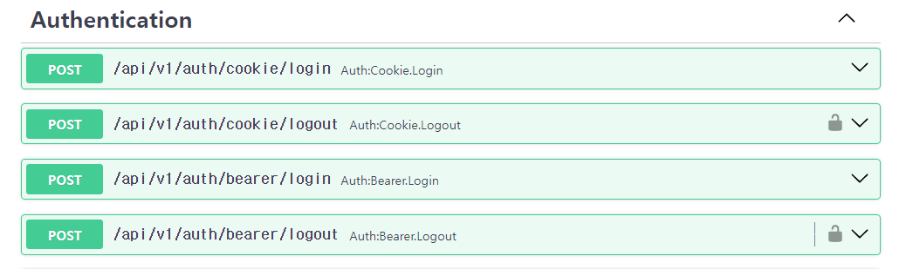

6. **router를 등록해서 token을 발급해주는 `bearer login router의 URL`이 확정됬으므로, bearer_transport의 tokenUrl를 변경해준다.**
    ```python
    def get_bearer_transport():
        return BearerTransport(
            # tokenUrl='auth/jwt/login'  # fastapi-users에서 기본backend만들 때, token을 발급해주는 라우터?
            tokenUrl='/api/v1/auth/bearer/login'
        )
    ```
   
7. 이제 callback url이 바꼈으니(전과동일함) 구글 프로젝트에서 승인된 redirect_url에 callback 2개(cookie, bearer)를 업데이트해준다.(실제도메인버전도 +1)
    - bearer버전을 추가해준다.
    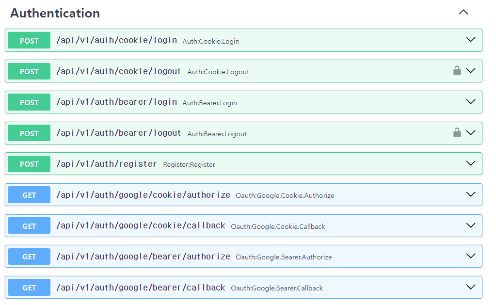
    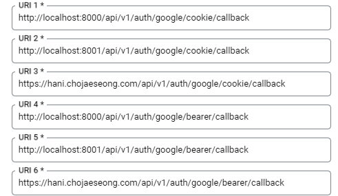


### 도커 명령어

1. (`패키지 설치`시) `pip freeze` 후 `api 재실행`

```shell
pip freeze > .\requirements.txt

docker-compose build --no-cache api; docker-compose up -d api;
```

2. (init.sql 재작성시) `data폴더 삭제` 후, `mysql 재실행`

```shell
docker-compose build --no-cache mysql; docker-compose up -d mysql;
```

```powershell
docker --version
docker-compose --version

docker ps
docker ps -a 

docker kill [전체이름]
docker-compose build --no-cache
docker-compose up -d 
docker-compose up -d [서비스이름]
docker-compose kill [서비스이름]

docker-compose build --no-cache [서비스명]; docker-compose up -d [서비스명];

```

3. docker 추가 명령어

```powershell
docker stop $(docker ps -aq)
docker rm $(docker ps -aqf status=exited)
docker network prune 

docker-compose -f docker-compose.yml up -d
```

### pip 명령어

```powershell
# 파이참 yoyo-migration 설치

pip freeze | grep yoyo

# 추출패키지 복사 -> requirements.txt에 붙혀넣기

```

### git 명령어

```powershell
git config user.name "" 
git config user.email "" 

```

### yoyo 명령어

```powershell
yoyo new migrations/

# step 에 raw sql 작성

yoyo apply --database [db_url] ./migrations 
```

- 참고
    - 이동: git clone 프로젝트 커밋id 복사 -> `git reset --hard [커밋id]`
    - 복구: `git reflog` -> 돌리고 싶은 HEAD@{ n } 복사 -> `git reset --hard [HEAD복사부분]`