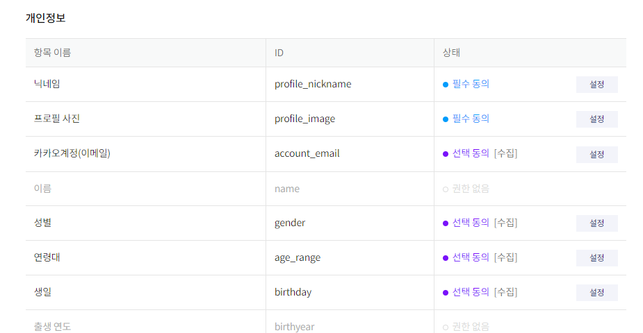
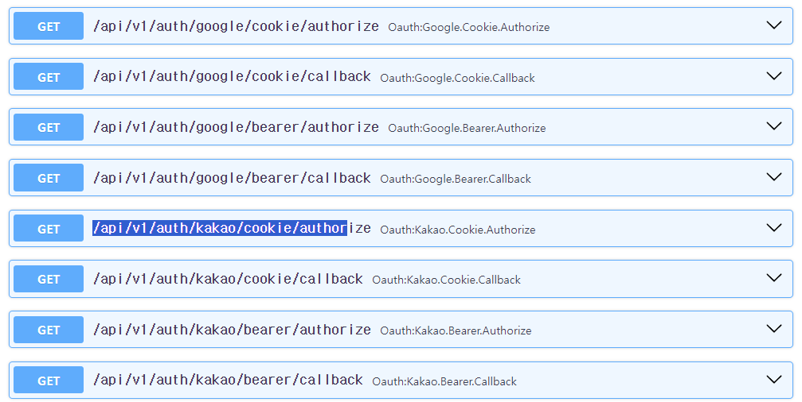
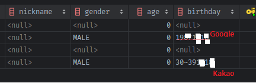
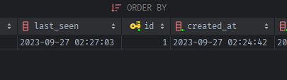

### kakao login
- 참고문서
   - 카카오 개발자 앱 설정: https://blog.itcode.dev/posts/2021/10/23/oauth2-java-server-6
   - 검수관련 : https://blog.itcode.dev/posts/2021/10/25/oauth2-java-server-11
      - 특정항목만 비지니스앱(사업자 요구) 설정이 따로 필요함. 
   - fastapi + react :  https://blog.joonas.io/230

#### 서비스 신청 및 clinet_id(REST_API), client_secret 준비
1. [개발자 페이지](https://developers.kakao.com/) > 내 애플리케이션 >  앱 선택
2. 카카오로그인 하위 > `동의화면` > account_email / gender / age_range / birthday 등 체크
    

3. 카카오로그인 클릭 > `Redirect_url 등록` **callback_url을 구글앱의 callback router 승인된 redirect_url의 google ->  kakao 버전으로 미리 등록해놓자**
    - 추가로 같은화면에 있는 `활성화`도 선택해야함.
    ```html
    http://localhost:8000/api/v1/auth/kakao/cookie/callback
    http://localhost:8001/api/v1/auth/kakao/cookie/callback
    https://hani.chojaeseong.com/api/v1/auth/kakao/cookie/callback
    
    http://localhost:8000/api/v1/auth/kakao/bearer/callback
    http://localhost:8001/api/v1/auth/kakao/bearer/callback
    https://hani.chojaeseong.com/api/v1/auth/kakao/bearer/callback
    ```
   
4. 카카오로그인 하위 > `보안` > Client Secret키 생성 + 활성화
    - 이후 .env 및 config에 추가한다.
    
5. **clinet_id는 카톡 앱 메인에 있는 `REST_API`키가 해당한다.**
    - `REST API 키	client_id 값으로 REST API를 호출 시 사용`
    - 이후 .env 및 config에 추가한다.
    ```dotenv
    KAKAO_CLIENT_ID="xxx" # REST API 키
    KAKAO_CLIENT_SECRET="xxx" # 보안 > CLINET_SECERT 키
    ```
    ```python
    # oauth
    GOOGLE_CLIENT_ID: str = environ.get("GOOGLE_CLIENT_ID", None)
    GOOGLE_CLIENT_SECRET: str = environ.get("GOOGLE_CLIENT_SECRET", None)
    KAKAO_CLIENT_ID: str = environ.get("KAKAO_CLIENT_ID", None)
    KAKAO_CLIENT_SECRET: str = environ.get("KAKAO_CLIENT_SECRET", None)
    
    ```
   

#### ouath_clinet 생성
1. app/libs/auth/oauth_clients.py에서 google것과 함께 같이 객체 미리 정의
    - client에 딸린 backend 2개 추가할 예정
    ```python
    # app/libs/auth/oauth_clients.py
    
    # scope 선택 (backend.login()에서 재요청할 것이므로 굳이 여기서 안해도 될듯 하긴 함.)
    # - BASE_SCOPE ["profile_nickname", "account_email"]
    # - profile_image, gender, age_range, birthday
    kakao_oauth_client = KakaoOAuth2(
        client_id=KAKAO_CLIENT_ID,
        client_secret=KAKAO_CLIENT_SECRET,
        scopes=BASE_SCOPES + ['profile_image', 'gender', 'age_range', 'birthday']
    )
    
    
    def get_oauth_clients():
        return [
            google_oauth_client, kakao_oauth_client
        ]
    ```
2. get_oauth_clients()가 호출되는 app/api/dependencies/auth.py에서 `isinstance(, KakaoOAuth2)`로 해당 backend 추가
    ```python
   
    def get_oauth_routers():
        routers = []
        for oauth_client in get_oauth_clients():
            if isinstance(oauth_client, GoogleOAuth2):
                #>..
                    
            elif isinstance(oauth_client, KakaoOAuth2):
                for backend in get_kakao_backends():
                    routers.append({
                        "name": f'{oauth_client.name}/' + backend.name,
                        "router": fastapi_users.get_oauth_router(
                            oauth_client=oauth_client,
                            backend=backend,
                            state_secret=JWT_SECRET,
                            associate_by_email=True,
                        )
                    })
        return routers
    ```
   
3. app/libs/auth/backends/oauth.py에서 get_kakao_backends()를 정의하기 위해, `KakaoBackend 커스텀으로 정의`후 cookie, bearer 2개 정의해서 메서드로 반환해주기
    - **이때 get_profile_info를 정의하지 않았으니 `has_profile_callback=`옵션을 False로 가져도록 한다.**
    - 만약, True로 주면, user.update를 시도하고, is_filled에 None이 나와서 에러가 날 것이다.
    ```python
    class KakaoBackend(OAuthBackend):
        OAUTH_NAME = 'kakao'
    
        def get_oauth_name(self):
            return self.OAUTH_NAME
    
        async def get_profile_info(self, access_token):
            return dict()
    
    kakao_cookie_backend = KakaoBackend(
        name="cookie",
        transport=get_cookie_transport(),
        get_strategy=get_jwt_strategy,
        # has_profile_callback=True,
    )
    
    kakao_bearer_backend = KakaoBackend(
        name="bearer",
        transport=get_bearer_transport(),
        get_strategy=get_jwt_strategy,
        # has_profile_callback=True,
    )
    
    def get_kakao_backends():
        return [
            kakao_cookie_backend, kakao_bearer_backend
        ]
    ```
    


4. **이제 /authorize router에 접속한 뒤, url을 받아서 가입해보자.**
    - db에 해당유저의 mail로 등록된다.

#### kakao 추가 정보 호출 - oauth_client의 get_id_mail 메서드를 참고하여.
- KakaoBackend의 get_profile_info 정의해서 추가정보를 가져갈 수 있게 해준다.
1. **먼저 kakao_oauth_client의 class내부에서 어떻게 호출하는지 참고해야한다.**
    - **google과 달리 `post`로 요청하며, google의  params는 `personFields`였지만, kakao는 `property_keys`를 key로, `list를 json.dumps()해서 string list`로 변환하여 넘겨준다.**
    ```python
    PROFILE_ENDPOINT = "https://kapi.kakao.com/v2/user/me"
    PROFILE_PROPERTIES = ["kakao_account.email"]

    class KakaoOAuth2(BaseOAuth2[Dict[str, Any]]):
        #...
        async def get_id_email(self, token: str) -> Tuple[str, Optional[str]]:
            async with self.get_httpx_client() as client:
                response = await client.post(
                    PROFILE_ENDPOINT,
                    params={"property_keys": json.dumps(PROFILE_PROPERTIES)},
                    headers={**self.request_headers, "Authorization": f"Bearer {token}"},
                )
    
                if response.status_code >= 400:
                    raise GetIdEmailError(response.json())
    
                payload = cast(Dict[str, Any], response.json())
                account_id = str(payload["id"])
                email = payload["kakao_account"].get("email")
                return account_id, email
    ```
   
2. property_keys에 dump에서 들어갈 list의 요소 목록은 [여기 문서](https://developers.kakao.com/docs/latest/ko/kakaologin/rest-api#propertykeys)에서 확인한다.
    - 문서 > 카카오 로그인 > REST API > PropertyKeys
    ```
    kakao_account.profile	카카오계정의 프로필 소유 여부/실시간 닉네임과 프로필 사진 URL
    kakao_account.name	카카오계정의 이름 소유 여부, 이름 값
    kakao_account.email	카카오계정의 이메일 소유 여부/이메일 값, 이메일 인증 여부, 이메일 유효 여부
    kakao_account.age_range	카카오계정의 연령대 소유 여부, 연령대 값
    kakao_account.birthday	카카오계정의 생일 소유 여부, 생일 값
    kakao_account.gender	카카오계정의 성별 소유 여부, 성별 값
    * properties.nickname, properties.profile_image, properties.thumbnail_image: Deprecated, 공지 참고
    ```
   
3. oauth_client인 KakaoOAuth2의 get_id_mail 메서드 내용을 복사해와서 맞게 수정한다.
    - **property_keys에 `kakao_account.`이 들어가서, kakao_accoutn 안에서 꺼내야하는 형식이며**
    - **생일은, 연도 대신 range로 30대임을 알려주고, 월일만 문자열로 반환해준다.**
    ```python
    class KakaoBackend(OAuthBackend):
    
        async def get_profile_info(self, access_token):
            async with self.get_httpx_client() as client:
                # https://developers.kakao.com/docs/latest/ko/kakaologin/rest-api#propertykeys
                PROFILE_ADDITIONAL_PROPERTIES = [
                    "kakao_account.profile",
                    "kakao_account.age_range",
                    "kakao_account.birthday",
                    "kakao_account.gender"
                ]
    
                response = await client.post(
                    PROFILE_ENDPOINT,
                    params={"property_keys": json.dumps(PROFILE_ADDITIONAL_PROPERTIES)},
                    headers={**self.request_headers, "Authorization": f"Bearer {access_token}"},
                )
    
                if response.status_code >= 400:
                    raise GetOAuthProfileError()
    
                data = cast(Dict[str, Any], response.json())
                print(data)
                # {
                #     "id":xxx,
                #     "connected_at":"2023-09-26T11:46:32Z",
                #     "kakao_account":{
                #         "profile_nickname_needs_agreement":false,
                #         "profile_image_needs_agreement":false,
                #         "profile":{
                #             "nickname":"조재성",
                #             "thumbnail_image_url":"http://k.kakaocdn.net/dn/bLu5OM/btsqh2LkkN0/KR5dVHiRVIFfTC0uZCtWTk/img_110x110.jpg",
                #             "profile_image_url":"http://k.kakaocdn.net/dn/bLu5OM/btsqh2LkkN0/KR5dVHiRVIFfTC0uZCtWTk/img_640x640.jpg",
                #             "is_default_image":false
                #         },
                #         "has_age_range":true,
                #         "age_range_needs_agreement":false,
                #         "age_range":"xx~xx",
                #         "has_birthday":true,
                #         "birthday_needs_agreement":false,
                #         "birthday":"xxxx",
                #         "birthday_type":"SOLAR",
                #         "has_gender":true,
                #         "gender_needs_agreement":false,
                #         "gender":"male"
                #     }
                # }
            return dict()
    ```
   
4. 이제 필요한 정보를 빼서 user의 필드와 일치시킨 profile_info를 반환한다.
    ```python
    class KakaoBackend(OAuthBackend):
    
        async def get_profile_info(self, access_token):
            async with self.get_httpx_client() as client:
                # https://developers.kakao.com/docs/latest/ko/kakaologin/rest-api#propertykeys
                PROFILE_ADDITIONAL_PROPERTIES = [
                    "kakao_account.profile",
                    "kakao_account.age_range",
                    "kakao_account.birthday",
                    "kakao_account.gender"
                ]
    
                response = await client.post(
                    PROFILE_ENDPOINT,
                    params={"property_keys": json.dumps(PROFILE_ADDITIONAL_PROPERTIES)},
                    headers={**self.request_headers, "Authorization": f"Bearer {access_token}"},
                )
    
                if response.status_code >= 400:
                    raise GetOAuthProfileError()
    
                data = cast(Dict[str, Any], response.json())
                # 동의 안했을 수도 있으니, 키값을 확인해서 꺼내서 db에 맞게 넣는다.
                profile_info = dict()
    
                kakao_account = data['kakao_account']
                if data.get('profile'):
                    profile_info['profile_img'] = kakao_account['profile']['thumbnail_image_url']
                if kakao_account.get('birthday'):
                    profile_info['birthday'] = kakao_account['birthday']
                if kakao_account.get('has_age_range'):
                    profile_info['birthday'] = kakao_account['age_range'] + profile_info['birthday']
                if kakao_account.get('gender'):
                    profile_info['gender'] = kakao_account['gender']
    
            return profile_info
    ```
   
5. google은 출생연도 + 출생일을, kakao는 연령대 / 출생일을 따로 제공하므로, db의 형태도 바껴야할 듯 하다.
    

### Users 필드 변경 및 추가
#### last_seen 필드 추가 후, UserManager(fastapi-users) 및 자체 로그인 update로직 반영
1. last_seen필드를 Users에 추가한다.
    - 시간 default의 경우에는 `server_default=func.now()`를 추천한다고 한다. -> **db서버가 KST면, KST기준으로 들어가버림.**
    - **그래서 나는 `default=`의 python코드 기준으로, `func.utc_timestamp()`로 utc datetime을 넣어준다.**
    ```python
    class Users(BaseModel, SQLAlchemyBaseUserTable[int]):
        #...
        # last_seen = Column(DateTime, server_default=func.now(), nullable=True)
        # => 서버의 시간대(KST)로 들어가버림.
        last_seen = Column(DateTime, default=func.utc_timestamp(), nullable=True)
    ```
   
2. 테이블 전체 삭제 후, 재 생성되도록 한다.
3. 이제 UserManager에 on_after_loing에서, **`BaseUserManager`상속이라면 가지고 있는 `self.user_db`를 이용해서 last_seen을 업데이트한다.**
    ```python
    class UserManager(IntegerIDMixin, BaseUserManager[Users, int]):
        reset_password_token_secret = JWT_SECRET
        verification_token_secret = JWT_SECRET
    
        async def on_after_login(self, user: models.UP, request: Optional[Request] = None,
                                 response: Optional[Response] = None) -> None:
    
            await self.user_db.update(
                user, {"last_seen": D.datetime()}
            )
    ```
   
4. 이제 /register라우터에서 가입하여, last_seen이 자동으로 채워진 것을 확인하고, `/login`해보고 바뀌는지 확인한다.
    
   - **소셜로그인하더라도, fastapi_user객체 만들 때, 들어간 `user_manager`를 backend.login 후 `user_manager.on_after_login`을 호출하므로 자동 업데이트 된다.**

5. 문제는 직접 만든 로그인 router인  `@router.post("/login/{sns_type}", status_code=200, response_model=Token)`에도 직접 추가해줘야한다.
    - **조회후, 최초이자 마지막 업뎃이었던 hashed_password 업뎃에 auto_commit을 제거하고, last_seen을 D.datetime() UTC 유틸로 입력한다.**
    ```python
    @router.post("/login/{sns_type}", status_code=200, response_model=Token)
    async def login(sns_type: SnsType, user_request: UserRequest, session: AsyncSession = Depends(db.session),
                    password_helper=Depends(get_password_helper)
                    ):
        if sns_type == SnsType.EMAIL:
    
            if updated_hashed_password:
                # await user.update(session=session, auto_commit=True, hashed_password=updated_hashed_password)
                await user.update(session=session, hashed_password=updated_hashed_password)
    
            await user.update(session=session, auto_commit=True, last_seen=D.datetime())
    ```
   
#### birthday -> birthday(String, 4) + age_range(String, 5) + birthyear(String, 4)로 수정.
- age칼럼은 삭제하고 나중에 필요할 때 birth year -> property로 계산하자.
```python
class Users(BaseModel, SQLAlchemyBaseUserTable[int]):
    #....
    # age = Column(Integer, nullable=True, default=0)
    # birthday = Column(String(length=20), nullable=True)
    # kakao age_range(연령대)
    # 1~9: 1세 이상 10세 미만
    # 10~14: 10세 이상 15세 미만
    # 15~19: 15세 이상 20세 미만
    # 20~29: 20세 이상 30세 미만
    # 80~89: 80세 이상 90세 미만
    # 90~: 90세 이상
    age_range = Column(String(length=5), nullable=True) # 카카오 형식인데, 구글 등에서 변환하길.
    birthyear = Column(String(length=4), nullable=True) # kakao는 '출생연도'가 비즈니스 아니면 동의화면 권한없음. 구글에서는 'year'로 바로 들어옴
    birthday = Column(String(length=4), nullable=True) # 1218. 구글에서는 'month', 'day'를 합해서 넣기

```

#### 각 backend에서 새로운 필드에 맞게 입력해주기
1. birthyear, birthday를 입력해주고, **`birthyear` -> age -> `age_range`를 부모class에서 메서드로 정의해서 추출하게 한다.**
    ```python
    class OAuthBackend(AuthenticationBackend):
    
        def calculate_age_range(self, year: [str, int], month: [str, int], day:[str, int]):
            if isinstance(year, str):
                year = int(year)
            if isinstance(month, str):
                month = int(month)
            if isinstance(day, str):
                day = int(day)
    
            # 1. age 계산 (month, day)를 tuple비교로, 지났으면 0(False), 안지났으면 -1(True) 빼준다.
            today = date.today()
            age = today.year - year - ((today.month, today.day) < (month, day))
    
            # 2. age로 kakao양식의 age_range 반환해주기
            if 1 <= age < 10:
                age_range = "1~9"
            elif 10 <= age < 15:
                age_range = "10~14"
            elif 15 <= age < 20:
                age_range = "15~19"
            elif 20 <= age < 30:
                age_range = "20~29"
            elif 80 <= age < 90:
                age_range = "80~89"
            else:
                age_range = "90~"
    
            return age_range
    ```
   
2. 각 백엔드에서 year, month, day를 입력해서 age_range를 반환받아 입력한다.
    - google
    ```python
    class GoogleBackend(OAuthBackend):
    
        async def get_profile_info(self, access_token):
    
            async with self.get_httpx_client() as client:
    
                    if field == 'birthdays':
                        birthday_info = primary_data['date']
                        # "date": {
                        #              "year": 1900,
                        #              "month": 00,
                        #              "day": 00
                        #          }
                        # profile_info['birthday'] = str(birthday_info['year']) + str(birthday_info['month']) + str(
                        #     str(birthday_info['day']))
                        profile_info['birthyear'] = str(birthday_info['year'])
                        profile_info['birthday'] = str(birthday_info['month']) + str(birthday_info['day'])
                        profile_info['age_range'] = self.calculate_age_range(birthday_info['year'], birthday_info['month'], birthday_info['day'])
    ```
    - kakao
    ```python
    class KakaoBackend(OAuthBackend):
    
        async def get_profile_info(self, access_token):
    
            async with self.get_httpx_client() as client:
    
                if kakao_account.get('has_age_range'):
                    # profile_info['birthday'] = kakao_account['age_range'] + profile_info['birthday']
                    profile_info['age_range'] = kakao_account['age_range']
    ```
   

#### backend.login()에서 profile 정보 업데이트할 때, self.get_oauth_name으로 user.sns_type도 업데이트 해주기
```python
class OAuthBackend(AuthenticationBackend):

    async def login(self, strategy: Strategy[models.UP, models.ID], user: Users) -> Response:

        strategy_response = await super().login(strategy, user)

        if self.has_profile_callback and (access_token := self.get_access_token(user)):

            try:

                if profile_info := await self.get_profile_info(access_token):

                    # await user.update(auto_commit=True, **profile_info)
                    await user.update(auto_commit=True, **profile_info, sns_type=self.get_oauth_name())
```
### 도커 명령어

1. (`패키지 설치`시) `pip freeze` 후 `api 재실행`

```shell
pip freeze > .\requirements.txt

docker-compose build --no-cache api; docker-compose up -d api;
```

2. (init.sql 재작성시) `data폴더 삭제` 후, `mysql 재실행`

```shell
docker-compose build --no-cache mysql; docker-compose up -d mysql;
```

```powershell
docker --version
docker-compose --version

docker ps
docker ps -a 

docker kill [전체이름]
docker-compose build --no-cache
docker-compose up -d 
docker-compose up -d [서비스이름]
docker-compose kill [서비스이름]

docker-compose build --no-cache [서비스명]; docker-compose up -d [서비스명];

```

3. docker 추가 명령어

```powershell
docker stop $(docker ps -aq)
docker rm $(docker ps -aqf status=exited)
docker network prune 

docker-compose -f docker-compose.yml up -d
```

### pip 명령어

```powershell
# 파이참 yoyo-migration 설치

pip freeze | grep yoyo

# 추출패키지 복사 -> requirements.txt에 붙혀넣기

```

### git 명령어

```powershell
git config user.name "" 
git config user.email "" 

```

### yoyo 명령어

```powershell
yoyo new migrations/

# step 에 raw sql 작성

yoyo apply --database [db_url] ./migrations 
```

- 참고
    - 이동: git clone 프로젝트 커밋id 복사 -> `git reset --hard [커밋id]`
    - 복구: `git reflog` -> 돌리고 싶은 HEAD@{ n } 복사 -> `git reset --hard [HEAD복사부분]`