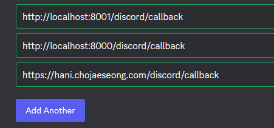

- 참고 유튜브: https://www.youtube.com/watch?v=WI9eGCCP5-c&t=524s

### oauth

1. index.html에 login 버튼 및 css를 추가한다.

```html

<body>
<h1> Discord bot Dashboard</h1>
<h3>bot은 <strong>{{count}}</strong>개의 server에서 활동하고 있습니다.</h3>

<button class="btn-login"> Login</button>
</body>
```

```css
.btn-login {
    background: #ea461e;
    border: 0;
    color: white;
    padding: 12px 48px;
    font-size: 18px;
    margin-top: 8px;
    border-radius: 8px;
    cursor: pointer;
}
```

2. **pages용으로 `authorize_url`요청 이후 `code=`를 querystring으로 받을 callback router**를 만들어야한다. 이 때, 미들웨어의 검사예외 path여야한다.
    - `EXCEPT_PATH_REGEX = "^(/docs|/redoc|/api/v[0-9]+/auth|/static)"`

#### index.py가 아니라 discord.py를 pages패키지에 추가하여 변환

1. except_path에 `/discord`를 추가하고
    ```python
    # EXCEPT_PATH_REGEX = "^(/docs|/redoc|/api/v[0-9]+/auth|/static)"
    EXCEPT_PATH_REGEX = "^(/docs|/redoc|/api/v[0-9]+/auth|/static|/discord)"
    ```

2. index.py의 index router의 내용을 `discord.py`로 옮긴다
    - index.html은 `discord_dashboard.html`로 변경한다.
    - url은 `/discord/dashboard`가 되도록 할 예정.
    ```python
    # app/pages/discord.py
    from fastapi import APIRouter
    from starlette.requests import Request
    
    from app.libs.discord.ipc_client import discord_ipc_client
    from app.pages import templates
    
    router = APIRouter()
    
    
    @router.get("/dashboard")
    async def discord_dashboard(request: Request):
        """
        `Discord Bot Dashboard`
        """
        # bot에 연결된 server.route에 요청
        guild_count = await discord_ipc_client.request("guild_count")
    
        context = {
            'request': request,  # 필수
            'count': guild_count.response,  # 커스텀 데이터
        }
        return templates.TemplateResponse(
            "discord_dashboard.html",
            context
        )
    ```

3. pages/init.py에 `from . import discord`를 import한 뒤, Pages tags로 + `prefix='/discord'`로 router를 추가한다.
    - dashboard 경로는 `http://localhost:8001/discord/dashboard`가 된다.
    ```python
    from . import index, discord
    
    router = APIRouter()
    router.include_router(index.router, tags=['Pages'])
    router.include_router(discordrouter, prefix='/discord', tags=['Pages'])
    ```

#### discord 제공 authorize_url에 포함될 callback router(GET) 미리 생성해놓기

1. `/discord/callback`의 url을 가지는 callback GET ROUTER를 작성해놓는데
    - **OAuth authorize_url을 통해 로그인되면 `code=`의 쿼리스트링이 들어오는데, 이것을 view func 인자로 받으면 자동으로 받아진다!**
    ```python
    @router.get("/callback")
    async def discord_callback(code: str):
        """
        `Discord callback for Developer OAuth Generated URL`
        """
        print(f"code >> {code}")
        pass
    ```
   

#### discord개발자 OAuth2 > URL Generator에서 `identify + guilds`로 길드정보를 볼 수 있는 권한의 authorize_url을 생성한다.

1. pages용으로 생성한 callback을 discord개발자 페이지 > OAuth2 > General 에서 redirect url에 추가한다.
   
2. OAuth2 > Generate URL > `indentify, guilds`를 선택하고 , redirect_url을 선택한 뒤, generated url을 가져온다.
   

3. dashboard router에서 **genearted ULR을 `authorize_url`로 template으로 던져준다.**
    - **이 때, redirect_url이 실행되는 환경(local/test -> 8001, docker -> 8000, HOST_MAIN -> https)마다 URL속 `redirec_url=`의 값이 달라질
      수 있다.**
    - 이미 bot에서는 3가지를 다 등록해놨으니, 환경에 따라, `redirect_url=`의 querystring만 변경해준다.
    - `local/test`환경에서 HOST_MAIN을 "localhost"로 설정해놓고, 처리한다.
    - 동적으로 `self.DOMAIN:str`을 만든다.

    ```python
    @dataclass
    class Config(metaclass=SingletonMetaClass):
        # ...
        def __post_init__(self):
            # ...
            # redirect시 필요한 프론트 DOMAIN 동적으로 만들기
            self.DOMAIN: str = f'http://{self.HOST_MAIN}:{self.PORT}' if API_ENV != 'prod' else f'https://{HOST_MAIN}'

     @dataclass
    class LocalConfig(Config):
        HOST_MAIN: str = "localhost"
    
    @dataclass
    class TestConfig(Config):
        TEST_MODE: bool = True  # test db 관련 설정 실행
    
        HOST_MAIN: str = "localhost"
    ```
    ```python
    authorize_url = "https://discord.com/api/oauth2/authorize?client_id=xxx&" \
                    "redirect_uri=http%3A%2F%2Flocalhost%3A8001%2Fdiscord%2Fcallback" \
                    "&response_type=code&scope=identify%20guilds"
    
    # 기존의 redirect_uri 파라미터 값을 가져옴
    parsed_url = urlparse(authorize_url)
    query_params = parse_qs(parsed_url.query)
    redirect_uri = query_params.get('redirect_uri', [''])[0]
    
    # config.host에 따라 http 또는 https를 선택
    if config.HOST_MAIN != "localhost":
        new_redirect_uri = f"https://{config.HOST_MAIN}/discord/callback"
    else:
        new_redirect_uri = f"http://{config.HOST_MAIN}:{config.PORT}/discord/callback"
    
    # 인코드된 redirect_uri을 다시 URL에 삽입하여 새로운 authorize_url 생성
    uery_params['redirect_uri'] = [new_redirect_uri]
    updated_query = urlencode(query_params, doseq=True)

    new_url = parsed_url._replace(query=updated_query).geturl()
    #  https://discord.com/api/oauth2/authorize?client_id=xxx&redirect_uri=http%3A%2F%2Flocalhost%3A8001%2Fdiscord%2Fcallback&response_type=code&scope=identify%20guilds
    ```
    - 새롭게 뽑은 url을 클릭하면 authorize_url로서 로그인 화면이 나온다.
        - **이 떄, `response_type=code`라는 말은, `redirect_uri=`로 code가 querystring으로 들어갈 예정이라는 것이다.**
    - auth_utils.py에 메서드 `update_redirect_uri()`로 뽑아서 추가해준다.
    ```python
    def update_redirect_uri(url: str):
        parsed_url = urlparse(url)
        query_params = parse_qs(parsed_url.query)
        redirect_uri = query_params.get('redirect_uri', [''])[0]
        # config.host에 따라 http 또는 https를 선택
        if config.HOST_MAIN != "localhost":
            new_redirect_uri = f"https://{config.HOST_MAIN}/discord/callback"
        else:
            new_redirect_uri = f"http://{config.HOST_MAIN}:{config.PORT}/discord/callback"
        # 인코드된 redirect_uri을 다시 URL에 삽입하여 새로운 authorize_url 생성
        uery_params['redirect_uri'] = [new_redirect_uri]
      
        updated_query = urlencode(query_params, doseq=True)
    
        new_url = parsed_url._replace(query=updated_query).geturl()
      
        return new_url
    ```
    ```python
    
    authorize_url = "https://discord.com/api/oauth2/authorize?client_id=1156507222906503218&" \
                    "redirect_uri=http%3A%2F%2Flocalhost%3A8001%2Fdiscord%2Fcallback" \
                    "&response_type=code&scope=identify%20guilds"
      
    @router.get("/dashboard")
    async def discord_dashboard(request: Request):
        guild_count = await discord_ipc_client.request("guild_count")
    
        context = {
            'request': request,  # 필수
            'count': guild_count.response,  # 커스텀 데이터
            'authorize_url': update_redirect_uri(authorize_url),
        }
        return templates.TemplateResponse(
            "discord_dashboard.html",
            context
        )
    ```

4. **`update_query_string(url, key=value)`형태로 변환하여 다른 qs도 변경가능하게 수정한다.**
    ```python
    def update_query_string(url: str, **kwargs):
        parsed_url = urlparse(url)
        query_params = parse_qs(parsed_url.query)
    
        # if not isinstance(config, ProdConfig):
        #     new_redirect_uri = f"http://{config.HOST_MAIN}:{config.PORT}/discord/callback"
        # else:
        #     new_redirect_uri = f"https://{config.HOST_MAIN}/discord/callback"
        # # 인코드된 redirect_uri을 다시 URL에 삽입하여 새로운 authorize_url 생성
        # query_params['redirect_uri'] = [new_redirect_uri]
    
        for key, value in kwargs.items():
            query_params[key] = [value]
        updated_query = urlencode(query_params, doseq=True)
    
        new_url = parsed_url._replace(query=updated_query).geturl()
    
        return new_url
    ```
    ```python
    @router.get("/dashboard")
    
    async def discord_dashboard(request: Request):
    
        guild_count = await discord_ipc_client.request("guild_count")
    
        context = {
            'request': request,  # 필수
            'count': guild_count.response,  # 커스텀 데이터
            'authorize_url': update_query_string(authorize_url, redirect_uri=config.DOMAIN + '/discord/callback'),
        }
        return templates.TemplateResponse(
            "discord_dashboard.html",
            context
        )
    ``` 

5. 환경변수로 빼주고, 받아와서 처리하게 한다.
    ```dotenv
    # Dashboard용 개발자페이지 > OAuth2 > "identify + guilds" Generated URL (callback 주소 환경에 따라 자동변환)
    DISCORD_AUTHORIZE_URL="https://discord.com/api/oauth2/authorize?client_id=1xxx&redirect_uri=http%3A%2F%2Flocalhost%3A8001%2Fdiscord%2Fcallback&response_type=code&scope=identify%20guilds"
    ```
    ```python
    DISCORD_AUTHORIZE_URL: str = environ.get("DISCORD_AUTHORIZE_URL", None)
    ```
    ```python
    @router.get("/dashboard")
    async def discord_dashboard(request: Request):
        guild_count = await discord_ipc_client.request("guild_count")
    
        context = {
            'request': request,  # 필수
            'count': guild_count.response,  # 커스텀 데이터
            'authorize_url': update_query_string(
                config.DISCORD_AUTHORIZATION_URL,
                redirect_uri=config.DOMAIN + '/discord/callback'
            ),
        }
        return templates.TemplateResponse(
            "discord_dashboard.html",
            context
        )
    ```

#### template에 로그인버튼에 a태그 href= {{authorize_url}}로 감싸기

1. dashboard.html의 **로그인버튼에 바깥a[href=]에 적용하여 클릭시 넘어갔다가 callback router로 redirect되게한다.**
    ```html
    
    <body>
    <h1> Discord bot Dashboard</h1>
    <h3>bot은 <strong>{{count}}</strong>개의 server에서 활동하고 있습니다.</h3>
    
    <a href="{{authorize_url}}">
        <button class="btn-login"> Login</button>
    </a>
    </body>
    ```
    - 클릭하면 discord authorize_url로 이동하며, 로그인하면 redirect_uri에 적힌 callback router로 이동한다.
    
2. **`authorize_url에 적혀있떤 response_type=code`는 redirect_uri에 적힌 callback router에서 `code: str`의 쿼리스트링으로 들어오게 된다.**
    ```python
    @router.get("/callback")
    async def discord_callback(code: str):
        """
        `Discord callback for Developer OAuth Generated URL`
        """
        print(f"code >> {code}")
        pass
    
    ```
    ```shell
    code >> Ah7sDYhuPIXkxxxx
    INFO:     172.29.0.1:45720 - "GET /discord/callback?code=Ah7sDYhuPIXkxxx HTTP/1.1" 200 OK 
    ```
    - 브라우저에서도 `http://localhost:8000/discord/callback?code=Ah7sDYhuPIXkxxx`의 `code=`로 값이 넘어오는 것을 확인할 수 있다.

### 인증서버가 rediect_url(callback router)에 code= 쿼리스트링으로 넘겨준 code 처리하기

#### redirect_url로 넘어온 qs code= 값 외에, CLIENT_ID, SECRET, grant_type, redirect_url(callback)으로 한번더 요청해야 token이 나온다.
1. httx_oauth의 clients/discord.py를 까보면,
    - `ACCESS_TOKEN_ENDPOINT="https://discord.com/api/oauth2/token"`으로 저장되어있고,
    - DiscordOAuth2의 부모인 BaseOAuth2 클래스 내부에서 `get_access_token`를 보면, 아래와 같은 코드로 `POST`요청을 해서 가져온다.
    ```python
    AUTHORIZE_ENDPOINT = "https://discord.com/api/oauth2/authorize"
    ACCESS_TOKEN_ENDPOINT = "https://discord.com/api/oauth2/token"
    REVOKE_TOKEN_ENDPOINT = "https://discord.com/api/oauth2/token/revoke"
    BASE_SCOPES = ["identify", "email"]
    PROFILE_ENDPOINT = "https://discord.com/api/users/@me"
    
    class DiscordOAuth2(BaseOAuth2[Dict[str, Any]]):
    
        def __init__(
            self,
            client_id: str,
            client_secret: str,
            scopes: Optional[List[str]] = BASE_SCOPES,
            name: str = "discord",
        ):
            super().__init__(
                client_id,
                client_secret,
                AUTHORIZE_ENDPOINT,
                ACCESS_TOKEN_ENDPOINT,
                ACCESS_TOKEN_ENDPOINT,
                REVOKE_TOKEN_ENDPOINT,
                name=name,
                base_scopes=scopes,
            )
            #...
    ```
    ```python
    class BaseOAuth2(Generic[T]):
        #...
        async def get_access_token(
            self, code: str, redirect_uri: str, code_verifier: Optional[str] = None
        ):
            async with self.get_httpx_client() as client:
                data = {
                    "grant_type": "authorization_code",
                    "code": code,
                    "redirect_uri": redirect_uri,
                    "client_id": self.client_id,
                    "client_secret": self.client_secret,
                }
    
                if code_verifier:
                    data.update({"code_verifier": code_verifier})
    
                response = await client.post(
                    self.access_token_endpoint,
                    data=data,
                    headers=self.request_headers,
                )
    
                data = cast(Dict[str, Any], response.json())
    
                if response.status_code >= 400:
                    raise GetAccessTokenError(data)
    
                return OAuth2Token(data)
    ```
    - OAuth2Token은 resopnse.json()을 dict 로 cast한 것을 처리하는 `dict 객체 wrapper`로 아래와 같이, 만료기한을 설정하고 메서드 `is_expired`를 호출하게 해준다.
    ```python
    class OAuth2Token(Dict[str, Any]):
        def __init__(self, token_dict: Dict[str, Any]):
            if "expires_at" in token_dict:
                token_dict["expires_at"] = int(token_dict["expires_at"])
            elif "expires_in" in token_dict:
                token_dict["expires_at"] = int(time.time()) + int(token_dict["expires_in"])
            super().__init__(token_dict)
    
        def is_expired(self):
            if "expires_at" not in self:
                return False
            return time.time() > self["expires_at"]
    ```
   
2. 그렇다면, 우리는 httx_oauth의 discord clinet를 이용해서 처리하면 될 듯하다.
    - 하지만, redirect_uri는 어디서 구할까?
    - 직접 넣어주지 않는다면, `callback_route_name`으로 처리한다.
    ```python
    def get_oauth_router(
            
        router = APIRouter()
        callback_route_name = f"oauth:{oauth_client.name}.{backend.name}.callback"
    
        if redirect_url is not None:
            oauth2_authorize_callback = OAuth2AuthorizeCallback(
                oauth_client,
                redirect_url=redirect_url,
            )
        else:
            oauth2_authorize_callback = OAuth2AuthorizeCallback(
                oauth_client,
                route_name=callback_route_name,
            )
    
    ```
        - **str(request.url_for())에 현재 해당하는 route_name을 입력하면, url경로가 나오게 된다.**
    ```python
    class OAuth2AuthorizeCallback:
        async def __call__(
            #...
            if self.route_name:
                redirect_url = str(request.url_for(self.route_name))
    ```

3. 우리는 `request.url_for('라우트명')`으로 **정의된 route의 URL을 알 수 있다.**
   - **그리고 route를 정의할 때 `name=`으로 라우트명을 직접 줄 수 있으며**  
   - client.get_acess_token()에 들어갈 `code=`외에 `redirect_uri`에 `request.url_for('discord_callback')`을 작성해준다.
   - **응답된 OAuth2Token의 dict wrapper객체는 `is_expired를` 사용할 수 있다.**
    ```python
    @router.get("/callback", name='discord_callback')
    async def discord_callback(request: Request, code: str):
        print(f"request.url_for('discord_callback') >> {request.url_for('discord_callback')}")
    
        # http://localhost:8001/discord/callback
    
        # 1. 받은 code 및 redirect_url로 OAuth2Token (dict wrapping 객체)을 응답받는다.
        discord_client = get_discord_client()
        oauth2_token = await discord_client.get_access_token(
            code=code,
            redirect_uri=request.url_for('discord_callback')
        )
        print(oauth2_token.is_expired())
        print(oauth2_token)
        # {
        # 'token_type': 'Bearer', 
        # 'access_token': 'zv9SHN0TGA5lwxxx', 
        # 'expires_in': 604800, 
        # 'refresh_token': 'p8XpO6fCAykjxxxx', 
        # 'scope': 'identify guilds email', '
        # expires_at': 1696919521
        # }
        pass
    ```
4. 이제 authorize_url을 만들 때, config.HOST_MAIN + @로 만들어준 callback router (redirect_url)을 `request.url_for()`로 수정해준다.
    ```python
    @router.get("/dashboard")
    
    async def discord_dashboard(request: Request):
    
        guild_count = await discord_ipc_client.request("guild_count")
    
        context = {
            'request': request,  # 필수
            'count': guild_count.response,  # 커스텀 데이터
            'authorize_url': update_query_string(
                DISCORD_AUTHORIZE_URL,
                # redirect_uri=config.DOMAIN + '/discord/callback'
                redirect_uri=request.url_for('discord_callback')
            ),
        }
        return templates.TemplateResponse(
            "discord_dashboard.html",
            context
        )
    ```
   
5. 이제 `oauth2_token.is_expired()`를 사용해서, 토큰만료되었으면 에러를 내준다.
    ```python
    @router.get("/callback", name='discord_callback')
    async def discord_callback(request: Request, code: str):
        discord_client = get_discord_client()
        oauth2_token: OAuth2Token = await discord_client.get_access_token(
            code=code,
            redirect_uri=request.url_for('discord_callback')
        )    
        # print(oauth2_token.is_expired())
        if oauth2_token.is_expired():
            raise TokenExpiredException()
    
        pass
    
    ```
   
6. **만료 확인된 정보는 아직 사용하지 않았찌만, 데이터를 뿌려줄 api route로 Redirect해보자.**
    - **이 때, `RedirectResponse(url="")`로 작성한다면, `prefix까지 직접 입력`해야하므로, 이번에도 request.url_for('라우트명')을 이용하되**
    - **name=을 주지 않고 default view_function명으로 넣어보니 작동한다.**
    ```python
    @router.get("/callback", name='discord_callback')
    
    async def discord_callback(request: Request, code: str):
    
        # 1. 받은 code 및 redirect_url로 OAuth2Token (dict wrapping 객체)을 응답받는다.
        discord_client = get_discord_client()
        oauth2_token: OAuth2Token = await discord_client.get_access_token(
            code=code,
            redirect_uri=request.url_for('discord_callback')
        )
        # 2. 응답받은 oauth2_token객체로 만료를 확인하고
    
        if oauth2_token.is_expired():
            raise TokenExpiredException()
    
        # 3. 데이터를 뿌려주는 api router로 Redirect시킨다.
        # return RedirectResponse(url='/guilds')
        return RedirectResponse(url=request.url_for('guilds'))
    
    
    @router.get("/guilds")
    async def guilds():
        return dict(success="길드 정보 조회")
    
    ```
    

### Custom Client 새로 작성
#### (기존)discord_clinet.get_access_token() 이후 -> token을 넣어 get_user/get_guilds 요청 지속 예정으로 클래스로 만들기
1. 이전에는 Cusotm backend객체를 생성할 때, clinet의 요청방법을 참고해서, 추가정보를 받았었다.
    ```python
    class OAuthBackend(AuthenticationBackend):
        #...
        # 추가정보 요청용 client
        @staticmethod
        def get_httpx_client() -> AsyncContextManager[httpx.AsyncClient]:
            return httpx.AsyncClient()
    ```
    ```python
    class DiscordBackend(OAuthBackend):
    
        async def get_profile_info(self, access_token):
            async with self.get_httpx_client() as client:
                response = await client.get(
    
                    discord.PROFILE_ENDPOINT,
    
                    headers={**self.request_headers, "Authorization": f"Bearer {access_token}"},
                )
            return profile_dict
    
    ```
   
2. 이제는 get_httpx_client를 정의해놓고, 한번해놓고, 지속적으로 요청을 보내기 위해 custom Client를 생성한다.
    - app/libs/discord/`oauth_client.py` 파일 생성
    ```python
    from typing import AsyncContextManager
    
    import httpx
    
    
    class DiscordClient:
    
        @staticmethod
        def get_httpx_client() -> AsyncContextManager[httpx.AsyncClient]:
            return httpx.AsyncClient()
    ```
   
3. callback router에서 들어간 정보들 받고, 기존객체.get_access_token()메서드를 현재 class의 메서드로 옮기기
    - `venv/Lib/site-packages/httpx_oauth/clients/discord.py`를 모방하여 DiscordClient class를 정의하고, 객체를 생성하여, callback route에서 사용해본다.
    ```python
    from typing import AsyncContextManager, Optional, List, Dict, cast, Any
    
    import httpx
    from httpx_oauth.oauth2 import GetAccessTokenError, OAuth2Token
    
    from app.common.config import DISCORD_CLIENT_ID, DISCORD_CLIENT_SECRET
    
    AUTHORIZE_ENDPOINT = "https://discord.com/api/oauth2/authorize"
    ACCESS_TOKEN_ENDPOINT = "https://discord.com/api/oauth2/token"
    REVOKE_TOKEN_ENDPOINT = "https://discord.com/api/oauth2/token/revoke"
    # BASE_SCOPES = ["identify", "email"]
    BASE_SCOPES = ["identify", "guilds"]
    PROFILE_ENDPOINT = "https://discord.com/api/users/@me"
    
    
    class DiscordClient:
        client_id: str
        client_secret: str
        scopes: Optional[List[str]]
        request_headers: Dict[str, str]
    
        access_token_endpoint: str
        refresh_token_endpoint: str
        revoke_token_endpoint: str
    
        def __init__(self, client_id: str, client_secret: str, scopes: Optional[List[str]] = BASE_SCOPES):
            self.client_id = client_id
            self.client_secret = client_secret
            self.scopes = scopes
            self.request_headers = {
                "Accept": "application/json",
            }
    
            self.access_token_endpoint = ACCESS_TOKEN_ENDPOINT
            self.refresh_token_endpoint = ACCESS_TOKEN_ENDPOINT
            self.revoke_token_endpoint = REVOKE_TOKEN_ENDPOINT
    
        async def get_access_token(self, code: str, redirect_uri: str):
            async with self.get_httpx_client() as client:
                data = {
                    "grant_type": "authorization_code",
                    "code": code,
                    "redirect_uri": redirect_uri,
                    "client_id": self.client_id,
                    "client_secret": self.client_secret,
                }
    
                response = await client.post(
                    ACCESS_TOKEN_ENDPOINT,
                    data=data,
                    headers=self.request_headers,
                )
    
                data = cast(Dict[str, Any], response.json())
    
                if response.status_code >= 400:
                    raise GetAccessTokenError(data)
    
                return OAuth2Token(data)
    
        @staticmethod
        def get_httpx_client() -> AsyncContextManager[httpx.AsyncClient]:
            return httpx.AsyncClient()
    
    
    discord_client = DiscordClient(client_id=DISCORD_CLIENT_ID, client_secret=DISCORD_CLIENT_SECRET)
    
    ```
    ```python
    @router.get("/callback", name='discord_callback')
    
    async def discord_callback(request: Request, code: str):
    
        # 1. 받은 code 및 redirect_url로 OAuth2Token (dict wrapping 객체)을 응답받는다.
    
        # discord_client = get_discord_client()
        # oauth2_token: OAuth2Token = await discord_client.get_access_token(
        #     code=code,
        #     redirect_uri=request.url_for('discord_callback')
        # )
    
        oauth2_token: OAuth2Token = await discord_client.get_access_token(
            code=code,
            redirect_uri=request.url_for('discord_callback')
        )
        if oauth2_token.is_expired():
            raise TokenExpiredException()
    
        print(oauth2_token)
       # {'token_type': 'Bearer', 'access_token': 'xxx', 'expires_in': 604800, 'refresh_token': 'xxx', 'scope': 'guilds identify email', 'expires_at': 1696940225}

        return RedirectResponse(url=request.url_for('guilds'))
    
    ```
   
#### CustomClinet에서, 받은token을 input으로 받아 ->  GUILD POINT 에 GUILD 정보 받아오는 메서드 정의

1. get_guilds 메서드를 정의하는데 **필요한 것은 `token`이며, 인자로 받아서 요청한다.**
    - 길드정보 ENDPOINT는 PROFILE_ENDPOINT + @다
    ```python
    PROFILE_ENDPOINT = "https://discord.com/api/users/@me"
    GUILD_ENDPOINT = PROFILE_ENDPOINT + '/guilds'
    
    class DiscordClient:
        #...
        async def get_guilds(self, token: str):
            async with self.get_httpx_client() as client:
                response = await client.get(
                    GUILD_ENDPOINT,
                    headers={**self.request_headers, 'Authorization': f"Bearer {token}"},
                )
    
                data = cast(Dict[str, Any], response.json())
    
                return data
    ```

2. callback route에서 code를 받아 -> token을 발급해서 -> /guilds로 redirect되는 중인데 **token을 넘겨줄 방법은 현재 없다.**
    - 그래서 **임시로 받은 token값을 직접 넣어 호출해본다.**
    ```python
    @router.get("/guilds")
    async def guilds():
        guilds = await discord_client.get_guilds('token')
        return dict(guilds=guilds)
    
        # {
        #     "data":{
        #         "guilds":[
        #             {
        #                 "id":"ㅌㅌㅌ",
        #                 "name":"한의원 인증앱",
        #                 "icon":null,
        #                 "owner":true,
        #                 "permissions":ㅌㅌㅌ,
        #                 "permissions_new":"ㅌㅌㅌ",
        #                 "features":[
        #
        #                 ]
        #             }
        #         ]
        #     },
        #     "version":"1.0.0"
        # }
    ```

### 도커 명령어

1. (`패키지 설치`시) `pip freeze` 후 `api 재실행`

```shell
pip freeze > .\requirements.txt

docker-compose build --no-cache api; docker-compose up -d api;
```

2. (init.sql 재작성시) `data폴더 삭제` 후, `mysql 재실행`

```shell
docker-compose build --no-cache mysql; docker-compose up -d mysql;
```

```powershell
docker --version
docker-compose --version

docker ps
docker ps -a 

docker kill [전체이름]
docker-compose build --no-cache
docker-compose up -d 
docker-compose up -d [서비스이름]
docker-compose kill [서비스이름]

docker-compose build --no-cache [서비스명]; docker-compose up -d [서비스명];

```

3. docker 추가 명령어

```powershell
docker stop $(docker ps -aq)
docker rm $(docker ps -aqf status=exited)
docker network prune 

docker-compose -f docker-compose.yml up -d
```

### pip 명령어

```powershell
# 파이참 yoyo-migration 설치

pip freeze | grep yoyo

# 추출패키지 복사 -> requirements.txt에 붙혀넣기

```

### git 명령어

```powershell
git config user.name "" 
git config user.email "" 

```

### yoyo 명령어

```powershell
yoyo new migrations/

# step 에 raw sql 작성

yoyo apply --database [db_url] ./migrations 
```

- 참고
    - 이동: git clone 프로젝트 커밋id 복사 -> `git reset --hard [커밋id]`
    - 복구: `git reflog` -> 돌리고 싶은 HEAD@{ n } 복사 -> `git reset --hard [HEAD복사부분]`