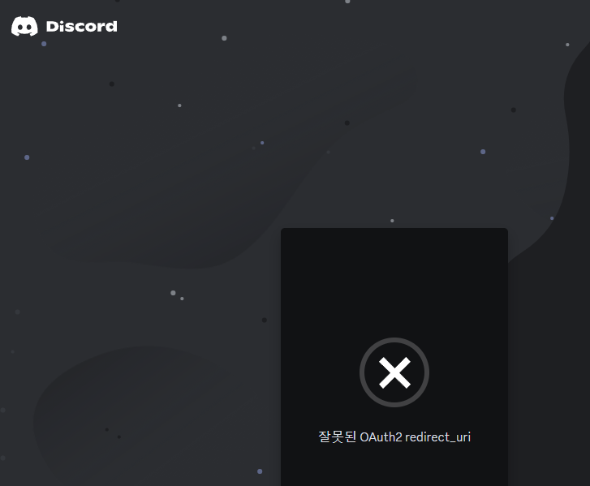
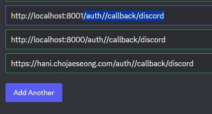
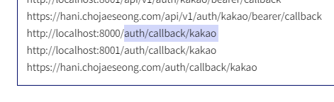
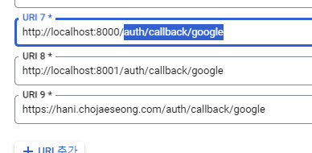

- 참고 유튜브: https://www.youtube.com/watch?v=WI9eGCCP5-c&t=524s

### front 처리

- 현재 authorize_url을 매번 뿌려줘야하는 문제점이 생긴다. -> **front에서 현재url을 jinja filter를 이용해 state=로 넣어줘서, authorize_url을 자체적으로 만들어,
  요청하도록 하자.**
    - **그럴려면, fastapi-users가 제공해주는 /authorize 라우터에서 `고정된 authorize_url`을 받아와 붙혀서 redirect시켜야한다.**
    - **하지만, 제공해주는 `fastapi-users의 /authorize` route들은 `state=` qs를 받지 않고, 내부에서 생성한다.**
    - **고정 route 내부에서 `oauth_client.get_authorize_url()에서는 state=를 받아주니`, 이부분만 챙겨서 자체 `cookie용 oauth /authorize` route를
      재정의한다.**
    ```python
    class BaseOAuth2(Generic[T]):
        # ...
        async def get_authorization_url(
            self,
            redirect_uri: str,
            state: Optional[str] = None,
            scope: Optional[List[str]] = None,
            extras_params: Optional[T] = None,
        ) -> str:
    ```

#### front에서는 백엔드가 매번 내려주는 {{authorize_url}}이 아니라, fetch로 해당 sns_type으로 쿠키용 /authorize에 authorize_url을 요청한다.

1. get/post요청을 보내는 js 함수 2개를 정의한다.
    - **비동기 요청인 fetch는 호출 후 `.then()`으로 이어나가야한다.**
    - **전체 url이 아닌 경우는 `/`로 시작하는 `uri`를 넣어 요청해주면 된다.**
    ```js
    function fetchPost(url, data = null) {
        return fetch(url, {
            method: "POST",
            headers: {
                "Content-Type": "application/json",
                "Accept": "application/json"
            },
            body: data ? JSON.stringify(data) : null,
        })
            .then(response => {
                if (response.ok) {
                    return response.json();
                } else {
                    console.log(response.status);
                    return false;
                }
            }).catch((error) => {
                console.error("Error:", error);
            });
    }
    
    function fetchGet(url, data = {}) {
        let query = '';
        if (Object.keys(data).length > 0) {
            query = '?' + Object.keys(data)
                .map(k => encodeURIComponent(k) + '=' + encodeURIComponent(data[k]))
                .join('&');
        }
    
        return fetch(url + query, {
            method: "GET",
            headers: {
                "Content-Type": "application/json",
                "Accept": "application/json"
            }
        }).then(response => {
            if (response.ok) {
                return response.json();
            } else {
                console.log(response.status);
                return false;
            }
        }).catch((error) => {
            console.error("Error:", error);
        });
    }
    ```
2. **이제 특정 oauth 로그인 버튼마다 `onClickXXXX`메서드를 정의하고, oauth_name만 입력하면 요청할 수 있도록 `onClickOAuthLogin`메서드를 정의한다.**
    - **이 때, `내부 redirect`로 fastapi-users의 /authorize로 보내주는 `login route`명은 `/auth/cookie/authorize/{sns_type}`으로 잡을 예정이다.**
    ```html
    <button class="btn-login" onclick="onClickOAuthLogin('discord')">Login</button>
    ```
    - oauth_name을 붙여서 템플릿 쿠키용 /authorize ->  fastapi-users로 redirect -> `authorization_url`를 받는다.
    - **제공받은 authorize_url에 `현재 url을 jinja 필터로 encoding한 state=값`을 반환받는다.**
    ```js
    const onClickOAuthLogin = (oauth_name) => {
        if (!oauth_name) {
            console.error('oauth_name is required.');
            return;
        }
        fetchGet('/auth/cookie/authorize/' + oauth_name)
            .then((response) => {
                // console.log("response", response)
                if (response && response.data && response.data.authorization_url) {
                    // 1. template 라우트 -> oauth_name별로 fastapi-users route redirect -> authorization_url 반환
                    let authorization_url = response.data.authorization_url;
                    // 2. jinaj 필터를 이용해 state값을 붙이기
                    authorization_url = authorization_url + '&state={{ request.url._url | encode_next_state }}';
                    // console.log(authorization_url)

                    window.location.href = authorization_url;
                } else {
                    console.log("Error: Failed to get authorization URL");
                }
            });
    };
    ```
   
3. **이 때, 쿠키용 route -> fastapi-users의 고정된 autrhoize_url -> `현재주소를 jinja + filter로 jwt_ecnoding`한 값을 state=에 넣어서, oauth 인증서버로 이동**시킬 예정이다.
    - **jinja 환경에서 `{{request.url._url}}`로 string url을 뽑을 수 있다.**
    - **내부에서 `next=`로 들어온url을 value를 넣는 dict를 -> jwt_encoding해주는 fastapi-users의 `generate_state_token`을 활용해서 encode해준다.**
    ```python
    # app/templates/filters/oauth.py
    from fastapi_users.router.oauth import generate_state_token
    
    from app.common.config import JWT_SECRET
    
    
    def encode_next_state(url: str) -> str:
        # {{request.url}}로 만 사용하면 string아님. request.url._url일 경우만 string
        if not isinstance(url, str):
            url = str(url) 
        state_data = dict(next=url)
        return generate_state_token(state_data, JWT_SECRET)
    ```
    - **필터등록은 templates객체에 `.env.filters[]`에 넣어주면 된다.**
    ```python
    # app/pages/__init__.py
    templates = Jinja2Templates(directory=str(templates_directory))
    templates.env.filters["encode_next_state"] = encode_next_state
    ```
### access_control에서 template을 고려해서 수정
1. **세부 service api -> api 요청만 검사하고 user request.state.user를 넣고, 그외에는 그냥 템플릿 요청으로서 접속허용하고, view function level에서 검증**
    - **이 때, `api접속 중에 /auth가 안달린`것만 검사하도록 조건을 건다.**
    ```python
    class AccessControl(BaseHTTPMiddleware):
    
        async def dispatch(self, request: Request, call_next: RequestResponseEndpoint) -> Response:
            await self.init_state(request)
    
            headers = request.headers
            cookies = request.cookies
            query_params = request.query_params
            url = request.url.path
    
            try:
                if await url_pattern_check(url, SERVICE_PATH_REGEX):
    
                    if config.DEBUG:
                        request.state.user = await self.extract_user_token_by_non_service(headers, cookies)
                        response = await call_next(request)
                        await app_logger.log(request=request, response=response)
                        return response
                    # print("service")
                    request.state.user = await self.extract_user_token_by_service(headers, query_params)
    
                elif not await url_pattern_check(url, '/api/v[0-9]+/auth') and await url_pattern_check(url, API_PATH_REGEX):
                    request.state.user = await self.extract_user_token_by_non_service(headers, cookies)
                response = await call_next(request)
    
                if url != "/":
                    await app_logger.log(request=request, response=response)
            #...
    ```
   
### 템플릿용 oauth_authorize 라우터 만들기
1. fastapi-users의 /authorize route를 참고하는데, **`하지만, fastapi-users의 callback으로 보내면, state= 속 next=를 읽어서 redirect`하는 기능이 없기 때문에**
    - **`state에서 next=를 꺼내주는 기능`이 있는 Cusotm callback route를  redirect_uri로 입력해주는 authorization_url을 반환해주는 route를 정의한다.**
    - 이 때, 여러 oauth가 가능하도록 discord.py가 아닌 index.py에 정의해준다.
    - **sns_type을 path로 받고, authorization_url에 넣을 redirect_url을 `자체 callback route의 이름을 template_oauth_callback`로 두되**
        - **callback route도 sns_type을 path로 받을 것이기 때문에 url_for( , path=)에 건네받은 sns_type을 넣어준다.**
    ```python
    @router.get(
        "/auth/cookie/authorize/{sns_type}",
        name=f"template_oauth_authorize",
        response_model=OAuth2AuthorizeResponse,
    )
    async def template_oauth_authorize(
            request: Request,
            sns_type: SnsType,
            scopes: List[str] = Query(None),
            state: Optional[str] = None,
    
    ) -> OAuth2AuthorizeResponse:
    
        authorize_redirect_url = str(request.url_for('template_oauth_callback', sns_type=sns_type.value))
    
        oauth_client = get_discord_client()
        authorization_url = await oauth_client.get_authorization_url(
            authorize_redirect_url,
            state,
            scopes,
        )
    
        return OAuth2AuthorizeResponse(authorization_url=authorization_url)
    ```
2. **이때 get_discord_client()를 사용중인데, 다른 oauth를 위해서 `get_template_oauth_client('discord' or sns_type.value')`가 될 수 있도록 메서드를 정의한다.**
    - 기존에 있던 백엔드 등록용 get_oauth_clients() 말고, 개별 추출메서드 `get_oauth_client()`를 정의한다.
    ```python
    # app/libs/auth/oauth_clients/__init__.py
    def get_oauth_clients():
        clients = []
    
        if GOOGLE_CLIENT_ID and GOOGLE_CLIENT_SECRET:
            clients.append(get_google_client())
    
        if KAKAO_CLIENT_ID and KAKAO_CLIENT_SECRET:
            clients.append(get_kakao_client())
    
        if DISCORD_CLIENT_ID and DISCORD_CLIENT_SECRET:
            clients.append(get_discord_client())
    
        return clients
    
    
    def get_oauth_client(sns_type: SnsType):
        if not sns_type:
            raise Exception(f'get_oauth_clients() 호출시 sns_type을 입력해주세요: {sns_type}')
    
        if sns_type not in SnsType:
            raise NoSupportException()
    
        if sns_type == SnsType.GOOGLE:
            if not (GOOGLE_CLIENT_ID and GOOGLE_CLIENT_SECRET):
                raise Exception('환경 변수에 구글 ID, SECRET 설정이 안되었습니다.')
            return get_google_client()
    
        if sns_type == SnsType.DISCORD:
            if not (DISCORD_CLIENT_ID and DISCORD_CLIENT_SECRET):
                raise Exception('환경 변수에 DISCORD ID, SECRET 설정이 안되었습니다.')
            return get_discord_client()
    
        if sns_type == SnsType.KAKAO:
            if not (KAKAO_CLIENT_ID and KAKAO_CLIENT_SECRET):
                raise Exception('환경 변수에 KAKAO ID, SECRET 설정이 안되었습니다.')
            return get_kakao_client()
    
    ```
   
3. 사용해 준다.
    ```python
    @router.get(
        "/auth/cookie/authorize/{sns_type}",
        name=f"template_oauth_authorize",
        response_model=OAuth2AuthorizeResponse,
    )
    async def template_oauth_authorize(
            request: Request,
            sns_type: SnsType,
            scopes: List[str] = Query(None),
            state: Optional[str] = None,
    
    ) -> OAuth2AuthorizeResponse:
    
        oauth_client = get_oauth_client(sns_type)
    
        authorization_url = await oauth_client.get_authorization_url(
            redirect_uri=str(request.url_for('template_oauth_callback', sns_type=sns_type.value)),
            state=state,
            scope=scopes,
        )
    
        return OAuth2AuthorizeResponse(authorization_url=authorization_url)
    ```
   
#### front에서는 sns_type에 따른 authorization_url에, state를 jinja filter를 통해 붙혀서 인증서버로 redirect(window.location.href)한다.
- 위에서 oauth_name -> sns_type으로 변경
    ```js
    fetchGet('/auth/cookie/authorize/' + sns_type)
        .then((response) => {
            // console.log("response", response)
            if (response && response.data && response.data.authorization_url) {
                // 1. template 라우트 -> sns_type별 authorization_url 반환
                let authorization_url = response.data.authorization_url;
    
                // 2. jinaj 필터를 이용해 state값을 붙이기
                authorization_url = authorization_url + '&state={{ request.url._url | encode_next_state }}';
                // console.log(authorization_url)
                window.location.href = authorization_url;
            } else {
                console.log("Error: Failed to get authorization URL");
            }
        });
    ```
  
#### route 경로에서 cookie를 빼준다.
```python
@router.get(
    "/auth/authorize/{sns_type}",
    name=f"template_oauth_authorize",
    response_model=OAuth2AuthorizeResponse,
)
async def template_oauth_authorize(
        request: Request,
        sns_type: SnsType,
        scopes: List[str] = Query(None),
        state: Optional[str] = None,
) -> OAuth2AuthorizeResponse:

    oauth_client = get_oauth_client(sns_type)
```
```js
const onClickOAuthLogin = (sns_type) => {
    if (!sns_type) {
        console.error('oauth_name is required.');
        return;
    }
    fetchGet('/auth/authorize/' + sns_type)
        .then((response) => {
            // console.log("response", response)
            if (response && response.data && response.data.authorization_url) {
                // 1. template 라우트 -> sns_type별 authorization_url 반환
                let authorization_url = response.data.authorization_url;

                // 2. jinaj 필터를 이용해 state값을 붙이기
                authorization_url = authorization_url + '&state={{ request.url._url | encode_next_state }}';
                // console.log(authorization_url)
                window.location.href = authorization_url;
            } else {
                console.log("Error: Failed to get authorization URL");
            }
        });
};
```

### code=외 state=도 처리해주는 자체 callback route 주소(redirect_uri)를 sns 개발자 페이지에 추가
1. /auth/authorize/{sns_type} 내부에서는 redirect_uri를 `request.url_for('callback 라우트명', sns_type=)`으로 줬지만,
    ```python
        oauth_client = get_oauth_client(sns_type)
    
        authorization_url = await oauth_client.get_authorization_url(
            redirect_uri=str(request.url_for('template_oauth_callback', sns_type=sns_type.value)),
            state=state,
            scope=scopes,
        )
    ```
    - **callback route명을 sns 개발페이지에 redirect_url로 직접 등록해줘야한다. 등록하지 않으면 잘못된 redirect_url로 로그인페이지에서 에러 난다.**
        
2. 각 개발자문서마다 `http://localhost:8001/auth/callback/{해당sns_type}` 을 로그인서버에서 callback route로 redirect되도록 등록해준다..
    - discord 
         
    - kakao
         
    - google cloud
          

### code=외 state=도 -> next_url로 처리해주는 자체 callback route 정의
1. 기존에 정의한 자체 discord route를 index.py에 복사해와서 처리하는데
    - **sns_type을 path로 주고, `name=template_oauth_callback`을 추가해준다.**
    - **route인자로 sns:SnsType도 필요하는데, callback 디펜던시에서 사용할 예정이다.**
    ```python
    @router.get("/auth/callback/{sns_type}", name='template_oauth_callback')
    async def template_oauth_callback(
            request: Request,
            # code: str,
            # state: Optional[str] = None,
            # sns_type: SnsType,
            # 인증서버가 돌아올떄 주는 code와 state + sns_type까지 내부에서 받아 처리
            access_token_and_next_url: DiscordAuthorizeCallback = Depends(
                get_discord_callback(route_name='template_oauth_callback')
            ),
            user_manager: BaseUserManager[models.UP, models.ID] = Depends(get_user_manager),
    ):
        oauth2_token, next_url = access_token_and_next_url
        #...
    ```
   ```python
    class DiscordAuthorizeCallback:
        client: DiscordClient  # BaseOAuth2
        route_name: Optional[str]
        redirect_url: Optional[str]
    
        def __init__(
                self,
                client: DiscordClient,
                route_name: Optional[str] = None,
                redirect_url: Optional[str] = None,
        ):
            assert (route_name is not None and redirect_url is None) or (
                    route_name is None and redirect_url is not None
            ), "You should either set route_name or redirect_url"
            self.client = client
            self.route_name = route_name
            self.redirect_url = redirect_url
    
        # dependency에 들어갈 객체용
        async def __call__(
                self,
                request: Request,
                sns_type: SnsType,
                code: Optional[str] = None,
                state: Optional[str] = None,
                error: Optional[str] = None,
        ) -> Tuple[OAuth2Token, Optional[str]]:

            #...
    
    def get_discord_callback(redirect_url: Optional[str] = None, route_name: Optional[str] = None):
        return DiscordAuthorizeCallback(
            discord_client,  # client_id, secret + authorization_url 기본 포함. -> access_token을 받아냄.
            redirect_url=redirect_url,  # 2개 중 1개로 client가 access_token요청시 필요한 redirect_uri을 만듦
            route_name=route_name,
        )
    ```
2. get_`discord`_callback() 디펜던시를 get_`oauth`_callback() 디펜던시로 작동하게 일반화시켜야한다.

#### DiscordAuthorizeCallback -> OAuthAuthorizeCallback으로 일반화시키기
- 이미 discord.py에서 쓰고 있으니, 일반화 성공 전에, 새롭게 만든다.
1. get메서드 get_discord_callback 부터 -> `get_oauth_callback` +  `client의 일반화`와 함께 생성
    ```python
    def get_discord_callback(redirect_url: Optional[str] = None, route_name: Optional[str] = None):
        return DiscordAuthorizeCallback(
            discord_client,  # client_id, secret + authorization_url 기본 포함. -> access_token을 받아냄.
            redirect_url=redirect_url,  # 2개 중 1개로 client가 access_token요청시 필요한 redirect_uri을 만듦
            route_name=route_name,
        )
    
    
    def get_oauth_callback(sns_type: SnsType, redirect_url: Optional[str] = None, route_name: Optional[str] = None):
        return OAuthAuthorizeCallback(
            client=get_oauth_client(sns_type),  # client_id, secret + authorization_url 기본 포함. -> access_token을 받아냄.
            redirect_url=redirect_url,  # 2개 중 1개로 client가 access_token요청시 필요한 redirect_uri을 만듦
            route_name=route_name,
        )
    ```
2. **하지만, `디펜던시가 아닌 get_oauth_callback` 메서드는 paht상의 sns_type을 받아올 수 가 없다**
    ```python
    @router.get("/auth/callback/{sns_type}", name='template_oauth_callback')
    async def template_oauth_callback(
            request: Request,
            # code: str,
            # state: Optional[str] = None,
            sns_type: SnsType,
            access_token_and_next_url: OAuthAuthorizeCallback = Depends(
                get_oauth_callback(route_name='template_oauth_callback')
            ),
            user_manager: BaseUserManager[models.UP, models.ID] = Depends(get_user_manager),
    ):
    ```
   
3. **디펜던시 부분인 `__call__`부분에서 `path인 sns_type:SnsType`을 받아줘서, 그 때 `sns_type에 맞는 oauth_client`를 받아줘야하므로, `callback 객체생성시 sns_type에 맞는 client를 받아올 수 없다.`**
    ```python
    @router.get("/auth/callback/{sns_type}", name='template_oauth_callback')
    async def template_oauth_callback(
            request: Request,
            # code: str,
            # state: Optional[str] = None,
            sns_type: SnsType,
            access_token_and_next_url: OAuthAuthorizeCallback = Depends(
                get_oauth_callback(route_name='template_oauth_callback')
            ),
            user_manager: BaseUserManager[models.UP, models.ID] = Depends(get_user_manager),
    ):
    ```
    ```python
    def get_oauth_callback(redirect_url: Optional[str] = None, route_name: Optional[str] = None):
        return OAuthAuthorizeCallback(
            # client=get_oauth_client(sns_type),  # client_id, secret + authorization_url 기본 포함. -> access_token을 받아냄.
            # => sns_type을 현재 모르므로, 디펜던시 (call)부분에서 path를 받도록 수정
            redirect_url=redirect_url,  # 2개 중 1개로 client가 access_token요청시 필요한 redirect_uri을 만듦
            route_name=route_name,
        )
    ```
4. callback class 생성자에서 client받는 것을 없애고, 내부 call에서 sns_type:SnsType을 path로서 받는다.
    ```python
    class OAuthAuthorizeCallback:
        # client: BaseOAuth2
        route_name: Optional[str]
        redirect_url: Optional[str]
    
        def __init__(
                self,
                # client: BaseOAuth2,
                route_name: Optional[str] = None,
                redirect_url: Optional[str] = None,
        ):
            assert (route_name is not None and redirect_url is None) or (
                    route_name is None and redirect_url is not None
            ), "You should either set route_name or redirect_url"
            # self.client = client
            self.route_name = route_name
            self.redirect_url = redirect_url
    
        # dependency에 들어갈 객체용
        async def __call__(
                self,
                request: Request,
                sns_type: SnsType, # 추가
                code: Optional[str] = None,
                state: Optional[str] = None,
                error: Optional[str] = None,
        ) -> Tuple[OAuth2Token, Optional[str]]:
            #...
    ```
   
5. 내부에서 sns_type맞는 oauth_client를 `get_oauth_client()`메서드를 이용해 가져와서, token을 얻고, 
    - **sns_type이 optional로서 들어온다면, `redirect_uri를 구성할 callback route_name` + request.url_for()에다가 `sns_type=`의 path를 넣어서 구성하게 한다.**
    ```python
    class OAuthAuthorizeCallback:
    
        async def __call__(
    
                self,
                request: Request,
                sns_type: SnsType, # 추가
                code: Optional[str] = None,
                state: Optional[str] = None,
                error: Optional[str] = None,
        ) -> Tuple[OAuth2Token, Optional[str]]:
    
            if self.route_name:
                if sns_type:
                    redirect_url = str(request.url_for(self.route_name, sns_type=sns_type.value))
                else:
                    redirect_url = str(request.url_for(self.route_name))
    
            elif self.redirect_url:
                redirect_url = self.redirect_url
    
            oauth_client = get_oauth_client(sns_type)
            access_token: OAuth2Token = await oauth_client.get_access_token(
                code=code, redirect_uri=redirect_url
            )
    ```

### 도커 명령어

1. (`패키지 설치`시) `pip freeze` 후 `api 재실행`

```shell
pip freeze > .\requirements.txt

docker-compose build --no-cache api; docker-compose up -d api;
```

2. (init.sql 재작성시) `data폴더 삭제` 후, `mysql 재실행`

```shell
docker-compose build --no-cache mysql; docker-compose up -d mysql;
```

```powershell
docker --version
docker-compose --version

docker ps
docker ps -a 

docker kill [전체이름]
docker-compose build --no-cache
docker-compose up -d 
docker-compose up -d [서비스이름]
docker-compose kill [서비스이름]

docker-compose build --no-cache [서비스명]; docker-compose up -d [서비스명];

```

3. docker 추가 명령어

```powershell
docker stop $(docker ps -aq)
docker rm $(docker ps -aqf status=exited)
docker network prune 

docker-compose -f docker-compose.yml up -d
```

### pip 명령어

```powershell
# 파이참 yoyo-migration 설치

pip freeze | grep yoyo

# 추출패키지 복사 -> requirements.txt에 붙혀넣기

```

### git 명령어

```powershell
git config user.name "" 
git config user.email "" 

```

### yoyo 명령어

```powershell
yoyo new migrations/

# step 에 raw sql 작성

yoyo apply --database [db_url] ./migrations 
```

- 참고
    - 이동: git clone 프로젝트 커밋id 복사 -> `git reset --hard [커밋id]`
    - 복구: `git reflog` -> 돌리고 싶은 HEAD@{ n } 복사 -> `git reset --hard [HEAD복사부분]`