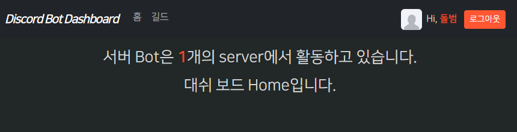

### 정리

- 참고 github: https://github.dev/codingforentrepreneurs/video-membership
- 참고: github: https://github.dev/UnoYakshi/FRAAND/blob/master/src/fraand_core/templates/base.html

#### base.html

1. 비로그인 허용 discord_dashboard.html은 templaets > `base.html`로 바꾸고, 로그인 관련 기능을 심어놓는 부모로 작동하게 한다.
    - boostrap을 넣어주고, fetch 유틸리티는 fetch.js로 뺀다.
    - **`block`은 head_js / title / content / body_js로 4가지를 base상속 자식들에게 커스텀할 수 있게 나눈다.**
    ```html
    <!doctype html>
    <html lang="en">
    <head>
        <meta charset="UTF-8">
        <meta name="viewport"
              content="width=device-width, user-scalable=no, initial-scale=1.0, maximum-scale=1.0, minimum-scale=1.0">
        <meta http-equiv="X-UA-Compatible" content="ie=edge">
        <!-- css -->
        <!-- css-Bootstrap -->
        <link href="https://cdn.jsdelivr.net/npm/bootstrap@5.1.3/dist/css/bootstrap.min.css" rel="stylesheet" integrity="sha384-1BmE4kWBq78iYhFldvKuhfTAU6auU8tT94WrHftjDbrCEXSU1oBoqyl2QvZ6jIW3" crossorigin="anonymous">
        <!-- css-self -->
        <link rel="stylesheet" type="text/css" href="{{ url_for('static', path='css/style.css') }}?v=0.1.0">
        <!-- head_js -->
        
        <!-- title -->
        <title>BOT DASHBOARD</title>
    </head>
    
    <body>
    <!-- nav -->
    <h1>Discord bot Dashboard</h1>
    
        <p> Hey <strong>{{ user.nickname }}</strong>, bot이 활동하는 디스코드 서버를 선택해주세요.</p>
        <button class="btn-logout" onclick="logout(); return false;">로그아웃</button>
    
        <button class="btn-login" onclick="onClickOAuthLogin('discord')">Login</button>
    
    <!-- nav -->
    
    
    <!-- content -->
    <div class="container-fluid mt-3">
         base 
    </div>
    <!-- content -->
        
    <!-- body_js -->
    <!-- js-library -->
    {#<script src="https://code.jquery.com/jquery-3.6.0.min.js"></script>#}
    <script src="https://unpkg.com/htmx.org@1.6.1" integrity="sha384-tvG/2mnCFmGQzYC1Oh3qxQ7CkQ9kMzYjWZSNtrRZygHPDDqottzEJsqS4oUVodhW" crossorigin="anonymous"></script>
    <script src="https://cdn.jsdelivr.net/npm/bootstrap@5.1.3/dist/js/bootstrap.bundle.min.js" integrity="sha384-ka7Sk0Gln4gmtz2MlQnikT1wXgYsOg+OMhuP+IlRH9sENBO0LRn5q+8nbTov4+1p" crossorigin="anonymous"></script>
    <!-- js-fetch -->
    <script src="{{ url_for('static', path='js/fetch.js') }}?v=0.1.0"></script>
    <!-- js-login -->
    <script>
        const onClickOAuthLogin = (sns_type) => {
            if (!sns_type) {
                console.error('sns_type is required.');
                return;
            }
            fetchGet('/auth/authorize/' + sns_type)
                .then((response) => {
                    // console.log("response", response)
                    if (response && response.data && response.data.authorization_url) {
                        // 1. template 라우트 -> sns_type별 authorization_url 반환
                        let authorization_url = response.data.authorization_url;
    
                        // 2. jinaj 필터를 이용해 state값을 붙이기
                        authorization_url = authorization_url + '&state={{ request.url._url | encode_next_state }}';
                        // console.log(authorization_url)
                        window.location.href = authorization_url;
                    } else {
                        console.log("Error: Failed to get authorization URL");
                    }
                });
        };
    
        function logout() {
            // evt.preventDefault();
            // evt.stopPropagation();
    
            // 로그아웃 버튼 클릭 이벤트 처리
            let response = fetchPost('{{url_for("auth:cookie.logout")}}');
            if (response) {
                alert('로그아웃 성공')
                window.location.href = '/discord/dashboard';
            } else {
                alert('로그아웃 실패')
            }
        }
    </script>
    
    
    </body>
    </html>
    ```

### 로그아웃시 돌아갈 home.html

1. `base.html`를 상속한 `home.html`로 변경하여 처리한다.
    - 로그인 정보는 없어도 서버에서 돌아가는 bot_guild_count를 받아서 처리할 것이다.
    - **더이상 `authorization_url`을 만들어서 내려보지 않아도 된다.**
    - **optional_current_active_user를 쓰지 않아도 user가 없으면 front에서 if user가 안돈다.**
    - **`하지만, 템플릿에서는 base.html의 nav부터 항상 user변수가 필요`하다**


2. **또한, home.html에서 로그인 여부 guilds.html로 들어갈 nav가 먼저 구성되어야한다.**

### 매번 user를 context = {}에 안넣어기 위해, dependency로 request에 넣었다가 -> request에서 자동으로 뽑아쓰기

#### fastapi optional user 디펜던시 + request를 합친 reqeust.state.user = user or None을 박은 request 디펜던시

- **Reqeust를 반환하는 디펜던시는 버그로 인해, 바로 사용불가능하다.**
    - 버그: https://github.com/tiangolo/fastapi/discussions/9542
- **그래서 app단위나 router단위에서 `dependencies=[]`로 미리 주입해놓고, `request:Request`로 사용해야한다.**

1. **`optional_current_active_user` + request를 사용하는 `request_with_fastapi_optional_user` 디펜던시를 route에 옵션으로 기입한다.**
    ```python
    # app/api/dependencies/auth.py
    optional_current_active_user = fastapi_users.current_user(
        active=True,
        optional=True,
    )
    async def request_with_fastapi_optional_user(request: Request, user=Depends(optional_current_active_user)) -> Request:
        request.state.user = user
        return request
    ```
    - 혹시 몰라 미들웨어 request init메서드에서 None으로 초기화해주자.
    ```python
    class AccessControl(BaseHTTPMiddleware):
    
        async def dispatch(self, request: Request, call_next: RequestResponseEndpoint) -> Response:
            # ...
            await self.init_state(request)
            # ...
    
        @staticmethod
        async def init_state(request):
            # ...
            request.state.user = None
    
    ```

2. **pages/init.py에서 통합 template용 router객체에 dependencies를 미리 주입한다.**
    ```python
    # app/pages/__init__.py:18
    from app.api.dependencies.auth import request_with_fastapi_optional_user
    
    router = APIRouter(
        dependencies=[Depends(request_with_fastapi_optional_user)]
    )
    ```

3. **이제 pages내의 모든 route들의 request는 `request.state.user에 optional user(user or None)이 박힌 request`를 사용할 수 있게 된다.**
    ```python
    @router.get("/")
    # async def discord_home(request: Request, user: Users = Depends(optional_current_active_user)):
    async def discord_home(request: Request):
        """
        `Discord Bot Dashboard Home`
        """
        print(f"request.state.user >> {request.state.user}")
        # request.state.user >> <Users#4>
    ```
    - **template render시에는 user를 reqeust.state.user에서 뽑아서 넣어주면 된다.**
    ```python
    @router.get("/")
    async def discord_home(request: Request):
    
        context = {
            'request': request,  # 필수
            'bot_guild_count': guild_count.response,  # 커스텀 데이터
            # 'user': user,
            'user': request.state.user,  # None or user
        }
        return templates.TemplateResponse(
            "bot_dashboard/home.html",
            context
        )
    ```

#### templates에서는 base.html에 들어가는 user변수가 매번 필요하지만, discord용 template에서는 server guild count도 매번 필요하다.

```python
class AccessControl(BaseHTTPMiddleware):

    @staticmethod
    async def init_state(request):
        # ...
        request.state.bot_guild_count = None
```

```python
# template + discord dashboard용
from app.libs.discord.bot.ipc_client import discord_ipc_client


async def request_with_fastapi_optional_user_and_bot_guild_count(
        request: Request, user=Depends(optional_current_active_user)
) -> Request:
    request.state.user = user

    server_response = await discord_ipc_client.request("guild_count")
    # <ServerResponse response=1 status=OK>
    request.state.bot_guild_count = server_response.response

    return request
```

```python
router = APIRouter(
    dependencies=[Depends(request_with_fastapi_optional_user)]
)
router.include_router(index.router, tags=['Pages'])
router.include_router(discord.router, prefix='/discord', tags=['Pages'],
                      dependencies=[Depends(request_with_fastapi_optional_user_and_bot_guild_count)]

                      )
```

### shortcuts.py를 만들어서, render시 request에서, user + bot_guild_count(discord dashboard로서 request에 있으면) 뽑아서 넣어주자.

- 참고: https://github.dev/codingforentrepreneurs/video-membership 의 shortcuts.py

1. app/utils/http_utils.py에다가 정의해준다.
    - 참고로 darkmode여부도 여기서 매번 cookie로 넣어준다.
    - **context를 `user, bot_guild_count`를 포함하는 `context`외 추가 context가 들어오면 업데이트 해준다.**
    - **cookie도 넣어줄려면 외부에서 받아서 넣어준다.**
    ```python
    def render(request, template_name, context={}, status_code: int = 200, cookies: dict = {}):
    
        ctx = {
            'request': request,
            'user': request.state.user,
            **context
        }
        if request.state.bot_guild_count:
            ctx.update({'bot_guild_count': request.state.bot_guild_count})
    
        t = templates.get_template(template_name)
        html_str = t.render(ctx)
        
        response = HTMLResponse(html_str, status_code=status_code)
        
        response.set_cookie(key='darkmode', value=str(1))
        if len(cookies.keys()) > 0:
    
            # set httponly cookies
            for k, v in cookies.items():
                response.set_cookie(key=k, value=v, httponly=True)
    
        # delete coookies
        # for key in request.cookies.keys():
        #     response.delete_cookie(key)
    
        return response
    ```

2. 추가로 redirect와 is_htmx 요청인지 확인하는 유틸까지 미리 정의해둔다.
    ```python
    def is_htmx(request: Request):
        return request.headers.get("hx-request") == 'true'
    
    
    def redirect(path, cookies: dict = {}, logout=False):
        response = RedirectResponse(path, status_code=302)
    
        for k, v in cookies.items():
            response.set_cookie(key=k, value=v, httponly=True)
    
        if logout:
            # response.set_cookie(key='session_ended', value=str(1), httponly=True)
            response.delete_cookie('Authorization')
    
        return response
    ```

3. **이제 template용 route들에서 render()메서드로 render해준다.**
    ```python
    @router.get("/")
    async def discord_home(request: Request):
        """
        `Discord Bot Dashboard Home`
        """
        # request.state.user >> <Users#4>
        # request.state.bot_guild_count >> 1
    
        # return templates.TemplateResponse(
        #     "bot_dashboard/home.html",
        #     context
        # )
        #
        return render(request, "bot_dashboard/home.html")
    ```

### base에 포함되는 nav ->  snippets/nav.html

#### 자체 boostrap(css)  + jquery -> bootsrap bundle(js)로 추가하기

1. base.html에 기존 프로젝트에서 사용했던 bootstrap 소스를 가져와 붙혀넣고 직접 걸어준다.
    - **파일 1개만 x, 폴더 전체의 min 버전들도 다 들고와야 작동함.**
    ```html
    <!-- css-self -->
    <link rel="stylesheet" type="text/css" href="{{ url_for('static', path='css/bootstrap.css') }}?v=5.3.0">
    <link rel="stylesheet" type="text/css" href="{{ url_for('static', path='css/style.css') }}?v=0.1.0">
    ```
    ```html
    <script src="{{ url_for('static', path='js/jquery.js') }}?v=3.6.0"></script>
    <script src="{{ url_for('static', path='js/bootstrap.bundle.js') }}?v=5.3.0"></script>
    <script src="{{ url_for('static', path='js/fetch.js') }}?v=0.1.0"></script>
    ```

#### 이제 template route에서 render()되는 html에서는 user, bot_guild_count 를 변수로 사용해 nav 태그를 작성할 수 있다.

1. 아래 예제에서 boostrap nav를 가져오고 일부분 수정한 뒤, base.html에 넣는다.
    - https://github.dev/codingforentrepreneurs/video-membership 에서 snippets/nav.html
    - navbar-expand-sm navbar-dark bg-dark
    - navbar-brand fw-bolder fst-italic
    ```html
    
    <nav class="navbar navbar-expand-sm navbar-dark bg-dark">
        <div class="container-fluid">
            <a class="navbar-brand fw-bolder fst-italic" href="{{ url_for('discord_home') }}"
               style="letter-spacing: -1.2px;"
            >
                Discord Bot Dashboard
            </a>
            <button class="navbar-toggler" type="button" data-bs-toggle="collapse" data-bs-target="#navbarSupportedContent"
                    aria-controls="navbarSupportedContent" aria-expanded="false" aria-label="Toggle navigation">
                <span class="navbar-toggler-icon"></span>
            </button>
            <div class="collapse navbar-collapse" id="navbarSupportedContent">
                <ul class="navbar-nav me-auto mb-2 mb-lg-0">
                    <li class="nav-item">
                        <a class="nav-link" aria-current="page" href="{{ url_for('discord_home') }}">홈</a>
                    </li>
                    <li class="nav-item">
                        <a class="nav-link" href="{{ url_for('guilds') }}">길드</a>
                    </li>
                </ul>
    
            </div>
        </div>
    </nav>
    ```
2. collapse의 navbar 아이템들이 나타나는 ul태그 끝나고난 뒤, search form 자리에 login관련 코드를 if `user`를 활용
    - **flask에서는 url_for에 파라미터가 `filename=`이었지만, fastapi에서는 `path=`로 줘야한다.**
    - **static > img > auth 폴더 생성후 `default_avatar.svg`를 2022 프로젝트에서 가져와서 만들어놓음.**
    ```html
    <div class="collapse navbar-collapse" id="navbarSupportedContent">
        <ul class="navbar-nav me-auto mb-2 mb-lg-0">
            <li class="nav-item">
                <a class="nav-link" aria-current="page" href="{{ url_for('discord_home') }}">홈</a>
            </li>
            <li class="nav-item">
                <a class="nav-link" href="{{ url_for('guilds') }}">길드</a>
            </li>
        </ul>
    
        {##}
    
        {# 로그인 #}
        <div class="me-sm-3">
            
                <div class="">
                    <span class="me-2">
                        
                        Hi, <strong>{{ user.nickname }}</strong>
                    </span>
                    <button class="btn btn-sm btn-auth" onclick="logout(); return false;">로그아웃</button>
                </div>
            
                <div class="">
                    <button class="btn btn-sm btn-auth" onclick="onClickOAuthLogin('discord')">로그인</button>
                </div>
            
        </div>
    </div>
    ```

3. **이 때, btn을 boostrap버전으로 정의하기 위해 `.btn-auth`로 버튼스타일을 놓고 `style.css`에 정의한다.**
    - style.css는 boostrap css보다 아래에 있어서 그것을 이용한다.
    ```css
    @import url('https://fonts.googleapis.com/css2?family=Noto+Sans+KR:wght@500&family=Noto+Serif+KR:wght@500&display=swap');
    @import url(https://cdn.jsdelivr.net/gh/moonspam/NanumSquare@2.0/nanumsquare.css);
    
    :root {
        --primary-font-family: 'Noto Sans KR', sans-serif;
        --secondary-font-family: 'Noto Serif KR', sans-serif;
        --third-font-family: 'NanumSquare', sans-serif;
    
        --color-main: #00b5b2;
        --color-main-light: #5bd2cc;
        --color-main-dark: #50ccc7; /* for 둘러보기 배경색 + 클리닉 치료법 글자색 */
        --color-main-darker: #05736d; /* for 모바일 2차메뉴 */
        --color-submain: #FC5230;
    
        --color-schedule: #a9cccb;
    
        --color-pink: #F07F7F;
        --color-purple: #ab8dca;
        --color-green: #80BA96;
        --color-youtube: #f63232;
        --color-naver: #0eca8b;
        --color-yellow-gold: #cc820b;
        --color-gold: #CEA869;
        --color-gold-dark: #ad8b51;
        --color-gray-light: #343A3FBF;
        --color-gray-darker: #212529BF;
    
        --color-kakao-yellow: #fee500;
    }
    
    body {
        background: #222727;
        color: #d8d8d8;
        text-align: center;
        /*font-family: Verdana, sans-serif;*/
        font-family: 'NanumSquare', 'Noto Sans KR', 'Malgun Gothic', 'Nanum Gothic', 'Noto Sans', 'sans-serif';
    }
    
    strong {
        color: #ea461e;
    }
    
    .btn-auth {
        --bs-btn-color: #fff;
        --bs-btn-bg: #FC5230;
        --bs-btn-border-color: #FC5230;
    
        --bs-btn-hover-color: #fff;
        --bs-btn-hover-bg: #F07F7F;
        --bs-btn-hover-border-color:#F07F7F;
        --bs-btn-focus-shadow-rgb: #FC5230;
    
        --bs-btn-active-color: #fff;
        --bs-btn-active-bg: #F07F7F;
        --bs-btn-active-border-color: #F07F7F;
        --bs-btn-active-shadow: inset 0 3px 5px #FC5230;
    
        --bs-btn-disabled-color: #fff;
        --bs-btn-disabled-bg: #FC5230;
        --bs-btn-disabled-border-color: #FC5230;
    }
    
    /*.btn-login, .btn-logout {*/
    /*    background: #ea461e;*/
    /*    border: 0;*/
    /*    color: white;*/
    /*    padding: 12px 48px;*/
    /*    font-size: 18px;*/
    /*    margin-top: 8px;*/
    /*    border-radius: 8px;*/
    /*    cursor: pointer;*/
    /*}*/
    ```

4. include되는 반복코드를 분리하여 `template > bot_dashboard >  snippets`폴더를 만들고 nav.html을 생성해 `base.html에서 include`하게 한다.
    ```html
    <body>
    <!-- nav -->
    
    <!-- nav -->
    ```

5. bot_guild_count는 content 부분에서 block 바깥에서 작성해서 쓴다.
    ```html
    <!-- content -->
    <div class="container-fluid mt-3">
        <h3>서버 Bot은 <strong>{{ bot_guild_count }}</strong>개의 server에서 활동하고 있습니다.</h3>
         base 
    </div>
    <!-- content -->
    ```

#### 로그아웃시 돌아올 home.html

1. title block에서 ` | {{super()}}`를 활용하여 title이 부모와 연계되도록 한다.
    - base를 최상위부모로서 bot_dashboard로 적혀있다.
    - content block을 임시로 채운다.
    ```html
    
     
     Home | {{ super() }} 
     
    
        <div class="container mt-3">
            <div class="row">
                <div class="col">
                    <h3> 대쉬 보드 Home입니다.</h3>
                </div>
            </div>
        </div>
    
    ```
   

2. 이제 base.html의 logout 코드에서 discord_home으로 반환하게 한다.
```js
function logout() {
    // evt.preventDefault();
    // evt.stopPropagation();

    // 로그아웃 버튼 클릭 이벤트 처리
    let response = fetchPost('{{url_for("auth:cookie.logout")}}');
    if (response) {
        // alert('로그아웃 성공')
        window.location.href = '{{url_for("discord_home")}}';
    } else {
        // alert('로그아웃 실패')
    }
}
```

### logout 버그 수정 (fetch는 비동기라 변수로 받으면 안된다)
- 현재 쿠키제거 응답을 받았는데, reload or redirect해도 logout이 안풀려있다.
    - **그 이유는 `Jinja template은 HTTP 요청이 완료된 후에만 다시 렌더링`되는데, `await 비동기요청이 안끝난 상태에서 변수로만 받`고, reload해버리기 때문이다.**
1. 일단 fetchPost()를 요청하고 일반 변수로 받앗는데, 그러면 안되고 .then()으로 처리하게 해야한다.
    - fastapi-users의 cookie제거 route는 `auth:cookie(백엔드이름).logout`으로 정해지는데 여기로 `POST`요청으로 보내야한다
    ```js
    function logout() {
    
        // 로그아웃 버튼 클릭 이벤트 처리
        fetchPost('{{url_for("auth:cookie.logout")}}')
            .then((response) => {
                console.log("response", response)
                if (response) {
                    {#alert('로그아웃 성공');#}
                    {#window.location.reload();#}
                    window.location.href = '{{url_for("discord_home")}}';
                } else {
                    {#alert('로그아웃 실패')#}
                }
            })
    }
    ```
2. **하지만 이전에 정의한 fetch.js의 fetchPost는 `204 no content`에 대한 대처가 안되어있다.**
    - 무조건 response.json()으로 return하는데, 204 no content는 .json()을 못쓴다.
    - **그래서 response.ok (200번대 다 되는듯) 이후, `=== 204면, .json()이 아니라 true만 return`하도록 변경해준다.**
    ```js
    function fetchPost(url, data = null) {
        return fetch(url, {
            method: "POST",
            headers: {
                "Content-Type": "application/json",
                "Accept": "application/json"
            },
            body: data ? JSON.stringify(data) : null,
        })
            .then(response => {
                if (response.ok) {
                    // 204는 .json()을 못씀.
                    // return response.json();
                    return response.status === 204 ? true : response.json();
                } else {
                    console.log(response.status);
                    return false;
                }
            }).catch((error) => {
                console.error("Error:", error);
            });
    }
    ```
   
3. 이렇게 완료되어야 **로그아웃 요청이 끝나고, then에서 redirect 된다.**
### 도커 명령어

1. (`패키지 설치`시) `pip freeze` 후 `api 재실행`

```shell
pip freeze > .\requirements.txt

docker-compose build --no-cache api; docker-compose up -d api;
```

2. (init.sql 재작성시) `data폴더 삭제` 후, `mysql 재실행`

```shell
docker-compose build --no-cache mysql; docker-compose up -d mysql;
```

```powershell
docker --version
docker-compose --version

docker ps
docker ps -a 

docker kill [전체이름]
docker-compose build --no-cache
docker-compose up -d 
docker-compose up -d [서비스이름]
docker-compose kill [서비스이름]

docker-compose build --no-cache [서비스명]; docker-compose up -d [서비스명];

```

3. docker 추가 명령어

```powershell
docker stop $(docker ps -aq)
docker rm $(docker ps -aqf status=exited)
docker network prune 

docker-compose -f docker-compose.yml up -d
```

### pip 명령어

```powershell
# 파이참 yoyo-migration 설치

pip freeze | grep yoyo

# 추출패키지 복사 -> requirements.txt에 붙혀넣기

```

### git 명령어

```powershell
git config user.name "" 
git config user.email "" 

```

### yoyo 명령어

```powershell
yoyo new migrations/

# step 에 raw sql 작성

yoyo apply --database [db_url] ./migrations 
```

- 참고
    - 이동: git clone 프로젝트 커밋id 복사 -> `git reset --hard [커밋id]`
    - 복구: `git reflog` -> 돌리고 싶은 HEAD@{ n } 복사 -> `git reset --hard [HEAD복사부분]`