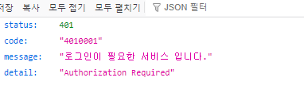

### guilds 라우트
#### 기존 구현 적용
1. 필요없는 것 정리
    - 이제 discord route는 자동으로 request.state.user 및 .bot_guild_count가 내포되어 있어서 디펜던시 필요없다.
    ```python
    @router.get("/guilds")
    # async def guilds(request: Request, user: Users = Depends(optional_current_active_user)):
    async def guilds(request: Request):
        # bot_guild_count = await discord_ipc_client.request("guild_count")
        user_guilds: list = []
        # if user:
        if request.state.user:
            # access_token = user.get_oauth_access_token('discord')
            access_token = request.state.user.get_oauth_access_token('discord')
                user_guilds = await discord_client.get_guilds(access_token)
    ```
   
2. render()메서드로 처리하며, authorize_url도 넘겨줄 필요없다. 추가 context는 user_guilds 밖이다.
    ```python
    # context = {
    #     'request': request,
    #     'user': user,
    #     'bot_guild_count': bot_guild_count.response,  # 커스텀 데이터
    # 
    #     'authorize_url': update_query_string(
    #         DISCORD_GENERATED_AUTHORIZATION_URL,
    #         # redirect_uri=config.DOMAIN + '/discord/callback'
    #         redirect_uri=request.url_for('discord_callback')
    #     ),
    # 
    #     'user_guilds': user_guilds,
    # }
    # return templates.TemplateResponse(
    #     "bot_dashboard/guilds.html",
    #     context
    # )
    
    context = {
        'user_guilds': user_guilds,
    }
    
    return render(
        request,
        "bot_dashboard/guilds.html",
        context=context
    )
    ```
#### login 여부 감별은 request.state.user로 해야한다 -> @login_required 데코레이터 화
1. login 여부 감별은 `optional user가 박힌 request.state.user`로 해야한다.
    ```python
    @router.get("/guilds")
    async def guilds(request: Request):
        
        if not request.state.user:
            raise NotAuthorized()
    ```
   
2. 매번 라우트마다 위의 코드를 작성하기 보다는 **데코레이터로 자동으로 raise되도록 정의해준다.**
    - 참고: https://github.dev/codingforentrepreneurs/video-membership - 
    - 심화: (role, permission): https://github.dev/is2js/2022_sqlalchemy - 
    - **이 때 데코레이터의 wrapper메서드 정의시에는 `route가 받는 dependencies or 인자`를 특정해서 받고, 나머지는 `*args, **kwargs`로 처리할 수 있다.**
    - state에 user가 박혀있는 request를 받아서 메서드 정의시 사용해준다.
    - **`pages/decorators.py`를 생성해서 정의해준다.**
    - **이 때, fastapi환경에서는 wrapper함수를 정의할 때, `async`로 정의하고 func 반환을 `await`로 해줘야한다.**
    ```python
    from functools import wraps
    from fastapi import Request
    
    from app.errors.exceptions import NotAuthorized
    
    
    # fastapi에서는 wrapperㄹㄹ async로, func반환을 await로 중간에 해줘야한다.
    def login_required(func):
        @wraps(func)
        async def wrapper(request: Request, *args, **kwargs):
            if not request.state.user:
                raise NotAuthorized()
            return await func(request, *args, **kwargs)
    
        return wrapper
    ```
   
3. **route에 데코레이터를 정의할 땐 `@route` <-> `view function` 사이에 끼워넣어준다.**
    ```python
    @router.get("/guilds")
    @login_required
    async def guilds(request: Request):
        # if not request.state.user:
        #     raise NotAuthorized()
    
        user_guilds: list = []
    ```
    

### template route 커스텀핸들링을 위한, route_class= 재정의 -> Fail 
1. **데코레이터로 error를 내게되면, 아직 `view function(route)에 들어가기 전에 에러가 나는 것`이라, route재정의한 custom error handler에 안잡힌다.**
    - **데코레이터에서 직접 redirect를 하던가**
    - **데코레이터에서 raise -> middleware에서 잡아야한다.**
    - **app.에러핸들러에서 잡아줘도 되지만, 이미 APIExcetion 처리하며 로그를 찍게 설계했었다.**

### middleware까지 가지 않고(log안찍기), @login_required에서 redirect
- 기존 프로젝트에 것을 그대로 응용한다.
   - 기존:  https://github.dev/is2js/2022_sqlalchemy

#### 원래 /login 페이지에 next= 현재url을 달고 redirect시켜야한다.
- 구조 참고: https://duckgugong.tistory.com/275

1. 현재 login 페이지로 `next= query_parameter`를 가지고 redirect시켜야한다.
    - **현재 없으니, discord_home으로 보내되, `?next= `로 현재 url을 `request.url`로 보낸다.**
    ```python
    def login_required(func):
        @wraps(func)
        async def wrapper(request: Request, *args, **kwargs):
            if not request.state.user:
                
                # TODO: login 페이지 GET route가 생기면 그것으로 redirect
                response = RedirectResponse(f"{request.url_for('discord_home')}?next={request.url}")
    
                return response
            return await func(request, *args, **kwargs)
    
        return wrapper
    ```
   
2. **discord관련 route용으로서 `@oauth_login_required('sns_type')` 데코레이터를 새롭게 정의해서, `기존 DiscordRoute`에 커스텀 핸들러에서 정의했던 것을 응용해서 redirect시켜보자.**
    - **데코레이터에서 인자를 받으려면 `def 데코(인자) > def decorator(func)`을 상위레벨로 추가해서 처리하면 된다.**
    - **만약 /guilds로 왔는데, 로그인이 안되어있다면, discord 제공 authorize_url에 현재주소를 state=로 jwt encoding해서, 그 주소로 반환한다.**
    ```python
    def oauth_login_required(sns_type: SnsType):
        def decorator(func):
            @wraps(func)
            async def wrapper(request: Request, *args, **kwargs):
                if not request.state.user:
                    if sns_type == SnsType.DISCORD:
    
                        state_data = dict(next=str(request.url))
                        state = generate_state_token(state_data, JWT_SECRET) if state_data else None
    
                        authorization_url: str = await discord_client.get_authorization_url(
                            redirect_uri=str(request.url_for('discord_callback')),
                            state=state
                        )
                        response = RedirectResponse(authorization_url)
                    else:
                        raise NotAuthorized()
                    return response
    
                return await func(request, *args, **kwargs)
    
            return wrapper
    
        return decorator
    ```

3. route에서 인자를 넣은 데코레이터를 적용해준다.
    ```python
    @router.get("/guilds")
    # @login_required
    @oauth_login_required(SnsType.DISCORD)
    async def guilds(request: Request):
        # if not request.state.user:
        #     raise NotAuthorized()
    ```
4. **더이상 route단위에서 not authorize를 잡지 않으므로, custom route사용을 풀어준다.**
    ```python
    # router = APIRouter(route_class=DiscordRoute)
    router = APIRouter()
    ```
   
5. 이제 /guilds는 request.state.user에 user객체가 보장된 상태이므로 일부 수정해준다.
    ```python
    @router.get("/guilds")
    # @login_required
    @oauth_login_required(SnsType.DISCORD)
    async def guilds(request: Request):
        # if not request.state.user:
        #     raise NotAuthorized()
    
        # user_guilds: list = []
        # if request.state.user:
        
        access_token = request.state.user.get_oauth_access_token('discord')
        user_guilds = await discord_client.get_guilds(access_token)
    
        context = {
            'user_guilds': user_guilds,
        }
    
        return render(
            request,
            "bot_dashboard/guilds.html",
            context=context
        )
    
    ```
   

### front /login 혹은 현재는 home에서, next=가 있다면, 현재주소대신, next query_params를 우선적으로 state=에 넣어줘야한다.
- 구조 참고: https://duckgugong.tistory.com/275

1. **기존에는 jinja의 현재 url인 `{{request.url._url }}`을 인코딩해서 state에서 넣었지만**
    - **로그인 요구 route에서 돌아온 상황이라면, `{{request.query_params }}`를 순회하면서 'next'가 있다면, state=에 우선적으로 먼저 넣어줘야하므로 if로 검사해서 처리한다.**
    - **if else jinja문에서는 ``을 활용해준다.**
    ```js
    const onClickOAuthLogin = (sns_type) => {
            if (!sns_type) {
                console.error('sns_type is required.');
                return;
            }
            fetchGet('/auth/authorize/' + sns_type)
                .then((response) => {
                    // console.log("response", response)
                    if (response && response.data && response.data.authorization_url) {
                        // 1. template 라우트 -> sns_type별 authorization_url 반환
                        let authorization_url = response.data.authorization_url;
    
                        // 2. jinja 필터를 이용해 state값을 붙이기
                        // 2-1. 로그인요구 route에서 돌아온 상태: ?next=를 달고 오니, 이것을 state에 jwt encode
                        
                            
                        
                        // 2-2. 만약, 그냥 로그인/비로그인 허용(base-nav)라면, 현재url을 state에 wjt encoding
                            
                        
    
                        authorization_url = authorization_url + '&state={{ next_url | encode_next_state }}';
                        // console.log(authorization_url)
                        window.location.href = authorization_url;
                    } else {
                        console.log("Error: Failed to get authorization URL");
                    }
                });
        };
    ```
### 도커 명령어

1. (`패키지 설치`시) `pip freeze` 후 `api 재실행`

```shell
pip freeze > .\requirements.txt

docker-compose build --no-cache api; docker-compose up -d api;
```

2. (init.sql 재작성시) `data폴더 삭제` 후, `mysql 재실행`

```shell
docker-compose build --no-cache mysql; docker-compose up -d mysql;
```

```powershell
docker --version
docker-compose --version

docker ps
docker ps -a 

docker kill [전체이름]
docker-compose build --no-cache
docker-compose up -d 
docker-compose up -d [서비스이름]
docker-compose kill [서비스이름]

docker-compose build --no-cache [서비스명]; docker-compose up -d [서비스명];

```

3. docker 추가 명령어

```powershell
docker stop $(docker ps -aq)
docker rm $(docker ps -aqf status=exited)
docker network prune 

docker-compose -f docker-compose.yml up -d
```

### pip 명령어

```powershell
# 파이참 yoyo-migration 설치

pip freeze | grep yoyo

# 추출패키지 복사 -> requirements.txt에 붙혀넣기

```

### git 명령어

```powershell
git config user.name "" 
git config user.email "" 

```

### yoyo 명령어

```powershell
yoyo new migrations/

# step 에 raw sql 작성

yoyo apply --database [db_url] ./migrations 
```

- 참고
    - 이동: git clone 프로젝트 커밋id 복사 -> `git reset --hard [커밋id]`
    - 복구: `git reflog` -> 돌리고 싶은 HEAD@{ n } 복사 -> `git reset --hard [HEAD복사부분]`