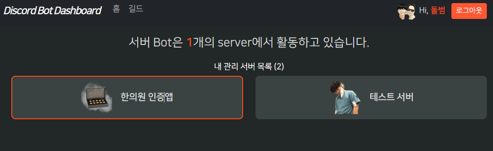

### guilds 

1. discord 패키지에서 `discord.Permissions()`안에 `user_guilds 정보 중 permission(int)`를 넣고 `.adminstrator`를 호출하면 해당 guild의 관리자인지 확인할 수 있다.
    - **혹은 guild정보 중 `owner`가 true로 오면 된다.**
    - **onwer가 아니라도 관리자(administrator권한)일 수 있기 때문에, 2가지를 검사한다.**
    ```python
    @router.get("/guilds")
    @oauth_login_required(SnsType.DISCORD)
    async def guilds(request: Request):
        access_token = request.state.user.get_oauth_access_token('discord')
    
        oauth_client: DiscordClient = get_oauth_client(SnsType.DISCORD)
        user_guilds = await oauth_client.get_guilds(access_token)
    
        for guild in user_guilds:
            # 해당user의 permission으로 guild 관리자인지 확인
            # (1) discord.Permissions( guild['permissions'] ).administrator   or  (2) guild['owner']
            is_admin: bool = discord.Permissions(guild['permissions']).administrator or guild['owner']
            if not is_admin:
                continue
        #...
    ```
   
#### bot이 가진 guild_ids vs user의 관리자 서버 ids 를 비교해서, bot 포함여부 나타내기
- 참고: https://github.dev/CodeWithSwastik/Dashboard-Tutorials/blob/main/Part%203/main.py
    - index.css / guilds 라우트 
1. bot에 guild_ids를 반환해주는 bot route생성
    ```python
    class DiscordBot(ezcord.Bot):
        #...
        @Server.route()
        async def guild_ids(self, _):
            # Expected type Dict or string as response, got list instead!
            # return [guild.id for guild in self.guilds]
            # => 외부에서는 await 호출 -> .response로 받는데, 이 때 str or dict가 반환되어야한다.
            return dict(guild_ids=[guild.id for guild in self.guilds])
    ```
   
2. /guilds 라우트에서 `use_bot` 속성을 user_guild에 할당해서 표시한다.
    - **이때 bot반환 guild_ids는 `int list`, client 반환 user_guilds 속 guild['id']는 string이니, int로 변환해서 확인한다.**
    ```python
    @router.get("/guilds")
    @oauth_login_required(SnsType.DISCORD)
    async def guilds(request: Request):
        #...
        guild_ids = await discord_ipc_client.request('guild_ids')
        guild_ids = guild_ids.response['guild_ids']
    
        for guild in user_guilds:
    
            # (3) user의 guild id가 bot에 포함되면, use_bot 속성에 True, 아니면 False를 할당하자.
            # => user_guilds의 guild마다 id는 string으로 적혀있으니 int로 변환해서 확인한다. (서버반환은 guild_ids는 int)
            guild['use_bot'] = (int(guild['id']) if isinstance(guild['id'], str) else guild['id']) in guild_ids
        
        print(f"user_guilds >> {user_guilds}")
        # user_guilds >> [
        # {'id': '1156511536316174368',
        # 'use_bot': True},
        # {'id': '1161106117141725284',
        # 'use_bot': False}]
    ```
   

3. **front에서 use_bot True 상태면 `border` 주기**
    ```html
    <div class="guild-item px-2 d-flex justify-content-center align-items-center rounded-3 border-guild">
    ```
    ```css
    .border-guild {
         border: 2px solid #ea461e;
    }
    ```
    


4. **여러개 있을 때, use_bot == True(1이라서 역순필요)들 먼저 순서정렬해놓기**
    ```python
    # bool을 key로 주면, False(0) -> True(1) 순으로 가므로, reverse까지 해줘야함
    user_guilds.sort(key=lambda x: x['use_bot'], reverse=True)
    ```
   
### guild_id로 bot에 개별guild 정보(stats)요청 -> bot에 없으면서버에 bot추가 링크로 연결

#### path로 id를 받는 /guilds/{guild_id} route를 만들고, 해당 guild_id로, bot에 guild_stats 정보 요청하기
1. **route의 `ipc_client.request()`에서 `@Server.route명`에 이은 `keyword 인자`로 요청을 보낸다.**
    ```python
    @router.get("/guilds/{guild_id}")
    @oauth_login_required(SnsType.DISCORD)
    async def get_guild(request: Request, guild_id: int):
        ...
        guild_stats = await discord_ipc_client.request('guild_stats', guild_id=guild_id) # server에서는 data.guild_id로 꺼냄.
    ```
   
2. **bot에서 @Server.route()를 정의할 때 `2번째 인자 data`를 discord의 `data: ClientPayload`로 받으면, `data.넘긴keyword명`으로 받을 수 있다.**
    ```python
    @Server.route()
    async def guild_stats(self, data: ClientPayload):
        data.guild_id
    ```
   
3. **지금까진 ezcord.Bot (discord.Bot)클래스에서 `self.guilds`로 bot의 길드전체 정보를 가져왔지만, `self.get_guild( guild_id )`메서드로 개별 길드정보를 가져올 수 있다.**
    - 뽑아낸 guild정보에서, 받은 guild_id외 +  `name` / `member_count`를 `dict`로 return해줘서 외부에서는 response로 받게 한다.
    - **`bot에 없는 guild의 id면, 빈 dict를 반환-> 외부에서도 빈dict를 확인하여 bot추가 url로 보낼 준비`**
    ```python
    @Server.route()
    async def guild_stats(self, data: ClientPayload):
        guild = self.get_guild(data.guild_id)

        if not guild:
            return {}

        return {
            "id": data.guild_id,
            "name": guild.name,
            "member_count": guild.member_count,
        }
    ```
   
4. 이제 route에서 render시 context로 guild_stats를 통째로 넘겨주자.
    ```python
    @router.get("/guilds/{guild_id}")
    @oauth_login_required(SnsType.DISCORD)
    async def get_guild(request: Request, guild_id: int):
        ...
        guild_stats = await discord_ipc_client.request('guild_stats', guild_id=guild_id)
        guild_stats = guild_stats.response
        print(f"guild_stats >> {guild_stats}")  # bot에 없는 서버면 {}
    
        # user 관리 서버 중, bot에 없는 guild -> bot 추가 url로 redirect or 추가링크가 있는 button?
        if not guild_stats:
            ...
    
        return render(request, 'bot_dashboard/guild.html', context={**guild_stats})
    ```
   
### (bot에 해당guild정보가 있는 경우) guild.html에서 개별 guild정보 펼쳐주기
1. title을 상속해서 연결하기 위해, guilds.html를 상속하고 content만 추가로 덮어씌운다.
    - **이 때 뒤로가기를 javascript로 구현하면, `미들웨어에서 api인줄 알고 request.state.user에서 정보를 추출해 log를 찍다가 DetachedError`가 난다.**
    ```python
    
    
     {{ name }} | {{ super() }} 
    
    
        <h1> {{name}} </h1>
        <a href="{{ request.url_for('guilds') }}">
            <button> 뒤로가기 </button>
        </a>
    
        <h2> ID: {{id}} </h2>
        <h2> Member: {{count}} </h2>
    
    
    ```
    
    - bot을 포함한 인원이 나온다.

#### 미들웨어에서, request.state.user가 Users 객체인 경우, 로깅하지말자.
- api용 로그찍을 땐, user.email 등 미들웨어에서 접근해버린다.
    ```python
    class AccessControl(BaseHTTPMiddleware):
        #...
        async def dispatch(self, request: Request, call_next: RequestResponseEndpoint) -> Response:
            try:
                #...
                response = await call_next(request)
                # 응답 전 logging
                # if url != "/" :
                # => 템플릿 사용하는 경우, reqeust.state.user에 Users모델 객체가 들어가있으니 로그찍지말자.
                if url != "/" and (request.state.user and not isinstance(request.state.user, Users)):
                    await app_logger.log(request=request, response=response)
    ```

- 이렇게 하면 뒤로가기를 javascript로 구현할 수 있다
    ```html
    #<a href="{{ request.url_for('guilds') }}">#}
    <a href="javascript:history.back();">
        <button> 뒤로가기 </button>
    </a>
    ```

#### 이제 개별guild접근 전인, guilds.html에서 {guild_id}를 포함한 url 제공 -> view에서 a태그
1. **개별route의 path가 완성된 상황이므로, `request.url_for(, route_path=)`를 써서, guild['id']를 넣어 url을 완성시켜 보내준다.**
    ```python
    @router.get("/guilds")
    @oauth_login_required(SnsType.DISCORD)
    async def guilds(request: Request):
        #...
        for guild in user_guilds:
    
            # (4) 개별guild 접속에 필요한 guild['id'] -> guild['url] 만들어서 넘겨주기
            guild['url'] = str(request.url_for('get_guild', guild_id=guild['id']))
    ```
   
2. 이제 전체조회 페이지에서, 개별guild마다 만들어진 `guild['url']`을 a태그에 걸어준다.
    - **이 때, a태그의 decoration을 삭제하면서, 기본 text색을 준다.**
    ```html
    
    <div class="col-sm-12 col-md-6 col-lg-4">
        <a href="{{ guild.url }}" class="text-decoration-none text-white">
            <div class="guild-item px-2 d-flex justify-content-center align-items-center rounded-3 border-guild">
                {##}
                
                <p class="m-0 h-75 d-flex align-items-center">
                    <b>{{ guild.name }}</b>
                </p>
            </div>
        </a>
    </div>
    
    ```
   
### (bot에 해당guild정보가 없는 경우) guild.html render못하므로 미리 bot response를 확인하여 [bot 추가 url]로 redirect
- 참고: https://github.dev/CodeWithSwastik/Dashboard-Tutorials/blob/main/Part%203/main.py

1. **guild_stats 가 빈 dict로 반환된다면, 현재guild는 `bot에 없는 guild`로서, `bot추가 url`로 redirect시킨다.**
    - **`scope=bot`만 주면, 서버에 추가 url이 완성된다. 여기에 `permissions=8`을 주면 `bot에 대한 관리자 권한`을 주면서 bot을 해당 서버에 추가하게 된다.**
    - **redirect_url은 개발자 application에 등록된 자체 callback route밖에 줄 수 없다(안주면 잘못된 reidirect_url)**
    - **이 때, path=인 `{sns_type}`을 넣어줄 때, enum으로 주면 안된다. value까지 뽑아서 string으로 줘야한다.**
    ```python
    @router.get("/guilds/{guild_id}")
    @oauth_login_required(SnsType.DISCORD)
    async def get_guild(request: Request, guild_id: int):
        ...
        guild_stats = await discord_ipc_client.request('guild_stats', guild_id=guild_id)
        guild_stats = guild_stats.response  # 비었으면 빈 dict
        
        # user 관리 서버 중, bot에 없는 guild -> [bot 추가 url]을 만들어준다.
        if not guild_stats:
            return redirect(
                f'https://discord.com/oauth2/authorize?'
                f'&client_id={DISCORD_CLIENT_ID}'
                f'&scope=bot&permissions=8'
                f'&guild_id={guild_id}'
                f'&response_type=code'
                f'&redirect_uri={str(request.url_for("template_oauth_callback", sns_type=SnsType.DISCORD.value))}'
            )
        #...
    ```
   
2. **이 떄, bot 추가 url을 거치고, 자체 콜백라우터로 돌아오면 BadRequest 에러가 뜬다.**
    - **자체 callback의 dependency인 `get_oauth_callback`에서 `state=`가 없는 상황에서도 state를 처리하고 next_url을 만들어낼려고 해서다.**
    - **테스트서버에 추가된 bot을 `추방`하고 다시 시도할 준비를 한다.**
        
    ```python
    @router.get("/auth/callback/{sns_type}", name='template_oauth_callback')
    async def template_oauth_callback(
            request: Request,
            # code: str,
            # state: Optional[str] = None,
            sns_type: SnsType,
            # 인증서버가 돌아올떄 주는 code와 state + sns_type까지 내부에서 받아 처리
            access_token_and_next_url: OAuthAuthorizeCallback = Depends(
                get_oauth_callback(route_name='template_oauth_callback')
            ),
            user_manager: BaseUserManager[models.UP, models.ID] = Depends(get_user_manager),
    ):
        #...
    def get_oauth_callback(redirect_url: Optional[str] = None, route_name: Optional[str] = None):
        return OAuthAuthorizeCallback(
            redirect_url=redirect_url,  # 2개 중 1개로 client가 access_token요청시 필요한 redirect_uri을 만듦
            route_name=route_name,
        )
    ```
   
3. 자체 `OAuthAuthorizeCallback` class의 call에서
    - **기본 next_url은 `/`로 잡아두고**
    - **`state가 있을 때만`, state=의 값을 decode하고, 그 state_data(dict)에 `next=`가 있을 때만, 기본 next_url을 덮어쓴다**
    - **state가 jwt인코딩 안되어있다면 에러를 내서, BadRequest가 아니라 State디코딩하다가 난 에런 줄 알 수 있게 하자**
    ```python
    class StateDecodeException(BadRequestException):
    
        def __init__(self, exception: Exception = None):
            super().__init__(
                code_number=16,
                detail="state의 value를 jwt decode하는데 실패했습니다.",
                exception=exception
            )
    ```
    ```python
    class OAuthAuthorizeCallback:
    
        async def __call__(
                self,
                request: Request,
                sns_type: SnsType,  # 추가
                code: Optional[str] = None,
                state: Optional[str] = None,
                error: Optional[str] = None,
        ) -> Tuple[OAuth2Token, Optional[str]]:
    
            #...
   
            # 추가로 로직 -> state에 next=가 있으면 여기서 빼주기
            next_url = '/'
            if state:
                try:
                    state_data = decode_jwt(state, JWT_SECRET, [STATE_TOKEN_AUDIENCE])
                    if next_url_ := state_data.get('next', None):
                        next_url = next_url_
                except jwt.DecodeError:
                    # raise HTTPException(status_code=status.HTTP_400_BAD_REQUEST)
                    raise StateDecodeException()
    
            return access_token, next_url
    ```

4. **이제 bot 추가 url에 `state=`를 현재 요청 url인 request.url을 state로 만들어서 추가해준다.**
    - **fastapi_users/router/oauth.py에 있는 `generate_state_token`을 사용한다.**
    ```python
    @router.get("/guilds/{guild_id}")
    @oauth_login_required(SnsType.DISCORD)
    async def get_guild(request: Request, guild_id: int):
        ...
        guild_stats = await discord_ipc_client.request('guild_stats', guild_id=guild_id)
        guild_stats = guild_stats.response  # 비었으면 빈 dict
    
        # user 관리 서버 중, bot에 없는 guild -> [bot 추가 url]을 만들어준다.
        if not guild_stats:
            return redirect(
                f'https://discord.com/oauth2/authorize?'
                f'&client_id={DISCORD_CLIENT_ID}'
                f'&scope=bot&permissions=8'
                f'&guild_id={guild_id}'
                f'&response_type=code'
                f'&redirect_uri={str(request.url_for("template_oauth_callback", sns_type=SnsType.DISCORD.value))}'
                f'&state={generate_state_token(dict(next=str(request.url)), JWT_SECRET)}'
            )
    
        return render(request, 'bot_dashboard/guild.html', context={**guild_stats})
    ```

### 도커 명령어

1. (`패키지 설치`시) `pip freeze` 후 `api 재실행`

```shell
pip freeze > .\requirements.txt

docker-compose build --no-cache api; docker-compose up -d api;
```

2. (init.sql 재작성시) `data폴더 삭제` 후, `mysql 재실행`

```shell
docker-compose build --no-cache mysql; docker-compose up -d mysql;
```

```powershell
docker --version
docker-compose --version

docker ps
docker ps -a 

docker kill [전체이름]
docker-compose build --no-cache
docker-compose up -d 
docker-compose up -d [서비스이름]
docker-compose kill [서비스이름]

docker-compose build --no-cache [서비스명]; docker-compose up -d [서비스명];

```

3. docker 추가 명령어

```powershell
docker stop $(docker ps -aq)
docker rm $(docker ps -aqf status=exited)
docker network prune 

docker-compose -f docker-compose.yml up -d
```

### pip 명령어

```powershell
# 파이참 yoyo-migration 설치

pip freeze | grep yoyo

# 추출패키지 복사 -> requirements.txt에 붙혀넣기

```

### git 명령어

```powershell
git config user.name "" 
git config user.email "" 

```

### yoyo 명령어

```powershell
yoyo new migrations/

# step 에 raw sql 작성

yoyo apply --database [db_url] ./migrations 
```

- 참고
    - 이동: git clone 프로젝트 커밋id 복사 -> `git reset --hard [커밋id]`
    - 복구: `git reflog` -> 돌리고 싶은 HEAD@{ n } 복사 -> `git reset --hard [HEAD복사부분]`