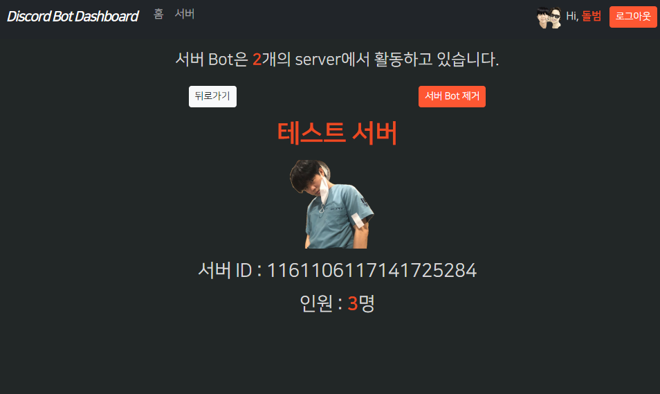

### 서버 정보 페이지에서 bot 제거 기능 추가하기

- **해당 서버의 discord에서 bot을 `추방하기`해도 되지만, web에서 제공할 수 있게 구현한다.**

#### discord bot에 leave_guild Server.route 구현 -> delete_guild route에서 ipc_client로 호출

1. ipc_client에서는 request시 `guild_id=guild_id`를 건네줘서, data에서 받는다.
    - **이 때 얻은 guild객체를 `await guild.leave()`를 하면, 해당 bot이 해당 server에서 추방(스스로 나감)되게 된다.**
    - **실패할 수 도 있으니, dict()를 통해 success여부와 message를 같이 전달한다.**
    ```python
    
    class DiscordBot(ezcord.Bot):
        # ...
        @Server.route()
        async def leave_guild(self, data: ClientPayload):
            guild = self.get_guild(data.guild_id)
            if guild:
                try:
                    await guild.leave()
                    return {"success": True, "message": f"Bot has left the server {data.guild_id}."}
                except discord.Forbidden:
                    return {"success": False, "message": "I do not have total_permission to leave the server."}
                except discord.HTTPException:
                    return {"success": False, "message": "Failed to leave the server."}
            else:
                return {"success": False, "message": f"Guild {data.guild_id} not found."}
    ```

### route에서 post body 받기

#### Schema 없이 POST form의 body 값들 받기 + is_htmx로 redirect 처리해주기

1. **삭제 작업은 `GET + path`가 아니라 `POST + form데이터`로 한다.**
    - **Schema가 없다면, route의 인자로는 `Form(...)`으로 받으면 된다. 만약 null 허용이라면 `Form(default=xxx)`로 잡으면 된다.**
    ```python
    @router.post("/guilds/delete")
    @oauth_login_required(SnsType.DISCORD)
    async def delete_guild(
            request: Request,
            is_htmx=Depends(is_htmx),
            # guild_id: Optional[int] = Form(default=None)
            guild_id: int = Form(...)
    ):
    ```

2. **이 때, `hx-post로 날릴 예정`이라, htmx요청인지 확인 후 -> `redirect를 RedirectResponse가 아닌 Response + headers`로 처리해야한다.**
    - **기존에 http_utils.py에 만들어둔 is_htmx메서드는 request:Request를 받으므로 `async def아니여도 dependency`로 활용 가능하다**
    - **request.headers 속에 `hx-request`가 `문자열 true`로 들어가있다면, htmx 요청이다.**
    ```python
    def is_htmx(request: Request):
        return request.headers.get("hx-request") == 'true'
    ```

3. int로 받은 guild_id를 ipc_client로 leave_guild에 guild_id=로 요청을 보낸다.
    ```python
    @router.post("/guilds/delete")
    @oauth_login_required(SnsType.DISCORD)
    async def delete_guild(
            request: Request,
            is_htmx=Depends(is_htmx),
            # guild_id: Optional[int] = Form(default=None)
            guild_id: int = Form(...)
    ):
    
        leave_guild = await discord_ipc_client.request('leave_guild', guild_id=guild_id)
        leave_guild = leave_guild.response
    ```

4. 만약 응답 dict 속 success가 True라면, 해당 user의 guild를 떠나게 되었다.
    - **그렇다면 redirect로 개별guild -> `/guilds`로 redirect보내야한다.**
    - **하지만 기존 redirect는 RedirectResponse로 반환하는데 `htmx는 Redirect된 페이지를 hx-target으로 집어넣어버린다.`**
      

5. **redirect() 유틸메서드에 `is_htmx=`여부를 받아, 만약 htmx요청이라면, `Response객체에 headers에 HX-Redirect`로 응답해줘야한다.**
    ```python
    def redirect(path, cookies: dict = {}, logout=False, is_htmx=False):
        # htmx 요청을 redirect할 경우 -> RedirectResponse (X) Response + 302 + HX-Redirect에 path
        if is_htmx:
            response: Response = Response(status_code=302)
            response.status_code = 302
            response.headers['HX-Redirect'] = str(path) if not isinstance(path, str) else path
        else:
            response = RedirectResponse(path, status_code=302)
    
        for k, v in cookies.items():
            response.set_cookie(key=k, value=v, httponly=True)
    
        if logout:
            response.delete_cookie('Authorization')
    
        return response
    ```
    - **bot삭제가 완료되면 개별 guild가 아닌 guilds전체로 redirect시킨다.**
    ```python
    @router.post("/guilds/delete")
    @oauth_login_required(SnsType.DISCORD)
    async def delete_guild(
            request: Request,
            is_htmx=Depends(is_htmx),
            # guild_id: Optional[int] = Form(default=None)
            guild_id: int = Form(...)
    ):
    
        leave_guild = await discord_ipc_client.request('leave_guild', guild_id=guild_id)
        leave_guild = leave_guild.response
    
        # user 관리 서버 중, bot에 없는 guild -> [bot 추가 url]을 만들어준다.
        if not leave_guild['success']:
            raise
    
        # return redirect(request.url_for('guilds'))
        return redirect(request.url_for('guilds'), is_htmx=is_htmx)
    ```
   

### front에서 hx-post + hx-vals로 POST + form데이터 요청하기
1. `hx-post=`를 이용해서 post요청을 보낼 때, **body 데이터는 `hx-vals='{"name":"value"}'`형식으로 보낼 수 있다.**
    - **jinja는 `{{}}` 지만, hx-vals 는 `{}`의 object(dict)형태로 작성하면 된다.**
    ```html
    
    <button class='btn btn-sm btn-auth'
            hx-post='{{ url_for("delete_guild") }}'
            hx-vals='{"guild_id": "{{ id }}"}'
    >
        서버 Bot 제거
    </button>
    ```

#### POST route의 썡 Form(...) 대신 Schema 적용하기
- 참고: https://github.dev/riseryan89/imizi-api/blob/main/app
    - 이미지 올리는 application
1. app > schemas > `discord.py`를 생성하여, view에서 보내는 hx-vals의 항목들을 `:int`로 변환하여 받을 수 있게 Schema Model을 작성한다.
    - **이 때, Field()를 사용하면 제약조건 이나 설명등을 더 사용할 수 있게 된다. `...`는 default값 없는 필수값이다.**
    ```python
    class GuildLeaveRequest(BaseModel):
    
        guild_id: int = Field(..., description='삭제할 guild의 id')
    ```
   
2. 이 Request Schema를 route에서 받으면, **에러가 난다. `hx-post`로 오는 경우 `hx-vals`를 pydantic에서 인식못한다.**
    - **fastapi는 `Form()`으로 `hx-vals`들을 인식했지만, pydantic은 받질 못한다.**
    ```python
    @router.post("/guilds/delete")
    @oauth_login_required(SnsType.DISCORD)
    async def delete_guild(
            request: Request,
            # guild_id: int = Form(...),
            body: GuildLeaveRequest,
            is_htmx=Depends(is_htmx),
    ):
        #...
    ```
    - **pydantic Schema Model은 hx-vals를 못받아서 `422 Entity 에러`가 난다.**

#### hx-vals를 Form()로 개별로 일일히 다 받은 뒤, 유틸메서드로서 Schema + 받은 data dict를 호출하기
- 참고: https://github.dev/codingforentrepreneurs/video-membership

##### 참고프로젝트의 hx-vals를 처리방법 
1. Schema와 route에서 일일히 Form(...)으로 받은 데이터를 route내부에서 유틸메서드를 호출하여 만나도록 함.
    ```python
    import json
    from pydantic import BaseModel, error_wrappers
    
    def valid_schema_data_or_error(raw_data: dict, SchemaModel:BaseModel):
        data = {}
        errors = []
        error_str = None
        try:
            cleaned_data = SchemaModel(**raw_data)
            data = cleaned_data.dict()
        except error_wrappers.ValidationError as e:
            error_str = e.json()
        if error_str is not None:
            try:
                errors = json.loads(error_str)
            except Exception as e:
                errors = [{"loc": "non_field_error", "msg": "Unknown error"}]
        return data, errors
    ```
2. route에서는 Form(...)으로 받은 필드들을 raw_data dict에 집어넣고, 호출하여 cleaned_data dict를 가져와서 사용
    ```python
    @router.post("/create", response_class=HTMLResponse)
    @login_required
    def video_create_post_view(request: Request, is_htmx=Depends(is_htmx), title: str=Form(...), url: str = Form(...)):
        raw_data = {
            "title": title,
            "url": url,
            "user_id": request.user.username
        }
        data, errors = utils.valid_schema_data_or_error(raw_data, VideoCreateSchema)
        redirect_path = data.get('path') or "/videos/create" 
        
        context = {
            "data": data,
            "errors": errors,
            "title": title,
            "url": url,
        }
    
        if is_htmx:
            """
            Handle all HTMX requests
            """
            if len(errors) > 0:
                return render(request, "videos/htmx/create.html", context)
            context = {"path": redirect_path, "title": data.get('title')}
            return render(request, "videos/htmx/link.html", context)
        """
        Handle default HTML requests
        """
        if len(errors) > 0:
            return render(request, "videos/create.html", context, status_code=400)
        return redirect(redirect_path)
    ```
   

#### hx-post의  hx-vals를 Body(...) 의 bytes로 받고, Schema는 wrapprer function에서 정해서 Schema를 호출하는 CustomDependency
1. **원래 route에서 POST의 request body(`hx-vals`)를 받으면, 아래와 같이 `b''`의 `{}`도 없는 bytes 문자열로 반환된다.**
    ```python
    @router.post("/guilds/delete")
    @oauth_login_required(SnsType.DISCORD)
    async def delete_guild(
    # body = Body(...),
            # body >> b'guild_id=1161106117141725284&member_count=3'
    ):
    ```
   
2. **이 bytes반환 Body(...)를 받아 -> `bytes.decode()를 통해 string으로 전환` -> `=로 split한 뒤, dict에 담기`를 통해, Pydantic Schema에 넣을 dict를 완성한다.**
    ```python
    def bytes_body_to_dict(body: bytes = Body(...)):
        # print(f"body >> {body}")
        # body >> b'guild_id=1161106117141725284'
        # body >> b'guild_id=1161106117141725284&member_count=3'
    
        # bytes.decode() -> 문자열로 디코딩
        # body_str = body.decode("utf-8")
        # body_str >> guild_id=1161106117141725284
    
        form_fields = {}
        for param in body.decode('utf-8').split('&'):
            key, value = param.split('=')
            form_fields[key] = value
    
        # form_fields >> {'guild_id': '1161106117141725284'}
        # form_fields >> {'guild_id': '1161106117141725284', 'member_count': '3'}
        return form_fields
    ```
   
3. **name-value가 `각각 문자열로 변환된 form_fields dict`를 Pydantic Schema에 넣어줘야하는데, `route에서 사용할 때 정해지므로`**
    - **외부에서 사용할 변수를 지정할 수 있는 `inner function 형태`(wrapper)로 `return 메서드 비호출 객체`를 반환해주는 메서드를 outer에서 정의한다.**
    - **route에서 실제로는 `body:bytes = Body(...)를 받아 Depends()로 사용`될 외부 Schema지정 Dependency이름을 `hx_vals_schema`로 지었다.**
    - http_utils.py 에 넣어준다.
    ```python
    def hx_vals_schema(schema):
        def bytes_body_to_schema(body: bytes = Body(...)):
            # print(f"body >> {body}")
            # body >> b'guild_id=1161106117141725284'
            # body >> b'guild_id=1161106117141725284&member_count=3'
    
            # bytes.decode() -> 문자열로 디코딩
            # body_str = body.decode("utf-8")
            # body_str >> guild_id=1161106117141725284
    
            form_fields = {}
            for param in body.decode('utf-8').split('&'):
                key, value = param.split('=')
                form_fields[key] = value
    
            # form_fields >> {'guild_id': '1161106117141725284'}
            # form_fields >> {'guild_id': '1161106117141725284', 'member_count': '3'}
            # return form_fields
    
            return schema(**form_fields)
    
        return bytes_body_to_schema
    ```
    
4. **route에서는 Dependency로 사용해준다.**
    - **`body`로 받아서, `body.xxx`로 사용하면 된다.**
    ```python
    @router.post("/guilds/delete")
    @oauth_login_required(SnsType.DISCORD)
    async def delete_guild(
            request: Request,
            body=Depends(hx_vals_schema(GuildLeaveRequest)),
            is_htmx=Depends(is_htmx),
    ):
        print(f"body >> {body}")
        # body >> guild_id=1161106117141725284
        # body >> guild_id=1161106117141725284 member_count=3
    
        # leave_guild = await discord_ipc_client.request('leave_guild', guild_id=guild_id)
        leave_guild = await discord_ipc_client.request('leave_guild', guild_id=body.guild_id)
        leave_guild = leave_guild.response
    ```
   


### guild.html -> guild-detail.html로 바꾸고 꾸미기
1. guild.html 대신 guild-detail.html로 바꾼다.
    ```python
    return render(request, 'bot_dashboard/guild-detail.html', context={**guild_stats})
    ```

2. **개별 guild 정보 요청(`guild_stats`)시 icon url을 `icon`으로 반환해준다.**
    - **이 때, `user_guilds`와 다르게 self.get_guild() -> `Guild객체` -> .icon -> `Asset`객체 -> .url 로 얻어내야한다.**
    - **`guild.icon.url`는 `?size=1024`가 기본인데 작게 요청하기 위해 `update_query_string(size=)`로 qs를 조절한다.**
        - 아무 숫자나 안되고 64배수만 되는 듯하다.
    ```python
    class DiscordBot(ezcord.Bot):
    
        @Server.route()
        async def guild_stats(self, data: ClientPayload):
            guild = self.get_guild(data.guild_id)
            # .get_guild -> Guild: https://discordpy.readthedocs.io/en/stable/api.html#discord.Guild
            # => .icon은 image url이 아닌 Asset 객체
            # .icon -> Asset: https://discordpy.readthedocs.io/en/stable/api.html#discord.Asset
            # Attributes
            # - key, url
            # => guild.icon(Asset).url 로 써야 이미지 경로가 나온다.
    
            if not guild:
                return {}  # 외부에서 .response는 때려야하므로 ...
    
            icon = guild.icon.url
            # icon : https://cdn.discordapp.com/icons/1156511536316174368/b56a15058665d945d28251148720f3b9.png?size=1024
            icon = update_query_string(icon, size=128)
            # icon = guild.icon.url.with_size(35)
            # print(f"icon >> {icon}")
            # icon >> https://cdn.discordapp.com/icons/1156511536316174368/b56a15058665d945d28251148720f3b9.png?size=55
    
            return {
                "id": data.guild_id,
                "name": guild.name,
                "member_count": guild.member_count,
                "icon": icon
            }
    ```
   
3. guild-detail.html을 수정한다.
    - 뒤로가기 + bot제거 버튼을  flex 공간안에 양쪽여백을 포함한 벌리기인 `evenly`로 수평정렬해주고
    - **뒤로가기 버튼은 hx-get -> redirect가 안되므로 `a태그 > button`을 유지해서 한다.**
    - img태그의 src=""에  `{{icon}}`을 넣어서 길드 이미지가 보이게 한다.
    ```html
    
    
     {{ name }} | {{ super() }} 
    
    
        <div class="d-flex justify-content-evenly mb-3">
            {#<a href="javascript:history.back();">#}
            {# bot 추가 url담에 넘어올 수 있어서, route로 링크를 건다. #}
            <a href="{{ request.url_for('guilds') }}">
                <button class="btn btn-sm btn-light">뒤로가기</button>
            </a>
            <button class='btn btn-sm btn-auth'
                    hx-post='{{ url_for("delete_guild") }}'
                    hx-vals='{"guild_id": "{{ id }}"}'
            >
                서버 Bot 제거
            </button>
        </div>
    
        <h1><strong>{{ name }}</strong></h1>
    
        
    
        <div class="d-flex flex-column justify-content-start">
            <h3 class="h3 my-2"> 서버 ID : {{ id }} </h3>
            <h3 class="h3 my-2"> 인원 : <strong>{{ member_count }}</strong>명</h3>
        </div>
    
    
    
    
    ```

### 도커 명령어

1. (`패키지 설치`시) `pip freeze` 후 `api 재실행`

```shell
pip freeze > .\requirements.txt

docker-compose build --no-cache api; docker-compose up -d api;
```

2. (init.sql 재작성시) `data폴더 삭제` 후, `mysql 재실행`

```shell
docker-compose build --no-cache mysql; docker-compose up -d mysql;
```

```powershell
docker --version
docker-compose --version

docker ps
docker ps -a 

docker kill [전체이름]
docker-compose build --no-cache
docker-compose up -d 
docker-compose up -d [서비스이름]
docker-compose kill [서비스이름]

docker-compose build --no-cache [서비스명]; docker-compose up -d [서비스명];

```

3. docker 추가 명령어

```powershell
docker stop $(docker ps -aq)
docker rm $(docker ps -aqf status=exited)
docker network prune 

docker-compose -f docker-compose.yml up -d
```

### pip 명령어

```powershell
# 파이참 yoyo-migration 설치

pip freeze | grep yoyo

# 추출패키지 복사 -> requirements.txt에 붙혀넣기

```

### git 명령어

```powershell
git config user.name "" 
git config user.email "" 

```

### yoyo 명령어

```powershell
yoyo new migrations/

# step 에 raw sql 작성

yoyo apply --database [db_url] ./migrations 
```

- 참고
    - 이동: git clone 프로젝트 커밋id 복사 -> `git reset --hard [커밋id]`
    - 복구: `git reflog` -> 돌리고 싶은 HEAD@{ n } 복사 -> `git reset --hard [HEAD복사부분]`