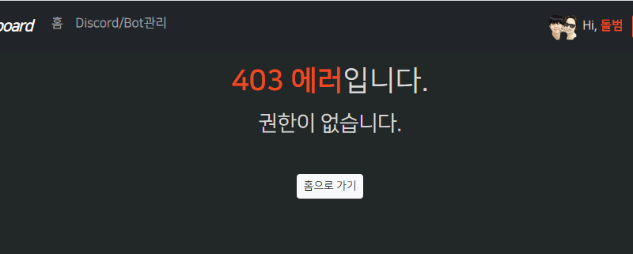

### required 데코레이터 속 에러는 템플릿 route_class_에서 못잡는다.
- 전에 구현해봤던 `route 용 custom_error_handler`를 구현할 수 있는 APIRoute 상속 Template Route에서 `custom_route_handler` 속에서 except로 잡아도
    - **`데코레이터는 route 진입 전`에 처리되기 때문에, Custom APIRouter에서 에러를 못잡는다!!**

### 데코레이터의 에러는 app에서 잡던지, middleware에서 처리해야한다.
#### middleware에서 잡아줄 TemplateException 구현하기
1. 현재 필요한 것은 TemplateException 중에서도 `권한없음의 403(forbidden)`이 필요하다.
    ```python
    from starlette import status
    
    
    class TemplateException(Exception):
        status_code: int
        code: str
        message: str
        detail: str
        exception: Exception
    
        def __init__(
                self,
                *,
                status_code: int = status.HTTP_500_INTERNAL_SERVER_ERROR,
                code: str = "0000000",
                message: str = "템플릿 서버에 문제가 발생했습니다.",
                detail: str = None,
                exception: Exception = None,
        ):
            self.status_code = status_code
            self.code = code
            self.message = message  # 유저에게 바로 보여주는 메세지
            self.detail = detail  # 에러마다의 해당 정보를 보여주는 메세지
            self.exception = exception
            # self.result_data: dict 도 필요할 수 도
            super().__init__(exception)
    
    
    # 403 FORBIDDEN
    class ForbiddenException(TemplateException):
        def __init__(self, *, code_number: [str, int] = "0", detail: str = None, exception: Exception = None):
            if not isinstance(code_number, str):
                code_number = str(code_number)
    
            super().__init__(
                status_code=status.HTTP_403_FORBIDDEN,
                code=f"{status.HTTP_403_FORBIDDEN}{code_number.zfill(4)}",
                message="접근 권한이 없습니다.",
                detail=detail,
                exception=exception,
            )
    
    ```
2. 권한 데코레이터에서는 redirect 할 곳이 없다. 에러페이지로 가기 위해 `raise ForbiddenException(defailt=)`을 내어준다.
    ```python
    def permission_required(permission: Permissions):
        def decorator(func):
            @wraps(func)
            async def wrapper(request: Request, *args, **kwargs):
                user: Users = request.state.user
    
                if not user.has_permission(permission):
                    raise ForbiddenException(detail=f'{permission.name}에 대한 권한이 없음.')
    
                return await func(request, *args, **kwargs)
            
            return wrapper
        return decorator
    
    
    def role_required(role_name: RoleName):
        def decorator(func):
            @wraps(func)
            async def wrapper(request: Request, *args, **kwargs):
                user: Users = request.state.user
    
                # 내부에서 user.has_permission을 이용
                if not user.has_role(role_name):
                    raise ForbiddenException(
                        detail=f'{role_name.name}에 대한 권한이 없음.',
                    )
    
                return await func(request, *args, **kwargs)
            return wrapper
        return decorator
    ```
#### middleware에서는 TemplateException도 관리하는 Exception으로서, exception_handler의 강제변환에서 제외시킨다.
1. 템플릿 에러도 알지못하는 Exception -> `관리되는 logging가능 APIException`으로의 강제변환 없이, 취급하는 것으로 간주하게 추가해준다.
    ```python
    async def exception_handler(exception: Exception):
        # if not isinstance(exception, (APIException, SQLAlchemyException)):
        # - 템플릿 에러도 강제변환 없이, 취급하는 것으로 간주하게 추가해준다.
        if not isinstance(exception, (APIException, SQLAlchemyException, TemplateException)):
            exception = APIException(exception=exception, detail=str(exception))
        ...
        return exception
    ```
2. 이제 dispatch의 except에서 반환되는 에러가 APIException, SQLAlchemyException만 잇는 것이 아니라 `TemplateException`도 있다.
    ```python
    class AccessControl(BaseHTTPMiddleware):
    
        async def dispatch(self, request: Request, call_next: RequestResponseEndpoint) -> Response:
            await self.init_state(request)
            #...
    
            try:
                #...
            except Exception as e:
                error: [APIException, SQLAlchemyException, TemplateException] = await exception_handler(e)
                #...
    ```

#### 문제점) TemplateException은 JSONResponse가 아닌 render(HTMLResponse)하고 싶은데, logging시 request속 user쓰다가 DetachError난다.
1. 이제 에러를 잡은 상태에서, TemplateException은 JSONResponse가 아닌 `render()`시키고 싶은데
    - **route용 depends로 얻는 `request.state.user`를 middleware에서 접근하면 `DetachedError`가 난다.**
    - **render를 시킬 수 없으니, redirect를 통해 에러 처리 route로 보내서 user를 사용할 수 있게 한다..**
    - **이 때, path parameter로 stats_code도 같이 보내자.**
    ```python
    if isinstance(error, (APIException, SQLAlchemyException)):
        response = JSONResponse(status_code=error.status_code, content=error_dict)
    
    # elif isinstance(error, TemplateException):
    # 템플릿 에러 -> route depends용 request.state.user을 나와서 render하니 DetachError난다.
    # => redirect로 에러페이지로 보내자.
    else: 
        # template_name = 'bot_dashboard/errors.html'
        # context = {
        #     "status_code": error.status_code,
        #     "message": error.message,
        #     "detail": error.detail,
        # }
        # render(request, template_name, context=context)
        response = redirect(request.url_for('errors', status_code=error.status_code))
    ```
   
#### /errors route in index.py
1. discord dashboard 뿐만 아니라 모든 template에 대한 에러를 처리할 예정이므로, index.py에 정의했다.
    - 이렇게 되면, bot_count가 아마 작동안될 것이다.
    - **또한 path로 detail, message등이 못오고 status_code만 오는 상황이다.**
    - **message/detail은 log에 양보하고, errors route 내에서 `status_code에 따른 message`만 if문으로 나눠서 보내자.**
    - **`새롭운 request가 route안`으로 와서 render()하면, 내부에서 `request.state.user가 DetachedError 안나고 제대로 살아있을 것`이다.**
    ```python
    @router.get("/errors/{status_code}")
    async def errors(request: Request, status_code: int):
    
        message = "관리자에게 문의해주세요."
        if status_code == status.HTTP_403_FORBIDDEN:
            message = "권한이 없습니다."
    
        context = {
            "status_code": status_code,
            "message": message,
        }
    
        return render(request, 'bot_dashboard/errors.html', context=context)
    ```
   

2. errors.html을 만들어서, status_code와 message를 뿌려준다.
    ```html
    
    
     {{ status_code }} | {{ super() }} 
    
    
        <h1><strong>{{ status_code }} 에러</strong>입니다.</h1>
        <h3 class="my-3">
            {{ message }}
        </h3>
    
        <div class="mt-5">
            <a class="mt-5" href="{{ url_for('discord_home') }}">
                <button class="btn btn-sm btn-light">홈으로 가기</button>
            </a>
        </div>
    
    ```
    

#### 또다른 에러처리 -> 아래 logger.log() 내부에서도 request.state.user를 쓰고 있다.
- **template Error에서는 request.state.user에 접근하는 순간 Middleware에서 에러가 발생해버린다.**
    - try except로 잡아서 try는 APIException일 것이고, except에 걸린 TemplateException의 경우, `user = email = None`으로 처리해서 user_dict안에 에러 안나게 한다.
```python
if isinstance(error, (APIException, SQLAlchemyException, DBException)):
    response = JSONResponse(status_code=error.status_code, content=error_dict)

else:
    response = redirect(request.url_for('errors', status_code=error.status_code))

# logging => 템플릿 에러시 내부 request.state.user 사용으로 DetachedError 나는 것을 try로 잡아 except  -> user = 'TemplateException'
if isinstance(error, (SQLAlchemyException, DBException)):
    # APIException의 하위 DBException class부터 검사하여 해당하면 db_logger로 찍기
    await db_logger.log(request, error=error)
else:
    await app_logger.log(request, error=error)

return response
```
```python
class Logger:

    async def log(self, request: Request, response=None, error=None):

        #### 템플릿일 땐, detache error난다.
        try:
            user = request.state.user
            email = user.email.split("@") if user and user.email else None
        except DetachedInstanceError:
            user = email = None
            
        user_log = dict(
            client=request.state.ip,
            user=user.id if user and user.id else None,
            email="**" + email[0][2:-1] + "*@" + email[1] if user and user.email else None,
        )
```

#### errors.html 페이지에 bot 활동여부 with bot_guild_count가 뜨는 base.html의 내용에 if문을 건다.
```html
<!-- content -->
<div class="container-fluid mt-3">
    
        <h4 class="h4 mb-4">서버 Bot은 <strong>{{ bot_guild_count }}</strong>개의 server에서 활동하고 있습니다.</h4>
    
     base 
</div>
<!-- content -->
```



#### templates > bot_dashboard -> 일반 dashboard로 변경
1. 템플릿 폴더명을 `bot_dashboard` -> `dashboard`로 변경하고, bot_dashboard/로 검색해서 render path를 다 수정해준다.
2. 

## DOCEKR, 설정 관련

### 터미널에서 main.py가 아닌 os로 DOCKER_MODE아니라고 신호주고 사용
- **docker -> `mysql`호스트DB접속이 아니라 | local -> `localhost`호스트DB접속시키려면 환경변수를 미리입력해줘야한다.**
- **비동기(`await`)가 가능하려면, python 터미널이 아닌 `ipython`으로 들어와야한다.**
```python
import os;os.environ['DOCKER_MODE']="False";
from app.models import Users
```
### 도커 명령어

1. (`패키지 설치`시) `pip freeze` 후 `api 재실행`

```shell
pip freeze > .\requirements.txt

docker-compose build --no-cache api; docker-compose up -d api;
```

2. (init.sql 재작성시) `data폴더 삭제` 후, `mysql 재실행`

```shell
docker-compose build --no-cache mysql; docker-compose up -d mysql;
```

```powershell
docker --version
docker-compose --version

docker ps
docker ps -a 

docker kill [전체이름]
docker-compose build --no-cache
docker-compose up -d 
docker-compose up -d [서비스이름]
docker-compose kill [서비스이름]

docker-compose build --no-cache [서비스명]; docker-compose up -d [서비스명];

```

3. docker 추가 명령어

```powershell
docker stop $(docker ps -aq)
docker rm $(docker ps -aqf status=exited)
docker network prune 

docker-compose -f docker-compose.yml up -d
```

### pip 명령어

```powershell
# 파이참 yoyo-migration 설치

pip freeze | grep yoyo

# 추출패키지 복사 -> requirements.txt에 붙혀넣기

```

### git 명령어

```powershell
git config user.name "" 
git config user.email "" 

```

### yoyo 명령어

```powershell
yoyo new migrations/

# step 에 raw sql 작성

yoyo apply --database [db_url] ./migrations 
```

- 참고
    - 이동: git clone 프로젝트 커밋id 복사 -> `git reset --hard [커밋id]`
    - 복구: `git reflog` -> 돌리고 싶은 HEAD@{ n } 복사 -> `git reset --hard [HEAD복사부분]`