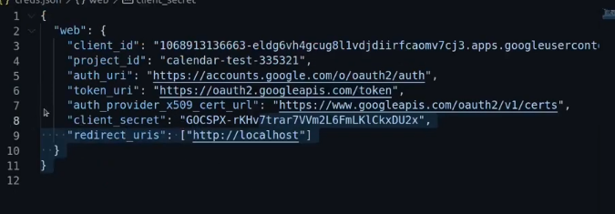
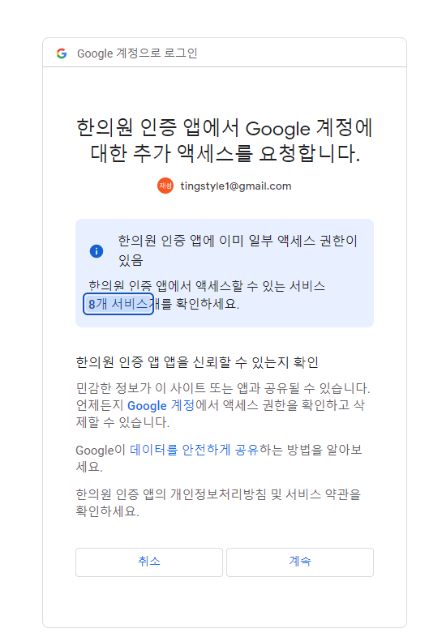
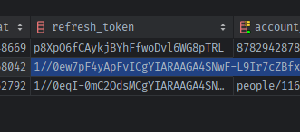
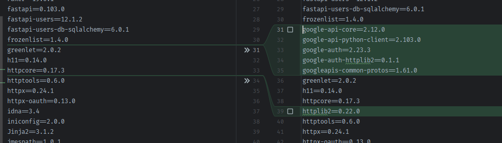

### google python

### secret.json을 안쓰고 처리하기

- https://github.com/googleworkspace/python-samples/blob/main/calendar/quickstart/quickstart.py

1. quickstart.py 속을 보니 모든 **`build`(creds = ) 가 `최종 필요한 인증된 객체`**고, 그전에 인증정보를 담은 `Credentials객체`를 `json파일`을 통해 만든다.
    - 정확하게는 **`credentials.json` + `SCOPES` + InstalledAppFlow -> `token.json`을 먼저 만들고**
    - **`token.json` + Credentials.from_authorized_user_file() -> `creds 객체`를 만든다.**
      
    ```python
    from google.oauth2.credentials import Credentials
    from google_auth_oauthlib.flow import InstalledAppFlow
    from googleapiclient.discovery import build
    
    SCOPES = ['https://www.googleapis.com/auth/calendar.readonly']
    
    
    def main():
        """Shows basic usage of the Google Calendar API.
        Prints the start and name of the next 10 events on the user's calendar.
        """
        creds = None
        # The file token.json stores the user's access and refresh tokens, and is
        # created automatically when the authorization flow completes for the first
        # time.
        if os.path.exists('token.json'):
            creds = Credentials.from_authorized_user_file('token.json', SCOPES)
        # If there are no (valid) credentials available, let the user log in.
        if not creds or not creds.valid:
            if creds and creds.expired and creds.refresh_token:
                creds.refresh(Request())
            else:
                flow = InstalledAppFlow.from_client_secrets_file(
                    'credentials.json', SCOPES)
                creds = flow.run_local_server(port=0)
            # Save the credentials for the next run
            with open('token.json', 'w') as token:
                token.write(creds.to_json())
    
        try:
            service = build('calendar', 'v3', credentials=creds)
    ```

2. 하지만 Credentials class를 펴보면,
    - https://github.com/googleapis/google-auth-library-python/blob/f19f610ce6afeea74fd634c356abb24192a843b8/google/oauth2/credentials.py#L54
    - `from_authorized_user_file` 외에 **user_info를 가진상태로서 `from_authorized_user_info(cls, info, scopes=None)`도 존재한다.**
    ```python
    class Credentials(credentials.ReadOnlyScoped, credentials.CredentialsWithQuotaProject):
        """Credentials using OAuth 2.0 access and refresh tokens..
        """
        def __init__(
            self,
            token,
            refresh_token=None,
            id_token=None,
            token_uri=None,
            client_id=None,
            client_secret=None,
            scopes=None,
            default_scopes=None,
            quota_project_id=None,
            expiry=None,
            rapt_token=None,
            refresh_handler=None,
            enable_reauth_refresh=False,
            granted_scopes=None,
        ):
        @classmethod
        def from_authorized_user_info(cls, info, scopes=None):
            """Creates a Credentials instance from parsed authorized user info.
            #...
            
        @classmethod
        def from_authorized_user_file(cls, filename, scopes=None):
            """Creates a Credentials instance from an authorized user json file.
    ```

3. **`from_authorized_user_info()`메서드를 좀 더 자세히 살펴보면**
    - **`refresh_token, client_id, client_secret`를 필수로 받는데, 구글로그인만 하면 refresh_token이 없다. `따로 설정`이 필요하다.**
    - `scopes`는 info dict에 포함되어도 되며, info dict에 포함될거면 scopes key에 value는 `"scoep1 scope2"`의 띄워쓰기 1개로 구분한 string으로
      들어와야한다.
    - **info에 만료기간이 없으면 알아서 `expiry` key로 직접 만든다.**
    ```python
    @classmethod
    def from_authorized_user_info(cls, info, scopes=None):
        """Creates a Credentials instance from parsed authorized user info.
    
        Args:
            info (Mapping[str, str]): The authorized user info in Google
                format.
            scopes (Sequence[str]): Optional list of scopes to include in the
                credentials.

        """
        keys_needed = set(("refresh_token", "client_id", "client_secret"))
        missing = keys_needed.difference(six.iterkeys(info))
    
        if missing:
            raise ValueError(
                "Authorized user info was not in the expected format, missing "
                "fields {}.".format(", ".join(missing))
            )
    
        # access token expiry (datetime obj); auto-expire if not saved
        expiry = info.get("expiry")
        if expiry:
            expiry = datetime.strptime(
                expiry.rstrip("Z").split(".")[0], "%Y-%m-%dT%H:%M:%S"
            )
        else:
            expiry = _helpers.utcnow() - _helpers.REFRESH_THRESHOLD
    
        # process scopes, which needs to be a seq
        if scopes is None and "scopes" in info:
            scopes = info.get("scopes")
            if isinstance(scopes, six.string_types):
                scopes = scopes.split(" ")
    
        return cls(
            token=info.get("token"),
            refresh_token=info.get("refresh_token"),
            token_uri=_GOOGLE_OAUTH2_TOKEN_ENDPOINT,  # always overrides
            scopes=scopes,
            client_id=info.get("client_id"),
            client_secret=info.get("client_secret"),
            quota_project_id=info.get("quota_project_id"),  # may not exist
            expiry=expiry,
            rapt_token=info.get("rapt_token"),  # may not exist
        )
    ```

#### google cloud application에 Calendar API 사용설정 추가

1. `사용설정된 API 및 서비스`에서 Google Calendar API 추가
2. 비로소 `동의화면`에서 앱수정 > 동의후 계속 > API 범위 추가 및 삭제 > `API` 검색 후 calendar api 다 사용하도록 추가
    - 일단 민감범위도 다 추가.
3. `fastapi-users`의 oauth 로그인에 사용되는 `google oauth client`객체 생성시 scope 추가
    - **로그인 할 때 calendar 사용여부까지 물어보게 된다.**
    ```python
    def get_google_client():
        # return GoogleOAuth2(
        return GoogleClient(
            GOOGLE_CLIENT_ID,
            GOOGLE_CLIENT_SECRET,
            scopes=google.BASE_SCOPES + [
                "openid",
                "https://www.googleapis.com/auth/user.birthday.read",  # 추가 액세스 요청 3개 (전부 people api)
                "https://www.googleapis.com/auth/user.gender.read",
                "https://www.googleapis.com/auth/user.phonenumbers.read",
                # 달력 조정 추가
                "https://www.googleapis.com/auth/calendar",
                "https://www.googleapis.com/auth/calendar.events",
            ])
    ```

### 문제점) 일반 구글 로그인 연동시 `refresh_token`을 발급해주지 않아 Credentials 객체를 생성할 수 없다.

- **결과적으로 authorization_url을 생성해주는 `google_oauth_client`에 `get_authorization_url 메서드를 재정의`해서, oauth 로그인시 refresh_token을
  발급해주도록 query parameter를 추가해야한다.**
    - 만약, refresh_token없이 생성하면 아래와 같은 에러가 뜬다.
    ```
    google.auth.exceptions.RefreshError: ('invalid_request: Missing required parameter: refresh_token', {'error': 'invalid_request', 'error_description': 'Missing required parameter: refresh_token'})
    ```

1. **참고 문서들을 살펴보면, `access_type=offline`를 authorizaion_url에 query string으로 포함시켜야, `refresh token이 application 최초 1회 로그인`
   시 발급되며**
    - **`prompt=consent`를 추가해서 동의화면을 띄워야, Product모드가 아닌 상황에서 매번 refresh token이 발급되게 할 수 있다.**
    - [문서1-달록 spring](https://hyeonic.github.io/woowacourse/dallog/google-refresh-token.html#%E1%84%86%E1%85%AE%E1%86%AB%E1%84%8C%E1%85%A6%E1%84%8C%E1%85%A5%E1%86%B7):
    - [문서2-nodejs](https://m.blog.naver.com/dldbdgml99/222013891067)

2. **google의 authorization_url을 발급해주는 객체는 GoogleClinet클래스의 get_authorization_url메서드이므로 재정의해서 parameter 2개를 추가해준다.**
    ```python
    async def get_authorization_url(self, redirect_uri: str, state: Optional[str] = None,
                                    scope: Optional[List[str]] = None, extras_params: Optional[T] = None,
                                    ) -> str:
        """
        구글 로그인 성공시 refresh token을 받기 위해, authroization_url에 파라미터를 추가하기 위해 재정의
    
        """
        # https://hyeonic.github.io/woowacourse/dallog/google-refresh-token.html#%E1%84%8B%E1%85%A5%E1%86%B7%E1%84%80%E1%85%A7%E1%86%A8%E1%84%92%E1%85%A1%E1%86%AB-google
        # "access_type=offline"
    
        # 운영 환경: Refresh Token 발급을 위해 accept_type을 offline으로 설정한다. 단 최초 로그인에만 Refresh Token을 발급 받기 위해
        #  - prompt는 명시하지 않는다.
        # 개발 환경: 개발 환경에서는 매번 DataBase가 초기화 되기 때문에 Refresh Token을 유지하여 관리할 수 없다. 테스트를 위한 추가적인 Google Cloud Project를 생성한 뒤, accept_type을 offline으로,
        #  - prompt는 consent로 설정하여 매번 새롭게 Refresh Token을 받도록 세팅한다.
        # #정리
    
        if extras_params is None:
            extras_params = {}
    
        refresh_token_params = {
            'access_type': 'offline',  # 이 옵션을 추가하면, browser 최초 로그인시에만 refresh token을 최초 1회만 발급해준다.
            # 'prompt': 'consent',  # 최초1회 발급하는 refresh token -> 동의화면을 띄워 매번 받게 함.
            'include_granted_scopes': 'true',  # 기존 동의받은 scope를 재확인한다.
        }
    
        # 운영환경이 아닐 때만, 매번 동의화면 띄워서 -> 동의화면 띄우기 -> 매번 refresh 토큰 받도록 설정
        # => &prompt=consent 옵션이 사라지는 순간, 로그아웃 후, 직접 로그인창을 통해 로그인해야 refresh token이 access_type=offline 하에 발급된다.
        # => 즉, 브라우저 자동 로그인 기간동안에는, 동의화면 없이, 넘어가서 refresh token이 발급안된다.
        if not isinstance(config, ProdConfig):
            # 테스트 결과 이미 browser에 로그인되어 인증정보가 박힌 상태로서 -> 로그인 및 동의화면 안 뜰 때, refresh 토큰 발급이 안된다.
            refresh_token_params = refresh_token_params | {'prompt': 'consent'}

        extras_params = {**extras_params, **refresh_token_params}
    
        authorization_url = await super().get_authorization_url(redirect_uri, state, scope, extras_params)
    
        # {
        #   "data": {
        #     "authorization_url": "https://accounts.google.com/o/oauth2/v2/auth?~~access_type=offline&prompt=consent"
        #   },
        #   "version": "1.0.0"
        # }
    
        return authorization_url
    ```


3. 이제 docs에서 fastapi-users의 google용 authorize에서 authorization_url을 접속하여
    - refresh token이 db에 들어오는 것을 확인한다.
      
      

### 패키지 설치 및 cred.json 없이 Credentials -> build 만들어보기

1. quickstart.py에서 필요한 package 중에, `build`가 포함된 `googleapiclient` 라이브러리의 설치만 진행해본다.
    - 문서: https://developers.google.com/calendar/api/quickstart/python
    - calendar 부분
      github: https://github.com/googleworkspace/python-samples/blob/main/calendar/quickstart/quickstart.py#L22
    ```shell
    pip install --upgrade google-api-python-client #google-auth-httplib2 google-auth-oauthlib
    pip freeze > .\requirements.txt

    ```

    - **자동으로 `google-auth-httplib2`는 따라 설치되는 것 같다.**
    ```
    Installing collected packages: uritemplate, pyparsing, pyasn1, protobuf, rsa, pyasn1-modules, httplib2, googleapis-common-protos, google-auth, google-auth-httplib2, google-api-core, google-api-python-client
    ```
   


2. **첫번째 google-api-python-client만 설치해도 `build`외에 `Credentials`도 사용할 수 있다.**

#### discord_home route에서, 임시로, 로그인 한 user의 google oauth account 모델 데이터에서 Credentials 생성에 필요한 정보를 가져온다.

1. 구글 계정 정보가 있는지는 데코레이터에서 사용되었던 `user.get_oauth_access_token(sns_type)`를 활용하고
2. 만약, 로그인된 상태면서 & 구글 계정 정보가 있으면 -> 구글 계정 정보 전체를 가져오는 `user.get_oauth_account(sns_type)`을 먼저 정의해서 가져온다
    ```python
    class Users(BaseModel, SQLAlchemyBaseUserTable[int]):
    
        def get_oauth_access_token(self, sns_type: SnsType):
            """
            lazy="joined"되어 session 없이, oauth_accounts 모델에서 특정 oauth의 access_token을 얻는 메서드
            """
            for existing_oauth_account in self.oauth_accounts:
                if existing_oauth_account.oauth_name == sns_type.value:
                    return existing_oauth_account.access_token
    
            return None
    
        def get_oauth_account(self, sns_type: SnsType):
            """
            lazy="joined"되어 session 없이, oauth_accounts 모델에서 특정 oauth의 row 데이터르 얻는 메서드
            """
            for existing_oauth_account in self.oauth_accounts:
                if existing_oauth_account.oauth_name == sns_type.value:
                    return existing_oauth_account
    
            return None
    ```
3. discord_home route에 적용한다
    ```python
    @router.get("/")
    async def discord_home(request: Request):
        user = request.state.user
    
        if user and user.get_oauth_access_token(SnsType.GOOGLE):
            oauth_account: OAuthAccount = user.get_oauth_account(SnsType.GOOGLE)
            
        return render(request, "dashboard/home.html")
    ```


4. **`Credentials.from_authorized_user_info()`로 creds를 만들 땐, 5가지 정보가 필요하다.**
    - 글 계정정보 중 [access_token + refresh_token]
    - 구글 config정보 [GOOGLE_CLIENT_ID + GOOGLE_CLIENT_SECRET]
    - cred객체 생성후 build객체로 [서비스 요청할 scopes 범위]
    - **creds객체를 만들 땐, info:dict가 5가지를 채워서 넣어줘야한다.**
    - **`scope`는 임시로, `calendar + calendar.events`만 넣어준다.**

    ```python
    @router.get("/")
    async def discord_home(request: Request):
    
        from google.oauth2.credentials import Credentials
        from googleapiclient.discovery import build
    
        user = request.state.user
    
        if user and user.get_oauth_access_token(SnsType.GOOGLE):
            google_account: OAuthAccount = user.get_oauth_account(SnsType.GOOGLE)
    
            creds = Credentials.from_authorized_user_info(
                info=dict(
                    token=google_account.access_token,
                    refresh_token=google_account.refresh_token,
                    client_id=GOOGLE_CLIENT_ID,
                    client_secret=GOOGLE_CLIENT_SECRET,
                    scopes=["https://www.googleapis.com/auth/calendar", "https://www.googleapis.com/auth/calendar.events"],
                )
            )
    ```

5. **build객체를 만들 땐 creds객체 외 `service name`도 넣어줘야한다. calendar로 넣어주고 객체를 만들자.**
    - **예제에 따라서, utcnow() -> `.isoformat()` string 화 -> 문자열 `Z`를 붙여서 string datetime isoformat에 `UTC`를 명시한다**
    - **예제에 따라서, build한 `calendar 서비스`의 `.events().list()`에
      - `canlendarId=`를 `'primary'`로 줘서 대표 캘린더를 가져오고
      - isoformat + Z로 구한 now를 `timeMin=`으로 줘서, 현재부터 시작하며
      - `maxResults=`를 10으로 줘서, 10개까지 구하고
      - `singleEvents=True`로 단일 이벤트만 구하며
      - `orderBy='startTime'`으로 줘서 시작시간 순으로 가져온 것을 
      - **`.execute()`까지 해서 events_result 변수로 받는다.**
      - execute된 결과물에서 `.get('items', [])`를 호출하면, **`지금으로부터 10개의 events`들을 dict의 list로 가져온다**

    ```python
    @router.get("/")
    async def discord_home(request: Request):
        """
        `Discord Bot Dashboard Home`
        """
    
        from google.oauth2.credentials import Credentials
        from googleapiclient.discovery import build
    
        user = request.state.user
        if user and user.get_oauth_access_token(SnsType.GOOGLE):
            google_account: OAuthAccount = user.get_oauth_account(SnsType.GOOGLE)
    
            creds = Credentials.from_authorized_user_info(
                info=dict(
                    token=google_account.access_token,
                    refresh_token=google_account.refresh_token,
                    client_id=GOOGLE_CLIENT_ID,
                    client_secret=GOOGLE_CLIENT_SECRET,
                    scopes=["https://www.googleapis.com/auth/calendar", "https://www.googleapis.com/auth/calendar.events"],
                )
            )
            calendar_service = build('calendar', 'v3', credentials=creds)
    
            # Call the Calendar API
            now = datetime.datetime.utcnow().isoformat() + 'Z'  # 'Z' indicates UTC time
            print('Getting the upcoming 10 events')
            events_result = calendar_service.events().list(
                calendarId='primary',
                timeMin=now,
                maxResults=10, singleEvents=True,
                orderBy='startTime') \
                .execute()
            events = events_result.get('items', [])
    
            print(f"events >> {events}")
            # events >> [
            # {
            #     "kind":"calendar#event",
            #     "etag":"\"3222264627100000\"",
            #     "id":"chh68oj16som8b9g69ijcb9kc5j6ab9o60r6cb9g61ij8oj275im8e1l60_20231020T043000Z",
            #     "status":"confirmed",
            #     "htmlLink":"https://www.google.com/calendar/event?eid=Y2hoNjhvajE2c29tOGI5ZzY5aWpjYjlrYzVqNmFiOW82MHI2Y2I5ZzYxaWo4b2oyNzVpbThlMWw2MF8yMDIzMTAyMFQwNDMwMDBaIHRpbmdzdHlsZTFAbQ",
            #     "created":"2020-03-02T23:26:11.000Z",
            #     "updated":"2021-01-20T08:45:13.550Z",
            #     "summary":"마통상품20만원 출금",
            #     "colorId":"5",
            #     "creator":{
            #         "email":"tingstyle1@gmail.com",
            #         "self":true
            #     },
            #     "organizer":{
            #         "email":"tingstyle1@gmail.com",
            #         "self":true
            #     },
            #     "start":{
            #         "dateTime":"2023-10-20T13:30:00+09:00",
            #         "timeZone":"Asia/Seoul"
            #     },
            #     "end":{
            #         "dateTime":"2023-10-20T14:30:00+09:00",
            #         "timeZone":"Asia/Seoul"
            #     },
            #     "recurringEventId":"chh68oj16som8b9g69ijcb9kc5j6ab9o60r6cb9g61ij8oj275im8e1l60",
            #     "originalStartTime":{
            #         "dateTime":"2023-10-20T13:30:00+09:00",
            #         "timeZone":"Asia/Seoul"
            #     },
            #     "iCalUID":"chh68oj16som8b9g69ijcb9kc5j6ab9o60r6cb9g61ij8oj275im8e1l60@google.com",
            #     "sequence":0,
            #     "reminders":{
            #         "useDefault":true
            #     },
            #     "eventType":"default"
            # },
            # ]
    
        return render(request, "dashboard/home.html")
    ```
### discord_home에서 events 대신 calendarlist 가져오기
- python  calendar API 문서: https://developers.google.com/resources/api-libraries/documentation/calendar/v3/python/latest/index.html
- build()된 calendar_service.`calendarList()` 이후의  문서 -> **호출 후 `.execute()`까지 해야한다.**
    ```python
    # Calendar API . calendarList
    delete(calendarId=*)
    # Removes a calendar from the user's calendar list.
    get(calendarId=*)
    # Returns a calendar from the user's calendar list.
    insert(body=None, colorRgbFormat=None)
    # Inserts an existing calendar into the user's calendar list.
    list(syncToken=None, minAccessRole=None, maxResults=None, showDeleted=None, showHidden=None, pageToken=None)
    # Returns the calendars on the user's calendar list.
    list_next(previous_request=*, previous_response=*)
    # Retrieves the next page of results.
    patch(calendarId=*, body=None, colorRgbFormat=None)
    # Updates an existing calendar on the user's calendar list. This method supports patch semantics.
    update(calendarId=*, body=None, colorRgbFormat=None)
    # Updates an existing calendar on the user's calendar list.
    watch(body=None, syncToken=None, minAccessRole=None, maxResults=None, showDeleted=None, showHidden=None, pageToken=None)
    # Watch for changes to CalendarList resources.
    ```
  
1. route에서 만든 calendar_service 객체로 `.calendarList().list().execute()`를 호출한 결과를 찍어본다.
    - **원하는 calendar 정보들은 `items`안에 dict list로 들어가 있다.**
    ```python
    calendar_service = build('calendar', 'v3', credentials=creds)
    
    #### calendar list ####
    current_cals = calendar_service.calendarList().list().execute()
    print(f"current_cals >> {current_cals}")
    # {
    #     "kind":"calendar#calendarList",
    #     "etag":"\"p328bp1t5gro820o\"",
    #     "nextSyncToken":"CJC8h6WG8IEDEhR0aW5nc3R5bGUxQGdtYWlsLmNvbQ==",
    #     "items":[
    #         {
    #             "kind":"calendar#calendarListEntry",
    #             "etag":"\"1657577269858000\"",
    #             "id":"addressbook#contacts@group.v.calendar.google.com",
    #             "summary":"생일",
    #             "description":"Google 주소록에 등록된 사람들의 생일, 기념일, 기타 일정 날짜를 표시합니다.",
    #             "timeZone":"Asia/Seoul",
    #             "summaryOverride":"Contacts",
    #             "colorId":"17",
    #             "backgroundColor":"#9a9cff",
    #             "foregroundColor":"#000000",
    #             "accessRole":"reader",
    #             "defaultReminders":[
    #                 
    #             ],
    #             "conferenceProperties":{
    #                 "allowedConferenceSolutionTypes":[
    #                     "hangoutsMeet"
    #                 ]
    #             }
    #         },
    #         {
    #             "kind":"calendar#calendarListEntry",
    #             "etag":"\"1657580828523000\"",
    #             "id":"ko.south_korea#holiday@group.v.calendar.google.com",
    #             "summary":"대한민국의 휴일",
    #             "description":"대한민국의 공휴일",
    #             "timeZone":"Asia/Seoul",
    #             "summaryOverride":"대한민국의 휴일",
    #             "colorId":"17",
    #             "backgroundColor":"#9a9cff",
    #             "foregroundColor":"#000000",
    #             "accessRole":"reader",
    #             "defaultReminders":[
    #                 
    #             ],
    #             "conferenceProperties":{
    #                 "allowedConferenceSolutionTypes":[
    #                     "hangoutsMeet"
    #                 ]
    #             }
    #         },
    #         {
    #             "kind":"calendar#calendarListEntry",
    #             "etag":"\"1657580830000000\"",
    #             "id":"tingstyle1@gmail.com",
    #             "summary":"tingstyle1@gmail.com",
    #             "timeZone":"Asia/Seoul",
    #             "colorId":"19",
    #             "backgroundColor":"#c2c2c2",
    #             "foregroundColor":"#000000",
    #             "selected":true,
    #             "accessRole":"owner",
    #             "defaultReminders":[
    #                 {
    #                     "method":"popup",
    #                     "minutes":30
    #                 }
    #             ],
    #             "notificationSettings":{
    #                 "notifications":[
    #                     {
    #                         "type":"eventCreation",
    #                         "method":"email"
    #                     },
    #                     {
    #                         "type":"eventChange",
    #                         "method":"email"
    #                     },
    #                     {
    #                         "type":"eventCancellation",
    #                         "method":"email"
    #                     },
    #                     {
    #                         "type":"eventResponse",
    #                         "method":"email"
    #                     }
    #                 ]
    #             },
    #             "primary":true,
    #             "conferenceProperties":{
    #                 "allowedConferenceSolutionTypes":[
    #                     "hangoutsMeet"
    #                 ]
    #             }
    #         }
    #     ]
    # }
    ```
## DOCEKR, 설정 관련

### 터미널에서 main.py가 아닌 os로 DOCKER_MODE아니라고 신호주고 사용

- **docker -> `mysql`호스트DB접속이 아니라 | local -> `localhost`호스트DB접속시키려면 환경변수를 미리입력해줘야한다.**
- **비동기(`await`)가 가능하려면, python 터미널이 아닌 `ipython`으로 들어와야한다.**

```python
import os;

os.environ['DOCKER_MODE'] = "False";
from app.models import Users
```

### 도커 명령어

1. (`패키지 설치`시) `pip freeze` 후 `api 재실행`

```shell
pip freeze > .\requirements.txt

docker-compose build --no-cache api; docker-compose up -d api;
```

2. (init.sql 재작성시) `data폴더 삭제` 후, `mysql 재실행`

```shell
docker-compose build --no-cache mysql; docker-compose up -d mysql;
```

```powershell
docker --version
docker-compose --version

docker ps
docker ps -a 

docker kill [전체이름]
docker-compose build --no-cache
docker-compose up -d 
docker-compose up -d [서비스이름]
docker-compose kill [서비스이름]

docker-compose build --no-cache [서비스명]; docker-compose up -d [서비스명];

```

3. docker 추가 명령어

```powershell
docker stop $(docker ps -aq)
docker rm $(docker ps -aqf status=exited)
docker network prune 

docker-compose -f docker-compose.yml up -d
```

### pip 명령어

```powershell
# 파이참 yoyo-migration 설치

pip freeze | grep yoyo

# 추출패키지 복사 -> requirements.txt에 붙혀넣기

```

### git 명령어

```powershell
git config user.name "" 
git config user.email "" 

```

### yoyo 명령어

```powershell
yoyo new migrations/

# step 에 raw sql 작성

yoyo apply --database [db_url] ./migrations 
```

- 참고
    - 이동: git clone 프로젝트 커밋id 복사 -> `git reset --hard [커밋id]`
    - 복구: `git reflog` -> 돌리고 싶은 HEAD@{ n } 복사 -> `git reset --hard [HEAD복사부분]`