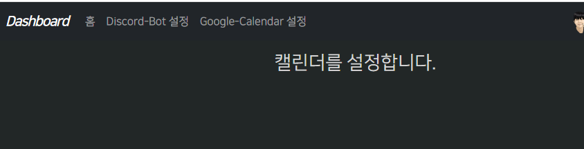
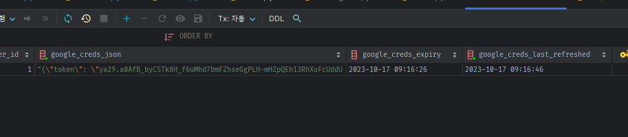
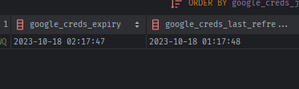

### 구글 sync 설정 페이지

#### 캘린더 설정 router 및 html 페이지 생성

1. pages > routers > google.py 생성
2. routers > init.py 에 추가
    ```python
    from . import index, discord, google
    
    router = APIRouter(
        dependencies=[Depends(request_with_fastapi_optional_user)],
        # request.state.user
    )
    router.include_router(index.router, tags=['Pages'])
    router.include_router(discord.router, prefix='/discord', tags=['Pages'],
                          dependencies=[Depends(request_with_fastapi_optional_user_and_bot_guild_count)]
                          # request.state.user / request.state.bot_guild_count
                          )
    router.include_router(google.router, prefix='/google', tags=['Pages'])
    ```
3. router 객체 만들고, `/calendar_sync`의 sync_calendar view function을 만들고, `dashboard/calendar-sync.html`를 렌더링
    ```python
    from fastapi import APIRouter
    from starlette.requests import Request
    
    from app.utils.http_utils import render
    
    router = APIRouter()
    
    
    @router.get("/calendar_sync")
    async def sync_calendar(request: Request):
        return render(request, "dashboard/calendar-sync.html")
    ```

4. templates > dashbaord > calendar-sync.html 생성
    ```html
    
    
     캘린더 설정 | {{ super() }} 
    
    
        <div class="container mt-3">
            <div class="row">
                <div class="col">
                    <h3> 캘린더를 설정합니다. </h3>
                </div>
            </div>
        </div>
    
    
    ```
5. nav.html에 viewfunc으로 캘린더 설정 링크 추가
    ```html
    <ul class="navbar-nav me-auto mb-2 mb-lg-0">
        <li class="nav-item">
            <a class="nav-link" aria-current="page" href="{{ url_for('discord_home') }}">홈</a>
        </li>
        <li class="nav-item">
            <a class="nav-link" href="{{ url_for('guilds') }}">Discord-Bot 설정</a>
        </li>
        <li class="nav-item">
            <a class="nav-link" href="{{ url_for('sync_calendar') }}">Google-Calendar 설정</a>
        </li>
    </ul>
    ```
   

#### 일단 로그인은 되어있어야하는데, 비로그인 시 google @oauth_login_required + STAFF @role_required

```python
@router.get("/calendar_sync")
@oauth_login_required(SnsType.GOOGLE)
@role_required(RoleName.STAFF)
async def sync_calendar(request: Request):
    return render(request, "dashboard/calendar-sync.html")

```

2. 아직 구글 required는 데코레이터에서 정의해주지 않았었는데, `state=처리용 template_oauth_callback`을 태워서 redirect되도록
    - 기존 discord_callback을 쓰던 것을 통일화
    - **각 개발자앱에서는 path에 해당 sns_type(소문자)로 redirect_url이 등록되어있어야한다.**
    - **`request.url_for( , path=)`에 Snstype Enum을 넣을 땐 `.value`로 string을 넣어야함.**
    ```python
    def oauth_login_required(sns_type: SnsType):
        def decorator(func):
            @wraps(func)
            async def wrapper(request: Request, *args, **kwargs):
                user: Users = request.state.user
    
                # 1) user가 로그인 안됬거나 2) 로그인 됬어도, oauth_account에 해당 sns_type으로 계정정보가 없다면
                if not user or not user.get_oauth_access_token(sns_type):
                    state_data = dict(next=str(request.url))
                    state = generate_state_token(state_data, JWT_SECRET) if state_data else None
    
                    oauth_client = get_oauth_client(sns_type)
    
                    # redirect_uri에 적을 callback route 만 달라진다. => template state=로 redirect 처리용, template_oauth_callback을 활용하도록 변경
                    # if sns_type == SnsType.DISCORD:
                    authorization_url: str = await oauth_client.get_authorization_url(
                        # redirect_uri=str(request.url_for('discord_callback')),
                        # redirect_uri=str(request.url_for('template_oauth_callback', sns_type=sns_type)),
                        # http://localhost:8001/auth/callback/SnsType.DISCORD => Enum을 request.url_for(, path=)에 적을 땐, .value로 확실히 해야한다.
                        redirect_uri=str(request.url_for('template_oauth_callback', sns_type=sns_type.value)),
                        state=state
                    )
    
                    return RedirectResponse(authorization_url)
    
                else:
                    return await func(request, *args, **kwargs)
    
            return wrapper
        return decorator
    ```

#### 간편로그인 용 autrhozation_url VS refresh_token 획득을 위한 url을 kwargs 추가로 분리한다.

1. google_client의 `get_authorization_url()`메서드에 **`for_sycn=False`의 키워드를 추가해서 재정의**해도 그대로 fastapi-users 내부에서 그대로 쓰일 수
   있다.
    - **`for_sync=False`를 추가 한뒤, 만약 True로 넘어오면, refresh token을 얻기위한 query params들을 추가해준다.**

    ```python
    class GoogleClient(GoogleOAuth2):
    
        async def get_authorization_url(self, redirect_uri: str, state: Optional[str] = None,
                                        scope: Optional[List[str]] = None, extras_params: Optional[T] = None,
                                        for_sync: bool = False,  # google refresh 토큰을 지속 얻기 위한 query params 추가
                                        ) -> str:
            if extras_params is None:
                extras_params = {}
    
            if for_sync:
                refresh_token_params = {
                    # 'include_granted_scopes': 'true',  # 기존 동의받은 scope를 재확인 + application의 모든 권한을 요구한다.
                }
                if not isinstance(config, ProdConfig):
    
                    refresh_token_params = refresh_token_params | {'prompt': 'consent'}
    
                extras_params = {**extras_params, **refresh_token_params}
    
            authorization_url = await super().get_authorization_url(redirect_uri, state, scope, extras_params)
    
            return authorization_url
    
    ```

2. 이제 `oauth_login_required` 데코레이터에도, for_sync여부를 추가해서, 내부에서 google에 한하여 for_sync kwargs를 get_authorization_url에 추가한다
    - 기본적으로 간편로그인 url로 redirect되며 **특정 route에서 데코레이터에 `for_sync=True`를 붙이면, 구글용이지만 해당 처리를 위한 url로 redirect 되도록**
    ```python
    def oauth_login_required(sns_type: SnsType, for_sync: bool = False):
        """
        구글 refresh_token을 얻기 위한 특수 로그인일 때, for_sync=True 추가
        """
    
        def decorator(func):
            @wraps(func)
            async def wrapper(request: Request, *args, **kwargs):
                user: Users = request.state.user
    
                # 1) user가 로그인 안됬거나 2) 로그인 됬어도, oauth_account에 해당 sns_type으로 계정정보가 없다면
                if not user or not user.get_oauth_access_token(sns_type):
                    state_data = dict(next=str(request.url))
                    state = generate_state_token(state_data, JWT_SECRET) if state_data else None
    
                    oauth_client = get_oauth_client(sns_type)
    
                    # redirect_uri에 적을 callback route 만 달라진다. => template state=로 redirect 처리용, template_oauth_callback을 활용하도록 변경
                    authorization_url_kwargs: dict = dict(
                        # Enum을 request.url_for(, path=)에 적을 땐, .value로 확실히 해야한다.
                        redirect_uri=str(request.url_for('template_oauth_callback', sns_type=sns_type.value)),
                        state=state
                    )
                    # google일 경우만 연동을 위해, 특별한 파라미터가 get_authorization_url() 내부에서 생기도록 for_sync=True 넣어주기
                    if sns_type == SnsType.GOOGLE and for_sync:
                        authorization_url_kwargs.update({'for_sync': True})
            
                    authorization_url: str = await oauth_client.get_authorization_url(**authorization_url_kwargs)
    
                    return RedirectResponse(authorization_url)
    
                else:
                    return await func(request, *args, **kwargs)
    
            return wrapper
    
        return decorator
    ```

#### oauth_client 생성시 scopes -> 내부 self.base_scopes로 들어가고, get_autrhoization_url( scopes=)메서드에서 넣어주면 덮어쓰기 된다.

1. oauth_client의 구조를 보면 **client생성시 넣어주는 `scopes=`는 `self.base_scopes`가 되며**
    - **`get_authorization_url()`호출시 scopes=가 들어간다면, `self.base_scopes는 or default값`
      형태로서, `메서드 호출시 넣어준 scopes가 우선시되어 덮어쓰기`된다.**
    ```python
    class GoogleClient(GoogleOAuth2):
    def get_google_client():
        # return GoogleOAuth2(
        return GoogleClient(
            GOOGLE_CLIENT_ID,
            GOOGLE_CLIENT_SECRET,
            scopes=google.BASE_SCOPES + [
                "openid",
                "https://www.googleapis.com/auth/user.birthday.read",  # 추가 액세스 요청 3개 (전부 people api)
                "https://www.googleapis.com/auth/user.gender.read",
                "https://www.googleapis.com/auth/user.phonenumbers.read",
                # 달력 조정 추가
                # "https://www.googleapis.com/auth/calendar",
                # "https://www.googleapis.com/auth/calendar.events",
            ])
    ```
    ```python
    class GoogleOAuth2(BaseOAuth2[GoogleOAuth2AuthorizeParams]):
        display_name = "Google"
        logo_svg = LOGO_SVG
    
        def __init__(
            self,
            client_id: str,
            client_secret: str,
            scopes: Optional[List[str]] = BASE_SCOPES,
            name="google",
        ):
            super().__init__(
                client_id,
                client_secret,
                AUTHORIZE_ENDPOINT,
                ACCESS_TOKEN_ENDPOINT,
                ACCESS_TOKEN_ENDPOINT,
                REVOKE_TOKEN_ENDPOINT,
                name=name,
                base_scopes=scopes,
            )
    ```
    ```python
    class BaseOAuth2(Generic[T]):
    
        def __init__(
            # ...
            base_scopes: Optional[List[str]] = None,
        ):
            # ...
            self.base_scopes = base_scopes
    
        async def get_authorization_url(
            self,
            redirect_uri: str,
            state: Optional[str] = None,
            scope: Optional[List[str]] = None,
            extras_params: Optional[T] = None,
        ) -> str:
            params = {
                "response_type": "code",
                "client_id": self.client_id,
                "redirect_uri": redirect_uri,
            }
    
            if state is not None:
                params["state"] = state
            # Provide compatibility with current scope from the endpoint
            _scope = scope or self.base_scopes
            if _scope is not None:
                params["scope"] = " ".join(_scope)
            if extras_params is not None:
                params = {**params, **extras_params}  # type: ignore
    
            return f"{self.authorize_endpoint}?{urlencode(params)}"
    ```

2. 그렇다면, **@oauth_login_required() 호출시, SnsType, for_sync여부 외 `authorization_url 생성시 덮어쓰는 scopes=`도 인자로 받을 수 있다.**
    - **로그인 했지만, 이미 google account정보가 있는 경우 -> `넣어준 scopes=`에 대해서만 요청 authorization_url**
    - **로그인 했지만, google account정보가 없는 경우 -> `client생성시 들어간 로그인 용 self.base_scopes` + `넣어준 scopes=`까지 추가해서 요청
      authorization_url**
    - **로그인 안한 경우 -> 로그인 scopes 후 기존 scopes내역을 확인한 뒤 -> 없다면 넣어준 scopes=까지 함께.. 하면 좋겠지만**
        - **google 로그인 `self.base_scopes 처리(google account 생성) 후 -> 넣어준 scopes 처리`를 여기 데코레이터에서 확인하여 추가 url요청은 할 수 없다.**
        - **그러므로 google account정보가 없는 경우로서 -> `self.base_scopes + 넣어준 scopes=`까지 한번에 요청하는게 최선인 것 같다.**
    - **로그인 & google account정보가 있는데, `scopes=로 특정 추가 요청이 없다면, pass`**


- 태초 google_client에 calendar관련 scope 제거
    - 대신 상수로 정의해놓고, @oauth_login_required의 인자로 들어가서, 필요한 route에서 해당 scope를 적용할 수 있게 한다.

```python
CALENDAR_SCOPES = [
    "https://www.googleapis.com/auth/calendar",
    "https://www.googleapis.com/auth/calendar.events",
    "https://www.googleapis.com/auth/calendar.calendarlist"
]


class GoogleClient(GoogleOAuth2):


# ...

def get_google_client():
    # return GoogleOAuth2(
    return GoogleClient(
        GOOGLE_CLIENT_ID,
        GOOGLE_CLIENT_SECRET,
        scopes=google.BASE_SCOPES + [
            "openid",
            "https://www.googleapis.com/auth/user.birthday.read",  # 추가 액세스 요청 3개 (전부 people api)
            "https://www.googleapis.com/auth/user.gender.read",
            "https://www.googleapis.com/auth/user.phonenumbers.read",
            # 달력 조정 추가
            # "https://www.googleapis.com/auth/calendar",
            # "https://www.googleapis.com/auth/calendar.events",
        ])
```

- 이 때, for_sync인자를 제거하여,새 scope가 들어온다면, sync용 authorizaion_url을 적용하도록 했다.
    - 여기서 로그인용 base_scopes를 덮어써버리면, 결국 받는 곳은 template_oauth_callback이며, access_token 및 프로필 요청도 하므로 로그인 scopes도 필요해서
    - scope범위부족 에러 난다.

```python
def oauth_login_required(sns_type: SnsType, scopes: Optional[List[str]] = None):
    def decorator(func):
        @wraps(func)
        async def wrapper(request: Request, *args, **kwargs):
            request.session['scopes'] = scopes

            user: Users = request.state.user
            if user and user.get_oauth_access_token(sns_type) and not scopes:
                return await func(request, *args, **kwargs)

            state_data = dict(next=str(request.url))
            state = generate_state_token(state_data, JWT_SECRET) if state_data else None
            oauth_client = get_oauth_client(sns_type)

            authorization_url_kwargs: dict = dict(
                redirect_uri=str(request.url_for('template_oauth_callback', sns_type=sns_type.value)),
                state=state
            )
            if scopes:
                authorization_url_kwargs.update({'scope': oauth_client.base_scopes + scopes})
                if sns_type == SnsType.GOOGLE:
                    authorization_url_kwargs.update({'for_sync': True})
            authorization_url: str = await oauth_client.get_authorization_url(**authorization_url_kwargs)
            return RedirectResponse(authorization_url)

        return wrapper

    return decorator
```

```python
@router.get("/calendar_sync")
@oauth_login_required(SnsType.GOOGLE, scopes=CALENDAR_SCOPES)
@role_required(RoleName.STAFF)
async def sync_calendar(request: Request):
    return render(request, "dashboard/calendar-sync.html")

```

- 그래서, template_oauth_callback에서는, base_scopes + 추가된 scopes에 대한 정보를 가져온 뒤, 데코레이터요청 url로 redirect되는데
    - **이 때, not scopes 상태가 아니기 때문에, 계속 뺑뺑이 돈다.**
    - **`추가 scopes에 대한 요청 후 callback을 지나와 완료했다`고 user.oauth_account 내부 DB에 정의를 해놔야한다.**
    - **그렇다면, 데코레이터 내부에서 해당 scopes -> template_oauth_callback에도 전달되어야, 거기서 user 데이터에 필드를 추가 할 수 있다**
    - **이렇게 보내는 방법은 state=는 next_url전용으로 만들었으므로 `request.session['scopes']`를 이용해야한다**
    - **fastapi에서 request.session을 이용하려면 `itsdangerous`패키지의 설치가 필요하며, SECREY_KEY 값과 함께
      fastapi의 `SessionMiddleware미들웨어를 추가`해야한다.**

```shell
pip install itsdangerous

pip freeze > .\requirements.txt

docker-compose build --no-cache api; docker-compose up -d api;
```

```python
# 미들웨어 추가 (실행순서는 반대)
app.add_middleware(AccessControl)
app.add_middleware(
    CORSMiddleware,
    allow_origins=config.ALLOWED_SITES,
    allow_credentials=True,
    allow_methods=["*"],
    allow_headers=["*"],
)
app.add_middleware(TrustedHostMiddleware, allowed_hosts=config.TRUSTED_HOSTS, except_path=["/health"])
# SessionMiddleware 추가 ( google oauth 데코레이터 - 추가 scopes 를 template_oauth_callback 라우터로 전달하여 creds 생성에 필요)
app.add_middleware(SessionMiddleware, secret_key=JWT_SECRET)


```

- 콜백라우터에서 추가된 scopes를 받을 수 있도록 request.session에 담아서 보낸다.

```python
def oauth_login_required(sns_type: SnsType, required_scopes: Optional[List[str]] = None):
    """
    구글 refresh_token을 얻기 위한 특수 로그인일 때, for_sync=True 추가
    + 특정범위의 scopes=로 덮어쓸 수 있는 인자 scopes=None 추가
    """

    def decorator(func):
        @wraps(func)
        async def wrapper(request: Request, *args, **kwargs):
            request.session['required_scopes'] = required_scopes
```

- template_oauth_callback에서는 request.session['required_scopes']에 있는 추가 scopes를 가져온다.

```python
@router.get("/auth/callback/{sns_type}", name='template_oauth_callback')
async def template_oauth_callback(
        request: Request,
        # code: str,
        # state: Optional[str] = None,
        sns_type: SnsType,
        # 인증서버가 돌아올떄 주는 code와 state + sns_type까지 내부에서 받아 처리
        access_token_and_next_url: OAuthAuthorizeCallback = Depends(
            get_oauth_callback(route_name='template_oauth_callback')
        ),
        user_manager: BaseUserManager[models.UP, models.ID] = Depends(get_user_manager),
):
    """
    `Discord callback for Developer OAuth Generated URL`
    """
    oauth2_token, next_url = access_token_and_next_url

    print(f"request.session['required_scopes'] >> {request.session['required_scopes']}")
    # request.session['required_scopes'] >> ['https://www.googleapis.com/auth/calendar', 'https://www.googleapis.com/auth/calendar.events', 'https://www.googleapis.com/auth/calendar.calendarlist']

```

- 이제 request.session에 `required_scopes`가 발견될 경우에만, `credentials`을 만든 뒤, `.to_json()으로 만들고 OAuth_account에 DB`에 저장해놓자.
    - 그렇다면, **데코레이터에 if user and user.get_oauth_account의 통과조건**을
    - **`user.oauth_accounts 중 google 정보 -> google_creds_json -> json.load() -> creds객체 -> .scopes` 한 것과,**
    - **데코레이터에 인자로 넘어온 required_scopes=CALENDAR_SCOPES를 `비교해 일치하여 이미 해당 scopes에 요청한 바 있고 creds도 보유 -> 통과`하도록 해야한다.**

- oauth 계정정보 업데이트는 user_manager.oauth_callback()에서 이루어지므로 재정의한 경험이 있으니, required_scopes를 추가해서 넣어준다.
    - **이때 session속 required_session은 pop으로 해서, 다음에는 못쓰게 한다.**

```python
@router.get("/auth/callback/{sns_type}", name='template_oauth_callback')
async def template_oauth_callback(
        request: Request,
        # code: str,
        # state: Optional[str] = None,
        sns_type: SnsType,
        # 인증서버가 돌아올떄 주는 code와 state + sns_type까지 내부에서 받아 처리
        access_token_and_next_url: OAuthAuthorizeCallback = Depends(
            get_oauth_callback(route_name='template_oauth_callback')
        ),
        # user_manager: BaseUserManager[models.UP, models.ID] = Depends(get_user_manager),
        user_manager: UserManager = Depends(get_user_manager),
):
    #### sync를 위한 추가 scopes가 데코레이터 -> session으로 넘어온다면, oauthaccount에 credentials 관련 정보를 저장해놓자
    # required_scopes = request.session.get('required_scopes', None)
    required_scopes = request.session.pop('required_scopes', None)

    try:
        user = await user_manager.oauth_callback(
            oauth_name=sns_type.value,
            access_token=oauth2_token.get("access_token"),
            account_id=account_id,
            account_email=account_email,
            expires_at=oauth2_token.get("expires_at"),
            refresh_token=oauth2_token.get("refresh_token"),
            request=request,
            associate_by_email=True,
            is_verified_by_default=True,
            required_scopes=required_scopes,  # sync 처리 scopes를 넣어줘서, 내부에 oauth_account에 creds관련 정보 추가 저장용
        )
```

- 커스텀 UserManager의 oauth_callback 내부

```python
    async def oauth_callback(self: "BaseUserManager[models.UOAP, models.ID]", oauth_name: str, access_token: str,
                             account_id: str, account_email: str, expires_at: Optional[int] = None,
                             refresh_token: Optional[str] = None, request: Optional[Request] = None, *,
                             associate_by_email: bool = False, is_verified_by_default: bool = False,
                             required_scopes=None,
                             # 데코레이터 -> session['required_scopes'] ->  template_oauth_callback 라우터에서 받아서 -> oauth_account 업뎃을 위해 들어옴 
                             ) -> models.UOAP:
    """
    Users 생성시, role 추가를 위해 재정의(user_dict)
    + 추가 addiotional_scopes가 넘어왔고 refresh token가 발급된 상황(첫 가입 + @)에서 creds관련 필드들 추가 in oauth_account_dict
    """
    oauth_account_dict = {
        "oauth_name": oauth_name,
        "access_token": access_token,
        "account_id": account_id,
        "account_email": account_email,
        "expires_at": expires_at,
        "refresh_token": refresh_token,
    }

    ##### 추가 scope에 따른 creds 생성후 oauth account 추가 필드 처리 ######
    # -> 추가 scope가 왔고, refresh_token이 발급된 상황에만 creds 업데이트
    if required_scopes and refresh_token:
        print(f"추가scope에 대해 refresh_token발급된 상황 >> ")

        creds = Credentials.from_authorized_user_info(
            info=dict(
                token=access_token,
                refresh_token=refresh_token,
                client_id=GOOGLE_CLIENT_ID,
                client_secret=GOOGLE_CLIENT_SECRET,
                scopes=required_scopes,
            )
        )

        # aouth_account 생성 정보인 oauth_account_dict에 cres관련 필드들을 추가한다.
        oauth_account_dict.update({
            "google_creds_json": creds.to_json(),  # 전체 정보 -> to_json()은 string이며, string json을 저장하는 JSON 칼럼에 저장한다.
            "google_creds_expiry": creds.expiry,  # 만료기한만 조회를 위해 빼놓기
            "google_creds_last_refreshed": D.datetime(),
        })

        # 'google_creds_json' is an invalid keyword argument for OAuthAccount
        # => 모델 만들러 간다.

    # ...

```

- 모델 추가

```python
class OAuthAccount(BaseModel, SQLAlchemyBaseOAuthAccountTable[int]):
    user_id = Column(Integer, ForeignKey("users.id", ondelete="CASCADE"), nullable=False)
    user = relationship("Users", back_populates="oauth_accounts",
                        foreign_keys=[user_id],
                        uselist=False,
                        )

    # 추가 additional_scope 에 대한요청 -> 콜백 -> usermanager로 들어옴 -> creds 생성후 관련정보 저장
    google_creds_json = Column(JSON,
                               nullable=True)  # 결국엔 to_json()은 json.dump( dict )로 변환된 string을 받는 것 -> 꺼낼 땐 json.load()필요
    google_creds_expiry = Column(DateTime, nullable=True)
    google_creds_last_refreshed = Column(DateTime, nullable=False)
```



- 잘 저장되었으면 데코레이터에서는 `user.oauth_accounts 중 google 계정정보`를 기존에 정의한 get_oauth_account()를 통해 구한 뒤
    - -> `google_creds_json` 을 꺼내고 -> json.load()한 다음 ->   scopes를 확인한다.
    - **꺼내는 것은 user객체에서 `joined`된 정보로서 바로 꺼낼 수 있는 property/method 등으로 정의한다.**
    - **데코레이터에 들어오는 required_scopes들이 현재 google_cred_json 속 scopes에 포함되는지로 확인한다.**


1. 일단, Users에 정의된 `get_oauth_account()`로 구글계쩡정보만 들고와서 `존재하면, google_creds_json`을 들고오고, `존재하면, json.load()`한
   뒤 `Credentials( **dict)`객체를 만드는 메서드를 정의한다.
    ```python
    def get_google_creds(self):
        google_account = self.get_oauth_account(SnsType.GOOGLE)
        if google_account and (creds := google_account.google_creds_json):
            stored_creds = json.loads(creds)
            return Credentials(**stored_creds)
    
        return None
    ```
2. 손 쉽게 .google_creds_scopes를 조회할 수 있게 property로 만든다.
    ```python
    @property
    def google_creds_scopes(self) -> Optional[List[str]]:
        creds = self.get_google_creds()
        return creds.scopes if creds else None
    
    ```

3. google_scopes가 존재하면, 위부에서 넘어오는 google_scopes를 순회하며 전부 포함하는지 `all()`로 확인하여 그 여부를 bool로 반환한다
    ```python
    def has_google_scopes(self, google_scopes: List[str]) -> bool:
        """
        lazy='joined' 되어 자동 load되는 OAuthAccount 중 google정보 인 google_creds_json에서 scopes를 확인한다.
        @aouth_required(SnsType.GOOGLE, scopes= ) 에서 사용될 예정 이미 요청하여 creds를 가지고 있는지 확인용
        """
        if creds_scopes := self.google_creds_scopes:
            has_scopes = all(scope in creds_scopes for scope in google_scopes)
            return has_scopes
    
        return False
    
    ```

- **데코레이터도 로직을 정리해준다.**

```python
def oauth_login_required(sns_type: SnsType, required_scopes: Optional[List[str]] = None):
    """
    구글 refresh_token을 얻기 위한 특수 로그인일 때, for_sync=True 추가
    + 특정범위의 scopes=를 로그인용 self.base_scopes에 추가 할 required_scopes=None 추가
    """

    def decorator(func):
        @wraps(func)
        async def wrapper(request: Request, *args, **kwargs):

            user: Users = request.state.user

            # 4) 로그인 & oauth_account 있음
            # => 1) required_scopes가 없으면 통과
            # => 2) required_scopes가 있다면
            #       2-1) 구글이 아니라면, required_scopes를 session에 넘길 필요없이, base_scopes + required_scopes 추가한
            #            authorization_url로 로그인 요청
            #       2-2) 구글이라면,
            #            2-2-1) has_google_scopes까지 만족하면 통과
            #            2-2-2) has_google_scopes가 없다면 template_oauth_callback 라우터에서 creds 생성을 위해,
            #                   session으로 required_session을 넘기고
            #                   base_scopes + required_scopes 추가 + get_authorization_url( for_sync=True)까지해서
            #                   authorization_url 요청
            if user and user.get_oauth_access_token(sns_type):
                if not required_scopes:
                    return await func(request, *args, **kwargs)
                else:
                    if sns_type == SnsType.GOOGLE:
                        if user.has_google_creds_and_scopes(required_scopes):
                            return await func(request, *args, **kwargs)
                        else:
                            request.session['required_scopes'] = required_scopes
                    else:
                        ...

            state_data = dict(next=str(request.url))
            state = generate_state_token(state_data, JWT_SECRET) if state_data else None
            oauth_client = get_oauth_client(sns_type)

            authorization_url_kwargs: dict = dict(
                redirect_uri=str(request.url_for('template_oauth_callback', sns_type=sns_type.value)),
                state=state
            )

            if required_scopes:
                authorization_url_kwargs.update({'scope': oauth_client.base_scopes + required_scopes})
                # googleClient에 for_sync= kwargs를 추가한 뒤, True로 준다면, refresh_token을 얻기 위한 query 파라미터(prompt=consent)를 추가한다.
                if sns_type == SnsType.GOOGLE:
                    authorization_url_kwargs.update({'for_sync': True})

            authorization_url: str = await oauth_client.get_authorization_url(**authorization_url_kwargs)
            return RedirectResponse(authorization_url)

        return wrapper

    return decorator
```

4. 이 때, 동의화면을 계속보여주는 옵션을 Prodconfig아니라면, 항상 prompt : consent로 주고 있기 때문에
    - 매번 refresh token이 발급되는 문제 상황(?)이다.
    - 새로운 consent -> refresh_token 새 발급 전에 발급된, creds를 그대로 사용할 수 있는지 확인해본다.

```python
@router.get("/")
async def discord_home(request: Request):
    from googleapiclient.discovery import build

    user = request.state.user
    if user and user.get_oauth_access_token(SnsType.GOOGLE) and user.has_google_creds_and_scopes(CALENDAR_SCOPES):
        creds = user.get_google_creds()
        calendar_service = build('calendar', 'v3', credentials=creds)
        current_cals = calendar_service.calendarList().list().execute()
        print(f"current_cals['items'] >> {current_cals['items']}")
        # skewed_expiry = self.expiry - _helpers.REFRESH_THRESHOLD
        # TypeError: unsupported operand type(s) for -: 'str' and 'datetime.timedelta'

```

7. get_google_creds()내부에서 `.to_json()`으로 저장한 것을 그대로 `json.load()`했더니, datetime이 아닌 string으로서 Credentials객체 만드는데 사용된 것 같다
    - **google_creds_json을 json.load()후 `datetime string을 직접 수정`해줘야한다.**
    - 참고: https://github.dev/PigsCanFlyLabs/cal-sync-magic/blob/main/cal_sync_magic/models.py
    - **우리는 이미 `google_creds_exprity`를 DateTime칼럼에 저장을 해놨으니 이것을 활용하면, to_json()으로 변환됬던 것을 무시하고 사용할 수 있다.**
    - **만약, usermanager.oauth_callback()에서 `creds` 발급시 .expiry가 비어서 빈값이 들어갔다면, 현재 utc시간을 넣어주자.**
    ```python
    def get_google_creds(self):
        google_account: OAuthAccount = self.get_oauth_account(SnsType.GOOGLE)
        if google_account and (creds := google_account.google_creds_json):
            stored_creds = json.loads(creds)
    
            # to_json()으로 들어갔떤 것을 다시 load하면 datetime으로 복구가 안된 상태임
            # => 미리 빼서 저장해놨던
            # Get expirery so we can figure out if we need a refresh
            if google_account.google_creds_expiry is not None:
                stored_creds["expiry"] = google_account.google_creds_expiry
            else:
                stored_creds["expiry"] = D.datetime()
            return Credentials(**stored_creds)
    
    ```
8. **로그인에 의한, access_token, 로그인 + promprt=consent에 의한 refresh_token이 새로 발급되어도, `google_creds`자체의 expiry만 지나지 않았다면, 요청이 잘
   들어간다.**
    ```python
    @router.get("/")
    async def discord_home(request: Request):
        from googleapiclient.discovery import build
    
        user = request.state.user
    
        if user and user.get_oauth_access_token(SnsType.GOOGLE) and user.has_google_creds_and_scopes(CALENDAR_SCOPES):
            creds = user.get_google_creds()
            calendar_service = build('calendar', 'v3', credentials=creds)
            current_cals = calendar_service.calendarList().list().execute()
            print(f"current_cals['items'] >> {current_cals['items']}")
            # skewed_expiry = self.expiry - _helpers.REFRESH_THRESHOLD
            # TypeError: unsupported operand type(s) for -: 'str' and 'datetime.timedelta'
            # current_cals['items'] >> [{'kind': 'calendar#calendarListEntry', 'etag': '"1657577269858000"', 'id': 'addressbook#contacts@group.v.calendar.google.com', 'summary': '�깮�씪', 'description': 'Google 二쇱냼濡앹뿉 �벑濡앸맂 �궗�엺�뱾�쓽 �깮�씪, 湲곕뀗�씪, 湲고� �씪�젙 �궇吏쒕�� �몴�떆�빀�땲�떎.', 'timeZone': 'Asia/Seoul', 'summaryOverride': 'Contacts', 'colorId': '17', 'backgroundColor': '#9a9cff', 'foregroundColor': '#000000', 'accessRole': 'reader', 'defaultReminders': [], 'conferenceProperties': {'allowedConferenceSolutionTypes': ['hangoutsMeet']}}, {'kind': 'calendar#calendarListEntry', 'etag': '"1657580828523000"', 'id': 'ko.south_korea#holiday@group.v.calendar.google.com', 'summary': '���븳誘쇨뎅�쓽 �쑕�씪', 'description': '���븳誘쇨뎅�쓽 怨듯쑕�씪', 'timeZone': 'Asia/Seoul', 'summaryOverride': '���븳誘쇨뎅�쓽 �쑕�씪', 'colorId': '17', 'backgroundColor': '#9a9cff', 'foregroundColor': '#000000', 'accessRole': 'reader', 'defaultReminders': [], 'conferenceProperties': {'allowedConferenceSolutionTypes': ['hangoutsMeet']}}, {'kind': 'calendar#calendarListEntry', 'etag': '"1657580830000000"', 'id': 'tingstyle1@gmail.com', 'summary': 'tingstyle1@gmail.com', 'timeZone': 'Asia/Seoul', 'colorId': '19', 'backgroundColor': '#c2c2c2', 'foregroundColor': '#000000', 'selected': True, 'accessRole': 'owner', 'defaultReminders': [{'method': 'popup', 'minutes': 30}], 'notificationSettings': {'notifications': [{'type': 'eventCreation', 'method': 'email'}, {'type': 'eventChange', 'method': 'email'}, {'type': 'eventCancellation', 'method': 'email'}, {'type': 'eventResponse', 'method': 'email'}]}, 'primary': True, 'conferenceProperties': {'allowedConferenceSolutionTypes': ['hangoutsMeet']}}]
    
    ```

9. CALENDAR_SCOPES를 만족하는 oauth데코를 통과했다면, CALENDAR 서비스를 build할 수 있는 creds를 가졌다는 말이다.
    - 해당 route에서는 SCOPES에 따른 service를 user.get_google_service(CALENDAR_SCOPES)로 가져올 수 있게 해보자.
```python
# app/libs/auth/oauth_clients/google.py
service_name_and_scopes_map = dict(
    calendar=CALENDAR_SCOPES,
)


def get_google_service_name(google_scopes: List[str]):
    for service_name, mapped_scopes in service_name_and_scopes_map.items():
        if all(scope in mapped_scopes for scope in google_scopes):
            return service_name
    return None

``` 
10. router에서는 required_scopes에 들어간 scope상수를 get_google_service_name에 넣어주면, 대응하는 서비스이름 `calendar`를 응답받을 수 있다.
    ```python
    @router.get("/calendar_sync")
    @oauth_login_required(SnsType.GOOGLE, required_scopes=CALENDAR_SCOPES)
    @role_required(RoleName.STAFF)
    async def sync_calendar(request: Request):
    
        user: Users = request.state.user
        service_name = get_google_service_name_by_scopes(CALENDAR_SCOPES)
        calendar_service = user.get_google_service(service_name)
        current_cals = calendar_service.calendarList().list().execute()
        print(f"current_cals['items'] >> {current_cals['items']}")
    
        return render(request, "dashboard/calendar-sync.html")
    ```
    

#### 만약, creds 정보가 만료가 되었다면? -> get_google_creds() 메서드에서 자체적으로  확인후  refresh 요청을 해야한다.
1. Credentials 객체는 자체적으로 `expired` property를 제공해줘서, 만료여부를 확인할 수 있다.
    - **self.expiry가 비었다면, return False로 만료안됬다고 나오는데, `그전에 우리는 D.datetime()으로 utcnow값을 넣어줬었다.` -> 만료된 상태로 본다.**
    ```python
    @property
    def expired(self):
        """Checks if the credentials are expired.
    
        Note that credentials can be invalid but not expired because
        Credentials with :attr:`expiry` set to None is considered to never
        expire.
        """
        if not self.expiry:
            return False
    
        # Remove some threshold from expiry to err on the side of reporting
        # expiration early so that we avoid the 401-refresh-retry loop.
        skewed_expiry = self.expiry - _helpers.REFRESH_THRESHOLD
        return _helpers.utcnow() >= skewed_expiry
    ```

2. 강제로 utcnow를 넣도록 고정해놓고 service요청을 해보자.
```python
def get_google_creds(self):
    google_account: OAuthAccount = self.get_oauth_account(SnsType.GOOGLE)
    if not (google_account and (creds := google_account.google_creds_json)):
        return None

    stored_creds = json.loads(creds)

    # for test
    stored_creds["expiry"] = D.datetime()

    # if google_account.google_creds_expiry is not None:
    #     stored_creds["expiry"] = google_account.google_creds_expiry
    # else:
    #     stored_creds["expiry"] = D.datetime()

    creds = Credentials(**stored_creds)
    print(f"creds.expired >> {creds.expired}")
          
    return creds
```
- creds.expired 가 True로 나오는데도, service build 및 요청이 들어간다. 
    - **expiry 및 expired 판단을 local에서 자체적으로 진행하고, 판단을 구글서버에서 하나보다.**
    - **강제로 expiry를 넣어줘봤자 의미가 없다.**
    - **만료기한 판단은 db에 넣어줬떤 `google_creds_expiry`필드로 하고, Cred생성시 사용되는 expiry는 json으로 변형시 변질됬던 것을 덮어쓰우기만 한 것이다.**
    - **덮어쓴 expiry를 통한 creds.expired를 판단한 뒤, 자체적으로 Refresh를 요청한다.**
    - **참고로, creds은 발급받으면, 만료기간이 1시간밖에 안되므로, 1시간동안만 db에 저장해놓고 사용하며, refresh해야한다.**
        

3. local용으로 expired를 판단하고, refresh_token으로 새로운 access_token을 요청해야한다.
    - 이 때, creds.refresh()에 필요한 인자가 `Optional[Callable[[google.auth.transport.Request, Sequence[str]], [str, datetime]]]`이며
    - Request() 객체를 만들어서 넣어줘야한다. - 참고: [프로젝트](https://github.dev/PigsCanFlyLabs/cal-sync-magic/blob/main/cal_sync_magic/models.py), [스택오버플로우](https://stackoverflow.com/questions/27771324/google-api-getting-credentials-from-refresh-token-with-oauth2client-client)
    - 해당 모듈 [공식문서](https://google-auth.readthedocs.io/en/master/reference/google.auth.transport.requests.html)에서 찾아보니, 해당 모듈은 `google-auth`패키지 및 `requests`패키지가 필요한 것 같다.
        - google-auth는 이미 설치되어있으나, google.auth.transport.requests까지는 import해야한다. 모듈이 아니라 패키지기 때문에 해당 경로까지 찾아가서 .Request class를 가져와 객체를 만든다.
    - **expired True가 생기도록 다시 만들어놓고, `creds.refresh`이후 업데이트된 정보를 `await google_accout.update()`를 때린다**
        - **await 등장하는 순간 연결된 메서드들, property들을 async로 바꿔줘야한다.**
    ```python
    async def get_google_creds(self):
        google_account: OAuthAccount = self.get_oauth_account(SnsType.GOOGLE)
        if not (google_account and (creds := google_account.google_creds_json)):
            return None
    
        stored_creds = json.loads(creds)
    
        # to_json()으로 들어갔떤 것을 다시 load하면 datetime으로 복구가 안된 상태임
        # => 미리 빼서 저장해놨던
        # Get expirery so we can figure out if we need a refresh
        # if google_account.google_creds_expiry is not None:
        #     stored_creds["expiry"] = google_account.google_creds_expiry
        # else:
        #     stored_creds["expiry"] = D.datetime()
        stored_creds["expiry"] = D.datetime()  # for test
    
        # Drop timezone info
        # stored_creds['expiry'] = stored_creds['expiry'].replace(tzinfo=None)
    
        creds = Credentials(**stored_creds)
    
        if creds.expired:
            print(f"creds 만료 creds.expired >> {creds.expired}")
    
            http_request = requests.Request() # google.auth.transport의 패키지(not module)
            creds.refresh(http_request)
    
            # 성공하면, 변화된 expity와 .to_json() 및 last_refreshed를 업데이트해야한다.
            await google_account.update(
                auto_commit=True,
                refresh=True,
                google_creds_json=creds.to_json(),
                google_creds_expiry=creds.expiry,
                google_creds_last_refreshed=D.datetime(),
            )
    
            print(f"refresh 후 바뀐token을 포함한 creds 저장완료 >>")
    
        return creds
    ```

4. **만약, creds.refresh()를 실패할 경우, 내부에서는 google.auth.exceptions.RefreshError가 발생한다**
    - **refresh_token이 만료되었을 상황이다. 이 때, try/except로 잡아놓고, `get_google_creds()`에서 return None을 통해, 데코레이터에서 통과못해 재발급하게 한다.**
    - **return None 전에 `해당 creds.token을 만료시켜고, google_cred_json 등 관련필드를 다 비워눠야한다.`**
    - 이 때, requests 모듈도 사용해야하니, google_auth_requests로 as이름을 정해서 처리하게 한다.
    ```python
    async def get_google_creds(self):
        google_account: OAuthAccount = self.get_oauth_account(SnsType.GOOGLE)
        if not (google_account and (creds := google_account.google_creds_json)):
            return None
    
        stored_creds = json.loads(creds)
    
        # to_json()으로 들어갔떤 것을 다시 load하면 datetime으로 복구가 안된 상태임
        # => 미리 빼서 저장해놨던
        # Get expirery so we can figure out if we need a refresh
        # if google_account.google_creds_expiry is not None:
        #     stored_creds["expiry"] = google_account.google_creds_expiry
        # else:
        #     stored_creds["expiry"] = D.datetime()
        # for test
        stored_creds["expiry"] = D.datetime()
    
        # Drop timezone info
        # stored_creds['expiry'] = stored_creds['expiry'].replace(tzinfo=None)
    
        creds = Credentials(**stored_creds)
    
        if creds.expired:
            try:
                http_request = google_auth_requests.Request()  # google.auth.transport의 패키지(not module) requests(모듈)
                creds.refresh(http_request)
    
                # for test
                raise exceptions.RefreshError()
    
                # 성공하면, 변화된 expity와 .to_json() 및 last_refreshed를 업데이트해야한다.
                # await google_account.update(
                #     auto_commit=True,
                #     google_creds_json=creds.to_json(),
                #     google_creds_expiry=creds.expiry,
                #     google_creds_last_refreshed=D.datetime(),
                # )
    
            except exceptions.RefreshError:
                # refresh 실패했다면, 해당 creds.token을 revoke 시키고, db에서도 creds관련필드 3개를 비워놓고
                # -> get_google_creds()를 return None한다.
    
                revoke = requests.post(
                    'https://oauth2.googleapis.com/revoke',
                    params={'token': creds.token},
                    headers={'content-type': 'application/x-www-form-urlencoded'}
                )
    
                await google_account.update(
                    auto_commit=True,
                    google_creds_json=None,
                    google_creds_expiry=None,
                    google_creds_last_refreshed=None,
                )
    
                return None
    
        return creds
    ```

    - 이제 for test를 위한 설정들을 제거한다.

5. **refresh가 실패했다는 말은, refresh token이 만료되었다는 말이고, get_google_creds 실패 -> 데코레이터에서 has_google_scopes()가 실패했다는 말이다.**
    - **has_google_scopes()는 `has_google_creds_and_scopes()`로 바꿔야한다.**

6. **데코레이터를 한번 더 정리 및 `첫 이메일 입력 로그인 -> application 등록을 제외하고는 동의화면 없으면 refresh token발급이 안된다.`**
    - **Prod환경 구분없이 그냥 sync를 요청한 경우, Prod환경 구분 없이  무조건 `prompt=consent`를 입력하도록 하자.**

```python
async def get_authorization_url(self, redirect_uri: str, state: Optional[str] = None,
                                scope: Optional[List[str]] = None, extras_params: Optional[T] = None,
                                for_sync: bool = False,  # google refresh 토큰을 지속 얻기 위한 query params 추가
                                ) -> str:
    if extras_params is None:
        extras_params = {}

    if for_sync:
        refresh_token_params = {
            'access_type': 'offline',  # 이 옵션을 추가하면, browser 최초 로그인시에만 refresh token을 최초 1회만 발급해준다.
            'prompt': 'consent',  # 최초1회 발급하는 refresh token -> 동의화면을 띄워 매번 받게 함. -> Prod환경 아닌경우만
            # 'include_granted_scopes': 'true',  # 기존 동의받은 scope를 재확인 + application의 모든 권한을 요구한다.
        }
        # if not isinstance(config, ProdConfig):
        #     refresh_token_params = refresh_token_params | {'prompt': 'consent'}

        extras_params = {**extras_params, **refresh_token_params}

    authorization_url = await super().get_authorization_url(redirect_uri, state, scope, extras_params)
    return authorization_url
```
    

## DOCEKR, 설정 관련

### 터미널에서 main.py가 아닌 os로 DOCKER_MODE아니라고 신호주고 사용

- **docker -> `mysql`호스트DB접속이 아니라 | local -> `localhost`호스트DB접속시키려면 환경변수를 미리입력해줘야한다.**
- **비동기(`await`)가 가능하려면, python 터미널이 아닌 `ipython`으로 들어와야한다.**

```python
import os;

os.environ['DOCKER_MODE'] = "False";
from app.models import Users
```

### 도커 명령어

1. (`패키지 설치`시) `pip freeze` 후 `api 재실행`

```shell
pip freeze > .\requirements.txt

docker-compose build --no-cache api; docker-compose up -d api;
```

2. (init.sql 재작성시) `data폴더 삭제` 후, `mysql 재실행`

```shell
docker-compose build --no-cache mysql; docker-compose up -d mysql;
```

```powershell
docker --version
docker-compose --version

docker ps
docker ps -a 

docker kill [전체이름]
docker-compose build --no-cache
docker-compose up -d 
docker-compose up -d [서비스이름]
docker-compose kill [서비스이름]

docker-compose build --no-cache [서비스명]; docker-compose up -d [서비스명];

```

3. docker 추가 명령어

```powershell
docker stop $(docker ps -aq)
docker rm $(docker ps -aqf status=exited)
docker network prune 

docker-compose -f docker-compose.yml up -d
```

### pip 명령어

```powershell
# 파이참 yoyo-migration 설치

pip freeze | grep yoyo

# 추출패키지 복사 -> requirements.txt에 붙혀넣기

```

### git 명령어

```powershell
git config user.name "" 
git config user.email "" 

```

### yoyo 명령어

```powershell
yoyo new migrations/

# step 에 raw sql 작성

yoyo apply --database [db_url] ./migrations 
```

- 참고
    - 이동: git clone 프로젝트 커밋id 복사 -> `git reset --hard [커밋id]`
    - 복구: `git reflog` -> 돌리고 싶은 HEAD@{ n } 복사 -> `git reset --hard [HEAD복사부분]`