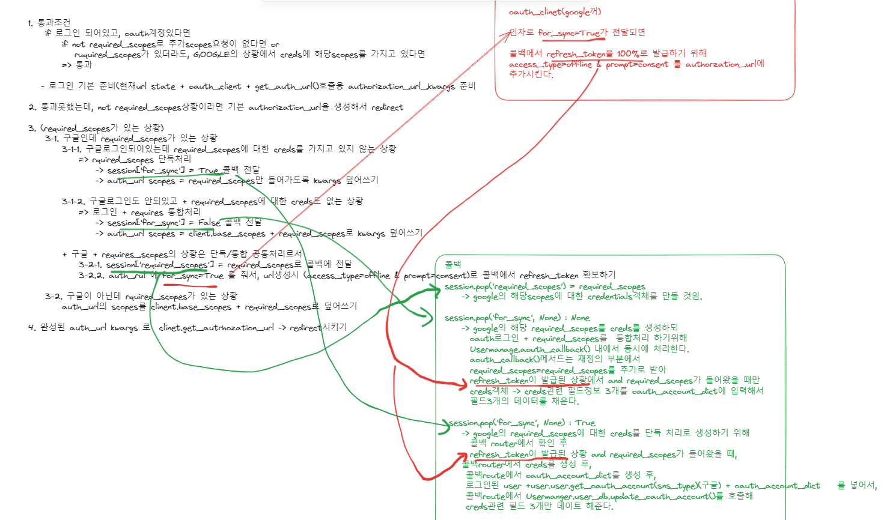
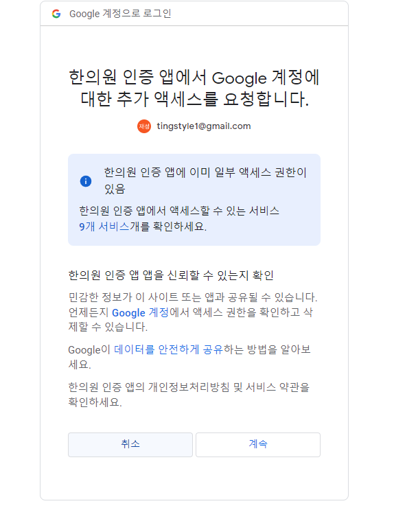
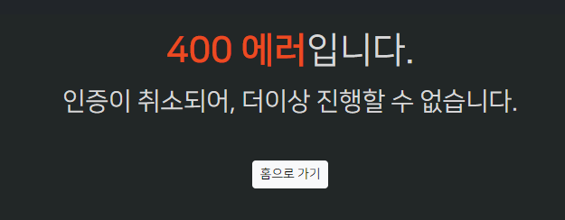

### 데코레이터에 session['for_sync']를 사용하여 로직 정리하기

#### 데코레이터 경우의 수 나누기

```python
def oauth_login_required(sns_type: SnsType, required_scopes: Optional[List[str]] = None):
    """
    required_scopes가 들어올 때, google요청시 refresh_token을 획득하고, authorization_url의 범위를 넓혀줄 required_scopes 추가
    + session을 이용하여 콜백라우터에서 추가scopes 단독처리 / 로그인 + 추가scopes 통합처리를 나눔.
    """

    def decorator(func):
        @wraps(func)
        async def wrapper(request: Request, *args, **kwargs):
            user: Users = request.state.user

            # 1. 통과 조건
            if user and user.get_oauth_access_token(sns_type):
                # required_scopes 없거나 있더라도 google이면서 그에 대한 creds + scopes를 가진 경우 통과
                if not required_scopes or (
                        sns_type == SnsType.GOOGLE and await user.has_google_creds_and_scopes(required_scopes)
                ):
                    return await func(request, *args, **kwargs)

            # 2. 로그인 안됬거나 구글계정 없어서, base_scopes로 로그인 url을 만들기 위해, 현재 url -> state + oauth_client 준비까지 해야하는데
            state_data = dict(next=str(request.url))
            state = generate_state_token(state_data, JWT_SECRET) if state_data else None
            oauth_client = get_oauth_client(sns_type)

            authorization_url_kwargs: dict = dict(
                redirect_uri=str(request.url_for('template_oauth_callback', sns_type=sns_type.value)),
                state=state
            )

            # 3. 통과못했다면, required_scopes가 없는 경우는 그냥 로그인 하면 된다.
            if not required_scopes:
                authorization_url: str = await oauth_client.get_authorization_url(**authorization_url_kwargs)
                return RedirectResponse(authorization_url)

            # (required_scopes가 있는 경우)
            # 4. required_scopes가 있는 경우에는, sns_type(구글 VS 비구글)에 따라 다르다.
            # 4-1) 구글에서 required_scope가 온 경우에는,
            #     4-1-1-1) 로그인 X or 계정정보 X -> 일단 [소셜로그인 + requires_scopes]가 [통합처리]되어야한다 -> 콜백라우터가 받을 [session에 for_sync =False]
            #     4-1-1-2) 로그인 & 계정정보 모두 있을 때만, [session for_sync = True] -> 콜백라우터가 소셜로그인없이 [required_scopes에 대해서만 sync 처리]한다.
            #      => 이에 따라, authorization_url의 scopes는   통합처리시에는 base_scopes+ required_scopes  /   sync처리시 requires_scopes만 주어져야한다.
            if sns_type == SnsType.GOOGLE:
                if user and user.get_oauth_account(SnsType.GOOGLE):
                    request.session['for_sync'] = True
                    authorization_url_kwargs.update({'scope': required_scopes})
                else:
                    request.session['for_sync'] = False
                    authorization_url_kwargs.update({'scope': oauth_client.base_scopes + required_scopes})

                # 4-1-2) 또한, requires_scope가 주어지면, 통합처리든 단일처리든, [콜백라우터에서 creds생성]을 위해 -> session에 'required_scopes'를 전달하여, creds생성시 scopes=required_scopes를 넣어줘야한다.
                request.session['required_scopes'] = required_scopes

                # 4-1-3) 또한, requires_scope가 주어지면, 통합처리든 단일처리든, [creds생성을 위한 refresh_token]을 받으려면 -> authorization_url 생성시 파라미터를 추가 신호인 for_sync=True를 인자로 줘야 동의화면 띄우고 전달한다.
                authorization_url_kwargs.update({'for_sync': True})

            # 4-2) 구글이 아닌 경우, requires_scopes가 주어졌따면, scopes를 추가해서 요청만 하면 된다.
            #     -> 단독처리 X -> session['for_sync'] X
            #     -> creds 생성X : session['required_scopes'] X
            #     -> refresh toekn 생성X: for_sync=True 신호 X
            else:
                authorization_url_kwargs.update({'scope': oauth_client.base_scopes + required_scopes})

            authorization_url: str = await oauth_client.get_authorization_url(**authorization_url_kwargs)

            return RedirectResponse(authorization_url)

        return wrapper

    return decorator
```
#### 콜백라우터에서 sesssion['for_sync']에 따라 creds 생성 및 모델에 3필드 입력을 단독처리/로그인과 통합처리로 나누어서 처리

1. 일단. creds를 생성해야하는 session['required_scopes']가 들어왔는데 없는 경우에 대해, 에러를 정의한다.
    ```python
    # 400
    class BadRequestException(TemplateException):
        def __init__(self, *, code_number: [str, int] = "0", message: str = None, detail: str = None,
                     exception: Exception = None):
            if not isinstance(code_number, str):
                code_number = str(code_number)
    
            super().__init__(
                status_code=status.HTTP_400_BAD_REQUEST,
                code=f"{status.HTTP_400_BAD_REQUEST}{code_number.zfill(4)}",
                message=message or "잘못된 요청입니다.",
                detail=detail,
                exception=exception,
            )
    
    
    class GoogleCredentialsCreateException(BadRequestException):
        def __init__(self, *, message: str = None, detail: str = None, exception: Exception = None):
            super().__init__(
                message=message if message else None,
                code_number="1",
                detail=detail,
                exception=exception,
            )
    ```

2. session의 reqruied_scopes(creds생성여부), for_sync(creds 단독 or 로그인 통합생성 처리)를 적용한 콜백 라우터를 정의한다.
    ```python
    @router.get("/auth/callback/{sns_type}", name='template_oauth_callback')
    async def template_oauth_callback(
            request: Request,
            # code: str,
            # state: Optional[str] = None, => get_oauth_callback()으로 생성된 콜백객체가 받아줌.
            sns_type: SnsType,
            # 인증서버가 돌아올떄 주는 code와 state + sns_type까지 내부에서 받아 처리
            access_token_and_next_url: OAuthAuthorizeCallback = Depends(
                get_oauth_callback(route_name='template_oauth_callback')
            ),
            user_manager: UserManager = Depends(get_user_manager),
    ):
        """
        `Discord callback for Developer OAuth Generated URL`
        """
    
        oauth2_token, next_url = access_token_and_next_url
    
        if oauth2_token.is_expired():
            raise TokenExpiredException()
    
        # 1) google - creds 생성 후 oauth_account 모델이 3필드 입력을  로그인 무관하게 단독처리
        # creds 생성여부를 결정
        required_scopes = request.session.pop('required_scopes', None) 
        # 단독처리로서 router에서 creds 생성(True) VS 통합처리로서 usermanage.oauth_callback() 내부에서 creds 생성(False)
        for_sync = request.session.pop('for_sync', False) 
    
        if for_sync:
            refresh_token = oauth2_token.get("refresh_token")
            if not (required_scopes and refresh_token):
                raise GoogleCredentialsCreateException(detail=f'credentials 생성에는 refresh_token, required_scopes가 모두 필요합니다.')
    
            creds = Credentials.from_authorized_user_info(
                info=dict(
                    token=oauth2_token.get("access_token"),
                    refresh_token=refresh_token,
                    client_id=GOOGLE_CLIENT_ID,
                    client_secret=GOOGLE_CLIENT_SECRET,
                    scopes=required_scopes,
                )
            )
    
            oauth_account_dict = {
                "google_creds_json": creds.to_json(),
                "google_creds_expiry": creds.expiry,
                "google_creds_last_refreshed": D.datetime(),
            }
            user: Users = request.state.user
    
            user = await user_manager.user_db.update_oauth_account(user, user.get_oauth_account(sns_type),
                                                                   oauth_account_dict)
    
        # 2) google - creds 생성 후 oauth_account 모델이 3필드 입력을 user, oauth_account와 통합처리
        else:
            oauth_client = get_oauth_client(sns_type)
            account_id, account_email = await oauth_client.get_id_email(oauth2_token["access_token"])
    
            try:
                user = await user_manager.oauth_callback(
                    oauth_name=sns_type.value,
                    access_token=oauth2_token.get("access_token"),
                    account_id=account_id,
                    account_email=account_email,
                    expires_at=oauth2_token.get("expires_at"),
                    refresh_token=oauth2_token.get("refresh_token"),
                    request=request,
                    associate_by_email=True,  # sns로그인시, 이미 email가입이 있어도, oauth_account로 등록을 허용한다.
                    # is_verified_by_default=False,
                    is_verified_by_default=True,  # sns로그인한 사람이라면 email인증을 안거쳐도 된다고 하자.
                    required_scopes=required_scopes,  # sync 처리 scopes를 넣어줘서, 내부에 oauth_account에 creds관련 정보 추가 저장용
                )
    
            except UserAlreadyExists:
                raise HTTPException(
                    status_code=status.HTTP_400_BAD_REQUEST,
                    detail=ErrorCode.OAUTH_USER_ALREADY_EXISTS,
                )
    
            if not user.is_active:
                raise HTTPException(
                    status_code=status.HTTP_400_BAD_REQUEST,
                    detail=ErrorCode.LOGIN_BAD_CREDENTIALS,
                )
            try:
                if profile_info := await oauth_client.get_profile_info(oauth2_token["access_token"]):
                    await user.update(
                        auto_commit=True,
                        **profile_info,
                        sns_type='discord',
                        last_seen=D.datetime(),  # on_after_login에 정의된 로직도 가져옴
                    )
    
            except Exception as e:
                raise OAuthProfileUpdateFailException(obj=user, exception=e)
    
        jwt_strategy = get_jwt_strategy()
        user_token_for_cookie = await jwt_strategy.write_token(user)
        cookie_redirect_transport = get_cookie_redirect_transport(
            redirect_url=next_url  # 로그인 성공 후 cookie정보를 가지고 돌아갈 곳.
        )
    
        response = await cookie_redirect_transport.get_login_response(user_token_for_cookie)
    
        return response
    ```


### google 인증 과정에서 [계속]이 아니라 [취소] 를 한다면?


1. autrhozation_url의 `redirect_url=`에 적힌 `call back route`로 state=와 함께 오는 것은 똑같은데
    - **아래와 같이, `code=`는 빠지고, 대신 `error=access_denied`의 **query_string**을 달고 `400 BadRequest`로 내려온다.**
    ```python
    # "GET /auth/callback/google?error=access_denied&state=xxx HTTP/1.1" 400 Bad Request
    ```
    ```python
    @router.get("/auth/callback/{sns_type}", name='template_oauth_callback')
    async def template_oauth_callback(
            request: Request,
            # code: str,
            # state: Optional[str] = None, => get_oauth_callback()으로 생성된 콜백객체가 받아줌.
            sns_type: SnsType,
            # 인증서버가 돌아올떄 주는 code=와 state= + sns_type까지 callback객체 내부에서 받아 처리.
            # + 인증 취소 될땐, code= 까지 받아준다.
            access_token_and_next_url: OAuthAuthorizeCallback = Depends(
                get_oauth_callback(route_name='template_oauth_callback')
            ),
            user_manager: UserManager = Depends(get_user_manager),
    ):
    ```

2. **그렇다면 get_oauth_callback()의 객체 내부의 `def __call__`에서 code=, state= 처리외에 `error=`처리를 해줘야한다.**
    - qs error를 받게 된다면, if error가 존재하면 **컨트롤 가능한 TemplateException 1개를 정의해서 raise시켜, middleware에서 처리하자.**
    - **어차피 depends로 작동하는 콜백객체는 route_class_=커스텀 라우트 에러 핸들링 Template Route로는 못잡는다. 라우트 내부에서 일어나는게 아님.**
    ```python
    class OAuthAuthorizeCallback:
    
    async def __call__(
                self,
                request: Request,
                sns_type: SnsType,  # 추가
                code: Optional[str] = None,
                state: Optional[str] = None,
                error: Optional[str] = None,
        ) -> Tuple[OAuth2Token, Optional[str]]:
    
            # 사용자가 인증 [계속] 대신 [취소]를 통해 거부한 경우
            if error:
                error_message = "인증이 취소되어, 더이상 진행할 수 없습니다."
                raise OAuthDeniedException(message=error_message, detail=error)
    ```
    ```python
    class BadRequestException(TemplateException):
        def __init__(self, *, code_number: [str, int] = "0", message: str = None, detail: str = None,
                     exception: Exception = None):
            if not isinstance(code_number, str):
                code_number = str(code_number)
    
            super().__init__(
                status_code=status.HTTP_400_BAD_REQUEST,
                code=f"{status.HTTP_400_BAD_REQUEST}{code_number.zfill(4)}",
                message=message or "잘못된 요청입니다.",
                detail=detail,
                exception=exception,
            )
    
    class OAuthDeniedException(BadRequestException):
        def __init__(self, *, message: str = None, detail: str = None, exception: Exception = None):
            super().__init__(
                message=message if message else None,
                code_number="2",
                detail=detail,
                exception=exception,
            )
    ```
   

#### 미들웨어에서 잡은 TemplateException에 대해, path로 전달하는 {status_code} 뿐만 아니라 message=로 query_string으로 넘기자.
1. **기존에는 redirect(request.url_for())로 query_string을 담을 공간이 없었지만**
    - **`request.url_for()`가 반환하는 URL객체에는, str()으로 만들기 전에 `.include_query_params()`를 통해 query_string을 담을 수 있다.**
    ```python
    class AccessControl(BaseHTTPMiddleware):
        async def dispatch(self, request: Request, call_next: RequestResponseEndpoint) -> Response:
            try:
                #...
            except Exception as e:
    
                if isinstance(error, (APIException, SQLAlchemyException, DBException)):
                    response = JSONResponse(status_code=error.status_code, content=error_dict)
                # 템플릿 에러 -> route depends용 request.state.user을 나와서 render하니 DetachError난다.
                # => redirect로 에러페이지로 보내자.
                else:
                    error_endpoint = request.url_for('errors', status_code=error.status_code)
                    error_endpoint = error_endpoint.include_query_params(message=error.message) # message를 쿼리파라미터로 추가
                    response = redirect(error_endpoint)
    ```

2. **index.py의 errors 라우트는 `message`를 `옵셔널 쿼리스트링 = None`으로 받되, `존재할 시, 한글이 urlencoding()되서 %로 넘어오는 것`을 `unquote()`로 url decoding을 한 되 message로 담아준다.**
    ```python
    @router.get("/errors/{status_code}")
    async def errors(request: Request, status_code: int, message: Optional[str] = None):
        # 쿼리 파라미터로 오는 한글은 디코딩 해야함.
        message = unquote(message) if message else "관리자에게 문의해주세요."
    
        # if status_code == status.HTTP_403_FORBIDDEN:
        #     message = "권한이 없습니다."
    
        context = {
            "status_code": status_code,
            "message": message,
        }
    
        return render(request, 'dashboard/errors.html', context=context)
    ```



## DOCEKR, 설정 관련

### 터미널에서 main.py가 아닌 os로 DOCKER_MODE아니라고 신호주고 사용

- **docker -> `mysql`호스트DB접속이 아니라 | local -> `localhost`호스트DB접속시키려면 환경변수를 미리입력해줘야한다.**
- **비동기(`await`)가 가능하려면, python 터미널이 아닌 `ipython`으로 들어와야한다.**

```python
import os;

os.environ['DOCKER_MODE'] = "False";
from app.models import Users
```

### 도커 명령어

1. (`패키지 설치`시) `pip freeze` 후 `api 재실행`

```shell
pip freeze > .\requirements.txt

docker-compose build --no-cache api; docker-compose up -d api;
```

2. (init.sql 재작성시) `data폴더 삭제` 후, `mysql 재실행`

```shell
docker-compose build --no-cache mysql; docker-compose up -d mysql;
```

```powershell
docker --version
docker-compose --version

docker ps
docker ps -a 

docker kill [전체이름]
docker-compose build --no-cache
docker-compose up -d 
docker-compose up -d [서비스이름]
docker-compose kill [서비스이름]

docker-compose build --no-cache [서비스명]; docker-compose up -d [서비스명];

```

3. docker 추가 명령어

```powershell
docker stop $(docker ps -aq)
docker rm $(docker ps -aqf status=exited)
docker network prune 

docker-compose -f docker-compose.yml up -d
```

### pip 명령어

```powershell
# 파이참 yoyo-migration 설치

pip freeze | grep yoyo

# 추출패키지 복사 -> requirements.txt에 붙혀넣기

```

### git 명령어

```powershell
git config user.name "" 
git config user.email "" 

```

### yoyo 명령어

```powershell
yoyo new migrations/

# step 에 raw sql 작성

yoyo apply --database [db_url] ./migrations 
```

- 참고
    - 이동: git clone 프로젝트 커밋id 복사 -> `git reset --hard [커밋id]`
    - 복구: `git reflog` -> 돌리고 싶은 HEAD@{ n } 복사 -> `git reset --hard [HEAD복사부분]`