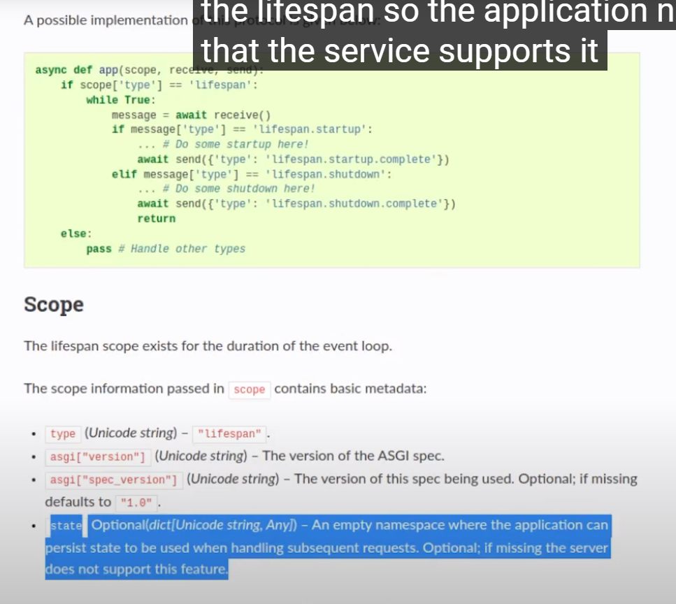
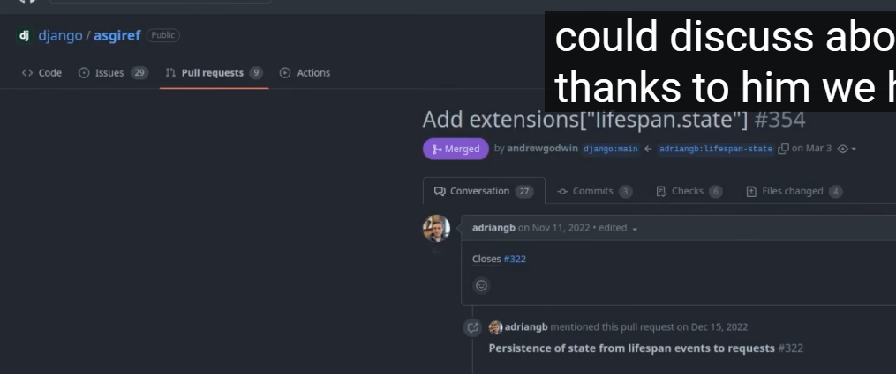
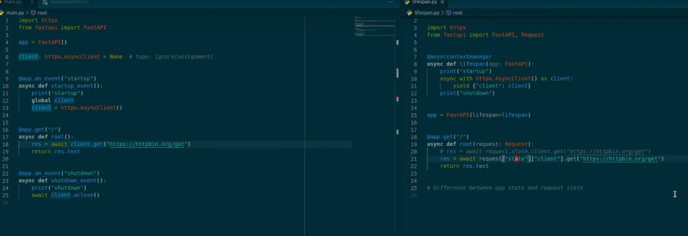
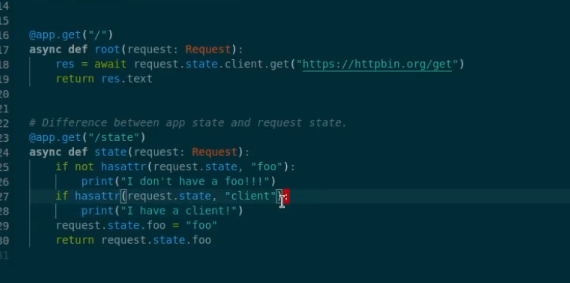
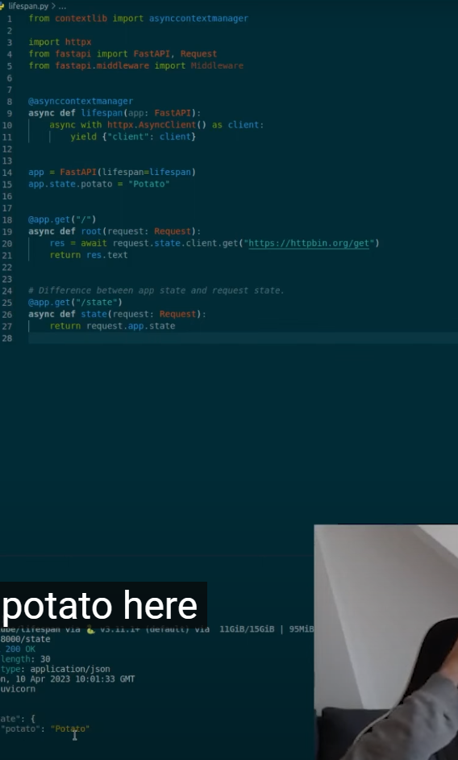
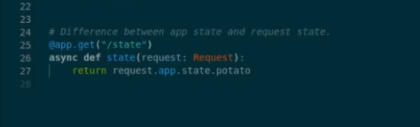

### discord bot 시작 위치 변경
####  어째서인지 startup에서 더이상 작동이 안되기 시작해서 app도 무한 waiting을 하기 시작함.

1. create_app 메서드에 있던 discord_bot.init_app( )을 삭제 처리한다.
    ```python
    def create_app(config: Config):
        #...
        # discord
        # discord_bot.init_app(app)
    ```
2. DiscordBot class에 있던 init_app 메서드 속 startup / shutdown 이벤트 리스너를 주석처리한다.
    ```python
    class DiscordBot(ezcord.Bot):
        ...
        # def init_app(self, app: FastAPI):
        # 
        #     @app.on_event("startup")
        #     async def start_up_discord():
                # self.load_cogs(Path(__file__).resolve().parent / 'cogs')
                # await asyncio.create_task(self.start(DISCORD_BOT_TOKEN))
    
                # await self.run(token=DISCORD_BOT_TOKEN)
    
            # @app.on_event("shutdown")
            # async def shut_down_discord():
            #     # websocket 연결이 끊겼으면, close시키기
            #     if not self.is_closed():
            #         await self.close()
            #     ...
            #     # await self.close()
    ```
   
#### lifespan으로서, app과 생명주기를 같이하되, 내부 yield를 타고 app으로 간다.
- **lifespan은 ML 모델을 app 시작 전에 미리 불러올 때 쓰이는 듯 하다.**
    - lifespan 참고 gist: https://gist.github.com/haykkh/49ed16a9c3bbe23491139ee6225d6d09?permalink_comment_id=4289183#gistcomment-4289183
    - lifespan 참고 유튜브(fastapiEXPERT) : https://www.youtube.com/watch?v=aYOyiAUzfr0
#### lifespan 강의 정리
1. lifespan은 app객체 실행 전, app객체 생성시 들어오는 scope 속 ['lifespan']으로 전달받고 -> **`request.state`의 처음에는 비어있는 namespace에 할당될 수 있는 것 같다.**
    
    - django에서도 최근에는 가져간 듯 하다.
    
2. `@app.on_event`와 다르게 **내부에 yield가 반드시 필요한데, yield {} dict로 생성객체를 반환해주면 `route의 Request객체에서 request.state.해당객체`를 꺼내 쓸 수 있게 된다.**
    
3. request.state에서 꺼내쓸 땐, 없을 수도 있는데, state자체가 **dict가 아니라서, in으로 key검사 or .get( , None) 의 방식이 불가하여** `if not hasattr(request.state, "client")`로 라우트 내에서 예외처리를 해줄수 있다.
    
4. 참고로, app.state.새필드 = 값으로 넣어주면 -> route속 Request객체.app.state에 _state필드에 담겨있으며, Request.app.state.새필드로 바로 꺼내볼 수 도 있다.
    
    

#### 적용
- 일본 블로그 discord + line bot: https://qiita.com/maguro-alternative/items/6f57d4cc6c9923ba6a1d
1. create_app 메서드가 있는 init.py에  `@asynccontextmanager`를 이용해서, async lifespan을 정의한다.
    - 내부에서 yield를 통해, lifespan을 통해 app으로 진입된다.
    - **bot.start( token )에 실패하더라도 yield까지 갈 수 있도록 예외처리를 해준다.**
    - **yield 이후는 app의 종료시점이라 bot도 await로 close해준다.**
    ```python
    # https://gist.github.com/haykkh/49ed16a9c3bbe23491139ee6225d6d09?permalink_comment_id=4289183#gistcomment-4289183
    # => 어떤 사람은 실패했지만 나는 잘 작동함.
    @asynccontextmanager
    async def lifespan(app: FastAPI):
        # Load the ML model
    
        # Load discord bot
        # try 일본사이트 참고: https://qiita.com/maguro-alternative/items/6f57d4cc6c9923ba6a1d
        try:
            asyncio.create_task(discord_bot.start(DISCORD_BOT_TOKEN))
        except discord.LoginFailure:
    
            app_logger.get_logger.error('Discord bot 로그인에 실패하였습니다.')
    
        except discord.HTTPException as e:
    
            app_logger.get_logger.info('Discord bot의 Http연결에 실패하였습니다.')
        except KeyboardInterrupt:
            app_logger.get_logger.info('Discord bot이 예상치 못하게 종료되었습니다.')
            await discord_bot.close()
        yield  # <- 이 yield가 없으면, 아래의 코드가 실행되지 않는다.
    
        # Unload the ML model
        # Unload discord bot
        if discord_bot.is_closed(): # web socket 연결 중인지 확인
            await discord_bot.close()
    ```

2. 기존의 cog 파일들을 불러오는 코드들을, bot class의 on_ready로 옮겨준다.
    - 기존에는 bot class의 startup에 있었다.
    ```python
    async def on_ready(self):
        # /cogs폴더의 파일들을 load함.
        self.load_cogs(Path(__file__).resolve().parent / 'cogs')
        
        # bot server 시작
        await self.ipc.start()
    
        app_logger.get_logger.info(f"{self.user} Application is online")
    ```
   
3. route에서 request.state에 hasattr를 확인해서 넣어준 discord_bot를 꺼내서 쓴다.
    ```python
    @router.get("/")
    async def index(request: Request, session: AsyncSession = Depends(db.session)):
        """
        `ELB 헬스 체크용`
        """
        # request.state는 dictionary 처럼 in이나 .get(, None)은 못쓴다.
        #   "detail": "'State' object has no attribute 'get'"
        #   "detail": "argument of type 'State' is not iterable"
        if hasattr(request.state, 'discord_bot'):
            discord_bot = request.state.discord_bot
            print(f"discord_bot >> {discord_bot}")
    
            print(f"discord_bot.is_closed() >> {discord_bot.is_closed()}")
            server_response = await discord_ipc_client.request("guild_count")
            print(f" guild_count >> {server_response.response}")
    
        return "ok"
    
    # discord_bot >> <app.libs.discord.bot.bot.DiscordBot object at 0x000001AAC35C7670>
    # discord_bot.is_closed() >> False
    # guild_count >> 2
    ```
#### middle 웨어에서 request.state.필드 = None으로 초기화면, lifespan에 넣어줬던 것이 없어져버린다.
1. **매번 `.hasattr()`로 확인하지 않아도 되도록 미들웨어에서 해당 namespace를 초기화하려고 했다.**
```python
class AccessControl(BaseHTTPMiddleware):

    async def dispatch(self, request: Request, call_next: RequestResponseEndpoint) -> Response:
        await self.init_state(request)
        #...
    @staticmethod
    async def init_state(request):
        #...
        
        # discord bot
        request.state.discord_bot = None
```

2. 이미 초기화됬으니 없으면  None으로서, if로 바로 확인하여 할당하고 사용해본다.
    ```python
    @router.get("/")
    async def index(request: Request, session: AsyncSession = Depends(db.session)):
    
        if discord_bot := request.state.discord_bot:
            print(f"discord_bot >> {discord_bot}")
    
            print(f"discord_bot.is_closed() >> {discord_bot.is_closed()}")
            server_response = await discord_ipc_client.request("guild_count")
            print(f" guild_count >> {server_response.response}")
    
    
        return "ok"
    ```
3. lifespan -> app -> middleware 순으로 실행되어
    - lifespan에 넣어줬던 discord_bot이 사라져 버린다.
    - **롤백하고, `lifespan에서 초기화`해주자.**
    - **확인은 `is_closed()`는 연결이 안된상태에서도 객체를 반환해버리므로 `.is_ready()`를 활용해서 yield에 초기화한다.**
    ```python
    @asynccontextmanager
    async def lifespan(app: FastAPI):
        # Load the ML model
        # Load discord bot
        try:
            asyncio.create_task(discord_bot.start(DISCORD_BOT_TOKEN))
        except discord.LoginFailure:
            app_logger.get_logger.error('Discord bot 로그인에 실패하였습니다.')
            # await discord_bot.close()
        except discord.HTTPException as e:
            # traceback.print_exc()
            app_logger.get_logger.info('Discord bot의 Http연결에 실패하였습니다.')
        except KeyboardInterrupt:
            app_logger.get_logger.info('Discord bot이 예상치 못하게 종료되었습니다.')
            await discord_bot.close()
            
        yield {
            'discord_bot': discord_bot if discord_bot.is_ready() else None
        }
        
        # Unload the ML model
        # Unload discord bot
        if discord_bot.is_closed():  # web socket 연결 중인지 확인
            await discord_bot.close()
    ```
   
4. **이제 hasattr()확인 없이 request.state.discord_bot을 꺼내서 None인지 판단후에 사용하면 된다.**
    ```python
    @router.get("/")
    async def index(request: Request, session: AsyncSession = Depends(db.session)):
        """
        `ELB 헬스 체크용`
        """
        # if hasattr(request.state, 'discord_bot'):
        #     discord_bot = request.state.discord_bot
        if discord_bot := request.state.discord_bot:
            print(f"discord_bot >> {discord_bot}")
            server_response = await discord_ipc_client.request("guild_count")
            print(f" guild_count >> {server_response.response}")
            #  guild_count >> 2
    
    
        return "ok"
    ```
   
### ipc_client에 예외처리를 하는 request를 구현하기 위해 wrapper class 만들기

#### libs/discord의 exception 따로 정의하기(순환 import 에러 방지)
- app/libs/discord/bot/exceptions.py를 생성하고 기본 Exception폼을 가져와 정의한다.
```python
from starlette import status

class DiscordException(Exception):
    status_code: int
    code: str
    message: str
    detail: str
    exception: Exception

    def __init__(
            self,
            *,
            status_code: int = status.HTTP_500_INTERNAL_SERVER_ERROR,
            code: str = "0000000",
            message: str = "Discord 연결에 문제가 발생했습니다.",
            detail: str = None,
            exception: Exception = None,
    ):
        self.status_code = status_code
        self.code = code
        self.message = message  # 유저에게 바로 보여주는 메세지
        self.detail = detail  # 에러마다의 해당 정보를 보여주는 메세지
        self.exception = exception
        # self.result_data: dict 도 필요할 수 도
        super().__init__(exception)


class DiscordBotRequestException(DiscordException):
    def __init__(self, *, code_number: [str, int] = "0", message: str = None, detail: str = None,
                 exception: Exception = None):
        if not isinstance(code_number, str):
            code_number = str(code_number)

        super().__init__(
            status_code=status.HTTP_400_BAD_REQUEST,
            code=f"{status.HTTP_400_BAD_REQUEST}{code_number.zfill(4)}",
            message=message or "Discord bot에 요청 실패하였습니다.",
            detail=detail,
            exception=exception,
        )

```
#### request를 재정의한 IPC Wrapper클래스 만들기


```python
# app/libs/discord/bot/ipc_client.py

from discord.ext.ipc import Client

from app.common.config import DISCORD_BOT_SECRET_KEY
from app.libs.discord.bot.exceptions import DiscordBotRequestException


# discord_ipc_client = Client(secret_key=DISCORD_BOT_SECRET_KEY)

class DiscordIPCWrapper:
    def __init__(self, secret_key):
        self.ipc_client = Client(secret_key=secret_key)

    async def request(self, request_type, *args, **kwargs):
        try:
            response = await self.ipc_client.request(request_type, **kwargs)
            return response
        except Exception as e:
            # "[Errno 10061] Connect call failed ('127.0.0.1', 20000)"
            # TODO: bot에 요청실패시 알려주기
            raise DiscordBotRequestException(
                message=f'Discord bot에 request 실패: {request_type} | {str(e)}',
                exception=e
            )


discord_ipc_client = DiscordIPCWrapper(secret_key=DISCORD_BOT_SECRET_KEY)
```

#### midleware에서 커버되는 Exception으로 추가해주기
```python
# app/errors/exception_handler.py
async def exception_handler(exception: Exception):

    # if not isinstance(exception, (APIException, SQLAlchemyException, DBException, TemplateException):
    if not isinstance(exception, (APIException, SQLAlchemyException, DBException, TemplateException, DiscordException)):
        exception = APIException(exception=exception, detail=str(exception))
    ...
    return exception
```
```python
class AccessControl(BaseHTTPMiddleware):

    async def dispatch(self, request: Request, call_next: RequestResponseEndpoint) -> Response:
        #...
        try:
            #...
        except Exception as e:

            # error: [APIException, SQLAlchemyException, DBException, TemplateException] = await exception_handler(e)

            error: [APIException, SQLAlchemyException, DBException, TemplateException, DiscordException] = await exception_handler(e)

            # JSONResponse의 content=로 넣을 error 객체를 dict로 변환한다.
            error_dict = dict(
                status=error.status_code,
                code=error.code,
                message=error.message,
                detail=error.detail,
            )
            # if isinstance(error, (APIException, SQLAlchemyException, DBException)):
            if isinstance(error, (APIException, SQLAlchemyException, DBException, DiscordException)):
                response = JSONResponse(status_code=error.status_code, content=error_dict)
            #...
```
## DOCEKR, 설정 관련

### 터미널에서 main.py가 아닌 os로 DOCKER_MODE아니라고 신호주고 사용

- **docker -> `mysql`호스트DB접속이 아니라 | local -> `localhost`호스트DB접속시키려면 환경변수를 미리입력해줘야한다.**
- **비동기(`await`)가 가능하려면, python 터미널이 아닌 `ipython`으로 들어와야한다.**

```python
import os;

os.environ['DOCKER_MODE'] = "False";
from app.models import Users
```

### 도커 명령어

1. (`패키지 설치`시) `pip freeze` 후 `api 재실행`

```shell
pip freeze > .\requirements.txt

docker-compose build --no-cache api; docker-compose up -d api;
```

2. (init.sql 재작성시) `data폴더 삭제` 후, `mysql 재실행`

```shell
docker-compose build --no-cache mysql; docker-compose up -d mysql;
```

```powershell
docker --version
docker-compose --version

docker ps
docker ps -a 

docker kill [전체이름]
docker-compose build --no-cache
docker-compose up -d 
docker-compose up -d [서비스이름]
docker-compose kill [서비스이름]

docker-compose build --no-cache [서비스명]; docker-compose up -d [서비스명];

```

3. docker 추가 명령어

```powershell
docker stop $(docker ps -aq)
docker rm $(docker ps -aqf status=exited)
docker network prune 

docker-compose -f docker-compose.yml up -d
```

### pip 명령어

```powershell
# 파이참 yoyo-migration 설치

pip freeze | grep yoyo

# 추출패키지 복사 -> requirements.txt에 붙혀넣기

```

### git 명령어

```powershell
git config user.name "" 
git config user.email "" 

```

### yoyo 명령어

```powershell
yoyo new migrations/

# step 에 raw sql 작성

yoyo apply --database [db_url] ./migrations 
```

- 참고
    - 이동: git clone 프로젝트 커밋id 복사 -> `git reset --hard [커밋id]`
    - 복구: `git reflog` -> 돌리고 싶은 HEAD@{ n } 복사 -> `git reset --hard [HEAD복사부분]`