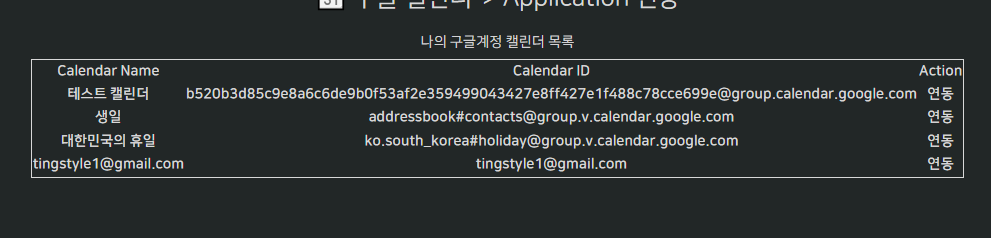
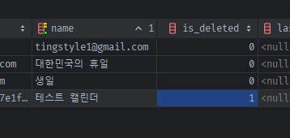

### UserCalendars

#### scopes -> service_name -> build된 service객체를 Users 모델 내부에서 처리되도록

1. 메서드를 google client.py에 정의된 get_google_service_name_by_scopes()를 google_scopes_to_service_name로 이름 변경 후,
   user.get_google_service(scopes) 내부에 쓰도록 변경
   ```python
   # app/libs/auth/oauth_clients/google.py
   def google_scopes_to_service_name(google_scopes: List[str]):
       for service_name, mapped_scopes in service_name_and_scopes_map.items():
           if all(scope in mapped_scopes for scope in google_scopes):
               return service_name
       return None
   ```
   ```python
   class Users(BaseModel, SQLAlchemyBaseUserTable[int]):
       ...
       async def get_google_service(self, scopes: List[str], api_version: str = 'v3'):
           if not (creds := await self.get_google_creds()):
               return None
   
           # Scopes to service name
           service_name = google_scopes_to_service_name(scopes)
   
           service = build(service_name, api_version, credentials=creds)
   
           return service
   ```
   ```python
   @router.get("/calendar_sync")
   
   @oauth_login_required(SnsType.GOOGLE, required_scopes=CALENDAR_SCOPES)
   @role_required(RoleName.STAFF)
   async def sync_calendar(request: Request):
       user: Users = request.state.user
       calendar_service = await user.get_google_service(CALENDAR_SCOPES)
       google_calendars = calendar_service.calendarList().list().execute()
   
       calendars = []
       for calendar in google_calendars['items']:
           # model을 담기 전, dict list로 뽑아본다.
           calendars.append(dict(
               # google_account_id=user.get_oauth_account(SnsType.GOOGLE).id,  # 추후 FK
               user_id=user.id,  # 추후 FK -> 구글 계정별 calendar도 되지만, 우리는 google계정 1개만 사용 + Users에 딸린 calendar를 바로 찾을 수 있다.
               calendar_id=calendar['id'],
               name=calendar['summary'],
               is_deleted=calendar.get('deleted', False),  # "deleted"키가 포함되어있고, True면 삭제 된 것. 없을 수 있어서 .get()
           ))
   ```

#### creds 복습

1. 데코레이터에서 `user.has_google_creds_and_scopes(required_scopes)`로 조회한다.
    - has_google_creds_and_scopes내부에서는 `await self.google_creds_scopes`로 가진 creds의 scopes를 조회한다.
        - google_creds_scopes내부에서는 `await self.get_google_creds()`로 creds를 조회한다.
            - **get_google_creds내부에서는 google_account 모델데이터 속 `.google_creds_json`를 가져온다.**
                - google_creds_json를 json.load한 뒤 -> Credentials객체를 만들고, `.expired`시 만료되었다면,
6. **`oauth_account의 refresh_token값`이 아닌, `required_scopes를 포함하여 만든 google_creds_json 내부 refresh_token`으로
   Credentials객체.refresh()메서드로 `inplace refresh` 후 creds_json도 업데이트**한 뒤, refresh된 creds를 반환한다.
    - **하지만, RefreshError에 걸릴 경우, google_creds_json필드를 None으로 비우고, `await self.get_google_creds() -> None을 반환`한다.**
7. get_google_creds이 creds expried + refreshError로 None을 반환하면, -> 데코레이터의 has_google_creds_and_scopes 역시 False를 반환하게 되어
    - 데코레이터에 걸려서 -> 다시 scopes를 포함한 google oauth 요청 -> creds를 새로 획득하게 된다.


8. **정리하면 `데코레이터의 has_creds`를 확인하는 과정에서 creds_json -> creds -> exipred -> refresh성공여부를 확인하고 refrehs실패시 None 박히고 False로
   나와 다시 creds요청하러 간다.**
    - **그 결과 sync_config route에 입장한 상태는 `무조건 creds 확보 -> build를 통한 service까지 호출해도 무방`상태다.**

### creds과 100% 확보된 상태 route [sync_calendar]에서 service까지 호출하여 DB에 저장하기

- 장고 모델 참고: https://github.dev/PigsCanFlyLabs/cal-sync-magic/blob/main/cal_sync_magic/models.py

1. dictionary로 저장해서 뿌려봤던 `user_id`, `calendar_id`, `name(summaru)`, `is_deleted`외 `BaseModel`에
   있는 `자체id`,  `created_at`, `updated_at`도 같이 저장한다.
    - **추가로, 관리자만 등록할 것 같지만, `last_sync_token`필드를 만들어, google calendar watch API에서 `다음 sync시 변화만 감지`하기
      위해, `nextPageToken`이 존재한다면 계속해서 업데이트될 필드도 만들어놓는다.**
        - 거기에 추가로 sync관련 에러 발생시간을 기록할 `last_error` 필드도 추가해놓는다.
    - **추가로, 변화감지 정보를 push받을 여부도 `webhook_enabled`필드로 만들어놓는다.**

2. models/calendar.py를 만들고, 모델을 정의한 뒤, `init`에 추가해준다.
    ```python
    from sqlalchemy import Column, String, Boolean, func, DateTime, Integer, ForeignKey
    from sqlalchemy.orm import relationship
    
    from app.models import BaseModel
    
    
    class UserCalendars(BaseModel):
        google_calendar_id = Column(String(length=500), nullable=False)
        name = Column(String(length=500), nullable=True)
        is_deleted = Column(Boolean, default=False)
        last_sync_token = Column(String(length=500), nullable=True)
        last_error = Column(DateTime, default=func.utc_timestamp(), nullable=True)
        webhook_enabled = Column(Boolean, default=False)  # See https://developers.google.com/calendar/api/guides/push
    
        user_id = Column(Integer, ForeignKey("users.id", ondelete="CASCADE"), nullable=False)
        user = relationship("Users", back_populates="calendars",
                            foreign_keys=[user_id],
                            uselist=False,
                            )
    ```
    ```python
    class Users(BaseModel, SQLAlchemyBaseUserTable[int]):
        # ...
        calendars = relationship("UserCalendars", back_populates="user",
                                 cascade="all, delete-orphan",
                                 lazy=True  # 'select'로서 자동load아님. 
                                 )
    ```
    ```python
    from app.models.user import *
    from app.models.calendar import *
    ```


3. startup대신 db 생성을 담당하게 된 lifespan에 해당 모델을 추가 import한다
    - 모듈단위에서 `import *`이 안됨.
    ```python
    @asynccontextmanager
    async def lifespan(app: FastAPI):
        # Load the ML model
    
        # Load discord bot
        # try 일본사이트 참고: https://qiita.com/maguro-alternative/items/6f57d4cc6c9923ba6a1d
        try:
            asyncio.create_task(discord_bot.start(DISCORD_BOT_TOKEN))
        except discord.LoginFailure:
            app_logger.get_logger.error('Discord bot 로그인에 실패하였습니다.')
            # await discord_bot.close()
        except discord.HTTPException as e:
            # traceback.print_exc()
            app_logger.get_logger.info('Discord bot의 Http연결에 실패하였습니다.')
        except KeyboardInterrupt:
            app_logger.get_logger.info('Discord bot이 예상치 못하게 종료되었습니다.')
            await discord_bot.close()
    
        # DB create
        async with db.engine.begin() as conn:
            from app.models import Users, UserCalendars  # , UserCalendarEvents, UserCalendarEventAttendees
            await conn.run_sync(Base.metadata.create_all)
            logging.info("DB create_all.")
    
        # default Role 데이터 create
        from app.models import Roles
        if not await Roles.row_count():
            await Roles.insert_roles()
    
        # TODO: 관리자 email기준으로 관리자 계정 생성
        # from app.models import Users
        # print(f"await Users.get(1) >> {await Users.get(1)}")
    
        # print(f"discord_bot.is_closed() in lifespan >> {discord_bot.is_closed()}")
        # => is_ready()로 확인하여 초기화한다.
        yield {
            'discord_bot': discord_bot if discord_bot.is_ready() else None
        }
    
        # Unload the ML model
        # Unload discord bot
        if discord_bot.is_closed():  # web socket 연결 중인지 확인
            await discord_bot.close()
    
        # delete session
        await db._scoped_session.remove()  # async_scoped_session은 remove까지 꼭 해줘야한다.
        await db._async_engine.dispose()
        logging.info("DB disconnected.")
    ```

### creds 확보 route에서 [아무런 요청없어도 default로] calendar_id외 데이터를 db에 저장(create_or_update)

- **매번 접속할때마다 조회 -> save를 해야하므로 `@classmethod create_or_update`를 구현해서, `생성하거나 있으면 update`시켜야한다.**
- 이미 `@classemthod`인 create메서드와 `@@update.instancemethod`인 update메서드가 구현되어있으니 활용해서 만들어본다.

#### Mixin - create_or_update 메서드

1. **껍데기를 만든다. CRUD메서드는 classmethod, instancemethod를 `@class_or_instance_method` 와 `@메서드명.instancemethod`를 통해 둘다 구현한다.**
    ```python
        @class_or_instance_method
        async def create_or_update(cls, session: AsyncSession = None, auto_commit=False, refresh=False, **kwargs):
            ...
        @create_or_update.instancemethod
        async def create_or_update(self, session: AsyncSession = None, auto_commit=False, refresh=False, **kwargs):
            raise NotImplementedError(f'객체 상태에서 {self.__class__.get.__name__}를 호출 할 수 없습니다.')
    ```

2. **내부에서는 `unique칼럼을 자동 추출`할 수 있는데, `google_calendar_id`를 unique처리하면, 다른type의 캘린더는 들어갈 수 없으니**
    - **google_calendar_id를 nullable하게 만들고, calendar_type필드를 Enum으로 배정하자.**
    - **`name`을 nullable=False + unique로 주자.**
    ```python
    class CalendarType(str, Enum):
        DEFAULT = "default"
        GOOGLE = "google"
    ```
    ```python
    class UserCalendars(BaseModel):
        # google_calendar_id = Column(String(length=500), nullable=False)
        type = Column(Enum(CalendarType), default=CalendarType.DEFAULT, index=True)
        google_calendar_id = Column(String(length=500), nullable=True)
    
        # name = Column(String(length=500), nullable=True)
        name = Column(String(length=500), nullable=False, unique=True)
        
        is_deleted = Column(Boolean, default=False)
        last_sync_token = Column(String(length=500), nullable=True)
        last_error = Column(DateTime, default=func.utc_timestamp(), nullable=True)
        webhook_enabled = Column(Boolean, default=False)  # See https://developers.google.com/calendar/api/guides/push
    
        user_id = Column(Integer, ForeignKey("users.id", ondelete="CASCADE"), nullable=False)
        user = relationship("Users", back_populates="calendars",
                            foreign_keys=[user_id],
                            uselist=False,
                            )
    ```

3. unique칼럼 name을 기준으로 존재하는지 판단 후, 존재하면 update / 존재하지 않으면 create 로직을 가져간다.
    ```python
        @class_property
        def unique_names(cls):
            return cls.get_constraint_column_names('unique')
    ```
    ```python
    @class_or_instance_method
    async def create_or_update(cls, session: AsyncSession = None, auto_commit=False, refresh=False, **kwargs):
        # create 전에, 조회 후 filter_by -> True면 update로 처리
        # 1) get에서 조회하던 unique 칼럼 들어왔는지 확인
        if not any(col_name in cls.unique_names for col_name in kwargs.keys()):
            raise KeyError(f'해당 데이터 존재 여부 확인을 위한 unique 칼럼을 적어도 하나 입력해주세요.')

        # 2) unique칼럼명 가져오기 (첫번재 칼럼)
        first_unique_col_name = cls.unique_names[0]

        # 3) unique칼럼명에 해당하는 kwargs의 값 뽑아 조회
        target_obj = await cls.filter_by(name=kwargs[first_unique_col_name]).first()
        # 4) 존재하면 update로
        if target_obj:
            await target_obj.update(session=session, auto_commit=auto_commit, refresh=refresh, **kwargs)
            return target_obj

        # 5) 존재안하면 create 로직
        obj = await cls.create_obj(session=session)
        if kwargs:
            obj.fill(**kwargs)

        return await obj.save(auto_commit=auto_commit, refresh=refresh)
    ```

#### creds 확보 router에서, 순회하며 auto_commit=True로 create_or_update로 생성

- **조회가 아닌 이상 `auto_commit=False으로 여러 CUD를 하면 저장이 안되고 초기화되어버린다.`**
- **`이후 로직이 이어진다면 auto_commit=True + refresh=True까지 줘서 사용하자?`**

1. dictionary 버전을 UserCalendars의 필드명에 맞게 바꿔서 저장한다.
    - **calendar들을 조회하고 난 뒤, for로 item들을 순회하면서, `auto_commit=False`로 순회하다가, 마지막에 직접 `awiat session.commit()`으로 commit한다.
      **
    ```python
    @router.get("/calendar_sync")
    # @oauth_login_required(SnsType.GOOGLE)
    @oauth_login_required(SnsType.GOOGLE, required_scopes=CALENDAR_SCOPES)
    @role_required(RoleName.STAFF)
    async def sync_calendar(request: Request, session: AsyncSession = Depends(db.session)):
        user: Users = request.state.user
        calendar_service = await user.get_google_service(CALENDAR_SCOPES)
        google_calendars = calendar_service.calendarList().list().execute()
    
        for calendar in google_calendars['items']:
            # 지워진 달력을 표시해서 업데이트 되게 하기
            # -> service 조회시 그렇게 나오나보다.
            is_deleted = "deleted" in calendar and calendar["deleted"]
    
            await UserCalendars.create_or_update(
                session=session, auto_commit=True,  # CUD는 False로 순회하면 저장이 안됨.
                type=CalendarType.GOOGLE,
                google_calendar_id=calendar['id'],
                name=calendar['summary'],
                is_deleted=is_deleted,
                user_id=user.id,
            )
    
        context = {
            'calendars': user.calendars
            # "Parent instance <Users at 0x22ef0a799d0> is not bound to a Session; lazy load operation of attribute 'calendars' cannot proceed (Background on this error at: https://sqlalche.me/e/20/bhk3)"
        }
        return render(request, "dashboard/calendar-sync.html", context=context)
    ```

#### joined안된 many테이블(UserCalendars)를 user.id + session으로 join없이 바로 조회하기

- 아직 `.load()` 믹스인을 개발하지 않은 상태며, user정보와 함꼐 내려가는 것이 내려가야하는 상황이 아니므로
    - **session + user.id로 UserCalendars를 조회한다.**
    ```python
    @router.get("/calendar_sync")
    # @oauth_login_required(SnsType.GOOGLE)
    @oauth_login_required(SnsType.GOOGLE, required_scopes=CALENDAR_SCOPES)
    @role_required(RoleName.STAFF)
    async def sync_calendar(request: Request, session: AsyncSession = Depends(db.session)):
        user: Users = request.state.user
        calendar_service = await user.get_google_service(CALENDAR_SCOPES)
        google_calendars = calendar_service.calendarList().list().execute()
    
        for calendar in google_calendars['items']:
            # 지워진 달력을 표시해서 업데이트 되게 하기
            # -> service 조회시 그렇게 나오나보다.
            is_deleted = "deleted" in calendar and calendar["deleted"]
    
            await UserCalendars.create_or_update(
                session=session, auto_commit=True,  # CUD는 False로 순회하면 저장이 안됨.
                type=CalendarType.GOOGLE,
                google_calendar_id=calendar['id'],
                name=calendar['summary'],
                is_deleted=is_deleted,
                user_id=user.id,
            )
    
        calenders = await UserCalendars.filter_by(session=session, user_id=user.id).all()
        context = {
            'calendars': calenders,
        }
        return render(request, "dashboard/calendar-sync.html", context=context)
    ```

### 만약, 캘린더를 지웠는데, db에는 남아있다면?



- 테스트캘린더는 지웟는데도 불구하고, db에 남아있다.

#### sync 처리

1. **set구조를 활용해서, `db에 저장했던 ids` VS `현재 google ids`를 비교하기 위해**
    - **google calendars['items']를 순회하며 `무조건 create_or_update`는 시킨다.**
    - **하지만, `db저장된 ids`에 포함되어있으나, `google에서는 삭제된 ids`들을 골라내기 위해 `현재 google_ids`까지 따로 set에 추출한다.**
    - 이 때, 판단 기준 unique 칼럼이 calendar_id(nullable, 구글아닌 캘린더가 올 수 잇음.)가 아니라 name으로 잡혀있는데
    - **이미 같은 name으로 캘린더가 생성되었다가 삭제(is_deleted=True)될 수 있다. 그러면, update를 수행하는데 삭제된 것을 살리도록 is_deleted=False를 직접 줘야한다.**
    ```python
    async def sync_calendar(request: Request, session: AsyncSession = Depends(db.session)):
        user: Users = request.state.user
        calendar_service = await user.get_google_service(CALENDAR_SCOPES)
        google_calendars = calendar_service.calendarList().list().execute()
    
        # 1. 삭제된 user_google_calendars를 찾기 위해 [새캘린더 추가 및 기존캘린더 업뎃] 순회 중에 모음.
        google_calendar_ids: set = set()
    
        # 2. 새 캘린더라면 추가, 기존 캘린더라면 업데이트
        for calendar in google_calendars['items']:
            google_calendar_ids.add(calendar['id'])
    
            await UserCalendars.create_or_update(
                session=session, auto_commit=True,  # CUD는 False로 순회하면 저장이 안됨.
                type=CalendarType.GOOGLE,
                google_calendar_id=calendar['id'],
                name=calendar['summary'], # unique필드로서, 생성/update의 기준이 된다.
                is_deleted=False, # True로 기존에 지워졌지만, 생성의 기준으로서, 똑같은 name이 있는 경우도 있으니, is_deleted=False로 업데이트해주기
                user_id=user.id,
            )
    ```

2. **`db에 저장했던 ids`만 추출하기 위해, `삭제마킹 안된` 현재 user.id 중, `is_deleted=False`인 것만 추출해서 `active한 db ids`을 `set`으로 추출한다.**
    ```python
    # 3. 지워진 google calendar를 찾아 is_deleted=True 표시
    # -> 지워진 달력: user의 is_deleted=False 인 type GOOGLE인 calendar_ids 에는 있지만, 
    #               google의 calendar의 id에는 들어오지 않은 달력
    user_active_google_calendars = await UserCalendars.filter_by(
        session=session,
        user_id=user.id,
        type=CalendarType.GOOGLE,
        is_deleted=False
    ).all()
    user_active_google_calendar_ids = {calendar.google_calendar_id for calendar in user_active_google_calendars}
    ```

3. **`db 삭제안된 ids set - 현재 google ids set`의 차집합 ids를 구해, 순회하면서, 삭제된 ids로서 판단하게 한다.**
    ```python
    # 4. db에는 active인데, google에는 없는 달력들 == 지워진 달력으로서, `is_deledted=True`로 삭제마킹 한다.
    deleted_google_calendar_ids: set = user_active_google_calendar_ids - google_calendar_ids
    for deleted_calendar_id in deleted_google_calendar_ids:
        target_calendar = await UserCalendars.filter_by(session=session, google_calendar_id=deleted_calendar_id).first()
        await target_calendar.update(session=session, auto_commit=True, is_deleted=True)
    ```

4. 이제 삭제마킹 안된 active google calendar만 뿌려주자.
    - user.id로 순회해서 가진 `GOOGLE` type의 캘린더를 반환해준다.
    ```python
    # 5. view에 뿌려줄 active(is_deleted=False) google calendars
    calenders = await UserCalendars.filter_by(
        session=session,
        user_id=user.id,
        type=CalendarType.GOOGLE,
        is_deleted=False
    ).all()
    
    context = {
        'calendars': calenders,
    }
    return render(request, "dashboard/calendar-sync.html", context=context)
    ```

5. google에서 삭제한 캘린더는 `is_deleted=True`로 마킹되어, 화면에 안나오게 된다.
   

## DOCEKR, 설정 관련

### 터미널에서 main.py가 아닌 os로 DOCKER_MODE아니라고 신호주고 사용

- **docker -> `mysql`호스트DB접속이 아니라 | local -> `localhost`호스트DB접속시키려면 환경변수를 미리입력해줘야한다.**
- **비동기(`await`)가 가능하려면, python 터미널이 아닌 `ipython`으로 들어와야한다.**

```python
import os;

os.environ['DOCKER_MODE'] = "False";
from app.models import Users
```

### 도커 명령어

1. (`패키지 설치`시) `pip freeze` 후 `api 재실행`

```shell
pip freeze > .\requirements.txt

docker-compose build --no-cache api; docker-compose up -d api;
```

2. (init.sql 재작성시) `data폴더 삭제` 후, `mysql 재실행`

```shell
docker-compose build --no-cache mysql; docker-compose up -d mysql;
```

```powershell
docker --version
docker-compose --version

docker ps
docker ps -a 

docker kill [전체이름]
docker-compose build --no-cache
docker-compose up -d 
docker-compose up -d [서비스이름]
docker-compose kill [서비스이름]

docker-compose build --no-cache [서비스명]; docker-compose up -d [서비스명];

```

3. docker 추가 명령어

```powershell
docker stop $(docker ps -aq)
docker rm $(docker ps -aqf status=exited)
docker network prune 

docker-compose -f docker-compose.yml up -d
```

### pip 명령어

```powershell
# 파이참 yoyo-migration 설치

pip freeze | grep yoyo

# 추출패키지 복사 -> requirements.txt에 붙혀넣기

```

### git 명령어

```powershell
git config user.name "" 
git config user.email "" 

```

### yoyo 명령어

```powershell
yoyo new migrations/

# step 에 raw sql 작성

yoyo apply --database [db_url] ./migrations 
```

- 참고
    - 이동: git clone 프로젝트 커밋id 복사 -> `git reset --hard [커밋id]`
    - 복구: `git reflog` -> 돌리고 싶은 HEAD@{ n } 복사 -> `git reset --hard [HEAD복사부분]`