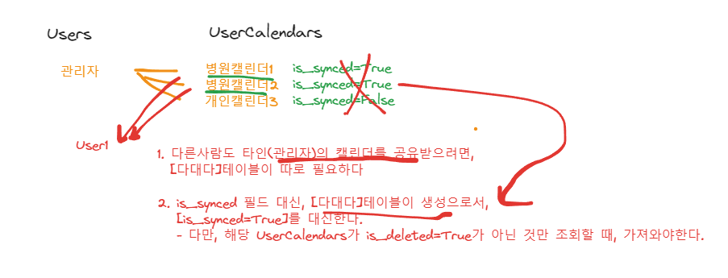
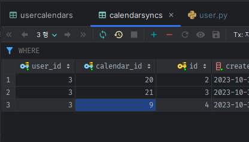
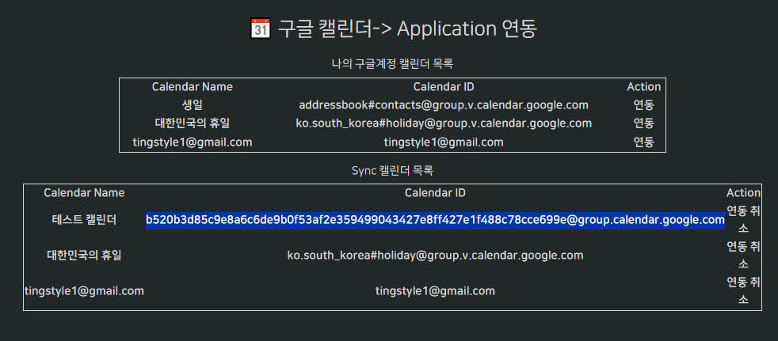
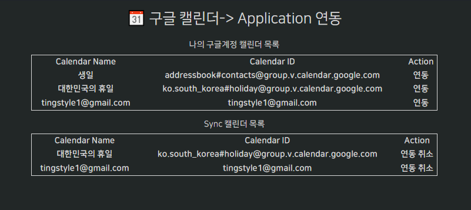
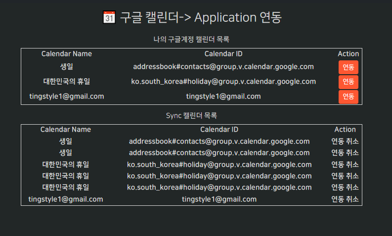

### UserCalendarSyncs 모델로 sync설정하기


1. **타인의 캘린더를 공유받으려면, 다대다 테이블로 db를 생성해놔야 가능하다.**
    - 현재는 Users(one) - UserCalendars(many) 관계로 되어있음
2. 또한, is_synced=True여부를 만들어서, 내 UserCalendars 중에 일부만 Sync하는 것보다
    - **타인캘린더 공유를 위한, `다대다 테이블 생성시, synced할 테이블을 선택해서 생성하는 것으로 is_synced=True필드를 대체`한다**
#### CalendarSyncs 모델 생성
```python
class CalendarSyncs(BaseModel):

    user_id = Column(Integer, ForeignKey("users.id", ondelete="CASCADE"), nullable=False, index=True)
    user = relationship("Users", back_populates="calendar_syncs",
                        foreign_keys=[user_id],
                        uselist=False,
                        )
    calendar_id = Column(Integer, ForeignKey('usercalendars.id', ondelete='CASCADE'), index=True, nullable=False)
    calender = relationship("UserCalendars", back_populates="calendar_syncs",
                            foreign_keys=[calendar_id],
                            uselist=False,
                            )
```
```python
class Users(BaseModel, SQLAlchemyBaseUserTable[int]):

    calendar_syncs = relationship("CalendarSyncs", back_populates="user",
                             cascade="all, delete-orphan",
                             lazy=True  # 'select'로서 자동load아님.
                             )

```
```python
class UserCalendars(BaseModel):

    calendar_syncs = relationship("CalendarSyncs", back_populates="calender",
                                cascade="all, delete-orphan",
                                lazy=True  # 'select'로서 자동load아님.
                                )
```
```python
@asynccontextmanager
async def lifespan(app: FastAPI):

    # DB create
    async with db.engine.begin() as conn:
        from app.models import Users, UserCalendars, CalendarSyncs  # , UserCalendarEvents, UserCalendarEventAttendees
        await conn.run_sync(Base.metadata.create_all)
        logging.info("DB create_all.")
```
#### 임의로 캘린더id, user_id를 넣어서, CalendarSyncs 생성 후, 해당 user의 SyncedCalendar를 가져오기
- db에서 현재 존재하는 관리자의 id를 user_id로 넣고, calendar_id를 넣는다.
- **이 때, is_deleted된 것도 다대다 테이블에선 인지못하고 들어가는데, `query를 날릴 때, is_deleted=False`를 넣어서 조회하도록 한다.**
- **`relationship필드를 이용하여 join`시켜놓고, `다대다 모델의 필드로 필터링`하여 해당하는 것만 가져온다.**
    - join모델의 필터링은 필수로 해당 모델.필드로 조회하고, select 모델은 filter_by(필드명=)으로 할 수 있다.
- **연쇄된 메서드가 아니므로, await에 .all()을 바로 때릴 수 없다.**
```python
@router.get("/calendar_sync")
# @oauth_login_required(SnsType.GOOGLE)
@oauth_login_required(SnsType.GOOGLE, required_scopes=CALENDAR_SCOPES)
@role_required(RoleName.STAFF)
async def sync_calendar(request: Request, session: AsyncSession = Depends(db.session)):
    #...
    context = {
        'calendars': calenders,
    }
    
    # sync된 목록
    synced_calendars = await session.scalars(
        select(UserCalendars)
        .filter_by(is_deleted=False) # cls 테이블에 대한 조건. 삭제처리 안된 것만
        .join(UserCalendars.calendar_syncs) \
        .filter(CalendarSyncs.user_id == user.id)
    ) # .all() # "'coroutine' object has no attribute 'all'"
    # TODO: .all()을 쓰려면, Mixin에 연쇄메서드로 정의해야한다.
    #       현재 login_required에서 user를 이미 심어놓고 가져오기 때문에, user에서 바로 synced_calendars를 가져올 순 없다. 따로 조회해야함.

    # print(f"synced_calendars >> {synced_calendars}")
    # sqlalchemy.engine.Engine SELECT usercalendars.type, usercalendars.google_calendar_id, usercalendars.name, usercalendars.is_deleted, usercalendars.last_sync_token, usercalendars.last_error, usercalendars.webhook_enabled, usercalendars.user_id, usercalendars.id, usercalendars.created_at, usercalendars.updated_at
    # FROM usercalendars INNER JOIN calendarsyncs ON usercalendars.id = calendarsyncs.calendar_id
    # WHERE calendarsyncs.user_id = %s
    # synced_calendars >> <sqlalchemy.engine.result.ScalarResult object at 0x0000015406108F40>
    synced_calendars = synced_calendars.all()
    
    context.update({
        'synced_calendars': synced_calendars,
    })

    return render(request, "dashboard/calendar-sync.html", context=context)

```




### htmx로 연동/연동취소 만들기

#### hx_ router 만들어서, 연동 시키기
- discord.py의 `hx_leaved_guilds` route를 참고해서 작성한다.

1. route를 작성할 때, 실시간 변동을 위한 htmx를 사용한다면
    - route명을 `hx_`로 시작하게 작성하고
    - htmx로 들어왔는지 확인하기 위해 Depends( `is_htmx` )를 사용하여 확인한 뒤, -> `redirect( , is_htmx=)`로 넣어줘야한다.
    - view에서 hx-vals로 데이터가 넘어올 예정이라면 Depends( `hx_vals_schema( pydantic스키마 )` )를 통해 **`hx-vals Form데이터를 Schema적용`시킨다**
        - 일반적으로 hx-vals의 데이터는 Schema적용이 안됬었다.
    - **hx_vals_schema로 받은 body는, body.필드명으로 써야한다. dict처럼 쓰면, `CreateCalendarSyncsRequest' object is not subscriptable`의 에러가 난다.**
    ```python
    @router.post("/calendar_sync")
    @oauth_login_required(SnsType.GOOGLE, required_scopes=CALENDAR_SCOPES)
    @role_required(RoleName.STAFF)
    async def hx_create_calendar_syncs(
            request: Request,
            is_htmx=Depends(is_htmx),
            # body = Body(...),
            body=Depends(hx_vals_schema(CreateCalendarSyncsRequest)),
            session: AsyncSession = Depends(db.session)
    ):
        ...
        return redirect(request.url_for('sync_calendar'), is_htmx=is_htmx)
    
    ```

2. 들어올 데이터에 대한 Schema를 만든다.
    ```python
    from pydantic import BaseModel, ConfigDict, Field
    
    
    class CreateCalendarSyncsRequest(BaseModel):
        model_config = ConfigDict(from_attributes=True)
    
        user_id: int = Field(..., description='Calnedar를 Sync할 user의 id')
        calendar_id: int = Field(..., description='Calnedar를 Sync할 calendar의 id')
    
    ```
   
3. route에서 body를 이용해 데이터를 추출 한 뒤, 사용한다
    ```python
    @router.post("/calendar_sync")
    async def hx_create_calendar_syncs(
            request: Request,
            is_htmx=Depends(is_htmx),
            # body = Body(...),
            body=Depends(hx_vals_schema(CreateCalendarSyncsRequest)),
            session: AsyncSession = Depends(db.session)
    ):
    
        await CalendarSyncs.create(
            session=session,
            auto_commit=True,
            user_id=body.user_id,
            calendar_id=body.calendar_id,
        )
    
        return redirect(request.url_for('sync_calendar'), is_htmx=is_htmx)
    
    ```
   

4. view에서 연동버튼을 만들고, hx-vals에 form데이터를 넣어 호출한 뒤, redirect되어 새로고침 되게 한다.
```html

<div class="row mt-3 justify-content-center">
    <h6> 나의 구글계정 캘린더 목록</h6>
    <table style="border: 1px solid; width: 80%;">
        <tr>
            <th>Calendar Name</th>
            <th>Calendar ID</th>
            <th>Action</th>
        </tr>
        
        <tr>
            <th>{{ calendar.name }}</th>
            <th>{{ calendar.google_calendar_id }}</th>
            {#
            <th>{{ calendar.user_id }}</th>
            #}
            <th>
                <button class='btn btn-sm btn-auth'
                        hx-post='{{ url_for("hx_create_calendar_syncs") }}'
                        hx-vals='{"user_id": "{{ user.id }}", "calendar_id" : "{{ calendar.id }}"}'
                >
                    연동
                </button>
            </th>
        </tr>
        
    </table>
</div>
```




## DOCEKR, 설정 관련

### 터미널에서 main.py가 아닌 os로 DOCKER_MODE아니라고 신호주고 사용

- **docker -> `mysql`호스트DB접속이 아니라 | local -> `localhost`호스트DB접속시키려면 환경변수를 미리입력해줘야한다.**
- **비동기(`await`)가 가능하려면, python 터미널이 아닌 `ipython`으로 들어와야한다.**

```python
import os;

os.environ['DOCKER_MODE'] = "False";
from app.models import Users
```

### 도커 명령어

1. (`패키지 설치`시) `pip freeze` 후 `api 재실행`

```shell
pip freeze > .\requirements.txt

docker-compose build --no-cache api; docker-compose up -d api;
```

2. (init.sql 재작성시) `data폴더 삭제` 후, `mysql 재실행`

```shell
docker-compose build --no-cache mysql; docker-compose up -d mysql;
```

```powershell
docker --version
docker-compose --version

docker ps
docker ps -a 

docker kill [전체이름]
docker-compose build --no-cache
docker-compose up -d 
docker-compose up -d [서비스이름]
docker-compose kill [서비스이름]

docker-compose build --no-cache [서비스명]; docker-compose up -d [서비스명];

```

3. docker 추가 명령어

```powershell
docker stop $(docker ps -aq)
docker rm $(docker ps -aqf status=exited)
docker network prune 

docker-compose -f docker-compose.yml up -d
```

### pip 명령어

```powershell
# 파이참 yoyo-migration 설치

pip freeze | grep yoyo

# 추출패키지 복사 -> requirements.txt에 붙혀넣기

```

### git 명령어

```powershell
git config user.name "" 
git config user.email "" 

```

### yoyo 명령어

```powershell
yoyo new migrations/

# step 에 raw sql 작성

yoyo apply --database [db_url] ./migrations 
```

- 참고
    - 이동: git clone 프로젝트 커밋id 복사 -> `git reset --hard [커밋id]`
    - 복구: `git reflog` -> 돌리고 싶은 HEAD@{ n } 복사 -> `git reset --hard [HEAD복사부분]`