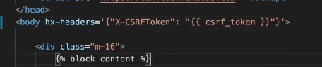
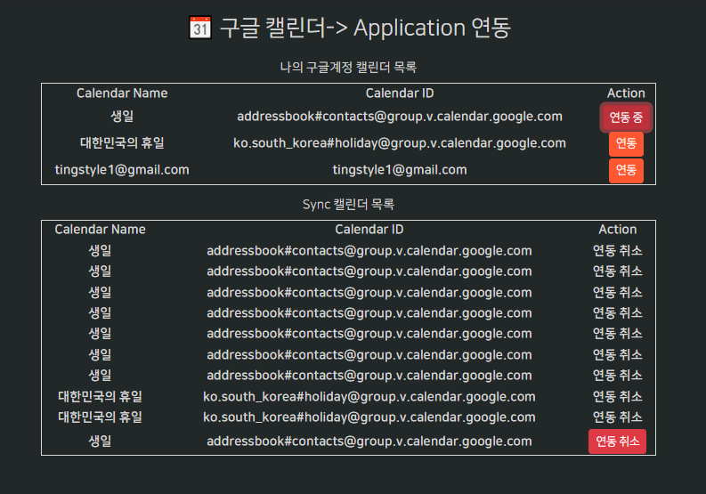
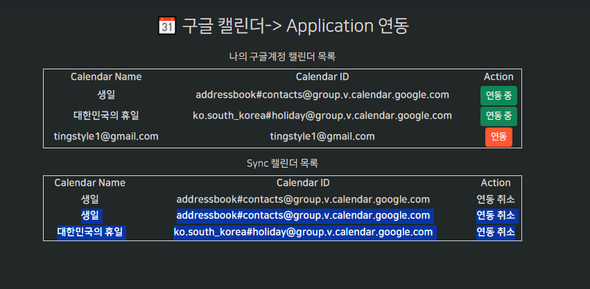
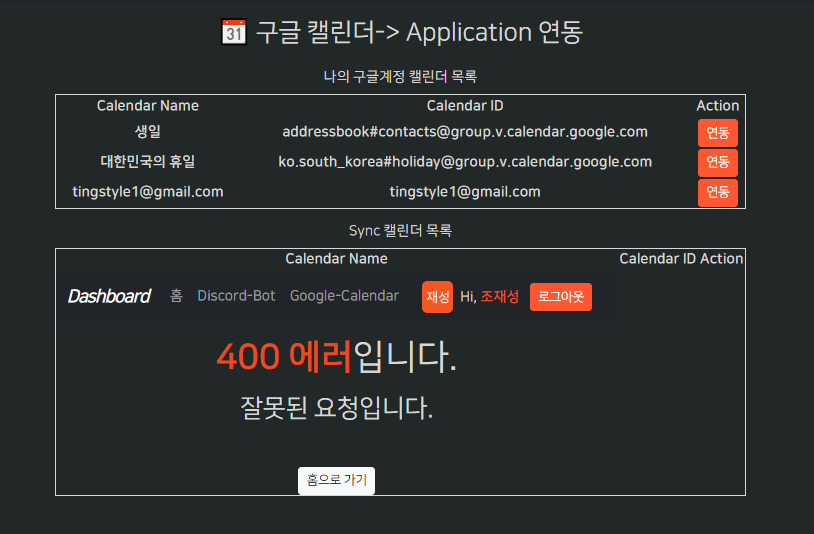
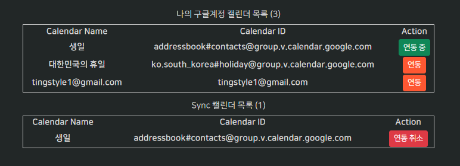
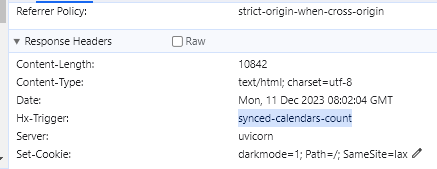
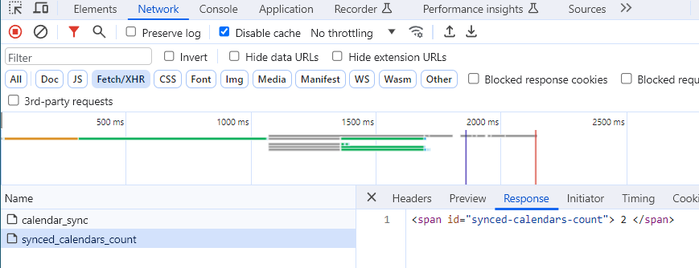

### hx_vals_Schema의 응답을 data_and_errors로 받아서, errros에도 html 응답을 해주자?!

- https://github.dev/codingforentrepreneurs/video-membership 의 `utils.valid_schema_data_or_error()` 유틸을 참고한다.

    ```python
    import json
    from pydantic import BaseModel, error_wrappers
    
    
    def valid_schema_data_or_error(raw_data: dict, SchemaModel:BaseModel):
        data = {}
        errors = []
        error_str = None
        try:
            cleaned_data = SchemaModel(**raw_data)
            data = cleaned_data.dict()
        except error_wrappers.ValidationError as e:
            error_str = e.json()
        if error_str is not None:
            try:
                errors = json.loads(error_str)
            except Exception as e:
                errors = [{"loc": "non_field_error", "msg": "Unknown error"}]
        return data, errors
    ```

#### hx_vals_schema 내부에서 에러를 잡아서, 템플릿용 errors = []의 형태로, body 데이터는 dictionary data로 넘겨준다.

1. 의존성

    ```python
    def hx_vals_schema(schema: BaseModel):
        def bytes_body_to_schema(body: bytes = Body(...)):
    
            form_fields = {}
            for param in body.decode('utf-8').split('&'):
                key, value = param.split('=')
                form_fields[key] = value
            # return schema(**form_fields)
    
            data = {}
            errors = []
            error_str = None
    
            try:
                data = schema(**form_fields).model_dump()
            except error_wrappers.ValidationError as e:
                error_str = e.json()
    
            if error_str is not None:
                try:
                    errors = json.loads(error_str)
                except Exception as e:
                    errors = [{"loc": "non_field_error", "msg": "Unknown error"}]
    
            return data, errors
    
        return bytes_body_to_schema
    
    ```

2. route에서는 유플 언패킹이 안되므로, `data_and_errors`로 받은 뒤, 내부에서 언패킹하여 사용한다.
    - 만약 errors의 list가 1개라도 존재할 경우 에러를 response할 것이다.
    - **기존의 `hx_leave_guilds`의 디스코드 htmx 라우트도 수정해준다.**
    - body대신 data는 dictionary이므로 .get으로 꺼낸다.
    ```python
    @router.post("/calendar_sync")
    async def hx_create_calendar_syncs(
            request: Request,
            is_htmx=Depends(is_htmx),
            data_and_errors=Depends(hx_vals_schema(CreateCalendarSyncsRequest)),
            session: AsyncSession = Depends(db.session),
    ):
        data, errors = data_and_errors
    
        await CalendarSyncs.create(
            session=session,
            auto_commit=True,
            user_id=data.get('user_id'),
            calendar_id=data.get('calendar_id'),
        )
    
        return redirect(request.url_for('sync_calendar'), is_htmx=is_htmx)
    ```

### 연동 성공시, table의 해당 row를 삭제하는 방법

1. row를 의미하는 `tr`태그마다 id를 부여해야한다.

```html

<!--<tr>-->
<tr id="calendarRow_{{ calendar.id }}">
```

```
Name	Description
innerHTML: the default, puts the content inside the target element
outerHTML: replaces the entire target element with the returned content
afterbegin: prepends the content before the first child inside the target
beforebegin: prepends the content before the target in the targets parent element
beforeend: appends the content after the last child inside the target
afterend: appends the content after the target in the targets parent element
delete: deletes the target element regardless of the response
none: does not append content from response (Out of Band Swaps and Response Headers will still be processed)
```

### bugbytes 참고 - hx-swap-oob 적용하여 다른 target + 현재 요소 업데이트 동시에 하기

- https://www.youtube.com/watch?v=g7Nlo6N2hAk

#### 다른 target 기본 hx-swap처리

1. 연동성공시 아래쪽 syncedCalendarTable의 tr에 tr을 beforeend로 append할 준비로서, table에 id를 부여한다.

    ```html
    
    <table style="border: 1px solid; width: 80%;" id="syncedCalendarTable">
    
    ```

2. hx-post요청 button에서 `hx-target`과 `hx-swap`을 지정해준다.
    ```html
    <button class='btn btn-sm btn-auth'
            hx-post='{{ url_for("hx_create_calendar_syncs") }}'
            hx-vals='{"user_id": "{{ user.id }}", "calendar_id" : "{{ calendar.id }}"}'
            hx-target="#syncedCalendarTable"
            hx-swap="beforeend swap:1s"
    >
    ```

3. hx router에서는 `append(swap beforeend)`될 `html + 데이터 삽입`를 반환하게 한다.

```python
@router.post("/calendar_sync")
async def hx_create_calendar_syncs(
        request: Request,
        is_htmx=Depends(is_htmx),
        data_and_errors=Depends(hx_vals_schema(CreateCalendarSyncsRequest)),
        session: AsyncSession = Depends(db.session),
):
    data, errors = data_and_errors
    # data, errors >> ({'user_id': 3, 'calendar_id': 19}, [])

    new_sync = await CalendarSyncs.create(
        session=session, auto_commit=True, refresh=True,
        user_id=data.get('user_id'),
        calendar_id=data.get('calendar_id'),
    )

    new_synced_calendar = await UserCalendars.filter_by(session=session, id=new_sync.calendar_id).first()

    from fastapi.responses import HTMLResponse
    return HTMLResponse(f"""
    <tr>
        <th>{new_synced_calendar.name}</th>
        <th>{new_synced_calendar.google_calendar_id}</th>
        <th>
            연동 취소
        </th>
    </tr>
    """)
```

4. 만약 form을 전달하는거면, body태그에 `hx-headers='{"X-CSRFToken": "{{ csrf_token }}"}'`을 추가해줘야한다.
   
5. htmx 공식홈페이지에서 [Updating Other Content](https://htmx.org/examples/update-other-content/)에 대해서, Solution들을 제시하는데,
    - Solution2로서, hx-swap-oob의 `Out of Band Responses`를 제시한다.

#### oob를 통한 table row 추가를 위한 설정

1. htmx js를 import후, table row를 처리하기 위해서는 아래 설정이 필요하다.
    ```js
    //Note that because we are using table rows here, we must enable template fragment parsing (thus sacrificing IE11 compatibility)
    htmx.config.useTemplateFragments = true;
    ```
    ```html
    <!-- htmx -->
    <script src="https://unpkg.com/htmx.org@1.6.1"
            integrity="sha384-tvG/2mnCFmGQzYC1Oh3qxQ7CkQ9kMzYjWZSNtrRZygHPDDqottzEJsqS4oUVodhW"
            crossorigin="anonymous"></script>
    <script>
        htmx.config.useTemplateFragments = true; // table row 조작을 위한 설정
    </script>
    ```

2. **hx-target외 `자기자신을 hx-swap-oob= 적용시킬 현재요소`는 `반드시 id를 가지며, swap될 요소 또한 동일한 id를 소유해야한다.`**
    - **일단 현재 버튼에 id를 부여해놓고, 추후 부분으로 return될 응답html에도 `똑같은id + hx-swap-oob="true"`를 부여해야한다.**
    ```html
    
    <th>
        <button id="sync-btn"
                class='btn btn-sm btn-auth'
                hx-post='{{ url_for("hx_create_calendar_syncs") }}'
                hx-vals='{"user_id": "{{ user.id }}", "calendar_id" : "{{ calendar.id }}"}'
                hx-target="#syncedCalendarTable"
                hx-swap="beforeend swap:1s"
        >
            연동
        </button>
    </th>
    ```

#### 현재요소까지 추가 업데이트 by oob

1. **`hx-target`에 swap될 html뿐만 아니라 `현재요소를 swap시킬 html`을 `hx-target swap html response에 추가`해서 응답해야한다.**
    - **이 떄, `똑같은 id` + `hx-swap-oob="true"`를 줌으로써 현재요소를 반영시킨다.?!**
    - **참고로, jinja에 쓸 중괄호 2개를 만들기 위해선 `{{` 1개당 `{`로 변환되므로, `{{{{` 으로 감싸도록 바꿔줘야한다.**
    -
    ```python
    return HTMLResponse(f"""
        <tr>
            <th>{new_synced_calendar.name}</th>
            <th>{new_synced_calendar.google_calendar_id}</th>
            <th>
                연동 취소
            </th>
        </tr>
        
        <button 
            id="sync-btn"
            class='btn btn-sm btn-danger'
            hx-post='{request.url_for("hx_create_calendar_syncs")}'
            hx-vals='{{{{"user_id": "{data.get('user_id')}", "calendar_id" : "{data.get('user_id')}"}}}}'
            hx-target="#syncedCalendarTable"
            hx-swap="beforeend swap:1s"
            hx-swap-oob="true"
            >
            연동 중
        </ button >
        """)
    ```

#### endpoint에서 중괄호 4쌍의 데이터를 채운 htmlresponse가 아니라 `context` + `context를 데이터를 받아 채울 partials html`을 렌더링하자.

1. **templates/dashboard 에 `/calendars`를 만들어 `calendar_sync.html`을 옮긴다.**
    - 기존 render( html )코드를 찾아서 /calnedars를 붙여주자.
    - **이후 `/calendars/partials`를 htmx용 html response(tr태그 + swap-oob)를 담을 `synced-calendar-tr.html`을 생성하여 내용을 작성한다.**
    - **f-string용 `{ 변수 }`과 `{{{{ jinja context변수 }}}}` 대신 context를 jinja문법으로 받는 `{{ jinja context변수 }}`만 사용하게 한다.**
    - 이 때, `hx-vals='{"user_id": "{data.get('user_id')}", "calendar_id" : "{data.get('calendar_id')}"}'` 속에 있는 user.id와
      calendar.id는 get route를 통한 view에서 전해지는 context요소기 때문에
        - **endpoint에서는 rendering된 context가 현재는 없으므로, jinja `{{}}`가 아닌, f-string `{}`안에 직접 data.get()으로 꺼내 넣어준다.** .
    ```html
    {#synced calendar - add row for hx-target#}
    <tr>
        <th>{{ new_synced_calendar.name }}</th>
        <th>{{ new_synced_calendar.google_calendar_id }}</th>
        <th>
            연동 취소
        </th>
    </tr>
    
    
    {# 내 구글 캘린더 - 연동 버튼(현재 element for hx-swap-oob) #}
    <button
            id="sync-btn"
            class='btn btn-sm btn-danger'
            hx-post='{{ url_for("hx_create_calendar_syncs") }}'
            hx-vals='{"user_id": "{{ user_id }}", "calendar_id" : "{{ calendar_id }}"}'
            hx-target="#syncedCalendarTable"
            hx-swap="beforeend swap:1s"
            hx-swap-oob="true"
    >
        연동 중
    </button>
    ```

#### hx-swap-oob="true"의 현재 호출요소 or 타겟요소의 반대 hx-통신 view 및 endpoint 만들기

1. synced_calendar table에 beforeend로 추가된 tr요소 `partials/synced-calendar-tr.html`에 hx-post로 연동취소를 만들어준다.
    - `연동 취소 text`에서 `연동취소 th > button`으로 만든다.
    - **일단 hx-post의 endpoint만 `hx_delete_calendar_syncs`로 수정한다**
    - **삭제시에도, UserCalendars의 id가 아닌, `CalendarSyncs`의 user_id + calendar_id를 보내줘야 `다대다에서 삭제`가 된다.**
    - **`1개 요소 삭제`라도, `htmx로 처리`를 하려면, `전체를 render`해야하기 때문에 `hx-target`은 table `hx-swap`은 `outerHTML`로서 해당 target 전체가
      바뀌게 해야한다.**
    ```html
    {#synced calendar - add row for hx-target#}
    <tr>
        <th>{{ new_synced_calendar.name }}</th>
        <th>{{ new_synced_calendar.google_calendar_id }}</th>
        <th>
            <button
                    id="sync-cancel-btn"
                    class='btn btn-sm btn-danger'
                    hx-post='{{ url_for("hx_delete_calendar_syncs") }}'
                    hx-vals='{"user_id": "{{ user_id }}", "calendar_id" : "{{ calendar_id }}"}'
                    hx-target="#syncedCalendarTable"
                    hx-swap="outerHTML"
            >
                연동 취소
            </button>
        </th>
    </tr>
    
    
    {# 내 구글 캘린더 - 연동 버튼 => 연동 취소로 바꾸기 (현재 element for hx-swap-oob) #}
    <button
    ```

2. 해당 작업을 할 route를 create를 복사해서 `hx_delete` route를 구현한다.
    - Delete Schema는 Create와 동일하게 user_id와 calendar_id만 받는다. (`다대다 삭제 종특`)
    ```python
    class DeleteCalendarSyncsRequest(BaseModel):
        model_config = ConfigDict(from_attributes=True)
    
        user_id: int = Field(..., description='Sync 삭제할 user의 id')
        calendar_id: int = Field(..., description='Sync 삭제할 calendar의 id')
    ```
    - 삭제는 filter_by로 찾아서 객체.delete()로 한다.
    ```python
    @router.post("/calendar_sync_cancel")
    async def hx_delete_calendar_syncs(
            request: Request,
            is_htmx=Depends(is_htmx),
            data_and_errors=Depends(hx_vals_schema(DeleteCalendarSyncsRequest)),
            session: AsyncSession = Depends(db.session),
    ):
        data, errors = data_and_errors
    
        # 1개 요소 delete
        target_sync = await CalendarSyncs.filter_by(
            session=session,
            user_id=data.get('user_id'),
            calendar_id=data.get('calendar_id'),
        ).first()
    
        await target_sync.delete(session=session, auto_commit=True)

        # ...
    ```

### htmx는 1개 요소(tr) delete시, 전체 요소(table)을  전체 데이터 조회 + render 해야한다.

- js로 1개만 삭제할 수도 있지만, htmx를 유지하려면 `서버에서 1개 데이터 삭제후 전체 list render`형식으로 delete endpoint를 작성해야한다.

1. **synced_calendars 조회는, 아직 @classmethod가 생성되지 않은 상태로 scalars를 아래와 같이 구하였다.**
    - **user의 calendars들을 구하는데 / `다대다 sync테이블을 join하여 Sync정보가 없는 것들은 자동으로 필터링 처리된 것들 중`에서 / is_deleted가 아닌 것**
    ```python
        synced_calendars = await session.scalars(
            select(UserCalendars)
            .filter_by(is_deleted=False)  # cls 테이블에 대한 조건. 삭제처리 안된 것만
            .join(UserCalendars.calendar_syncs) \
            .filter(CalendarSyncs.user_id == user.id)
        )
        synced_calendars = synced_calendars.all()
    ```


2. 이제 가상의 partials table.html을 만들어놓고, `UserCalendars`를, `CalendarSyncs`에 존재하는 것만 `join + user로 필터링`해놓고, active한 것만 조회한다
    ```python
    @router.post("/calendar_sync_cancel")
    async def hx_delete_calendar_syncs(
            request: Request,
            data_and_errors=Depends(hx_vals_schema(DeleteCalendarSyncsRequest)),
            session: AsyncSession = Depends(db.session),
    ):
        data, errors = data_and_errors
    
        # 1개 요소 delete
        target_sync = await CalendarSyncs.filter_by(
            session=session,
            user_id=data.get('user_id'),
            calendar_id=data.get('calendar_id'),
        ).first()
    
        await target_sync.delete(session=session, auto_commit=True)
    
        # htmx 삭제 후, 전체 user calendar 요소 다시 조회후 redner
        # TODO: load 구현 후, classmethod로 만들기
        synced_calendars = await session.scalars(
            select(UserCalendars)
            .filter_by(is_deleted=False)  # cls 테이블에 대한 조건. 삭제처리 안된 것만
            .join(UserCalendars.calendar_syncs) \
            .filter(CalendarSyncs.user_id == data.get('user_id'))
        )
        synced_calendars = synced_calendars.all()
    
        return render(request, "dashboard/calendars/partials/synced-calendar-table.html",
                      context={
                          'synced_calendars': synced_calendars,
                      })
    ```

3. 이제 tr이 아닌 table전체를 htmx 렌더링 할수 있도록 **syncedCalendarTable 태그를 복사해와서 작성한다.**
    ```html
    <!--app/templates/dashboard/calendars/partials/synced-calendar-table.html-->
    <table style="border: 1px solid; width: 80%;" id="syncedCalendarTable">
        <tr>
            <th>Calendar Name</th>
            <th>Calendar ID</th>
            <th>Action</th>
        </tr>
        
            <tr>
                <th>{{ synced_calendar.name }}</th>
                <th>{{ synced_calendar.google_calendar_id }}</th>
                <th>
                    연동 취소
                </th>
            </tr>
        
    </table>
    ```
   

#### 내 구글캘린더의 연동 중 btn은 클릭안되도록 하기 + 버그 고치기

- target외 자체적으로 바뀌는 것으로서 id 동일 및 hx-swap-oob="true"는 유지하되, hx-post, hx-vals, hx-target, hx-swap을 제거한다.
- **현재 연동 btn의 `id`가 모두 동일해서, 2번째 것을 연동해도, 첫번째 id가 swap-oob="true"가 적용되어 첫번째 row의 버튼이 바뀐다.**

1. 구독 버튼처럼 1개의 버튼이 아니라, row마다 id를 부여해줘야한다.
    - **`id="sync-btn"`을 `id="syncBtn_{{ loop.index }}`로서, 지정되게 한다.**
    - 첫번째 `calendar-sync.html`의 싱크 버튼 id / 2번째 자체요소 변화인 `synced-calendar-tr.html`의 oob 속 싱크 버튼 id에 적용해준다.
    ```html
    
        <tr id="calendarRow_{{ loop.index }}">
            <th>{{ calendar.name }}</th>
            <th>{{ calendar.google_calendar_id }}</th>
            <th>
                <button id="syncBtn_{{ loop.index }}"
                        class='btn btn-sm btn-auth'
                        hx-post='{{ url_for("hx_create_calendar_syncs") }}'
                        hx-vals='{"user_id": "{{ user.id }}", "calendar_id" : "{{ calendar.id }}"}'
                        hx-target="#syncedCalendarTable"
                        hx-swap="beforeend swap:1s"
                >
                    연동
                </button>
            </th>
        </tr>
    
    ```
    ```html
    {# 내 구글 캘린더 - 연동 버튼 => 연동 취소로 바꾸기 (현재 element for hx-swap-oob) #}
    <button
            id="syncBtn_{{ loop.index }}"
            class='btn btn-sm btn-success'
            hx-swap-oob="true"
    >
        연동 중
    </button>
    ```

2. **하지만, partials의 context에는 loop.index가 없기 때문에 `loop.index`도 `hx-vals` -> `Schema`를 통해 전해줘야한다.**
    ```html
    
    <tr id="calendarRow_{{ loop.index }}">
        <th>{{ calendar.name }}</th>
        <th>{{ calendar.google_calendar_id }}</th>
        <th>
            <button id="syncBtn_{{ loop.index }}"
                    class='btn btn-sm btn-auth'
                    hx-post='{{ url_for("hx_create_calendar_syncs") }}'
                    hx-vals='{"user_id": "{{ user.id }}", "calendar_id" : "{{ calendar.id }}", "loop_index": "{{ loop.index }}" }'
                    hx-target="#syncedCalendarTable"
                    hx-swap="beforeend swap:1s"
            >
                연동
            </button>
        </th>
    </tr>
    
    ```
    ```python
    class CreateCalendarSyncsRequest(BaseModel):
        model_config = ConfigDict(from_attributes=True)
    
        user_id: int = Field(..., description='Calnedar를 Sync할 user의 id')
        calendar_id: int = Field(..., description='Calnedar를 Sync할 calendar의 id')
        loop_index: int = Field(..., description='partial render를 위한 loop index')
    
    
    class DeleteCalendarSyncsRequest(BaseModel):
        model_config = ConfigDict(from_attributes=True)
    
        user_id: int = Field(..., description='Sync 삭제할 user의 id')
        calendar_id: int = Field(..., description='Sync 삭제할 calendar의 id')
        loop_index: int = Field(..., description='partial render를 위한 loop index')
    ```
    ```python
    @router.post("/calendar_sync")
    async def hx_create_calendar_syncs(
        # ...
        return render(request, "dashboard/calendars/partials/synced-calendar-tr.html",
                      context={
                          'new_synced_calendar': new_synced_calendar,
                          'user_id': data.get('user_id'),
                          'calendar_id': data.get('calendar_id'),
                          'loop_index': data.get('loop_index'),
                      })
    ```

3. 연동 취소버튼도 loop_index가 적용되어야할 것 같다.
    ```html
    {#synced calendar - add row for hx-target#}
    <tr>
        <th>{{ new_synced_calendar.name }}</th>
        <th>{{ new_synced_calendar.google_calendar_id }}</th>
        <th>
            <button
                    id="syncCancelBtn_{{ loop_index }}"
                    class='btn btn-sm btn-danger'
                    hx-post='{{ url_for("hx_delete_calendar_syncs") }}'
                    hx-vals='{"user_id": "{{ user_id }}", "calendar_id" : "{{ calendar_id }}", "loop_index": "{{ loop_index }}" }'
                    hx-target="#syncedCalendarTable"
                    hx-swap="outerHTML"
            >
                연동 취소
            </button>
        </th>
    </tr>
    
    
    {# 내 구글 캘린더 - 연동 버튼 => 연동 취소로 바꾸기 (현재 element for hx-swap-oob) #}
    <button
            id="syncBtn_{{ loop_index }}"
            class='btn btn-sm btn-success'
            hx-swap-oob="true"
    >
        연동 중
    </button>
    ```

#### 싱크 캘린더의 연동취소버튼 -> 내 구글캘린더 (연동 중 -> 연동)으로 변경

- 연동취소를 누를 때, syncedCalendarTable이 partials로 render되는데, **여기에 `oob`로서, 연동으로 다시 바꾼다.**
- 연동버튼의 id와 동일한 loop_index를 사용해서 oob로 바꾼다.

1. calendar-sync.html의 연동버튼을 복사해서, synced-calendar-table.html의 아래쪽에 복사해놓고 oob로 만든다.
    - **`hx-swap-oob="true"` 및 loop.index -> loop_index로 바꾼다. 그외 user.id, calendar.id도 바꿔준다.**
    ```html
    <button id="syncBtn_{{ loop_index }}"
            class='btn btn-sm btn-auth'
            hx-post='{{ url_for("hx_create_calendar_syncs") }}'
            hx-vals='{"user_id": "{{ user_id }}", "calendar_id" : "{{ calendar_id }}", "loop_index": "{{ loop_index }}" }'
            hx-target="#syncedCalendarTable"
            hx-swap="beforeend swap:1s"
            hx-swap-oob="true"
    >
        연동
    </button>
    ```

2. 삭제 route에서 schema로 넘어온 data.get('loop_index') 외 바뀔 연동버튼을 구성하는 user_id, calendar_id를 context에 추가한다.
    ```python
    @router.post("/calendar_sync_cancel")
    async def hx_delete_calendar_syncs(
            request: Request,
            data_and_errors=Depends(hx_vals_schema(DeleteCalendarSyncsRequest)),
            session: AsyncSession = Depends(db.session),
    ):
        data, errors = data_and_errors
    
        # ...
        return render(request, "dashboard/calendars/partials/synced-calendar-table.html",
                      context={
                          'synced_calendars': synced_calendars,
                          'user_id': data.get('user_id'),
                          'calendar_id': data.get('calendar_id'),
                          'loop_index': data.get('loop_index'),
                      })
    ```

#### 이제 no paritals 최초 render되는 calnedar-sync.html를 조건에 따라 연동/연동중/연동취소 등이 반영되게 한다.

- 만약 해당 user가 event모델의 전체데이터에 포함되었다면, `구독취소`가, 그렇지 않다면, `구독`버튼이 나오게 하는 것처럼 수행한다.

1. `/calendar_sync` route에서는 calendars와 synced_calendars가 context로 보내지는데,
    - for calendar로 돌 때, `if` synced_calendars에 포함되어 있으면, `연동 중` / `else` 포함안되어있으면 기존의 `연동`버튼이 나오게 한다.
    - 연동 중 버튼은, `partials/synced-calendar-tr.html`속에 있던, 새 synced row 외 `oob`인 `syncBtn_`의 연동중 버튼을 복사해서 넣어주면 된다.
        - 이 때, loop_index -> loop.index로 고쳐준다.
    - **이 때, `oob`는 떼고 붙혀넣어준다.**
    ```html
    
        <tr id="calendarRow_{{ loop.index }}">
            <th>{{ calendar.name }}</th>
            <th>{{ calendar.google_calendar_id }}</th>
            <th>
                {# 내 캘린더가 synced_calendars에 포함시, 연동중으로 표시 #}
                
                <button
                        id="syncBtn_{{ loop.index }}"
                        class='btn btn-sm btn-success'
                >
                    연동 중
                </button>
                
                {# 포함안되어있으면, 기존의 연동으로 표시 #}
                <button id="syncBtn_{{ loop.index }}"
                        class='btn btn-sm btn-auth'
                        hx-post='{{ url_for("hx_create_calendar_syncs") }}'
                        hx-vals='{"user_id": "{{ user.id }}", "calendar_id" : "{{ calendar.id }}", "loop_index": "{{ loop.index }}" }'
                        hx-target="#syncedCalendarTable"
                        hx-swap="beforeend swap:1s"
                >
                    연동
                </button>
                
            </th>
        </tr>
    
    ```
   


2. 또한, 연동 취소버튼도, tr 추가될 때 나타나는 것으로 바꿔준다.
    - 이 때, user_id / calendar_id 는 `.id`로 바꿔주는데, **`loop_index는 synced_calendars가 아니라, calendars의 index가 필요한상황`이다**
        - **btn의 id에 들어갈 index는 `위쪽 내 구글캘린더의 calendars의 loop.index`여야만, 삭제시, 연동중 -> 연동으로 바뀌게 되어 `synced_calendar`
          의 `loop.index`는 중요치 않다**
    - **하지만, 위쪽 table의 반복문 속 loop.index를 사용할 수 없어서 `일단은 loop_index: "0"`으로 넘겨주고 백엔드에서 검색하게 한다.**
    - **Schema의 Field자체가 값이 없으면 에러가 나는 구조인 상태다.**
    ```html
    
        <tr>
            <th>{{ synced_calendar.name }}</th>
            <th>{{ synced_calendar.google_calendar_id }}</th>
            <th>
                <button
                        id="syncCancelBtn_{{ loop.index }}"
                        class='btn btn-sm btn-danger'
                        hx-post='{{ url_for("hx_delete_calendar_syncs") }}'
                        hx-vals='{"user_id": "{{ user.id }}", "calendar_id" : "{{ synced_calendar.id }}", "loop_index": "0" }'
                        hx-target="#syncedCalendarTable"
                        hx-swap="outerHTML"
                >
                    연동 취소
                </button>
            </th>
        </tr>
    
    ```


3. backend에서는 loop_index가 0으로 넘어올 경우, 내 구글캘린더에서 그 순서를 조회하여 loop_index로 넣어준다.
    ```python
    @router.post("/calendar_sync_cancel")
    async def hx_delete_calendar_syncs(
            request: Request,
            data_and_errors=Depends(hx_vals_schema(DeleteCalendarSyncsRequest)),
            session: AsyncSession = Depends(db.session),
    ):
        data, errors = data_and_errors
    
        # 1개 요소 delete
        target_sync = await CalendarSyncs.filter_by(
            session=session,
            user_id=data.get('user_id'),
            calendar_id=data.get('calendar_id'),
        ).first()
    
        await target_sync.delete(session=session, auto_commit=True)
    
        # htmx 삭제 후, 전체 user calendar 요소 다시 조회후 redner
        # TODO: load 구현 후, classmethod로 만들기
        synced_calendars = await session.scalars(
            select(UserCalendars)
            .filter_by(is_deleted=False)  # cls 테이블에 대한 조건. 삭제처리 안된 것만
            .join(UserCalendars.calendar_syncs) \
            .filter(CalendarSyncs.user_id == data.get('user_id'))
        )
        synced_calendars = synced_calendars.all()
    
        synced_btn_id = data.get('loop_index')
        if not synced_btn_id:
            # 직접, 나의 캘린더의 순서를 찾아서, 현재 연동취소되는 캘린더가 몇번쨰인지 확인하여 loop_index로 대체
            user_active_google_calendars = await UserCalendars.filter_by(
                session=session,
                user_id=request.state.user.id,
                type=CalendarType.GOOGLE,
                is_deleted=False
            ).all()
    
            synced_btn_id = None
            for position, calendar in enumerate(user_active_google_calendars, start=1):
                if calendar.id == data.get('calendar_id'):
                    synced_btn_id = position
                    break
    
        return render(request, "dashboard/calendars/partials/synced-calendar-table.html",
                      context={
                          'synced_calendars': synced_calendars,
                          'user_id': data.get('user_id'),
                          'calendar_id': data.get('calendar_id'),
                          'loop_index': synced_btn_id,
                      })
    ```

#### oob는 htmx render에 id만 똑같으면 바로 대체시키는 (꼭 자신요소x) 기능이다.

4. 이제 연동취소를 누를 때, 1개 요소 삭제가 아니라, 전체 table을 render하게 되는데, **이 때 `연동 중`인 `id=syncBtn_{{loop_index}}`를 `oob`로서, `연동`으로 바꾸도록
   추가한다.**
    ```html
    <table style="border: 1px solid; width: 80%;" id="syncedCalendarTable">
        <tr>
            <th>Calendar Name</th>
            <th>Calendar ID</th>
            <th>Action</th>
        </tr>
        
            <tr>
                <th>{{ synced_calendar.name }}</th>
                <th>{{ synced_calendar.google_calendar_id }}</th>
                <th>
                    연동 취소
                </th>
            </tr>
        
    </table>
    
    {# 연동 취소후, 해당 id에 대응하는 연동버튼을 oob로서 대체시킨다. #}
    <button id="syncBtn_{{ loop_index }}"
            class='btn btn-sm btn-auth'
            hx-post='{{ url_for("hx_create_calendar_syncs") }}'
            hx-vals='{"user_id": "{{ user_id }}", "calendar_id" : "{{ calendar_id }}", "loop_index": "{{ loop_index }}" }'
            hx-target="#syncedCalendarTable"
            hx-swap="beforeend swap:1s"
            hx-swap-oob="true"
    >
        연동
    </button>
    ```

### 리팩토링: 둘다 calendar를 반영하는 것이므로, id="btn_{{loop.index}}" 대신 그냥 id="btn_{{Calendar객체.id}}"를 사용하면, loop_index를 넘길 필요가 없다?!

1. html의 모든 loop_index, loop.index를 `calendar.id로 대체하며, 없는 경우 넘어오는 calendar_id`로 대체한다.
2. Schema들에서 loop_index를 제거한다.
3. endpoint에서 calendar순서조회를 삭제하고, loop_index context도 제거한다.
4.

### hx_vals_schema에 에러가 발견될 때 처리하기

- **Schema의 Field()의 type을 Optional로도 주지 않는다면, `data`는 안채워지고, `errors`가 생기게 된다.**
    - `[{'type': 'missing', 'loc': ['loop_index'], 'msg': 'Field required', 'input': {'user_id': '3', 'calendar_id': '19'}, 'url': 'https://errors.pydantic.dev/2.3/v/missing'}]`
- **이 때, TemplateException을 발생시켜서, 미들웨어에서 errors.html을 띄우면, htmx의 결과로서 target으로 errors.html 렌더결과가 들어가버린다.**
  
- **htmx요청의 에러는, `결과물 자리에 error html 렌더`가 가능한 상황이면, error 렌더를 해줄 수 있으나**
- **나의 경우에는, errors.html의 message로 전달하려고 한다.**
    - https://github.dev/codingforentrepreneurs/video-membership 여기를 참고한다.

1. `hx_vals_schema` 디펜던시에서 return data, errors를 튜플을 반환했던 것을
    - **`error_infos`의 각 요소들을 li태그로 string연결한 요소를 만든다.**
    - 이 때, 필드(loc[0])가 `__root__`가 뜨면, msg만 전달하고 그외에는 필드명: msg를 전달하게 한다.
    ```python
    def hx_vals_schema(schema: BaseModel):
        def bytes_body_to_schema(body: bytes = Body(...)):
            # print(f"body >> {body}")
            # body >> b'guild_id=1161106117141725284'
            # body >> b'guild_id=1161106117141725284&member_count=3'
    
            # bytes.decode() -> 문자열로 디코딩
            # body_str = body.decode("utf-8")
            # body_str >> guild_id=1161106117141725284
    
            form_fields = {}
            for param in body.decode('utf-8').split('&'):
                key, value = param.split('=')
                form_fields[key] = value
    
            # form_fields >> {'guild_id': '1161106117141725284'}
            # form_fields >> {'guild_id': '1161106117141725284', 'member_count': '3'}
            # return form_fields
    
            # return schema(**form_fields)
    
            data = {}
            errors = []
            error_str = None
    
            try:
                data = schema(**form_fields).model_dump()
            # except error_wrappers.ValidationError as e:
            # `pydantic.error_wrappers:ValidationError` has been moved to `pydantic:ValidationError`.
            #   warnings.warn(f'`{import_path}` has been moved to `{new_location}`.')
            except ValidationError as e:
                error_str = e.json()
    
            if error_str is not None:
                try:
                    errors = json.loads(error_str)
                except Exception as e:
                    errors = [{"loc": "non_field_error", "msg": "Unknown error"}]
    
            # [{'type': 'missing', 'loc': ['loop_index'], 'msg': 'Field required', 'input': {'user_id': '3', 'calendar_id': '20'}, 'url': 'https://errors.pydantic.dev/2.3/v/missing'}]
            # return data, errors
    
            #     
            #         <li><b>{{ error.loc[0] }}</b>: {{ error.msg }}</li>
            #     
            error_infos = ""
            for error in errors:
                error_info = "<li>"
                if error.get('loc')[0] != "__root__":
                    error_infos += f"{error.get('loc')[0]}: {error.get('msg')}"
                else:
                    error_infos += f"{error.get('msg')}"
                error_info += "</li>"
    
            return data, error_infos
    
        return bytes_body_to_schema
    ```


2. route의 depends로 반환받은 errors의 길이를 확인하는 것은 list(errors)나 string(error_infos)나 동일하다
    - **이 때, `redriect(, is_htmx=)`를 줘서, 결과물에 갖다 꼽는게 아니라, redirect되게 만든다.**
    - errors.html + ?message= 를 쿼리파라미터로 넘겨주는 endpoint는 `errors`로 정의해놨었다.
    - request.url_for('errors', status_code=)를 활용해서, 상황에맞는 status_code로 htmx를 redirect시킨다.
    - **errors -> error_infos로 변수명을 고쳐준다.**
    ```python
    @router.post("/calendar_sync")
    async def hx_create_calendar_syncs(
            request: Request,
            is_htmx=Depends(is_htmx),
            # body = Body(...),
            # body =Depends(hx_vals_schema(CreateCalendarSyncsRequest))
            data_and_error_infos=Depends(hx_vals_schema(CreateCalendarSyncsRequest)),
            session: AsyncSession = Depends(db.session),
    ):
        data, error_infos = data_and_error_infos
        if len(error_infos) > 0:
            # raise BadRequestException()
            error_endpoint = request.url_for('errors', status_code=400)
            error_endpoint = error_endpoint.include_query_params(message=error_infos)  
            return redirect(error_endpoint, is_htmx=is_htmx)
    
    
        new_sync = await CalendarSyncs.create(
            session=session, auto_commit=True, refresh=True,
            user_id=data.get('user_id'),
            calendar_id=data.get('calendar_id'),
        )
    
        new_synced_calendar = await UserCalendars.filter_by(session=session, id=new_sync.calendar_id).first()
    
        return render(request, "dashboard/calendars/partials/synced-calendar-tr.html",
                      context={
                          'new_synced_calendar': new_synced_calendar,
                          'user_id': data.get('user_id'),
                          'calendar_id': data.get('calendar_id'),
                      })
    ```

3. 다른 htmx depends로서, hx_vals_schema를 이용하는 곳도 동일하게 바꿔준다.

4. 단일 삭제 후 재렌더링 되는 table의 연동취소 텍스트를 버튼으로 변경
    - synced-calendar-table.html
    ```html
    <table style="border: 1px solid; width: 80%;" id="syncedCalendarTable">
        <tr>
            <th>Calendar Name</th>
            <th>Calendar ID</th>
            <th>Action</th>
        </tr>
        
            <tr>
                <th>{{ synced_calendar.name }}</th>
                <th>{{ synced_calendar.google_calendar_id }}</th>
                <th>
    
                    <button
                            id="syncCancelBtn_{{ synced_calendar.id }}"
                            class='btn btn-sm btn-danger'
                            hx-post='{{ url_for("hx_delete_calendar_syncs") }}'
                            hx-vals='{"user_id": "{{ user_id }}", "calendar_id" : "{{ synced_calendar.id }}"}'
                            hx-target="#syncedCalendarTable"
                            hx-swap="outerHTML"
                    >
                        연동 취소
                    </button>
                </th>
            </tr>
        
    </table>
    
    {# 연동 취소후, 해당 id에 대응하는 연동버튼을 oob로서 대체시킨다. #}
    <button id="syncBtn_{{ calendar_id }}"
            class='btn btn-sm btn-auth'
            hx-post='{{ url_for("hx_create_calendar_syncs") }}'
            hx-vals='{"user_id": "{{ user_id }}", "calendar_id" : "{{ calendar_id }}"}'
            hx-target="#syncedCalendarTable"
            hx-swap="beforeend swap:1s"
            hx-swap-oob="true"
    >
        연동
    </button>
    ```

#### 연동시, 싱크 캘린더 갯수 변화시키기

##### 연동 추가시, 기존)추가된 싱크캘린더에 추가) 전체 싱크 캘린더 count도 같이 내려줘서 oob span#id에 변화시키기

1. jinja로 `| length ` 필터를 이용해서 일단 찍어준다.
    ```html
    <h6> 나의 구글계정 캘린더 목록 ({{ calendars | length }})</h6>
   
    <h6> Sync 캘린더 목록 ({{ synced_calendars | length }})</h6>
    ```
   

2. htmx의 oob를 적용시키기 위해, 카운터가 변하는 싱크캘린더에만 `span + id=`를 부여해준다
    - 내 구글캘린더는 갯수가 변하지 않는다(내 구글 캘린더 정보는 연동 추가시 데이터도 내리지 않음.)
    ```html
    <h6> Sync 캘린더 목록 (<span id="synced-calendars-count">{{ synced_calendars | length }}</span>)</h6>
    ```


3. **이제 연동create에 대한 htmx 템플릿인, `synced-calendar-tr.html`에 `싱크 캘린더 count oob`를 추가한다.**
    ```html
    {# 내 구글 캘린더 - [count] 업데이트 #}
    <span id="synced-calendars-count" hx-swap-oob="true">{{ synced_calendars_count }}</span>
    ```

4. 현재 hx-싱크캘린더 추가시, 추가된 싱크캘린더 정보만 내려오는데, **해당 유저의 싱크캘린더 갯수를 조회해서 내려준다.**
    ```python
    @router.post("/calendar_sync")
    async def hx_create_calendar_syncs(
            request: Request,
            is_htmx=Depends(is_htmx),
            data_and_error_infos=Depends(hx_vals_schema(CreateCalendarSyncsRequest)),
            session: AsyncSession = Depends(db.session),
    ):
        # ...
        new_sync = await CalendarSyncs.create(
            session=session, auto_commit=True, refresh=True,
            user_id=data.get('user_id'),
            calendar_id=data.get('calendar_id'),
        )
        new_synced_calendar = await UserCalendars.filter_by(session=session, id=new_sync.calendar_id).first()
    
        # 현재 user의 모든 synced calendars 조회하기 for count
        synced_calendars_count = await CalendarSyncs.filter_by(session=session, user_id=data.get('user_id')).count()
    
    
        return render(request, "dashboard/calendars/partials/synced-calendar-tr.html",
                      context={
                          'new_synced_calendar': new_synced_calendar,
                          'user_id': data.get('user_id'),
                          'calendar_id': data.get('calendar_id'),
                          'synced_calendars_count': synced_calendars_count,
                      })
    ```

##### 연동 삭제시, 기존) 전체 싱크 캘린더 렌더링하고 있으니, oob span#id + length필터로 바꿔주기

1. 연동 삭제시에는 전체 데이터를 내려보내 table을 생성하므로, `synced-calendar-table.html`에 전체 싱크 데이터의 length만 oob로 바꿔서 걸어주면 된다.
    ```html
    {# 연동 취소후, 싱크 캘린더 - [count] 업데이트 #}
    <span id="synced-calendars-count" hx-swap-oob="true">{{ synced_calendars | length }}</span>
    ```

### 중요) 다른 유저가 변경할 할 수 있는 [전체 데이터 count oob]를 hx-trigger response -> hx-trigger hx-get으로 받아오기

#### render메서드에 response.headers에 HX-Trigger 추가

1. 백엔드 render 메서드에서 `hx_trigger`인자를 추가하여, 존재시 `response.headers`에 HX-Trigger로 추가하기
    - response에 추가되면, 해당 trigger를 받는 view에서 custom event로서 작동하게 되어 -> 해당 htmx가 호출된다.
    ```python
    def render(request, template_name, context={}, status_code: int = 200, cookies: dict = {},
               hx_trigger: str = None,
               ):
        # ...
        t = templates.get_template(template_name)
        html_str = t.render(ctx)
        response = HTMLResponse(html_str, status_code=status_code)
        
        # htmx 관련 response headers에 HX-trigger 추가
        if hx_trigger:
            response.headers["HX-Trigger"] = hx_trigger
        # ...
        return response
    ```
   

#### htmx 유발 버튼(최초 render시에는 적용안됌.)에 hx-trigger 적용

1. 처음에는 render시부터 HX-Trigger를 추가하여 순차적으로 처리되도록 하고 싶었으나, 작동안함.
    - [HX-Trigger Response Headers not triggering on initial page load](https://github.com/bigskysoftware/htmx/issues/922)
    - 초기 로드는 htmx가 아닌 일반 브라우저 요청 메커니즘을 통해 이루어지므로 안타깝게도 헤더를 처리할 기회가 없습니다.
    - **hx-trigger를 만들어놔도 초기에 HX-Trigger response를 넘겨줘도 첨엔 작동안한다.**
        - hx호출 응답에 포함될때 비로소 작동함.

2. 초기 페이지가 아닌, `연동`버튼을 누를 때 작동하는 route의 response에 `HX-Trigger`를 response.headers에 추가한다.

    ```python
    
    @router.post("/calendar_sync")
    async def hx_create_calendar_syncs(
            request: Request,
            is_htmx=Depends(is_htmx),
            data_and_error_infos=Depends(hx_vals_schema(CreateCalendarSyncsRequest)),
            session: AsyncSession = Depends(db.session),
    ):
        # ...
        return render(request, "dashboard/calendars/partials/synced-calendar-tr.html",
                      context={
                          'new_synced_calendar': new_synced_calendar,
                          'user_id': data.get('user_id'),
                          'calendar_id': data.get('calendar_id'),
                          'synced_calendars_count': synced_calendars_count,
                      },
                      # 연동되서 호출될 hx custom event를 위한, HX-Trigger headers를 response 추가하는 옵션
                      hx_trigger='synced-calendars-count'
                      )
    
    ```

3. 초기화면 `calendar-sync.html`의 count span태그는 그대로 될 것이나, `연동`시 partials로서 새롭게 render해야하므로
    - paritals/synced-calendars-count-span.html을 새로 만들어서 붙혀놓고
    - oob가 아닌 원본으로서 `hx-swap-oob="true"`를 제거한다.
    - **추후, 렌더링된 paritals도 hx-trigger가 계속 발생하려면, partials도 원본처럼 hx-trigger, hx-get, hx-swap을 가져야함.**
    ```html
    <span id="synced-calendars-count">{{ synced_calendars | length }}</span>
    ```

4. **초기화면에서 작동은 안하지만, 추후 htmx호출시에 작동하도록 hx-trigger + hx-get으로 count데이터를 얻도록 작성한다.**
    - `partials의 span`은 htmx호출시 응답할 `custom event 자체로서, 딱히 hx옵션을 안건다`.

    1. **`hx-trigger`는 htmx 호출 response의 headers에 들어있는 `HX-Trigger`를 custom event로서 걸어, eventListener를 body에 걸어주는 역할을 한다.
       . js로 body에 걸어주는 addEventListener와 동급이다.**
        - 이 떄, response.headers['HX-Trigger'] = "synced-calendars-count"의 `custom event`외 **`from:body`를 hx-trigger에
          적어주는데**
            - `다른 element의 결과`로 내려오는 response.headers의 `Trigger이벤트를 인지`할 수 있게 `body에 js로 event Listener를 add해주는 것`과 동일한
              원리이다.
            ```js
            document.body.addEventListener("myEvent", function(evt){
                alert("myEvent was triggered!");
            })
            ```
            ```html
            <!-- Since it bubbles up to the <body>, we must use the `from:body` modifier below -->
            <div hx-trigger="myEvent from:body" hx-get="/example"></div>
            ```
   2. hx-get으로 작동시 count데이터를 얻어오는 url을 걸어준다.
        - 특정 유저에대한 정보인데, user_id는 굳이 안보내도, reqeuest.state.user에 포함되어있다.
         - **만약, hx-get을 hx-vals와 함께 보낸다면, Schema를 만들고 받아도 되지만, `?query=param`으로 결국엔 전송된다.get-form도 마찬가지다**
   3. htmx호출이후에는 span태그 자체가 바껴야하므로, hx-swap="outerHTML"로 작성해준다.
   ```html
   <span id="synced-calendars-count"
          hx-trigger="synced-calendars-count from:body"
          hx-get="{{ url_for('hx_get_synced_calendars_count') }}"
          hx-swap="outerHTML"
    >
        {{ synced_calendars | length }}
    </span>
   ```

5. 이제 `hx_get_synced_calendars_count 라우터`를 만들어서, partials를 응답해준다.
    - **이 때, join mixin이 없으므로, stmt -> count_stmt by select(func.count()).select_from(stmt) -> await session.execute -> .scalar() 까지 직접 해줘야한다.**
    - **혹은 stmt -> count_stmt by select(func.count()).select_from(stmt) -> await session.scalar 까지 직접 해줘야한다.**
    ```python
    @router.get("/synced_calendars_count")
    async def hx_get_synced_calendars_count(
            request: Request,
            session: AsyncSession = Depends(db.session),
    ):
        user = request.state.user
    
        # TODO: load 구현 후, count() 메서드로 처리되게 하기
        # scalars 객체 조회 : await session.scalars(stmt) + .all() =>
        # scalar count 조회 :
        # 1) stmt -> select( func.count() ).select_from( stmt )  + 2) await session.execute(count_stmt) + 3) .scalar()
        subquery_stmt = (
            select(UserCalendars)
            .filter_by(is_deleted=False)  # cls 테이블에 대한 조건. 삭제처리 안된 것만
            .join(UserCalendars.calendar_syncs)
            .filter(CalendarSyncs.user_id == user.id)
        )
        from sqlalchemy import func
        count_stmt = select(*[func.count()]) \
            .select_from(subquery_stmt)
    
        # synced_calendars_count_result = await session.scalar(count_stmt)
        # synced_calendars_count = synced_calendars_count_result.scalar()
    
        # 2) stmt -> select( func.count() ).select_from( stmt )  + 2) await session.scalar(count_stmt)
        synced_calendars_count = await session.scalar(count_stmt)
        
        return render(request, "dashboard/calendars/partials/synced-calendars-count-span.html",
                      context={
                          'synced_calendars_count': synced_calendars_count,
                      })
    
    ```
6. 여기까지 수행하고 htmx 호출(연동)을 하면, **`hx-trigger가 먼저 작동`되어 hx-swap하지만, `이후, 기존에 만들어둔 **
   - 연동으로 인해 추가되는 `synced-calendar-tr.html` 속 `hx-swap-oob="true"`로 인해 다시 바뀐다.
   - network > response에서 응답되는 html을 미리 파악해볼 수 있다.
    

7. 이제 연동/연동취소시 oob로 곁들여서 업데이트했던 count를, hx-trigger만으로 자동으로 업뎃되게 해야한다.

#### custom event로 만든 업데이트는, hx-trigger response만 내려주면, htmx어떤 연동이든 oob없이 업데이트 가능
1. 연동 추가 htmx호출인 `synced-calendar-tr.html` view에서 count 업데이트 oob를 삭제 + `route에서는 response에 HX-Trigger 추가`
    - **기존에 count하던 코드 삭제 추가**
```python
@router.post("/calendar_sync")
async def hx_create_calendar_syncs(
        request: Request,
        is_htmx=Depends(is_htmx),
        data_and_error_infos=Depends(hx_vals_schema(CreateCalendarSyncsRequest)),
        session: AsyncSession = Depends(db.session),
):
    #...
    
    # 현재 user의 모든 synced calendars 조회하기 for count
    # synced_calendars_count = await CalendarSyncs.filter_by(session=session, user_id=data.get('user_id')).count()
    # => custom event hx-trigger로 자동 처리

    return render(request, "dashboard/calendars/partials/synced-calendar-tr.html",
                  context={
                      'new_synced_calendar': new_synced_calendar,
                      'user_id': data.get('user_id'),
                      'calendar_id': data.get('calendar_id'),
                      # 'synced_calendars_count': synced_calendars_count,
                      # => custom event hx-trigger로 자동 처리
                  },
                  # 연동되서 호출될 hx custom event를 위한, HX-Trigger headers를 response 추가하는 옵션
                  hx_trigger='synced-calendars-count'
                  )
```
2. 연동 취소 htmx호출인 `synced-calendar-table.html` view에서 count 업데이트 oob를 삭제 + `route에서는 response에 HX-Trigger 추가`
3. **연동시에만 작동하는게 아니라 custom event 자체도, hx-trigger를 가지도록, 최소 렌더링과 동일하게 hx-trigger 및 속성들 적용**
    - synced-calendars-count-span.html
    ```html
    <span id="synced-calendars-count"
          hx-trigger="synced-calendars-count from:body"
          hx-get="{{ url_for('hx_get_synced_calendars_count') }}"
          hx-swap="outerHTML"
        >
        {{ synced_calendars_count }}
    </span>
    ```

### 반복되는 User의 Active Synced Calnedar 조회를 classmethod로 만들어놓기

## DOCKER, 설정 관련

### 터미널에서 main.py가 아닌 os로 DOCKER_MODE아니라고 신호주고 사용

- **docker -> `mysql`호스트DB접속이 아니라 | local -> `localhost`호스트DB접속시키려면 환경변수를 미리입력해줘야한다.**
- **비동기(`await`)가 가능하려면, python 터미널이 아닌 `ipython`으로 들어와야한다.**

```python
import os;

os.environ['DOCKER_MODE'] = "False";
from app.models import Users
```

### 도커 명령어

1. (`패키지 설치`시) `pip freeze` 후 `api 재실행`

```shell
pip freeze > .\requirements.txt

docker-compose build --no-cache api; docker-compose up -d api;
```

2. (init.sql 재작성시) `data폴더 삭제` 후, `mysql 재실행`

```shell
docker-compose build --no-cache mysql; docker-compose up -d mysql;
```

```powershell
docker --version
docker-compose --version

docker ps
docker ps -a 

docker kill [전체이름]
docker-compose build --no-cache
docker-compose up -d 
docker-compose up -d [서비스이름]
docker-compose kill [서비스이름]

docker-compose build --no-cache [서비스명]; docker-compose up -d [서비스명];

```

3. docker 추가 명령어

```powershell
docker stop $(docker ps -aq)
docker rm $(docker ps -aqf status=exited)
docker network prune 

docker-compose -f docker-compose.yml up -d
```

### pip 명령어

```powershell
# 파이참 yoyo-migration 설치

pip freeze | grep yoyo

# 추출패키지 복사 -> requirements.txt에 붙혀넣기

```

### git 명령어

```powershell
git config user.name "" 
git config user.email "" 

```

### yoyo 명령어

```powershell
yoyo new migrations/

# step 에 raw sql 작성

yoyo apply --database [db_url] ./migrations 
```

- 참고
    - 이동: git clone 프로젝트 커밋id 복사 -> `git reset --hard [커밋id]`
    - 복구: `git reflog` -> 돌리고 싶은 HEAD@{ n } 복사 -> `git reset --hard [HEAD복사부분]`